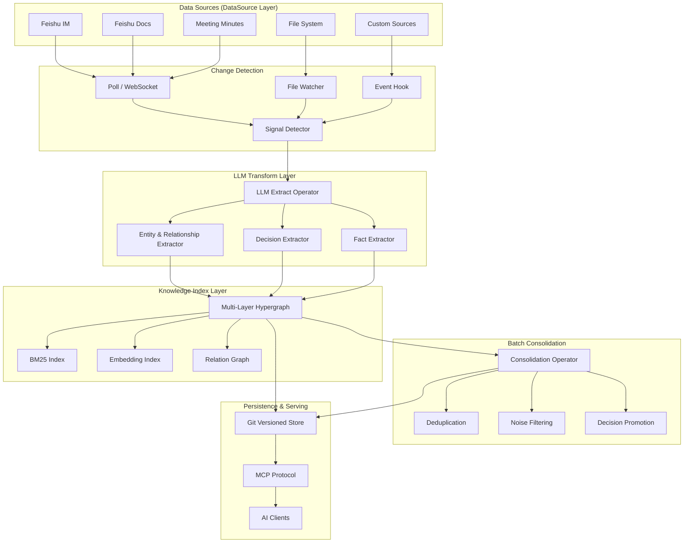

# 实时上下文引擎调研报告 — CocoIndex、Graphiti 与 UltraContext

> 调研日期：2026-08-03
> 调研范围：`ref/realtime-context/` 目录下的三个开源项目

---

## 目录

1. [CocoIndex —— 声明式增量数据处理引擎](#1-cocoindex--声明式增量数据处理引擎)
2. [Graphiti —— 时序知识图谱与动态语义框架](#2-graphiti--时序知识图谱与动态语义框架)
3. [UltraContext —— Agent 上下文基础设施](#3-ultracontext--agent-上下文基础设施)
4. [三项目对比与共性模式](#4-三项目对比与共性模式)
5. [Feishu-LongTerm-Mem 重新定位方案](#5-feishu-longterm-mem-重新定位方案)

---

## 1. CocoIndex —— 声明式增量数据处理引擎

### 1.1 一句话总结

声明式增量数据处理引擎，核心理念是"React for data engineering"：用户声明"要什么"，引擎自动追踪代码和数据变化、只处理增量部分、通过内容寻址保证幂等性。

### 1.2 核心架构

**三大抽象：**

| 抽象 | 作用 | 类比 |
|------|------|------|
| App | 顶层可运行单元 | 等同于一个处理管道 |
| Processing Component | 执行单元，拥有自己的 target state | 等同于一个 Transform |
| Target State | 想要在外部系统存在的数据 | 等同于 Output |

**组件树 (Component Tree)**：`mount()`、`use_mount()`、`mount_each()` 这些调用声明了组件之间的树形结构。引擎自动推断每个组件的增量刷新边界。

```python
# 用户代码（声明式 Python）
@coco.fn
async def main(srcdir: Path) -> None:
    target = await coco.mount_target(
        postgres.mount_table_target(PG_DB, table_name="docs")
    )
    target.declare_vector_index(column="embedding")
    files = localfs.walk_dir(srcdir).items()
    await coco.mount_each(process_file, files, target)

app = coco.App("doc-index", main, srcdir=Path("./docs"))
app.update_blocking()
```

用户写的是 imperative Python，但背后是声明式语义 —— engine 自动推断：
- 哪些组件需要刷新（代码是否变了？输入是否变了？）
- 哪些 target state 需要创建/更新/删除
- 哪些组件可以跳过（memo hit）

### 1.3 增量更新机制（最小增量更新）

这是 CocoIndex 的核心价值。三层增量机制：

**Layer 1：组件级 Memoization （Rust 引擎，LMDB 持久化）**

当组件再次运行时，`use_or_invalidate_component_memoization()` 检查：
1. 该组件路径是否有存储的 memo？
2. processor 的 memo key fingerprint 是否匹配？
3. 所有 logic dependencies 是否仍然注册在当前环境中（代码未变）？

全部通过 → 返回缓存结果，**完全跳过执行**。

**Layer 2：函数级 Memoization**

在组件内部，单个 `@coco.fn(memo=True)` 调用也会被 memoize。`fingerprint_call()` 生成唯一指纹，包括：
- 函数标识（module + qualname）
- 规范化参数（通过 `__coco_memo_key__` 协议）
- 函数逻辑指纹（AST 哈希）

**Layer 3：Target State Reconciliation**

组件执行完成后，进入 `pre_commit()` 阶段：
1. 读取组件之前声明的所有 target state 路径（`__track` 记录）
2. 遍历本次声明的 target state 与已有记录对比
3. 对每个 state，调用 connector 的 `reconcile()` 方法
4. reconcile 输出 `TargetReconcileOutput(action, sink, tracking_record)`
5. 变更级联：父组件内容变了 → 子组件路径可能变 → 子组件独立检查自己的 memo

**变更级联路径：**
```
代码变化 → 父组件 logic fingerprint 变 → 父组件 memo 失效 → 父组件重执行
    → mount 调用重跑 → 发现新/不同的子组件路径 → 子组件独立 check memo
    → 只有叶子节点中真正变化的部分执行
```

### 1.4 自动同步（Live Mode）

通过 `LiveComponent` 协议实现：

```python
class LiveComponent(Protocol):
    async def process(self) -> None:              # 全量扫描
    async def process_live(self, operator) -> None: # 持续监控
```

两种实时数据源：
- **LiveMapView**：可扫描当前状态 + 可 watch 变更。如 `localfs` 用 watchdog 做 OS 级文件事件监听
- **LiveMapFeed**：仅 watch，无快照。如 Kafka

`auto_refresh`：按固定间隔重新执行全量扫描，适用于无法 event-driven 的数据源。

### 1.5 变化发现

**代码变化检测**：AST 哈希（去除装饰器和文档字符串）+ module qualified name。支持 `version=` 参数强制重执行，支持 `deps=` 声明外部依赖（prompt 模板、模型名）。

**数据变化检测**：通过 `@coco.fn(memo=True)` 的参数哈希。如果参数不变 AND 代码不变 AND state validation 通过，使用缓存。

**文件变化检测**：watchdog OS 级别事件，S3 用 ETag/LastModified。

### 1.6 状态追踪

LMDB 中有专门的 `__track` 表记录每个组件处理过的 target state 路径。每条记录包含版本号（非负整数）。版本号收敛（normalization）允许将所有版本号重置为 1 以控制增长。已删除的项保留为 Deleted 状态标记，用于崩溃恢复。

**关键技术决策**：使用版本号（而非内容哈希）做增量跟踪。版本号适合顺序变更，内容哈希适合去重和乱序处理。

### 1.7 与 Feishu-LongTerm-Mem 的对应关系

| CocoIndex | Feishu-LongTerm-Mem |
|-----------|-------------------|
| Component memo | `_processed_episode_hashes` |
| Logic fingerprint | —（暂无代码变化检测） |
| Target reconcile | DecisionMutation → PipelineEngine.apply_mutation |
| LiveComponent | Detector 循环（async_detect + _tick_detector） |
| Connector reconcile | Graph → GitStorage 同步（_sync_dirty_to_storage） |
| State tracking (LMDB) | HypergraphPersistence + Git Storage |
| 声明式 API | 硬编码 pipeline |

---

## 2. Graphiti —— 时序知识图谱与动态语义框架

### 2.1 一句话总结

Zep Software 出品的 Python 框架（v0.29.3），用于构建和查询 AI Agent 的**时序上下文知识图谱**。从非结构化文本中动态发现实体和关系，支持时序感知和增量更新。

### 2.2 核心架构

**顶层接口：`Graphiti` 类**

接收 `GraphDriver`（图数据库）、`LLMClient`（LLM）、`EmbedderClient`（嵌入）、`CrossEncoderClient`（重排序），暴露方法：
- `add_episode()` / `add_episode_bulk()` — 注入对话
- `search()` — 混合搜索
- `build_communities()` — 社区检测
- `summarize_saga()` — 话题摘要

**节点层级：**
- `Node`（抽象基类）：`uuid`, `name`, `group_id`, `labels`, `created_at`
- `EpisodicNode(Node)`：原始输入数据。字段：`source`, `content`, `valid_at`, `entity_edges`
- `EntityNode(Node)`：知识图谱实体。字段：`name_embedding`, `summary`（演化描述）, `attributes`
- `CommunityNode(Node)`：社区聚类摘要。字段：`name_embedding`, `summary`
- `SagaNode(Node)`：故事/对话摘要节点。字段：`summary`, `last_summarized_at`

**边层级：**
- `Edge`（抽象基类）：`uuid`, `group_id`, `source_node_uuid`, `target_node_uuid`
- `EpisodicEdge`：连接 `EpisodicNode → EntityNode`（类型：MENTIONS）
- `EntityEdge`：核心事实。字段：`name`（关系类型，如 WORKS_AT）, `fact`（自然语言描述）, `fact_embedding`, `episodes`（溯源）, `expired_at`, `valid_at`, `invalid_at`
- `CommunityEdge`：连接 `CommunityNode → EntityNode`（类型：HAS_MEMBER）
- `HasEpisodeEdge` / `NextEpisodeEdge`：连接 Saga → Episode

### 2.3 时序感知（关键特性）

**双时态数据模型（Bi-temporal）**：每个 `EntityEdge` 有两个时间维度：

| 维度 | 字段 | 含义 |
|------|------|------|
| 事务时间 | `created_at` | 事实记录到系统的时间 |
| 有效时间 | `valid_at` / `invalid_at` | 事实在真实世界中的有效时间段 |
| 过期时间 | `expired_at` | 系统标记该事实被取代的时间 |

**注入时的工作原理**：
1. 用户提供 `reference_time: datetime` per episode
2. LLM 提取 edges 时，指令要求提取 `valid_at` / `invalid_at` 时间戳，系统用 reference_time 解析相对日期（如"上周"）
3. edge resolution 阶段检测矛盾。如果新事实与已有事实矛盾，旧 edge 的 `invalid_at` 和 `expired_at` 被设置为当前时间
4. 旧 edge 不被删除 —— 保留在图中以供历史查询

**时序查询支持**（`search_filters.py`）：
- `valid_at`, `invalid_at`, `created_at`, `expired_at` 四种过滤条件
- 支持比较运算符：equals, greater_than, less_than, is_null
- 示例："找出 2025 年 3 月有效的所有事实"：`valid_at <= March 31 AND (invalid_at IS NULL OR invalid_at >= March 1)`

### 2.4 本体论设计（Ontology / Entity-Relationship）

**混合本体策略：预设 Schema + 动态发现**

**默认行为（学习型本体）**：
- 无需预定义 schema。系统使用单一的 `Entity` 节点类型，从文本中提取命名实体
- 实体名称直接从文本提取（如 "Jordan", "Denver", "Acme Corp"）
- 关系类型由 LLM 推断为 SCREAMING_SNAKE_CASE（如 `WORKS_AT`, `LIVES_IN`）

**自定义实体类型（预设本体）**：
- 用户传入 `entity_types: dict[str, type[BaseModel]]`，每个 Pydantic 模型定义属性提取 schema
- 示例：`{'Person': PersonModel, 'Organization': OrgModel}`，其中 PersonModel 有 `phone`, `email` 字段
- 自定义字段名与 EntityNode 内置字段冲突时由 `validate_entity_types()` 校验

**自定义关系类型**：
- 用户传入 `edge_types: dict[str, type[BaseModel]]` 和 `edge_type_map: dict[tuple[str, str], list[str]]`
- edge_type_map 映射 (source_type, target_type) → 允许的关系类型名列表

**group_id 分区**：
- 每个节点和边携带 `group_id`，作为图分区
- 允许将数据限定到特定用户、租户或上下文

### 2.5 LLM 驱动实体/关系发现

六阶段提取管道，是从非结构化文本到结构化知识图谱的核心：

**阶段 1：实体提取**

基于 episode 类型有3个 prompt 变体：`extract_message`、`extract_json`、`extract_text`。LLM 获得：上一 episode 上下文、当前 episode 内容、实体类型定义。输出符合 `ExtractedEntities` Pydantic 模型的 JSON。

关键约束：
- 实体名称必须显式、具体、唯一可标识
- 大量 few-shot 示例和排除规则（不用代词、不用抽象概念、不用通用名词）
- 裸亲属关系术语（"dad", "dog"）必须限定到所有者（"Nisha's dad"）

**阶段 2：关系提取**

LLM 获得：前序 episode、当前 episode、已提取的实体列表、reference_time、可选关系类型定义。输出 `ExtractedEdges`，包含关系列表。

关键约束：
- 引用不在实体列表中的名称 → 丢弃
- 自连边（source == target）→ 丢弃

**阶段 3：节点去重**

两阶段：
1. **语义相似度**：每个提取的节点名称被嵌入，与已有节点做余弦相似度搜索。精确名称匹配和高相似度匹配确定性解决
2. **LLM 去重**：未解决的节点送入 LLM 进行 `dedupe_nodes` 提示，判断是重复还是新实体

**阶段 4：关系解析**

每个提取的 edge 与已有 edges 对比。LLM 通过 `EdgeDuplicate` 提示判断：重复 fact、矛盾 fact、无关系。矛盾的 edges 获得 `invalid_at` 和 `expired_at`，但在图中保留供历史查询。

**阶段 5：属性提取**

使用自定义实体类型的 Pydantic 模型作为 response schema，提取实体属性。

**阶段 6：摘要生成**

需要摘要的实体分批（每批30个）送入 LLM。输出更新的摘要，结合了已有内容和新的 episode 信息。

### 2.6 结构化输出保证

基于 **Pydantic response model** 贯穿始终：

- 每个 LLM 调用传入 `response_model: type[BaseModel]` 参数
- OpenAI client 使用 `client.responses.parse()` 原生结构化输出
- Anthropic client 使用 tool use 强制结构化输出
- Gemini client 使用 `response_mime_type="application/json"`
- 本地模型使用 `structured_output_mode`：`"json_schema"`（原生）或 `"json_object"`（prompt 回退）

**验证层**：
- Pydantic 模型验证每个 LLM 响应
- 关系提取时实体名称验证（必须存在于实体列表中）
- 实体类型 ID 验证
- 时间戳解析 + 错误处理

**错误弹性**：
- `tenacity` 指数退避重试（4次尝试，5-120s 随机等待）
- `LLMCache`（磁盘 MD5 哈希缓存）
- Token 用量追踪

### 2.7 搜索与检索

可插拔多策略混合搜索引擎，支持四种搜索范围（Edge, Node, Episode, Community）：

**搜索方法**（每种 scope 可配置）：
- `bm25` — 全文搜索（Neo4j Lucene, FalkorDB, Kuzu）
- `cosine_similarity` — 向量搜索
- `bfs` — 广度优先图遍历（可配置深度，默认3层）

**重排序器**（每种 scope 可配置）：
- `rrf` — Reciprocal Rank Fusion
- `node_distance` — 按图距离重排序
- `episode_mentions` — 按 episode 引用次数排序
- `mmr` — Maximal Marginal Relevance
- `cross_encoder` — Cross-encoder 重排序

### 2.8 增量图更新

**每个 episode 的注入流程**（`add_episode()`）：
1. 检索前 N 个 episode 作为上下文（`RELEVANT_SCHEMA_LIMIT`，默认10）
2. LLM 从新 episode 中提取实体
3. 解决提取实体与已有图的冲突（去重）
4. 提取关系，引用已解决的实体
5. 解决关系与已有图的冲突（去重 + 矛盾检测）
6. 提取已解决实体的属性
7. 全部保存到图数据库

**社区更新的两种模式**：
- 增量：新实体可以更新其所在社区摘要
- 全量重建：`build_communities()` 清除并重建所有社区

**并发控制**：`SEMAPHORE_LIMIT` 环境变量（默认10）控制并发操作数。

### 2.9 存储

支持四种图数据库后端：

| 后端 | 状态 | 特点 |
|------|------|------|
| **Neo4j** | 主推/推荐 | 完整 Cypher 查询，Lucene 全文索引 |
| **FalkorDB** | 可用 | Redis 图数据库，支持嵌入式模式（Python 3.12+） |
| **Kuzu** | 已废弃 | 嵌入式列式图数据库，上游不再维护 |
| **Amazon Neptune** | 可用 | 需要 OpenSearch Serverless 全文搜索 |

**图模式**：
- 节点标签：Entity, Episodic, Community, Saga
- 关系：`MENTIONS`, `RELATES_TO`, `HAS_MEMBER`, `HAS_EPISODE`, `NEXT_EPISODE`

### 2.10 与 Feishu-LongTerm-Mem 的对应关系

| Graphiti | Feishu-LongTerm-Mem |
|----------|-------------------|
| EntityNode + EpisodicNode | DecisionNode + FactNode + EpisodeNode |
| EntityEdge（关系事实） | Relation（决策关系） |
| CommunityNode | TopicNode + EpisodeHyperedge |
| SagaNode（话题摘要） | TopicNode（标题+摘要） |
| LLM 提取管道（6阶段） | SimpleLLMExtractor（1阶段决策提取） |
| 时序双时态模型 | created_at / updated_at + Git 历史 |
| Neo4j / FalkorDB | MemoryGraph（内存）+ GitStorage |
| search()（混合搜索） | search()（Embedding + BM25 关键词） |

**核心差距**：Graphiti 从单一 episode 提取 entity + edge 两种类型，而我们目前只提取 decision 一种类型。超图结构（n 元关系）比 Graphiti 的二元图更强大，但提取能力还没用满。

---

## 3. UltraContext —— Agent 上下文基础设施

### 3.1 一句话总结

Agent 上下文的版本控制系统 —— 实时捕获每个 Agent 的上下文，通过 MCP 协议在所有 Agent 之间共享。"Same context. Everywhere."

### 3.2 核心架构

**pnpn 单体仓库，四大组件：**

| 组件 | 作用 | 技术栈 |
|------|------|--------|
| Context API (`apps/api`) | 上下文版本化 REST API | Hono + TypeScript + Drizzle/Supabase |
| Sync (`apps/sync`) | 本地采集 + TUI 仪表盘 | Node.js daemon + Ink/React |
| MCP Server (`apps/mcp-server`) | 跨 Agent 上下文共享 | stdio-based MCP |
| JS SDK / Python SDK | 客户端接口 | npm / PyPI |

### 3.3 上下文版本化

- 核心抽象：context 是一个版本化的文档
- 每次变更创建一个新版本
- 支持时间旅行（访问任意时间点的上下文历史）
- 方法：create, get, append, update, delete（共5个）
- 数据库表：projects, api_keys, nodes（JSONB 存储 content/metadata）

### 3.4 上下文共享

MCP Server 暴露工具：`list_contexts`, `get_context_messages`, `get_recent_activity`

使用场景：
- "Codex, grab the last plan Claude Code made and implement it."
- "What's the team building today?"
- "What is Alex working on in Codex right now?"

### 3.5 与 Feishu-LongTerm-Mem 的对应关系

| UltraContext | Feishu-LongTerm-Mem |
|-------------|-------------------|
| Context API | MCP Server（39个工具） |
| 上下文版本化 | Git 版本化存储 |
| Sync daemon | Detector + MemoryEngine 循环 |
| MCP Server | MCP Server |
| TUI 仪表盘 | —（暂无 TUI） |

**核心差距**：UltraContext 的重点是"上下文共享"，而我们的重点是"知识提取"。UltraContext 的同步机制更通用（不限于飞书），但知识提取能力几乎为零。

---

## 4. 三项目对比与共性模式

### 4.1 共性模式矩阵

| 模式 | CocoIndex | Graphiti | UltraContext | Feishu-LongTerm-Mem |
|------|-----------|----------|--------------|-------------------|
| **声明式管道** | YAML/Python DSL | 代码级 pipeline | config.json | 硬编码 |
| **内容寻址/增量** | ✅ 双层 Memo + LMDB | ✅ episode-level dedup | — | ✅ 部分 (episode hash) |
| **多阶段处理** | DataSource→Transform→Index | Episode→Entity→Edge→Graph | Capture→Store→Serve | Detector→Extractor→MemoryGraph |
| **时序感知** | — | ✅ 双时态数据模型 | ✅ 版本化文档 | ✅ 部分 (Git + snapshot) |
| **实体关系发现** | — | ✅ LLM → Entity + Relation | — | ⛔ 只提取 Decision |
| **结构化输出** | — | ✅ Pydantic + JSON Schema | — | ✅ 部分 (response_format) |
| **MCP 开放协议** | — | — | ✅ MCP Server | ✅ MCP Server |
| **自动同步** | ✅ Poll loop + Live mode | — | ✅ Daemon | ✅ Sync loops |
| **批处理/整理** | — | ✅ Community detect | — | ✅ SleepManager |
| **代码变化感知** | ✅ AST 哈希 | — | — | — |
| **LLM去重** | — | ✅ 语义+LLM双阶段 | — | ✅ Dice+Embedding+LLM |
| **图表达** | — | 二元图（边） | — | 超图（n元超边） |

### 4.2 各项目最值得借鉴的点

| 项目 | 最值得借鉴的点 | 为什么 |
|------|--------------|--------|
| **CocoIndex** | 内容寻址增量更新 | 当前 `_processed_episode_hashes` 只覆盖 episode 级别，可以扩展到所有数据类型 |
| **CocoIndex** | 声明式管道配置 | 将硬编码 pipeline 改为 YAML/JSON 声明式，支持多种 source → transform → index 组合 |
| **CocoIndex** | 状态追踪表（version tracking） | 比纯 hash 更精确，支持删除检测和崩溃恢复 |
| **Graphiti** | 实体+关系联合提取 | 从同一段对话中同时提取实体和关系，不局限于决策 |
| **Graphiti** | 双时态数据模型 | valid_at / invalid_at 让系统支持"当时的知识"查询 |
| **Graphiti** | 6 阶段 LLM 管道 | 实体提取 → 关系提取 → 去重 → 属性提取 → 摘要，分层处理保证质量 |
| **Graphiti** | 混合搜索 + 多种重排序 | BM25 + 向量 + BFS + Cross-encoder 重排序，当前项目只有 BM25 和简单 embedding |
| **UltraContext** | 跨 Agent 上下文共享 | 通过 MCP Server 将处理后的知识共享给任何 Agent |
| **UltraContext** | 上下文版本化 | 已经用 Git 实现了版本化，可以封装成 API |

---

## 5. Feishu-LongTerm-Mem 重新定位方案

### 5.1 核心认知

**Feishu-LongTerm-Mem 已经是一个数据处理引擎** —— 只是目前定位为"飞书记忆系统"。

代码中已经有完整的管道：
```
Detector → Extractor → MemoryGraph → Sleep(batch) → GitStorage → MCP Server
```

但文档和对外讲述把它包装成了一个"飞书聊天记忆"系统。**重新定位是认知上的调整，不是架构上的重写。**

### 5.2 新定位

**从："飞书协作记忆系统"**

→ **到："声明式增量协作知识处理引擎"**

### 5.3 价值主张

> 一个声明式增量数据处理引擎，专为协作知识场景设计：
>
> 1. **声明式数据源** — 声明关注的数据（IM 消息、飞书文档、会议纪要），引擎自动检测变化
> 2. **增量知识提取** — 只处理变化的部分，LLM 和规则引擎智能提取结构化知识
> 3. **多层知识图谱** — 超图结构（L0 决策层 → L1 事实层 → L2 Episode 层 → L3 话题层）
> 4. **自动整理巩固** — Sleep Manager 批量去重、噪音过滤、决策升级
> 5. **MCP 开放接口** — 通过 MCP 协议向任何 AI 客户端提供知识服务

### 5.4 概念重命名映射

| 当前名 | 重命名后 | 理由 |
|--------|---------|------|
| EnhancedDetector | DataSource / Change Detector | 不限于检测决策，可以检测任何数据变化 |
| SimpleLLMExtractor | LLM Transform Operator | 不限于提取决策，可以提取实体、关系、事实 |
| MemoryGraph | In-Memory Knowledge Index | 不只是内存数据结构，是知识索引 |
| PipelineEngine | Mutation Pipeline | 已经是通用 mutation 管道 |
| SleepManager | Batch Consolidation Operator | 不限于"睡眠"，是批处理整理算子 |
| Hypergraph | Multi-Layer Knowledge Hypergraph | 当前命名太泛 |
| GitStorage | Versioned Persistence Backend | Git 是实现细节，不是概念 |

### 5.5 架构图（重新定位后）



### 5.6 实施路线图

#### P0 — 文档重述（无代码变更）

- 修改 README，定位改为 "Incremental Data Processing Engine for Collaborative Knowledge"
- 核心概念重述为更通用的术语
- 更新 `docs/wiki/` 文档中的项目描述
- 更新 MCP 工具文档中的项目定位

#### P1 — 引入实体+关系提取（借鉴 Graphiti）

当前系统只提取 Decision（决策），可以在同一段对话中提取更多类型：
- **Entity**：技术栈、团队成员、项目、服务
- **Relationship**：依赖关系、使用关系、负责关系
- **Fact**：事实性知识（谁做什么、什么版本、什么配置）
- **Decision**：保持不变（项目核心能力）

Decision 可以放在一个新的 EntityGraph 旁边作为互补知识层。

#### P1 — 声明式 Pipeline 配置（借鉴 CocoIndex）

将当前硬编码的处理管道改为 YAML/JSON 声明式配置：

```yaml
# pipeline.yaml
sources:
  - type: lark_im
    chats: ["oc_xxx"]
    poll_interval: 5
  - type: lark_doc
    docs: ["doc_xxx", "doc_yyy"]
    poll_interval: 60
  - type: local_file
    path: "./data/*.md"
    watch: true

transforms:
  - type: llm_extract
    input: all
    output: decision
    prompt: decision_extraction_v2
    confidence_threshold: 0.7
  - type: llm_extract
    input: all
    output: entity_relation
    prompt: entity_relation_extraction_v1

indexes:
  - type: memory_graph
    source: decision
  - type: hypergraph
    source: [decision, entity_relation]
  - type: bm25
    source: all
```

#### P1 — 内容寻址增量处理（借鉴 CocoIndex）

- 当前已经使用 episode content hash 去重，但仅用于 episode
- 扩展到所有数据类型：每个 Fact、Decision、Entity 都有内容哈希
- 管道根据内容哈希判断是否需要重新处理

#### P2 — 本体系统（借鉴 Graphiti）

定义实体类型和关系类型的 schema：

```python
ENTITY_TYPES = {
    "Person": {"description": "团队成员", "attributes": ["role", "email"]},
    "Technology": {"description": "技术栈", "attributes": ["version", "category"]},
    "Project": {"description": "项目", "attributes": ["status", "priority"]},
    "Service": {"description": "服务组件", "attributes": ["type", "provider"]},
}

RELATIONSHIP_TYPES = {
    ("Person", "Technology"): ["USES", "ADOPTED", "RECOMMENDS", "REJECTED"],
    ("Person", "Project"): ["OWNS", "CONTRIBUTES_TO", "DECIDES"],
    ("Project", "Technology"): ["USES_TECHNOLOGY", "EVALUATING", "MIGRATING_TO"],
}
```

#### P2 — 时序查询 API（借鉴 Graphiti）

支持 "as of time T" 查询和知识演变时序分析。

当前基础设施已经足够（Git 版本化 + created_at/updated_at），需要封装成 API：

```
GET /decisions?valid_at=2026-01-01
GET /timeline?topic=tech-stack&from=2025-01&to=2026-08
```

#### P3 — 跨 Agent 上下文共享（借鉴 UltraContext）

将处理后的知识作为可共享上下文。MCP Server 已经具备基础（39个工具），需要完善版本、fork、clone 的概念。

### 5.7 对比优势

| 对比对象 | 我们的优势 |
|---------|-----------|
| vs **CocoIndex** | 专为协作知识场景优化，有 LLM 驱动提取，超图结构比平坦表格更丰富，有批处理整理阶段（Sleep Manager） |
| vs **Graphiti** | 决策驱动（比通用实体更具行动力），超图比二元图更丰富（n 元关系支持），Git 版本化提供完整历史而不是简单的时间戳，MCP 协议开放接口 |
| vs **UltraContext** | 知识提取（不只是上下文捕获），结构化知识图谱（不只是上下文文档），增量处理管道（不只是存储和同步） |

### 5.8 核心差异化竞争力

> **超图结构的 n 元关系表达能力 + LLM 增量知识提取 + MCP 开放协议**

三者结合，目前市场上没有直接竞品。

- CocoIndex 没有知识提取，没有图存储
- Graphiti 没有超图，没有 MCP 协议，没有版本化存储
- UltraContext 没有知识提取，没有图结构

---

> **附录：CocoIndex 深层机制补充**

### A.1 编码变更检测

`_compute_logic_fingerprint()` 工作流程：
1. 获取函数的 AST（抽象语法树）
2. 去除装饰器和文档字符串
3. 结合 module 的 qualified name 生成哈希
4. 当源码不可用时回退到字节码哈希
5. 支持 `version=` 参数强制重执行
6. 支持 `deps=` 声明外部依赖（在装饰时快照）

### A.2 状态验证机制

在 memo hit 时，Python callback `handle_memo_states()` 决定是否可以重用：
- `can_reuse` → 直接使用缓存
- `states_changed` but `can_reuse` → 原地更新 memo 条目（不需要重执行）

### A.3 并发控制

- `inflight_semaphore`：限制并行组件执行数（默认1024）
- 目标状态所有权转移：`PreCommitOutcome::PendingRetry` + 指数退避，当一个 inflight precommit 持有竞争目标路径的 token 时
- 崩溃恢复：`pending_process_token` 标记在崩溃后仍然存在；重启后 `is_pending()` 强制 `prev_may_be_missing = true`，重新驱动 sink action

### A.4 Connector 架构

每个 connector 定义一个 `TargetHandler`，核心方法是 `reconcile()`：

```
输入: (key, desired_state | None, prev_possible_records, prev_may_be_missing)
输出: TargetReconcileOutput(action, sink, tracking_record, child_invalidation)
```

- action 为 None → 无变化
- action 为 Some(...) → sink 将应用它
- 阶段 2 处理删除：本次未声明但在上次存在的 state → 触发 reconcile 的 desired_target_state = None
- 动作按 sink 分组后批量应用

---

> **附录：Graphiti 搜索详解**

### B.1 预定义搜索配方

```python
# 从 search_config_recipes.py
COMBINED_HYBRID_SEARCH_CROSS_ENCODER  # 金牌标准：BM25 + cosine + BFS + cross-encoder
COMBINED_HYBRID_SEARCH_RRF            # BM25 + cosine + RRF
EDGE_HYBRID_SEARCH_RRF                # 仅 Edge：BM25 + cosine + RRF
EDGE_HYBRID_SEARCH_NODE_DISTANCE      # 仅 Edge：按图距离从中心节点重排序
```

### B.2 社区检测算法

标签传播算法：
1. 构建每个实体节点到其邻居的投影（通过 RELATES_TO 边），按边计数加权
2. 初始化每个节点在自己的社区中
3. 迭代：每个节点分配到权重最大的邻居社区
4. 平局：加入最大的社区
5. 停止：当没有节点改变社区时

社区摘要生成：通过 LLM 的二进制树（`summarize_pair`）对实体摘要进行两两合并，直到生成一个整体摘要。