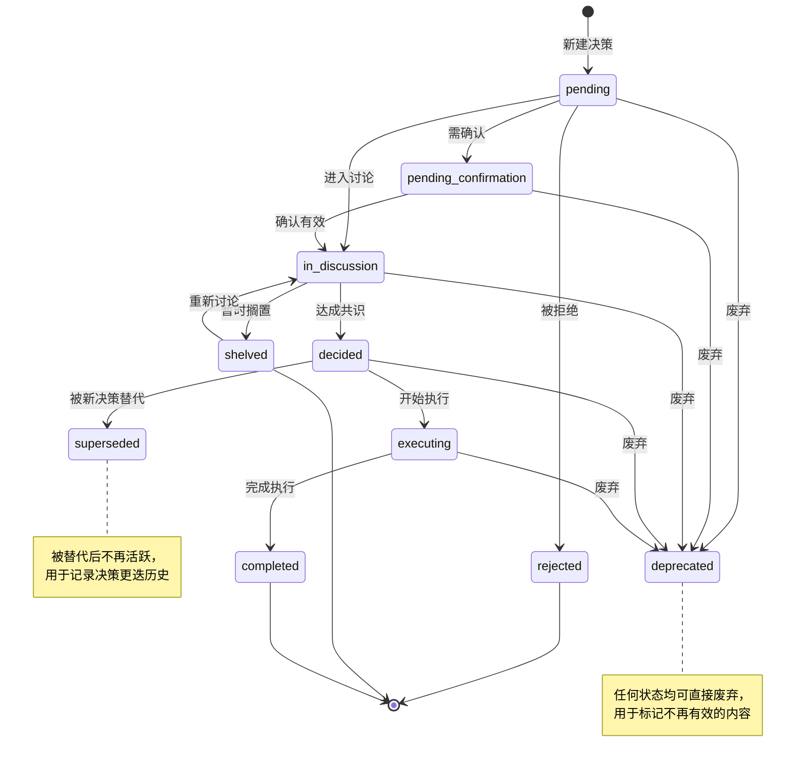
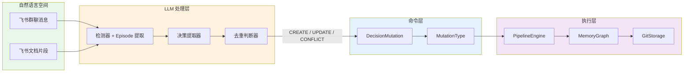
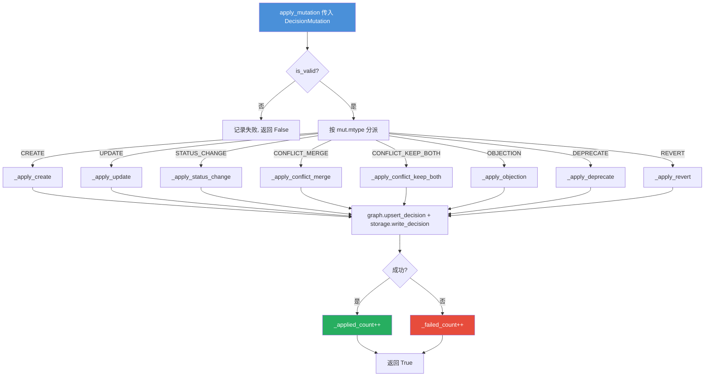
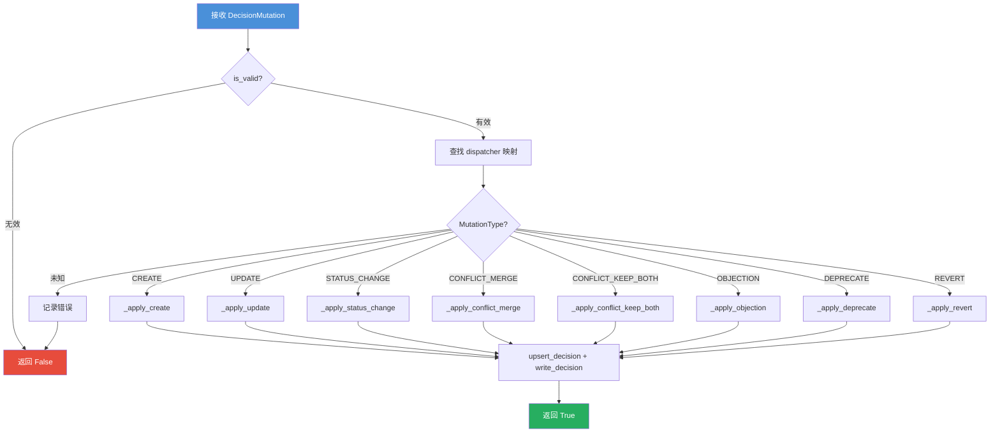

## DecisionNode 模式

DecisionNode 是整个系统中所有决策信息的标准化表示。它在飞书即时通讯（自然语言空间）和 Git 存储（结构化记录空间）之间充当中介者角色。每个决策节点由 LLM 从对话中提取，经过 PipelineEngine 校验后持久化。

### 核心字段与角色

| 字段 | 类型 | 说明 |
|------|------|------|
| `sid` | `str` | 唯一标识符（基于内容 MD5 哈希截取 12 位十六进制） |
| `topic_id` | `str` | 所属议题 ID，按议题聚合管理 |
| `title` / `summary` | `str` | 决策标题与摘要 |
| `full_text` | `str` | 决策完整原文 |
| `rationale` | `str` | 决策理由 / 论证过程 |
| `status` | `DecisionStatus` | 当前生命周期状态 |
| `impact_level` | `ImpactLevel` | 影响等级（advisory / minor / major / critical） |
| `confidence` | `float` | LLM 提取置信度（0.0~1.0） |
| `version` | `int` | 版本号（每次 UPDATE 递增） |
| `parent_id` | `str` | 父决策 SDRID，空值表示根节点 |
| `proposer` / `authority` / `assignee` | `str` | 提议者 / 决策者 / 执行者 |
| `tags` | `List[str]` | 标签集合 |
| `relations` | `List[Relation]` | 关系边列表（指向其他决策节点） |
| `access_stats` | `AccessStats` | 访问统计与热点值 |
| `created_at` / `updated_at` | `datetime` | 时间戳 |

### 决策角色

每个 DecisionNode 携带 `decision_role` 字段，标识该节点在决策流程中的职能角色：

- **decision** — 最终决策，代表团队达成的共识结论
- **plan** — 行动计划，描述如何执行决策的具体步骤
- **consideration** — 考虑项，记录讨论过程中被权衡的方案
- **action** — 执行动作，代表可追踪的任务项

角色的区分有助于 Memory Sleep 阶段的智能整理：同角色的重复节点更倾向于合并，不同角色的节点即使内容相似也应保留。

### 状态状态机

DecisionStatus 定义了一个包含 10 种状态的枚举体系，可分为活跃态和非活跃态两类：

**活跃态**：`pending` → `pending_confirmation` → `in_discussion` → `decided` → `executing`

**非活跃态**：`completed`, `shelved`, `rejected`, `superseded`, `deprecated`

#### 图：决策状态生命周期

状态流转的核心规则：

- `pending` 是唯一的新建状态入口
- `decided` → `in_progress`（代码中为 `executing`）→ `completed` 是标准的"决策→执行→完成"路径
- `superseded` 只从 `decided` / `executing` 进入，表示被更优决策替代
- `deprecated` 是任意状态的"紧急出口"，用于标记不再有效的内容
- `shelved` 可回退至 `in_discussion`，支持搁置后重新讨论

## DecisionMutation 模型

DecisionMutation 是引擎中描述变更操作的标准数据契约。当 LLM 提取一个决策后，引擎不会直接修改 MemoryGraph，而是先构建一个 Mutation，然后通过 PipelineEngine 统一执行。这种命令模式（Command Pattern）的设计使所有变更操作可追溯、可重放。

### 变更类型

| 变更类型 | 枚举值 | 行为 |
|----------|--------|------|
| `CREATE` | `"create"` | 新建决策节点，version = 1 |
| `UPDATE` | `"update"` | 覆盖更新已有节点，version++ |
| `STATUS_CHANGE` | `"status_change"` | 仅变更状态字段 |
| `CONFLICT_MERGE` | `"conflict_merge"` | 合并两个冲突决策为一个新节点 |
| `CONFLICT_KEEP_BOTH` | `"conflict_keep_both"` | 保留双方冲突关系，不合并 |
| `OBJECTION` | `"objection"` | 对决策提出异议 |
| `DEPRECATE` | `"deprecate"` | 废弃决策 |
| `REVERT` | `"revert"` | 回退到历史版本 |

Mutation 的有效性通过 `is_valid` 属性判断：必须有 `sdr_id`，且 CREATE 类型必须有 `summary`，OBJECTION 类型必须有 `objection_reason`。

### 变更数据流

#### 图：自然语言到代码实体映射

以下展示了从飞书对话内容到最终 Git 存储中决策文件的完整映射路径：

### PipelineEngine 分派逻辑

PipelineEngine 的核心是一个基于 MutationType 的分发路由器。每个 Mutation 进入后，先经过有效性校验，然后通过 `dispatcher` 字典映射到对应的处理方法。

#### 变更分派过程

#### 图：PipelineEngine 分派逻辑

每个 `_apply_*` 方法的内部逻辑遵循统一模式：

1. 从 MemoryGraph 获取目标决策（`_graph.get_decision()`）
2. 根据 MutationType 修改决策字段
3. 调用 `_graph.upsert_decision()` 更新内存图
4. 若 GitStorage 可用，调用 `_storage.write_decision()` 持久化
5. 记录变更日志并返回 `True` / `False`

### 关系与超边

决策节点之间通过 `Relation` 边模型建立关联，RelationType 枚举定义了八种关系语义：

- **DEPENDS_ON** — A 依赖 B，A 无法在 B 未完成时推进
- **SUPERSEDES** — A 替代 B（A 是更新的决策）
- **REFINES** — A 细化 B（A 提供更多细节或更窄的范围）
- **CONFLICTS_WITH** — A 与 B 冲突（二者不能同时成立）
- **RELATES_TO** — A 关联 B（一般关联，无特定语义）
- **OBJECTION** — A 有来自某方的异议
- **PARENT_OF** / **CHILD_OF** — 父子关系，用于层级化决策结构

这些关系边在 Hypergraph 结构中映射为超边（hyperedge），实现多对多的跨维度关联——一个超边可以连接决策节点、事实节点、Episode 和话题，形成完整的知识网络。详情参见 [Hypergraph Structure & Retrieval](../memory_graph_and_storage/Hypergraph%20Structure%20&%20Retrieval.md)。