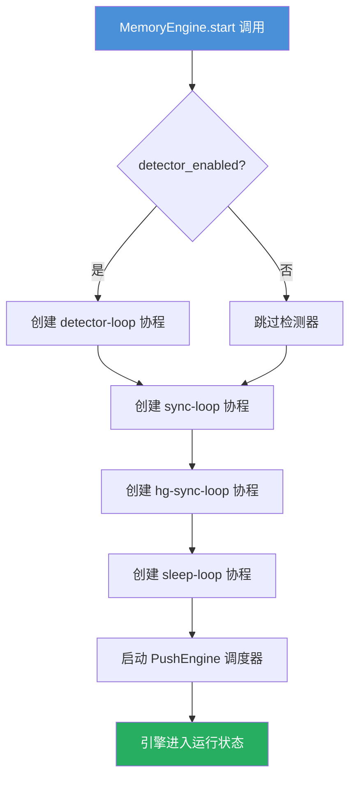
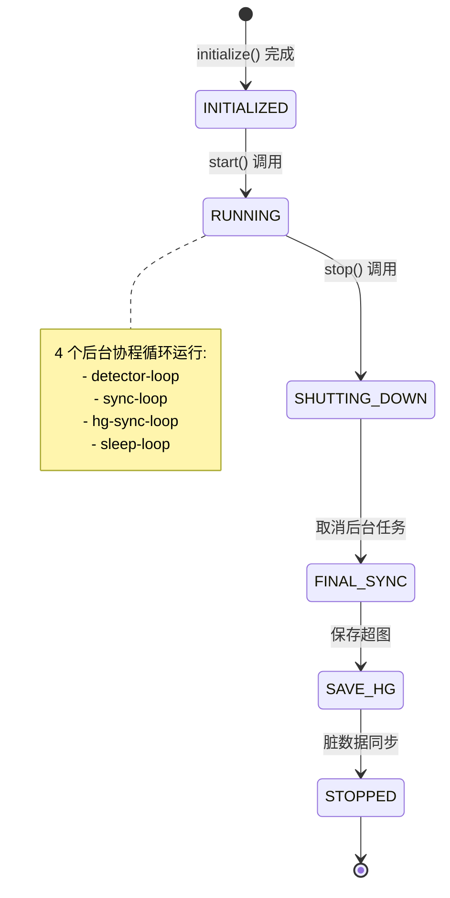

## 1. 初始化与启动

MemoryEngine 是记忆系统的核心后台引擎，负责将飞书对话中提取的决策信息持久化到 MemoryGraph 和 Git 存储中。其生命周期分为"初始化"和"启动"两个阶段。

### 初始化序列

`MemoryEngine.initialize()` 按严格顺序初始化八个子系统，每个子系统失败时均标记为非致命（non-fatal），保证引擎在部分能力缺失时仍可运行：

1. **GitStorage** — 初始化基于 Git 的决策文件存储后端，工作目录由 `STORAGE_PATH` 环境变量指定
2. **PipelineEngine** — 建立决策管道引擎，绑定 MemoryGraph 和 GitStorage，作为所有变更操作的统一入口
3. **从 Git 加载决策** — 读取 Git 仓库中已有的决策文件，反序列化为 DecisionNode 并填充到 MemoryGraph；同时统计已加载的决策数和主题数
4. **SnapshotManager** — 初始化检测器快照管理器，用于记录每次检测的原始内容快照，便于调试与追溯
5. **HypergraphPersistence** — 从 `data/hypergraph/state.json` 加载超图结构（决策-事实-话题-片段的关联网络），若不存在则创建空超图
6. **BaseViewSyncer** — 初始化基础视图同步器，负责将决策变更同步到飞书多维表格（Base），实现记忆数据的外部可查
7. **SleepManager** — 初始化记忆整理管理器（受 `MEMORY_SLEEP_ENABLED` 控制），负责定期执行重复合并、噪声裁剪和决策提升
8. **PushEngine** — 初始化推送引擎，从环境变量读取推送配置（`CardConfig.from_env()`），注入飞书客户端

```python
# 关键初始化序列（简化）
self._storage = GitStorage(config=...)
self._pipeline = PipelineEngine(memory_graph=self._graph, git_storage=self._storage)
self._graph.load_from_git(self._storage, self._config.project)
self._snapshot_mgr = SnapshotManager(storage_path=...)
self._hg_persistence = HypergraphPersistence(...)
self._hypergraph = self._hg_persistence.load()
self._base_view_syncer = BaseViewSyncer(self._storage, self._graph)
self._sleep_manager = SleepManager(graph=..., pipeline=..., ...)
self._push_engine = PushEngine(config=CardConfig.from_env(), ...)
```

### 代码实体映射：启动

#### MemoryEngine 启动流程

`MemoryEngine.start()` 被调用时，将 `_running` 置为 `true`，记录启动时间戳，然后创建四个后台异步协程，分别对应不同的生命周期职责：

- **detector-loop** — 检测器主循环，仅当 `detector_enabled=true` 时启动
- **sync-loop** — 脏决策同步循环，始终启动
- **hg-sync-loop** — 超图同步循环，始终启动（将 hypergraph state.json 提交到 Git）
- **sleep-loop** — 定时记忆整理循环，始终启动（但受 `MEMORY_SLEEP_ENABLED` 控制是否实际执行）

同时启动 PushEngine 的推送调度器（`start_push_scheduler()`），注册热点扫描、每日摘要和每周摘要的定时任务。



## 2. 检测器循环

`_run_detector_loop` 是引擎的感知入口，持续轮询消息源以发现潜在的决策信息。其核心工作流程：

1. 调用 `_detector.async_detect()` 获取检测结果
2. 若结果为空，按 `ingester_poll_interval`（默认 30s）休眠后继续
3. 若检测结果包含决策信号（`result.is_decision`），调用 `_process_detection(result)` 进入处理管线

`_process_detection` 的处理管线：

- **Step 1 — 快照保存**：若启用检测器快照，将原始检测内容、上下文和检测结果保存为 `DetectorSnapshot`
- **Step 2 — 决策提取**：构建已有决策上下文（`_build_existing_decisions_context`），注入 LLM 的 system prompt 中，调用 LLM extractor 从内容中提取决策节点（`DecisionNode`）
- **Step 3 — 变更执行**：调用 `_apply_decision_mutations(node, source)` 对提取结果进行语义去重、冲突检测和持久化

对于完整对话上下文（episode），引擎还支持：

- Episode 级别内容去重（基于 SHA256 content hash）
- 过短 episode 自动跳过（消息数 < 2 且长度 < 100 字符）
- 提取后自动构建 Hypergraph（通过 `HypergraphBuilder` 更新超图结构）

```
检测器循环流程图：

┌─────────────┐     ┌──────────────────┐     ┌──────────────────┐
│ async_detect │────>│  判断 is_decision  │────>│ _process_detection │
└─────────────┘     └──────────────────┘     └──────────────────┘
                                                     │
                                           ┌─────────┼─────────┐
                                           ▼         ▼         ▼
                                      保存快照    LLM提取   执行变更
```

## 3. 同步循环与脏节点刷新

引擎维护两个独立的同步回路，均以 `graph_sync_interval`（默认 60s）为调度频率：

**`_sync_loop` — 脏决策同步**：
- 调用 `_graph.get_dirty_and_clean()` 获取自上次同步以来被修改过的"脏"决策列表
- 遍历脏节点，通过 `_storage.write_decision()` 写入 Git 存储（每个决策对应一个 `.md` 文件）
- 同步完成后节点标记为"干净"

**`_hg_sync_loop` — 超图同步**：
- 检查 `_hypergraph_modified` 标记是否被设置
- 如有变更，通过 `_hg_persistence.save()` 将超图序列化为 `state.json`
- 通过 Git CLI 执行 `git add` + `git commit` 提交变更

两个回路职责分离的原因：MemoryGraph 管理的是独立决策文件，Hypergraph 管理的是单一 `state.json` 文件。分开同步可以避免单次提交过于庞大，也便于 Git 历史追溯。

## 4. 语义重连与去重

`_apply_decision_mutations` 是引擎中最核心的方法，它实现了从新决策到存储的完整映射逻辑，包含三级去重策略：

### 去重流水线

去重判定按优先级从高到低执行：

1. **精确匹配（SID）** — 若新节点 `sid` 已存在于图中，直接生成 UPDATE Mutation，版本递增
2. **语义检索（Embedding + Reranker）** — 在同一 topic 下查找候选决策：
   - 通过 Embedding provider 计算文本向量，余弦相似度检索 top-5
   - 若 `score >= 0.65`：硬约束直接合并，不走 LLM Judge（Plan B 优化）
   - 若 `score > 0.5`：通过 Reranker 精排后，进入 LLM Judge
3. **字符级预过滤（Fast Prefilter）** — 对未命中语义检索的决策，使用 Dice 系数 + 同 topic 约束快速扫描：
   - 通过预过滤后同样进入 LLM Judge

**LLM Judge** 使用 `REALTIME_DEDUP_PROMPT` 判断决策关系，返回四种动作之一：

| 动作 | 含义 | 处理方式 |
|------|------|----------|
| `skip` | 完全重复 | 不执行任何操作 |
| `update` | 覆盖更新 | 使用新内容更新旧决策，追加补充信息 |
| `conflict` | 语义冲突 | 双方标记 `CONFLICTS_WITH` 关系 |
| `create_new` | 全新决策 | 创建版本 1 的新节点 |

此外，父子关系和同父关系（sibling guard）不会进入 LLM Judge，直接判定为 `create_new`。

### 冲突检测

每个 CREATE Mutation 执行后，引擎调用 `_graph.detect_conflicts(node)` 检测新决策是否与已有决策存在冲突。冲突检测的逻辑基于：

- 同 topic 下的决策对比
- 内容层面的逻辑矛盾识别
- 关系链上的冲突传播

检测到冲突时，引擎自动创建 `CONFLICT_KEEP_BOTH` Mutation，在双方决策上标记 `CONFLICTS_WITH` 关系，并通过 PushEngine 推送冲突通知卡片到飞书。

## 5. 优雅关闭

`MemoryEngine.stop()` 实现了有序的资源释放序列：

1. 设置 `_running = false`，所有后台循环将在下次迭代时检测到并退出
2. 取消所有 asyncio Task（detector-loop, sync-loop, hg-sync-loop, sleep-loop）
3. 等待所有任务通过 `asyncio.gather(..., return_exceptions=True)` 完成
4. 停止 PushEngine 的推送调度器
5. 保存 Hypergraph 状态到 `state.json`（通过 `_hg_persistence.save()`）
6. 执行最后一次脏数据同步（`_sync_dirty_to_storage()`）
7. 输出最终统计信息（累计 applied 和 failed 的 mutation 数量）



关闭过程设计上的关键考虑：**保存超图优先于脏数据同步**。因为超图是跨会话的结构化记忆表示，丢失后将影响记忆检索的准确性；而脏决策数据在下次启动时仍可从 Git 加载并重建 MemoryGraph。