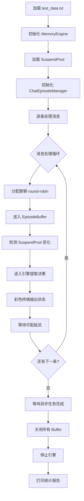
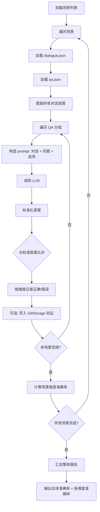

# 评估框架与场景

## 评估框架概览

项目提供两套互补的评估模式，分别从不同维度衡量决策提取系统的效果：

- **EvalRunner（实时流模拟评估）**：从 `eval_data/test_data.txt` 读取消息序列，模拟真实的群聊消息流，逐条送入引擎处理并统计决策提取结果。适用于评估端到端的系统行为，包括决策创建、更新、跳过以及 Episode 生命周期管理。
- **ExtractionEvaluator（结构化 QA 评估）**：使用 `eval_data/decision_extraction/` 下的人工标注数据集，通过多轮选择题的形式逐维度评估 LLM 的决策提取能力。适用于精细化评估模型在检测、内容、提议者、执行者等维度上的准确率。

两种模式定位不同：EvalRunner 侧重模拟真实场景中的系统行为完整性，ExtractionEvaluator 侧重结构化、可量化的维度级准确性评测。

---

## EvalRunner 实时流模拟

### 执行流程

EvalRunner 的执行过程可以分为以下几个阶段：



### 数据来源

测试数据位于 `eval_data/test_data.txt`，包含约 **250 条**非空消息（来源为 strip 后的纯文本行）。消息内容覆盖多个技术话题，各话题交织排列以模拟真实群聊的多线讨论特征：

- **数据库选型**：PostgreSQL 与 MySQL 的对比讨论，涉及连接池、迁移工具、备份策略、读写分离等
- **前端技术**：React、Vue.js 的选择，状态管理、构建工具、CDN 缓存等
- **容器化方案**：Kubernetes 集群、监控（Prometheus/Grafana）、网络插件（Calico）、安全策略等
- **消息队列**：Kafka、RabbitMQ 的选型讨论
- **监控告警**：业务指标采集（OpenTelemetry）、告警规则设计、日志收集等

`eval_data/user_only_messages.py` 提供了另一种消息构造方式，以单用户视角生成包含明确场景标签和决策类型标注的结构化消息（约 400 条），可用于更精细的模拟测试。

### 核心参数

| 参数 | 默认值 | 说明 |
|------|--------|------|
| `--input` | `eval_data/test_data.txt` | 输入文件路径，支持 .txt 和 .json 格式 |
| `--delay` | `1.0` | 消息间模拟延迟（秒），控制处理节奏 |
| `--max-messages` | `0` | 最大处理消息数，0 表示全部处理 |
| `--group-num` | `1` | 群聊数量，大于 1 时启用 round-robin 分配 |

### 群聊模拟机制

当 `--group-num N`（N > 1）时，消息按轮询方式分配到 `eval_0`、`eval_1`、…、`eval_{N-1}` 等多个群聊。每个群聊拥有独立的 EpisodeBuffer 和 SuspendPool 上下文，可模拟多群并行讨论的场景。统计报告会分别输出每群的消息分布和 Buffer 状态。

### 评估指标

EvalRunner 在报告阶段输出以下指标：

- **总消息数**：处理的消息总量
- **决策提取数**：引擎返回的检测结果总数
- **决策创建/更新/跳过数**：按操作类型区分的决策变更计数
- **Episode 挂起/重新打开数**：SuspendPool 中 Episode 的挂起与恢复频次
- **群聊消息分布**：各群聊的消息量及可视化条图
- **每群 Buffer 状态**：各群聊当前 Episode 的 ID 和消息数
- **LLM 调用统计**：调用次数、Token 消耗（输入/输出）、耗时统计

### 彩色终端输出

运行过程中，终端使用不同颜色标识不同状态：

- **青色（cyan）**：Episode 重新打开（reopen）
- **黄色（yellow）**：Episode 挂起（suspend）
- **绿色（green）**：新决策创建（new）
- **品红（magenta）**：决策相关状态（decision）
- **灰色（gray）**：跳过或错误（skip）

---

## ExtractionEvaluator 结构化 QA 评估

### 数据集概述

数据集位于 `eval_data/decision_extraction/` 目录，配置文件 `config.yaml` 定义了数据集的元信息：

```yaml
name: "decision-extraction-eval"
description: "HyperMem DecisionExtractor decision extraction correctness evaluation dataset"
version: "1.0"
total_scenarios: 12
total_samples: 170
dimensions:
  - detection
  - content
  - proposer
  - executor
  - impact_level
  - status
  - conflict
```

总计 **12 个场景、170 个样本**，每个样本包含一段对话（dialogue.json）和一组对应的选择题（qa.json）。

### 评估流程



### Prompt 构造策略

每个 QA 题目由以下部分组成：

1. **对话内容**：从 dialogue.json 中提取对应段落的发言记录
2. **问题**：qa.json 中的 `Q` 字段
3. **选项**：qa.json 中的 `options` 字段，格式化为 `A. xxx\nB. xxx\nC. xxx`
4. **维度引导**：根据不同维度附加规则提示，如 proposer 维度强调"第一个提出具体方案的人是提议者"，executor 维度强调"明确指派句式中的被指派人为执行者"

系统提示固定为："你是一个对话决策分析专家。根据对话内容做选择题，只输出选项字母（A/B/C/D），不要输出其他内容。"

LLM 配置：temperature=0.0（确定性输出）、max_tokens=10（仅需输出简短选项字母）。

### 评估维度详解

| 维度 | 评测目标 | 评分标准 | 示例问题 |
|------|---------|---------|---------|
| `detection` | 检测对话中是否形成了决策 | 正确判断"有决策"或"无决策" | "以上对话中是否做出了决策？" |
| `content` | 识别决策的具体内容 | 正确选出决策对应的方案/参数 | "决策内容是什么？" |
| `proposer` | 识别决策的提议者 | 正确找出第一个提出具体方案的人 | "这个决策是谁提出的？" |
| `executor` | 识别决策的执行者 | 正确找出被指派或主动承担任务的人 | "这个决策由谁执行？" |
| `impact_level` | 判断决策的影响级别 | 正确区分 major / minor / advisory | "这个决策的影响级别是？" |
| `status` | 判断决策的当前状态 | 正确区分 decided / in_progress / completed / pending_confirmation / superseded | "这个决策的当前状态是？" |
| `conflict` | 检测决策是否存在前后矛盾 | 正确判断是否出现"确认后又反悔"模式 | "对话中的决策是否存在冲突？" |

### 评估结果

`evaluate_extraction()` 函数返回每个场景的 `EvalResult`，包含：

- `scenario`：场景名称
- `dim_accuracies`：各维度的准确率字典
- `total` / `correct` / `accuracy`：该场景的整体统计
- `token_summary`：Token 消耗统计
- `storage_stored` / `storage_verified` / `storage_failed`：GitStorage 写入与验证计数

`run_extraction_eval()` 汇总所有场景结果，输出 `SummaryReport`，包含整体准确率、各维度跨场景综合准确率、总 Token 消耗等。

---

## 场景分类

数据集覆盖 12 个场景，每个场景包含特定类型的决策模式：

| 编号 | 场景名称 | 样本数 | 场景说明 |
|------|---------|--------|---------|
| 01 | 技术选型 | 20 | 数据库、框架、架构等技术方案的讨论与确定，包含明确的赞成和拍板 |
| 02 | 任务分配 | 15 | 指派人员或团队负责特定任务，含主动承担和指派两种模式 |
| 03 | 参数锁定 | 10 | 技术参数的最终确定，如超时时间、并发限制、副本数等 |
| 04 | 隐性共识 | 15 | 通过简短回应（"好""可以""👍"）达成的非显式共识决策 |
| 05 | 冲突决策 | 10 | 先确认一个方案后又推翻改用另一方案的前后矛盾场景 |
| 06 | 拒绝覆盖 | 10 | 推翻既有决策，改用全新方案的场景 |
| 07 | 纯讨论 | 20 | 仅有讨论没有结论的场景，用于检测假阳性 |
| 08 | 状态更新 | 15 | 仅报告进度或状态变更，不构成新决策的场景 |
| 09 | 仅建议 | 15 | 提出建议但未得到确认或落地的场景 |
| 10 | 闲聊 | 10 | 与工作无关的日常对话，不应被检测为决策 |
| 11 | 混合场景 | 20 | 单轮对话中包含多个议题，部分有决策部分无决策的复杂场景 |
| 12 | 边界情况 | 10 | 模糊表达、条件性决策、单句回复等边界案例 |

---

## 数据目录结构

```
eval_data/
├── test_data.txt                    # 实时流模拟测试数据（~250条交叠话题消息）
├── user_only_messages.py            # 单用户消息生成脚本（含场景标签和决策类型标注）
└── decision_extraction/             # 结构化QA评估数据集
    ├── config.yaml                  # 数据集配置（12场景、170样本、7个评估维度）
    ├── generate.py                  # 数据生成脚本（种子42的随机生成）
    ├── 01-technical-selection/      # 技术选型
    │   ├── dialogue.json
    │   └── qa.json
    ├── 02-task-assignment/          # 任务分配
    │   ├── dialogue.json
    │   └── qa.json
    ├── 03-parameter-lock/           # 参数锁定
    │   ├── dialogue.json
    │   └── qa.json
    ├── 04-implicit-consensus/       # 隐性共识
    │   ├── dialogue.json
    │   └── qa.json
    ├── 05-conflict-decisions/       # 冲突决策
    │   ├── dialogue.json
    │   └── qa.json
    ├── 06-rejection-override/       # 拒绝覆盖
    │   ├── dialogue.json
    │   └── qa.json
    ├── 07-pure-discussion/          # 纯讨论
    │   ├── dialogue.json
    │   └── qa.json
    ├── 08-status-update/            # 状态更新
    │   ├── dialogue.json
    │   └── qa.json
    ├── 09-suggestion-only/          # 仅建议
    │   ├── dialogue.json
    │   └── qa.json
    ├── 10-small-talk/               # 闲聊
    │   ├── dialogue.json
    │   └── qa.json
    ├── 11-mixed-scenario/           # 混合场景
    │   ├── dialogue.json
    │   └── qa.json
    └── 12-boundary-case/            # 边界情况
        ├── dialogue.json
        └── qa.json
```

---

## 如何运行评估

### EvalRunner 实时流模拟

通过 `main.py` 的 `--eval` 入口启动：

```bash
# 基础运行（单群聊，默认1秒延迟）
python main.py --eval

# 自定义参数
python main.py --eval --delay 1.0 --group-num 3 --max-messages 100

# 使用自定义输入文件
python main.py --eval --input eval_data/test_data.txt
```

参数说明：

- `--eval`：启用评估模式（必需）
- `--delay`：消息间延迟秒数
- `--group-num`：模拟群聊数量
- `--max-messages`：最大处理消息数（0 为全部）
- `--input`：输入文件路径

### ExtractionEvaluator 结构化 QA 评估

评估逻辑封装在 `src/eval/evaluator.py` 中，通过 `evaluate_extraction()` 对单个场景进行评估，通过 `run_extraction_eval()` 对所有场景进行全量评估：

```python
from src.llm.client import LLMClient
from src.eval.evaluator import run_extraction_eval

client = LLMClient()
report = run_extraction_eval(client, enable_storage=False)
print(report.overall_accuracy)
print(report.overall_dim_accuracies)
```

评估报告包含以下内容：

- 总体准确率
- 各维度跨场景综合准确率
- 每个场景的分维度准确率
- LLM 调用次数和 Token 消耗
- 可选：决策数据写入 GitStorage 的验证结果

### 运行测试

项目提供了测试文件 `tests/test_eval.py`，验证数据集加载和场景发现的正确性：

```bash
pytest tests/test_eval.py -v
```

该测试验证所有 12 个场景的 `dialogue.json` 和 `qa.json` 文件均可正确加载，以及数据集发现功能的正确性。