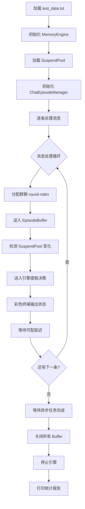

# 评估框架与场景

## 评估框架概览

项目提供 **EvalRunner（实时流模拟评估）**，从 `eval_data/test_data.txt` 读取消息序列，模拟真实的群聊消息流，逐条送入引擎处理并统计决策提取结果。适用于评估端到端的系统行为，包括决策创建、更新、跳过以及 Episode 生命周期管理和决策层级关系追踪。

---

## EvalRunner 实时流模拟

### 执行流程

EvalRunner 的执行过程可以分为以下几个阶段：



### 数据来源

测试数据位于 `eval_data/test_data.txt`，包含约 **250 条**非空消息（来源为 strip 后的纯文本行）。消息内容覆盖多个技术话题，各话题交织排列以模拟真实群聊的多线讨论特征：

- **数据库选型**：PostgreSQL 与 MySQL 的对比讨论，涉及连接池、迁移工具、备份策略、读写分离等
- **前端技术**：React、Vue.js 的选择，状态管理、构建工具、CDN 缓存等
- **容器化方案**：Kubernetes 集群、监控（Prometheus/Grafana）、网络插件（Calico）、安全策略等
- **消息队列**：Kafka、RabbitMQ 的选型讨论
- **监控告警**：业务指标采集（OpenTelemetry）、告警规则设计、日志收集等

`eval_data/user_only_messages.py` 提供了另一种消息构造方式，以单用户视角生成包含明确场景标签和决策类型标注的结构化消息（约 400 条），可用于更精细的模拟测试。

### 核心参数

| 参数 | 默认值 | 说明 |
|------|--------|------|
| `--input` | `eval_data/test_data.txt` | 输入文件路径，支持 .txt 和 .json 格式 |
| `--delay` | `1.0` | 消息间模拟延迟（秒），控制处理节奏 |
| `--max-messages` | `0` | 最大处理消息数，0 表示全部处理 |
| `--group-num` | `1` | 群聊数量，大于 1 时启用 round-robin 分配 |

### 群聊模拟机制

当 `--group-num N`（N > 1）时，消息按轮询方式分配到 `eval_0`、`eval_1`、…、`eval_{N-1}` 等多个群聊。每个群聊拥有独立的 EpisodeBuffer 和 SuspendPool 上下文，可模拟多群并行讨论的场景。统计报告会分别输出每群的消息分布和 Buffer 状态。

### 评估指标

EvalRunner 在报告阶段输出以下指标：

- **总消息数**：处理的消息总量
- **决策提取数**：引擎返回的检测结果总数
- **决策创建/更新/跳过数**：按操作类型区分的决策变更计数
- **Episode 挂起/重新打开数**：SuspendPool 中 Episode 的挂起与恢复频次
- **群聊消息分布**：各群聊的消息量及可视化条图
- **每群 Buffer 状态**：各群聊当前 Episode 的 ID 和消息数
- **LLM 调用统计**：调用次数、Token 消耗（输入/输出）、耗时统计

### 彩色终端输出

运行过程中，终端使用不同颜色标识不同状态：

- **青色（cyan）**：Episode 重新打开（reopen）
- **黄色（yellow）**：Episode 挂起（suspend）
- **绿色（green）**：新决策创建（new）
- **品红（magenta）**：决策相关状态（decision）
- **灰色（gray）**：跳过或错误（skip）

---

---

## 如何运行评估

### EvalRunner 实时流模拟

通过 `main.py` 的 `--eval` 入口启动：

```bash
# 基础运行（单群聊，默认1秒延迟）
python main.py --eval

# 自定义参数
python main.py --eval --delay 1.0 --group-num 3 --max-messages 100

# 使用自定义输入文件
python main.py --eval --input eval_data/test_data.txt

# 层级关系测试
python scripts/test_decision_hierarchy.py
```

参数说明：

- `--eval`：启用评估模式（必需）
- `--delay`：消息间延迟秒数
- `--group-num`：模拟群聊数量
- `--max-messages`：最大处理消息数（0 为全部）
- `--input`：输入文件路径