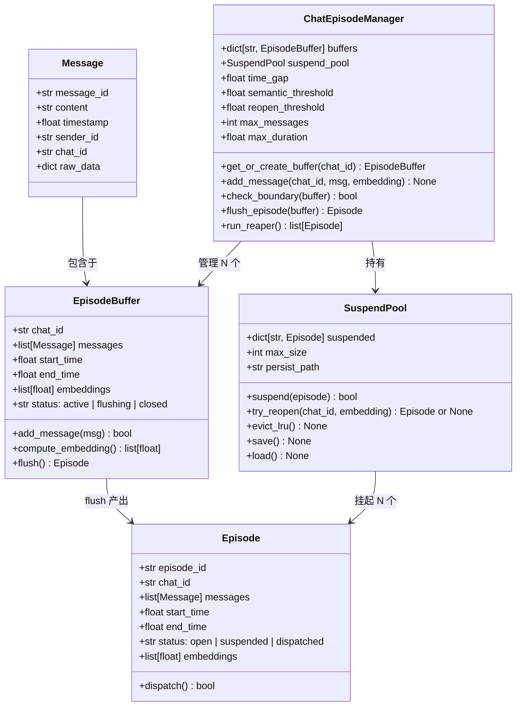
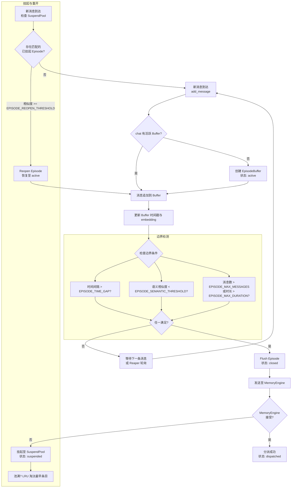

# Episode 管理

当 [LarkIMDetector](Feishu%20IM%20Detector.md) 从消息流中识别出记忆信号并将上下文块注入后，真正的"记忆组织"工作由 Episode 管理系统承担。其核心职责是将离散的消息聚合为语义连贯的**话题单元（Episode）**，检测话题边界，管理缓冲生命周期，最终将完整的 Episode 分派给 MemoryEngine 进行记忆提取。

从宏观视角看，Episode 管理系统是消息流水线的"胶水层"——它不直接生成记忆，而是决定了"哪些消息属于同一个记忆上下文"。

# 核心组件

Episode 管理体系由三个主要组件协作完成：

- **ChatEpisodeManager**：顶层管理器，为每个群聊维护独立的 Episode 缓冲区，驱动边界检测逻辑，管理 SuspendPool（挂起池）。系统全局仅存在一个实例。

- **EpisodeBuffer**：每个活跃群聊对应的内存缓冲区，存储待处理的消息序列及其嵌入向量，维护缓冲区的起始/结束时间戳。缓冲区是有状态的——一个 buffer 对应一个正在构建中的 Episode。

- **SuspendPool**：持久化存储层，将已关闭但可能被重新打开的 Episode 序列化到 JSON 文件。配合 LRU 淘汰策略，确保池大小不超过 `EPISODE_POOL_MAX_SIZE`。

## 数据模型关系

以下类图展示了 Message、EpisodeBuffer、ChatEpisodeManager 和 Episode 之间的静态关系与关键字段：



### 图：消息到 Episode 的映射

每个 `Message` 通过 `add_message()` 进入对应的 `EpisodeBuffer`。当边界条件触发时，Buffer 被 flush 为一个闭环的 `Episode` 对象。如果该 Episode 尚未达到分派条件，它会被送入 `SuspendPool` 等待潜在的重开（reopen）；否则直接分派至 MemoryEngine。

# 边界检测逻辑

边界检测是 Episode 管理的核心决策点——系统需要在"尽可能聚合相关消息"和"及时形成闭合 Episode"之间找到平衡。检测器在每次 `add_message()` 调用后触发检查，三个边界条件以**或**逻辑组合：任一条件满足即触发 Episode 关闭。

## 1. 时间间隔边界

当前消息与缓冲区最后一条消息的时间戳之差超过 `EPISODE_TIME_GAP`（默认 **1800 秒 / 30 分钟**）。这是最粗粒度的边界检测，适用于话题自然冷却的场景。

时间边界是兜底机制——即使语义上两个话题仍然相关，超过半小时的静默也意味着对话已经"断开"，应当形成独立 Episode。

## 2. 语义边界（话题切换）

当前消息的嵌入向量与缓冲区内消息嵌入的平均相似度（或最大相似度）低于 `EPISODE_SEMANTIC_THRESHOLD`（默认 **0.50**）。这标志着话题发生了实质性切换。

语义检测的实现流程：

1. 计算新消息的 embedding
2. 计算与缓冲区已有消息 embedding 的余弦相似度矩阵
3. 取平均值或最大值作为聚合相似度
4. 若聚合相似度 < 阈值，触发话题切换边界

这种基于 embedding 的语义边界检测能够感知到"从技术讨论跳转到午餐饮料"之类的话题切换，而单纯的时间间隔无法捕捉这种变化。

## 3. 容量约束

即使时间和语义均未触发边界，以下任一硬限制也会强制关闭 Episode：

- **消息数量上限**：缓冲区消息数超过 `EPISODE_MAX_MESSAGES`（默认 **50** 条）
- **持续时长上限**：缓冲区从创建到当前超过 `EPISODE_MAX_DURATION`（默认 **7200 秒 / 2 小时**）

容量约束防止缓冲区无限制膨胀，确保单个 Episode 的大小在可控范围内，既有利于后续的记忆提取质量，也避免了内存泄漏。

# Reaper 循环 (run_episode_check_loop)

Reaper（收割器）是一个定期运行的后台循环，在 IM 检测器的主循环内执行。它的职责是扫描所有活跃缓冲区，检查哪些满足了边界条件，对它们执行 flush 操作。

Reaper 的工作逻辑：

1. 遍历 `ChatEpisodeManager.buffers` 中所有状态为 `active` 的 buffer
2. 对每个 buffer，调用 `check_boundary()` 执行三个边界条件检查
3. 若触发边界，执行 `flush_episode()`：
   - 从 buffer 中提取消息列表、嵌入向量、时间范围
   - 构建 `Episode` 对象，状态设为 `closed`
   - 清空 buffer 等待新消息
4. 对 closed 状态的 Episode，尝试发送至 MemoryEngine
5. 若 MemoryEngine 暂时无法接受（如正在处理中），将 Episode 转入 SuspendPool 挂起

## 图：Episode 生命周期与分派

以下流程图展示了 Episode 从消息注入到最终分派的完整生命周期，包括边界检测、挂起、重开、LRU 淘汰等关键路径：



### 关键决策：挂起 vs 淘汰

当 Episode 被挂起而非直接分派时，它进入了**等待重开**状态。重开机制依赖于 Max-similarity 策略：

> 新消息的 embedding 与暂停 Episode 中**每一条消息**的 embedding 逐一比对，取最大相似度。若该最大值 >= `EPISODE_REOPEN_THRESHOLD`（默认 **0.55**），则从 SuspendPool 中移出该 Episode，恢复其 Buffer 为 active，新消息追加至恢复后的 Buffer 末尾。

相比平均相似度，Max-similarity 对话题的"回马枪"更敏感——某人在暂停的讨论中只发了一条关键消息，就足以触发重开。

**LRU 淘汰**：当 SuspendPool 中 Episode 数量达到 `EPISODE_POOL_MAX_SIZE`（默认 **20**），新挂入的 Episode 会导致最早暂停且未被重开的 Episode 被永久淘汰。

# 与 MemoryEngine 的集成

Episode 管理的输出端对接 MemoryEngine 的记忆提取管线。当一个 Episode 被成功分派（dispatched），它作为一个完整的消息集合被送入 MemoryEngine，触发以下操作：

1. **提取摘要**：对 Episode 中的消息进行 LLM 摘要，生成结构化记忆条目
2. **嵌入存储**：将 Episode 整体的 embedding 写入向量数据库
3. **关联索引**：记录 Episode 的时间范围、参与者、群聊来源等元数据，供后续检索

MemoryEngine 可能因负载原因暂时拒绝新 Episode——此时架构的优雅之处在于，Episode 可以被挂起而不会丢失。SuspendPool 的 JSON 持久化确保了即使进程重启，挂起的 Episode 也能被恢复。

# 关键配置常量

以下常量集中定义在系统配置中，控制 Episode 管理的全部行为参数：

| 配置项 | 默认值 | 说明 |
|--------|--------|------|
| `EPISODE_TIME_GAP` | 1800 秒（30 分钟） | 时间间隔边界阈值 |
| `EPISODE_SEMANTIC_THRESHOLD` | 0.50 | 语义边界 - 平均相似度下限 |
| `EPISODE_REOPEN_THRESHOLD` | 0.55 | 重开判定 - 最大相似度下限 |
| `EPISODE_MAX_MESSAGES` | 50 条 | 单 Episode 消息数上限 |
| `EPISODE_MAX_DURATION` | 7200 秒（2 小时） | 单 Episode 持续时长上限 |
| `EPISODE_POOL_MAX_SIZE` | 20 个 | SuspendPool 容量上限 |

这些参数需要在**记忆的粒度**与**计算开销**之间取得平衡。较短的时间间隔和较低的语义阈值会产生更多、更小的 Episode，提供更精细的话题划分，但会增加 MemoryEngine 的处理负载；反之，较宽松的参数会产生更粗粒度的 Episode，降低精度但提升吞吐。

# 已知问题与修复

## `_baseline_size` 缺失（Resume 路径）

在 `resume()` 方法从 SuspendPool 恢复 Episode 时，原有实现遗漏了 `_baseline_size`、`_baseline_embedding` 的初始化，导致后续调用 `add()` 时触发 `AttributeError`。这是因为在早期版本中 embedding 服务经常因配置问题不可用，`resume()` 路径从未被实际执行。

**修复**：在 `resume()` 中补全初始化：

```python
ep._baseline_size = TOPIC_BASELINE_SIZE
ep._baseline_embedding = None
if len(ep._embeddings) >= ep._baseline_size:
    ep._baseline_embedding = np.mean(ep._embeddings[:ep._baseline_size], axis=0)
```

## Embedding Provider 模型名大小写

`src/model/embedding_provider.py` 中的模型名检查使用硬编码大写 `'Qwen3'`，但实际模型名为小写 `qwen3-embedding-4b`，导致所有 embedding 请求在验证阶段即被拒绝。该 bug 使系统在整个运行期间都回退到 bigram 相似度。

**修复**：改为大小写不敏感检查 `self.model_name.lower()`。