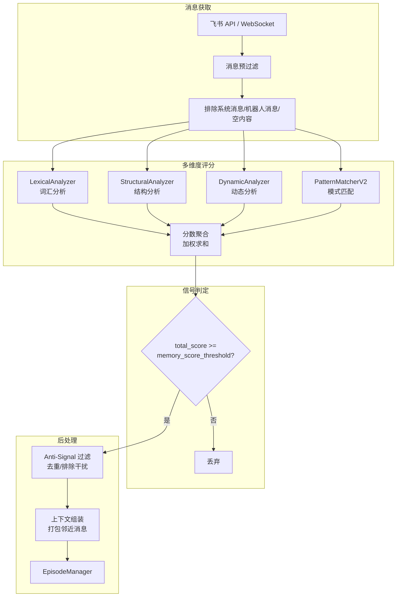
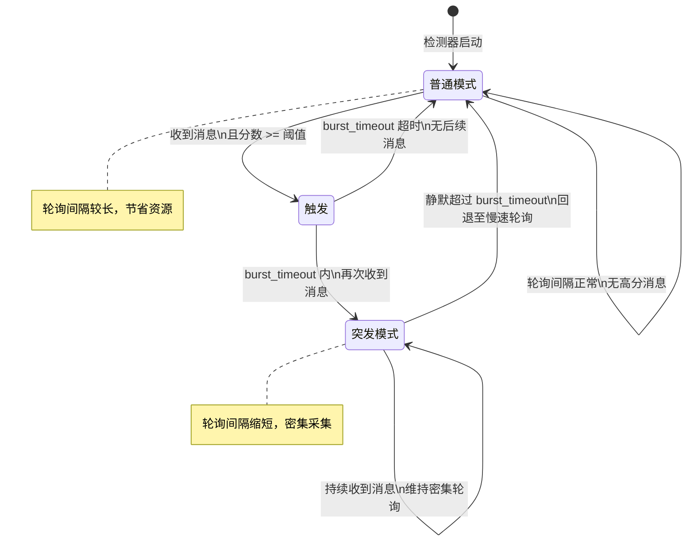

# LarkIMDetector 概览

`LarkIMDetector` 是摄入与检测层的核心引擎，负责监听飞书即时通讯消息流，从中识别出值得记忆的"信号"。它实现了两种互补的运行模式以适应不同部署场景：**轮询（Poll）模式** 为轻量级定时拉取方案，适合资源受限或简单场景；**WebSocket 模式**依赖飞书原生长连接 API，实现近乎实时的消息推送接收。

检测器本质上是消息的"筛子"：接收原始消息，经过多层启发式分析器打分，将分数超过阈值的消息判定为记忆信号，再经反信号过滤、上下文组装后送入 Episode 管理子系统。详见 [Episode 管理](Episode%20Management.md)。

## 运行模式

### Poll 模式（轮询）

Poll 模式通过 `_tick_detector` 定时器驱动，以固定间隔向飞书 API 请求指定群聊的新消息。该模式实现了**双态切换**机制以平衡资源开销与响应时效：

- **普通模式（Normal Mode）**：以较长的轮询间隔运行，适用于无明显信号活动的静默期，CPU 和 API 配额消耗最低。
- **突发模式（Burst Mode）**：当检测到高分记忆信号后，缩短轮询间隔以密集采集后续消息，防止在话题活跃期丢失关键上下文。

两种模式之间的切换由 `burst_timeout` 参数控制，形成"静默 → 信号触发 → 密集采集 → 超时恢复"的闭环。

### WebSocket 模式

WebSocket 模式对接飞书事件订阅框架，检测器注册为事件消费者。每当有新的消息事件产生，飞书服务器通过长连接主动推送至检测器，消除了轮询的时间窗口盲区。

此模式适用于对记忆完整性要求较高的场景——任何一条消息都不会因轮询间隔而被遗漏。代价是必须保持长连接存活并处理重连逻辑，对网络稳定性有一定要求。

## 实现细节

检测器在 `MemoryEngine._run_detector_loop` 后台协程中启动，内部维护一个独立的消息队列。工作流程可抽象为以下步骤：

1. **消息获取**：Poll 模式调用飞书 API 拉取群聊消息；WebSocket 模式从事件流读取消息负载。
2. **初步过滤**：排除系统消息、机器人自身消息、空内容等无需处理的消息类型。
3. **逐条分析**：对每条有效消息，依次传递给多个启发式分析器。
4. **分数聚合与判定**：各分析器返回子分数，加权汇总后与 `config.memory_score_threshold` 比较。
5. **后处理**：通过反信号逻辑去重，组装上下文，最终送入 Episode 管理器。

# 检测与评分流水线

检测的核心是一个**多维度评分函数**。每条消息进入流水线后，会被依次交给一组启发式分析器，每个分析器从不同角度评估消息的"记忆价值"，输出一个归一化的子分数。

最终综合分数由各子分数按权重累加而成：

```python
total_score = (lexical_score * w1 + structural_score * w2 +
               dynamic_score * w3 + pattern_score * w4)
```

若 `total_score >= config.memory_score_threshold`，该消息被标记为**记忆信号**并进入后续流程；否则被丢弃，不产生任何记忆开销。

## 启发式分析器

系统内置了四个专用分析器，分别关注消息的不同维度：

| 分析器 | 分析维度 | 典型特征 |
|--------|----------|----------|
| **LexicalAnalyzer** | 词汇丰富度 | 长文本、专有名词、情感词汇密度 |
| **StructuralAnalyzer** | 结构复杂度 | 列表、分段、代码块、引用等结构标记 |
| **DynamicAnalyzer** | 对话动态 | 回复链长度、提及频率、多轮交互深度 |
| **PatternMatcherV2** | 模式匹配 | 正则规则匹配（如决策、承诺、问题等预设模式） |

这种正交分析器设计使得系统无需依赖单一特征做判断——一条消息可能在词汇层面平淡无奇，但如果引发了多轮深入的对话（动态分析高分），同样可能被判定为记忆信号。

# 信号流图

以下流程图展示了消息从飞书 API 到达起，经过分析器评分、阈值判定、反信号过滤，直到最终进入 Episode 管理器的完整路径：



## IM 信号评分流水线

评分过程在实现上采用了**短路优化**：如果某条消息在前置分析器中获得极低分数，可以提前终止后续分析器调用，节省计算资源。反之，若某一分析器给出极高分数（如明确匹配到"重要决策"模式），亦可直接跳过剩余分析器进入信号判定，实现快速通道。

# 反信号过滤与发射器

并非所有高分消息都适合被记忆。检测器在评分之后设置了**反信号（Anti-Signal）** 过滤层，用于剔除以下类型的消息：

- **重复信号**：内容与近期已归档消息高度相似，避免冗余记忆
- **系统自动消息**：如"XXX 加入了群聊""文件已上传"等无记忆价值的系统事件
- **话题无关消息**：虽然本身结构完整但在当前上下文中属于偏离主话题的插入式消息
- **速率限制**：同一用户在短时间内连续发送的同类消息，仅保留首条

## 反信号逻辑

反信号过滤器维护一个轻量级的近期信号缓存（滑动窗口），对新进入的信号消息执行以下检查：

1. **精确去重**：基于 message_id 的幂等性检查
2. **模糊去重**：计算与窗口内消息的文本相似度，超过 `SIMILARITY_DEDUP_THRESHOLD` 则跳过
3. **元数据过滤**：检查消息类型是否为系统事件白名单之外的类别

## 上下文组装

通过反信号过滤的消息并不孤立发送。上下文组装器会从消息缓冲区中提取该信号消息前后的若干条消息（由 `context_window_size` 控制），打包为一个上下文块（Context Block），结构如下：

```
ContextBlock:
  ├─ signal_message: 触发的信号消息
  ├─ preceding_context: 信号前的 N 条消息
  ├─ following_context: 信号后的 N 条消息
  └─ metadata: 群聊 ID、时间戳、消息 ID 列表
```

这个上下文块最终被送入 `EpisodeManager.add_message()`，进入 Episode 的边界检测与缓冲管理。

# 突发模式轮询逻辑

突发模式是 Poll 模式的核心优化机制，灵感来源于网络拥塞控制中的"慢启动"思想。

## 生命周期状态机

检测器在轮询过程中维护一个简单的状态机，控制轮询频率的动态调整：



### 检测器循环架构

检测器循环运行在 `MemoryEngine` 的异步事件循环中，核心逻辑位于 `_tick_detector` 方法。每个 tick 周期内执行以下操作：

1. **检查状态**：读取当前模式（普通/突发）及已持续静默时间
2. **拉取消息**：调用飞书 API 获取指定 chat 的新消息
3. **处理消息**：逐条执行检测与评分流水线
4. **更新状态**：根据本次 tick 是否产生新信号，决定是否切换模式
5. **重置定时器**：若进入突发模式，缩短下一次 tick 的延迟；若超时，恢复普通模式间隔

这种设计确保了检测器能在"低资源消耗"和"快速响应"之间自适应切换，无需人工干预。

# Episode 管理与收割器

检测器的终点是 Episode 管理器。所有通过评分的信号消息连同其上下文块，会调用 `EpisodeManager.add_message()` 方法注入到对应群聊的消息缓冲区中。Episode 管理器在此之上执行更精细的边界检测、缓冲管理、挂起与收割逻辑。

完整的 Episode 生命周期管理详见 [Episode 管理](Episode%20Management.md)。检测器与 Episode 管理器之间的接口简洁明确：检测器只负责"发现信号"，Episode 管理器负责"组织记忆"。