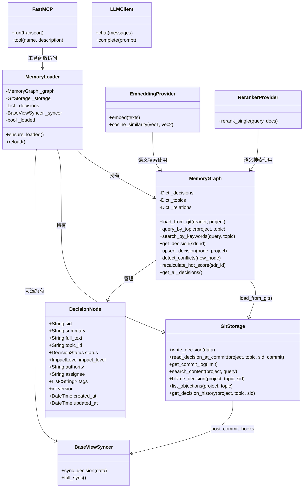
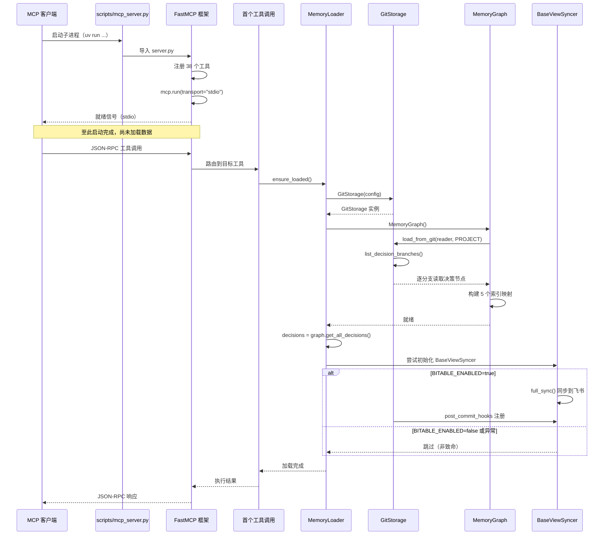

# MCP 服务器部署

## 部署概览

MCP 服务器以单进程 Python 应用的形式运行，通过标准输入输出（stdio）与 MCP 客户端建立双向通信信道。它不依赖 HTTP 服务端口，无需反向代理或负载均衡，部署形态极轻——本质是一个长时间运行的 CLI 进程，由 MCP 客户端（如 OpenClaw、Claude Desktop）作为子进程管理其生命周期。

### 数据流与系统集成

MCP 服务器在系统架构中扮演**数据访问层网关**的角色，位于 MCP 客户端与底层存储引擎之间。其数据流分为两条路径：

- **读取路径**：客户端请求 → FastMCP 解析 → 工具函数 → MemoryGraph 内存索引 → 返回 JSON 结果。MemoryGraph 在启动时从 GitStorage 全量加载决策数据到内存，后续读取完全在内存中完成，延迟在毫秒级。
- **写入路径**：客户端请求 → 工具函数 → MemoryGraph 更新内存索引 → GitStorage 写入 Git 仓库 → 可选触发 BaseViewSyncer 同步到飞书多维表格。每次写入产生一个 Git 提交，形成完整的版本历史。

此外，LLM 辅助工具通过 `LLMClient` 或 `LLMProvider` 调用外部大语言模型 API，这些调用独立于主数据流。

### 系统组件关联

核心组件之间的依赖关系采用**组合模式**设计：`MemoryLoader` 作为外观（Facade），统一管理 `MemoryGraph`、`GitStorage` 和 `BaseViewSyncer` 的生命周期；`EmbeddingProvider` 和 `RerankerProvider` 作为策略组件注入到语义搜索流程中。

**MCP 工具到代码实体的映射**



### 环境依赖与启动方式

**必须环境变量**：

| 变量名 | 用途 |
|-------|------|
| `MODEL_NAME` | LLM 模型名称（如 `deepseek-chat`） |
| `BASE_URL` | LLM API 的基础地址 |
| `API_KEY` | LLM API 的认证密钥 |
| `STORAGE_PATH` | Git 工作目录路径，用于存储决策文件 |

**可选环境变量**：

| 变量名 | 用途 |
|-------|------|
| `EMBEDDING_BASE_URL` | 嵌入模型服务地址，不配置则影响语义搜索功能 |
| `RERANKER_BASE_URL` | 重排序模型服务地址，不配置则影响语义搜索排序质量 |
| `BITABLE_ENABLED` | 是否启用飞书多维表格同步，默认不启用 |
| `BITABLE_APP_TOKEN` | 飞书多维表格的 App Token（启用同步时必须） |

**启动命令**：

```bash
uv run python scripts/mcp_server.py
```

**MCP 客户端配置（mcp.json）**：

```json
{
  "feishu-mem": {
    "command": "uv",
    "args": ["run", "python", "scripts/mcp_server.py"],
    "cwd": "/path/to/feishu-mem"
  }
}
```

## 实现细节

### 服务器生命周期与内存加载

MCP 服务器的生命周期可分为三个阶段：

1. **初始化阶段**：`scripts/mcp_server.py` 作为入口，将项目根目录加入 Python 路径、加载 `.env` 环境变量、导入 `run_server` 函数并调用 `mcp.run(transport="stdio")`。FastMCP 框架在此阶段完成工具注册和协议初始化。
2. **延迟加载阶段**：首次工具调用触发 `MemoryLoader.ensure_loaded()`，执行全量数据加载。这是一种**懒加载**策略——服务器启动时不做任何 IO 密集型操作，避免冷启动延迟。
3. **运行阶段**：持续监听 stdio 通道，处理 JSON-RPC 请求。支持通过 `refresh` 工具触发热重载。

**内存初始化时序**



### 语义搜索与降级逻辑

`search` 工具实现了业界通用的**双阶段检索**（Two-Stage Retrieval）架构，在精度和鲁棒性之间取得平衡。整体流程如下：

**第一阶段 — 向量召回（Embedding）**：

1. 初始化 `EmbeddingProvider`，对所有候选决策文本（`full_text` 或 `summary`）批量计算嵌入向量。
2. 对用户查询同样计算嵌入向量。
3. 使用余弦相似度计算查询向量与每个文档向量的相似度得分。
4. 取 Top-K×2 的候选结果进入下一阶段（K 为用户指定的 `top_k`，乘以 2 提供重排序的冗余窗口）。

**第二阶段 — 重排序（Reranker）**：

1. 初始化 `RerankerProvider`，将查询与第一阶段候选文档逐对输入交叉编码器。
2. 重排序模型计算每个候选的精确相关性得分。
3. 将嵌入得分与重排序得分融合，按重排序得分降序排列。

```python
# 语义搜索核心逻辑示意
query_vec = np.array(embedder.embed([query])[0])
doc_vectors = np.array(embedder.embed(texts))
scores = embedder.cosine_similarity(query_vec, doc_vectors)

top_indices = np.argsort(scores)[::-1][:top_k * 2]
scored = [(candidates[i], float(scores[i])) for i in top_indices]
docs = [d.full_text or d.summary for d, _ in scored]
rerank_scores = reranker.rerank_single(query, docs)

combined = sorted(
    [(_node_to_dict(n), es, float(rerank_scores[i]))
     for i, (n, es) in enumerate(scored)],
    key=lambda x: x[2], reverse=True,
)[:top_k]
```

**降级逻辑**：

当 Embedding 或 Reranker 服务不可用时（例如 API 地址未配置、网络异常、服务端返回错误），`search` 工具捕获所有异常并降级为纯关键词搜索：

```python
try:
    # 双阶段语义检索 ...
except Exception:
    logger.info("[search] Model unavailable, fallback to keyword")
    kw = graph.search_by_keywords(query, topic)
    results = [_node_to_dict(d) for d in kw[:top_k]]
```

`search_by_keywords` 在 `MemoryGraph` 内部实现，对决策的 `summary`、`full_text` 和 `tags` 字段进行大小写不敏感的子串匹配，按匹配字段优先级（标题 > 正文 > 标签）排序。降级模式下，返回结果会附加 `method: "keyword"` 标记，便于客户端区分检索方式。

**架构权衡**：

- 双阶段检索相比单次嵌入检索，多一次网络调用和交叉编码计算，但显著提升了搜索结果的相关性排序质量。
- 降级到关键词搜索虽损失语义理解能力，但保证了服务的**基本可用性**——即便 LLM 基础设施完全不可用，用户仍能通过精确匹配找到决策记录。
- 整个检索过程的超时和异常处理由调用方（工具函数）统一管理，`EmbeddingProvider` 和 `RerankerProvider` 自身不实现重试逻辑，保持关注点分离。