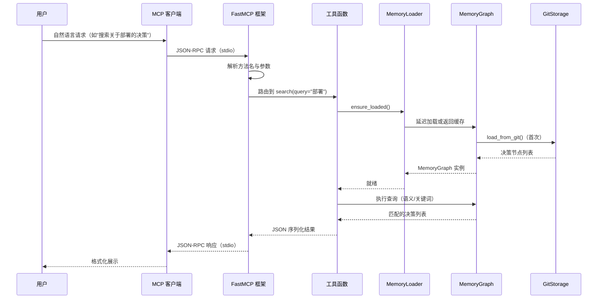

# MCP 工具参考

## 架构数据流

### 自然语言到代码实体映射

MCP（Model Context Protocol）服务器是飞书协作记忆系统的查询与写入网关。它通过标准化的 stdio 传输协议与 MCP 客户端（如 OpenClaw、Claude Desktop）通信，将用户输入的自然语言请求路由到对应的工具函数，最终映射到 MemoryGraph 内存索引或 GitStorage 持久化存储的操作。

整个请求链路可概括为四层：

- **客户端层**：用户通过 MCP 客户端发起自然语言查询或指令，客户端将请求封装为 JSON-RPC 消息。
- **传输层**：基于 stdio 通道，FastMCP 框架自动解析 JSON-RPC 请求，识别目标工具名称与参数。
- **服务层**：每个工具函数使用 `@mcp.tool()` 装饰器注册，通过 MemoryLoader 单例访问 MemoryGraph 和 GitStorage。
- **数据层**：MemoryGraph 提供内存级索引加速读取，GitStorage 负责持久化写入与版本历史追溯。

```python
# 工具注册示例 — FastMCP 装饰器风格
@mcp.tool(name="search", description="搜索决策记忆")
def search(query: str, topic: str = "", top_k: int = 10) -> str:
    _loader.ensure_loaded()
    graph = _loader.graph
    # ... 语义搜索或关键词降级逻辑
```

**MCP 工具执行流程**



## 工具分类

系统共暴露 **38 个工具**，按功能划分为四大类别。所有工具均通过 FastMCP 框架的 `@mcp.tool()` 装饰器注册，自动获得 JSON-RPC 协议兼容性、参数校验和错误响应处理。

### 1. 查询工具

查询工具提供对决策记忆的只读访问，涵盖列表浏览、议题筛选、全文搜索、关系网络、热度分析和决策树查询等场景。共 **16 个工具**。

| 工具名称 | 功能描述 |
|---------|---------|
| `list_decisions` | 列出所有存储的决策，按创建时间倒序排列 |
| `topic` | 按议题 ID 查询决策列表，不传参则返回全部 |
| `search` | 语义搜索（Embedding + Reranker），自动降级为关键词 |
| `decision` | 通过 SDR ID 获取单个决策的完整详情 |
| `timeline` | 获取所有决策的时间线视图 |
| `list_topics` | 列出系统中的所有议题分类 |
| `get_relations` | 获取指定决策的关系网络（关联 + 关系类型） |
| `stats` | 系统统计：决策总数、议题数、状态分布、影响等级分布 |
| `hot_decisions` | 按热度值排序的热点决策排名 |
| `forgotten_decisions` | 热度值低的"被遗忘"决策 |
| `related_decisions` | 获取与指定决策相关的其他决策 |
| `fulltext_search` | 基于关键词匹配的全文搜索 |
| `decision_children` | 获取指定决策的直接子决策列表 |
| `decision_descendants` | 递归获取指定决策的所有后代决策 |
| `decision_ancestors` | 获取指定决策的祖先路径（从根到自身） |
| `decision_tree` | 获取指定决策的完整层级树（递归嵌套结构） |

**关键实现细节**：
- `search` 工具实现了完整的双阶段语义检索（见下文的"语义搜索与降级逻辑"），当嵌入模型或重排序服务不可用时，自动降级为 `MemoryGraph.search_by_keywords()` 关键词搜索。
- `hot_decisions` 和 `forgotten_decisions` 在每次调用时先通过 `recalculate_hot_score()` 重新计算热度值，确保排名的实时性。
- 所有列表类工具均支持 `top_k` 参数限制返回数量，默认值为 50。
- **决策树工具**依赖 `DecisionNode.parent_id` 字段和 `PARENT_OF` / `CHILD_OF` 关系来构建层级结构。`decision_tree` 使用递归算法遍历所有后代节点，返回包含 `children` 数组的完整树状 JSON。

### 2. 写入与变更工具

写入工具负责决策的创建、更新、状态变更、回滚和冲突解决。每次写入操作同时更新内存索引和 Git 持久化存储。共 **7 个工具**。

| 工具名称 | 功能描述 |
|---------|---------|
| `create_decision` | 创建新决策，生成 SDR ID 并写入 Git |
| `update_decision` | 更新已有决策的内容、状态或影响等级 |
| `confirm_decision` | 批准决策，将状态设为 `decided` |
| `reject_decision` | 拒绝决策，将状态设为 `rejected`，可附带理由 |
| `revert_decision` | 回滚决策到指定 Git 提交版本 |
| `resolve_conflict` | 标记两个决策之间的冲突已解决 |
| `resolve_conflict_action` | 获取解决冲突的建议操作方案 |

**关键实现细节**：
- 每次写入操作都会调用 `_loader.storage.write_decision()` 持久化到 Git 仓库，同时更新 `_loader.decisions` 列表保持内存一致性。
- `revert_decision` 通过 `GitStorage.read_decision_at_commit()` 读取历史版本数据，利用 `MemoryGraph._dict_to_node()` 重建节点后覆盖当前版本。
- 所有变更工具均返回操作后的 SDR ID、摘要和提交哈希，便于客户端追踪。

### 3. LLM 辅助工具

LLM 辅助工具利用大语言模型进行语义层面的分析，包括决策提取、议题归类、冲突检测和跨议题影响分析。共 **7 个工具**。

| 工具名称 | 功能描述 |
|---------|---------|
| `evaluate_dedup` | 评估两个决策是否重复或冲突 |
| `extract_decision` | 从自由文本中提取决策信息（标题、影响等级、议题） |
| `classify_topic` | 将决策重新归类到指定议题 |
| `detect_crosstopic` | 检测决策对其他议题的跨议题影响 |
| `check_conflict` | 检查新决策内容与现有决策间的潜在冲突 |
| `extract_and_create` | 从文本提取决策信息并自动创建决策记录 |
| `resolve_conflict_action` | 获取冲突解决的智能建议方案 |

**关键实现细节**：
- `extract_decision` 和 `extract_and_create` 直接初始化 `LLMProvider` 和 `SimpleLLMExtractor`，不依赖 `_mcp_llm_client` 全局实例。当 `API_KEY` 未配置时返回明确错误提示。
- `check_conflict` 构造一个临时 `DecisionNode` 并调用 `MemoryGraph.detect_conflicts()` 进行语义层面的矛盾检测。
- `detect_crosstopic` 利用 `MemoryGraph.query_cross_topic()` 在内存图中搜索其他议题中与该决策相关的节点。

### 4. Git 与系统工具

Git 工具提供版本控制层面的数据追溯能力；系统工具管理服务器的运行时状态。共 **8 个工具**。

| 工具名称 | 功能描述 |
|---------|---------|
| `git_history` | 获取 Git 提交历史记录 |
| `git_search` | 在 Git 历史中搜索决策内容 |
| `git_blame` | 追溯决策文件的每行最后修改人 |
| `conflict_list` | 列出所有已记录的决策冲突关系 |
| `objection_list` | 列出指定议题下的异议（反对意见） |
| `decision_card` | 获取决策的飞书卡片格式 JSON |
| `decision_history` | 获取决策的版本变更历史 |
| `refresh` | 从 Git 存储重新加载所有决策到内存 |

**关键实现细节**：
- `git_blame` 和 `decision_history` 需要同时提供 SDR ID 和议题 ID 以定位 Git 中的决策文件。
- `conflict_list` 遍历所有决策的关系列表，筛选出类型为 `CONFLICTS_WITH` 的关系并构造冲突对。
- `refresh` 调用 `MemoryLoader.reload()` 将 `_loaded` 标志置为 `False`，下次访问时自动重新加载。
- `decision_card` 返回结构化字典，可直接用于飞书消息卡片渲染。