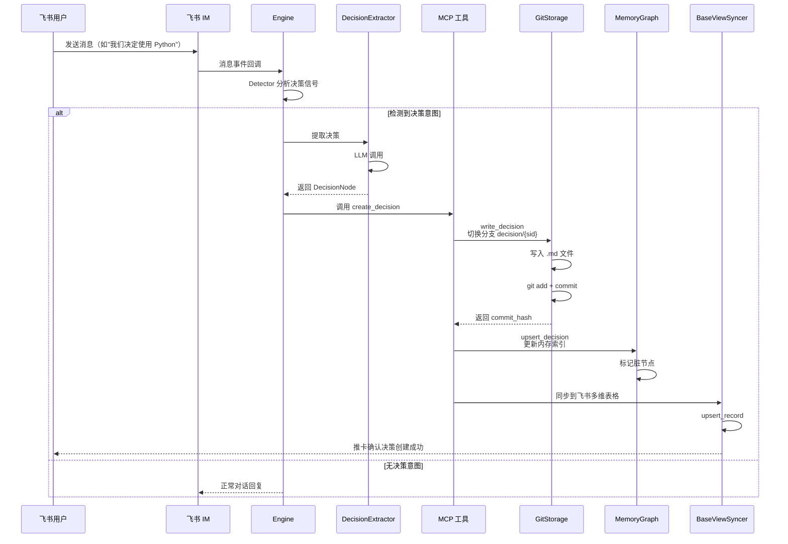

## 1. 架构概览

Git Storage 是整个系统数据持久化的基石，负责将 LLM 从飞书对话中提取的决策、反对意见等结构化知识写入本地 Git 仓库，并提供分支管理、历史追溯、内容搜索等版本控制能力。

`GitStorage` 封装了决策的完整 CRUD 操作（`write_decision`、`read_decision`、`list_decisions` 等）以及反对意见的管理（`write_objection`、`list_objections`），底层依赖 `GitCLI` 执行实际的 Git 命令。此外，`BaseViewSyncer` 在 Git 持久化的基础上，将决策数据同步到飞书多维表格（Base），实现 Git 仓库 ↔ 飞书 Base 的双通道写入。

### 数据流：自然语言到代码实体

一条决策从用户在飞书聊天中说出的一句话，到最终写入 Git 仓库，经历了一个完整的数据管道：

1. **消息接收**：飞书 IM 事件监听器捕获用户消息
2. **信号检测**：`Detector` 分析消息中是否包含决策意图
3. **LLM 提取**：`DecisionExtractor` 调用大模型从对话中提取结构化决策数据
4. **MCP 写入**：MCP 工具调用 `GitStorage.write_decision()` 持久化
5. **内存同步**：`MemoryGraph.upsert_decision()` 同步更新内存索引
6. **Base 同步**：`BaseViewSyncer.sync_decision()` 写入飞书多维表格

#### 图：决策持久化流程



`GitStorage` 同时支持**分支读取**与**主分支读取**两种方式：`read_decision_from_branch()` 基于 `decision/` 前缀的分支读取历史版本，`read_decision()` 直接从主分支的 `decisions/` 目录读取最新文件。这种双轨制使得 Git 仓库既能充当常规文件系统使用，又能保留按分支管理的版本历史。

## 2. 存储策略：每记录一分支

系统采用**每记录一分支**（Branch-per-Record）的存储策略：每个决策对应一个独立的 Git 分支，命名为 `decision/{sid}`。这种策略在常规代码仓库中较为罕见，但在知识管理场景中具有显著优势：

- **独立版本历史**：每个决策的变更历史完全隔离，`git log` 仅展示该决策的每次更新，不会被其他决策的提交干扰
- **细粒度回滚**：可针对单个决策执行 `git revert` 或切换分支实现时间旅行
- **并行演化**：多个决策可以独立演进，互不阻塞

### 分支生命周期管理

`write_decision()` 方法每次写入时执行以下分支操作序列：

1. 保存当前分支（通常为 `main`）
2. 检查 `decision/{sid}` 分支是否存在，不存在则从 `main` 创建
3. 切换到目标分支
4. 在 `decisions/{project}/{topic}/{sid}.md` 路径下写入文件
5. 执行 `git add` + `git commit`，使用 `rev-list --count` 计算当前版本号
6. 切换回 `main` 分支

版本号的生成方式为：`rev-list --count decision/{sid} ^main`，即计算从 `main` 分支分叉之后该决策分支上的提交数量。这使得每次更新自动递增版本号，无需额外维护计数器。

## 3. 文件格式与序列化

### YAML 前置元数据 + Markdown 正文

每条决策存储为一个独立的 `.md` 文件，采用 **YAML frontmatter + Markdown body** 的双段格式。这种格式的优点在于：

- **机器可读**：YAML 前置元数据可以被 `parse_decision_file()` 快速解析为结构化的 Python 字典
- **人工可读**：Markdown 正文方便直接在 Git 编辑器或 GitHub 中阅读
- **双向转换**：`render_decision_file()` 与 `parse_decision_file()` 互为逆操作

#### 文件结构示例：

```markdown
---
sid: "abc123def456"
topic_id: "技术选型"
title: "后端语言选择"
summary: "团队决定主语言选用 Python"
decision: "经讨论，团队决定将 Python 作为后端主语言..."
rationale: "团队 Python 经验丰富，生态成熟"
status: "decided"
impact_level: "major"
version: 3
project: "feishu-mem"
---

# 后端语言选择

## 决策

经讨论，团队决定将 Python 作为后端主语言...

## 依据

团队 Python 经验丰富，生态成熟

## 元数据

- **Topic**: 技术选型
- **Status**: decided
- **Impact Level**: major
- **Proposer**: user_123
```

`render_decision_file()` 将决策字典渲染为上述格式。YAML 部分包含决策的所有元数据字段，Markdown 正文部分则呈现决策标题、决策正文、依据说明和元数据摘要，方便人工阅读。`parse_decision_file()` 在读取时通过正则或 YAML 解析器提取 `---` 分隔符之间的前置元数据。

## 4. GitCLI 实现

`GitCLI` 是对 Git 命令行工具的轻量 Python 封装，所有操作通过 `subprocess.run()` 调用系统 Git 执行。它不依赖任何第三方 Git 库（如 GitPython），保持了零外部依赖和与系统 Git 版本的完全兼容。

### 关键操作

| 操作 | 方法 | 底层命令 |
|---|---|---|
| 初始化仓库 | `run("init")` | `git init` |
| 提交文件 | `commit(path, msg)` | `git add {path}` → `git commit -m {msg}` |
| 创建分支 | `create_branch(name)` | `git checkout -b {name}` |
| 切换分支 | `switch_branch(name)` | `git checkout {name}` |
| 合并分支 | `merge_branch(name)` | `git merge --no-ff {name}` |
| 获取 HEAD | `get_head_hash()` | `git rev-parse HEAD` |
| 文件历史 | `get_commit_log(path)` | `git log --oneline -- {path}` |
| 全文搜索 | `git_grep(pattern)` | `git grep -i -n {pattern}` |
| 逐行追溯 | `git_blame(path)` | `git blame -p {path}` |
| 分支列表 | `list_branches()` | `git branch -a` |
| 文件清单 | `ls_tree(branch)` | `git ls-tree -r --name-only {branch}` |
| 远程推送 | `run("push", ...)` | `git push -u origin {branch}` |

`GitCLI` 将 `git add` 和 `git commit` 合并为 `commit()` 方法，并处理了"没有变更需要提交"的边界情况。所有错误均以 `GitCLIError` 异常形式抛出，上层调用方可根据异常类型决定是否重试或跳过。

## 5. 目录结构与配置

### 仓库布局

`GitStorage` 在 `data/` 目录下维护独立的 Git 仓库，其文件结构如下：

```
data/
├── .git/                       # Git 仓库内部数据
├── L0_RULES.md                 # L0 规则文件（初始提交）
├── dummy.md                    # 根节点占位文件
├── decisions/                  # 决策文件目录
│   └── {project}/
│       └── {topic}/
│           └── {sid}.md        # 单个决策文件
├── objections/                 # 反对意见文件目录
│   └── {project}/
│       └── {topic}/
│           └── {oid}.md        # 单个反对意见文件
└── archive/                    # 归档项目
    └── {project}/
```

仓库在首次初始化时自动创建 `L0_RULES.md` 和 `dummy.md` 作为初始提交，确保 Git 仓库的 HEAD 始终有效。`archive_project()` 方法可将已归档的项目整体移动到 `archive/` 目录。

### 自动推送与同步

`GitStorageConfig` 提供了 `remote` 和 `auto_push` 两个配置项。当 `auto_push = True` 且 `remote` 不为空时，每次 `write_decision()` 写入成功后自动执行 `git push -u origin {branch}`，将变更同步到远程仓库。

`BaseViewSyncer` 在 Git 写入的基础上，通过飞书多维表格 API 将决策数据同步到 Base 视图。`full_sync()` 方法执行全量同步（先清空再重建），`sync_decision(sid)` 执行增量单条同步。这条同步链路由环境变量 `BITABLE_ENABLED` 控制开关。

关于内存索引的详细设计，参见 [MemoryGraph (In-Memory Index)](MemoryGraph%20(In-Memory%20Index).md)。关于超图检索与混合搜索的实现，参见 [Hypergraph Structure & Retrieval](Hypergraph%20Structure%20&%20Retrieval.md)。