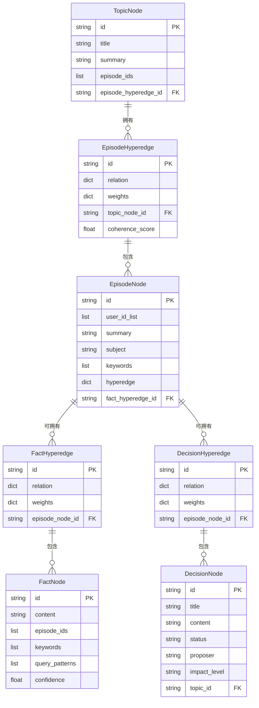
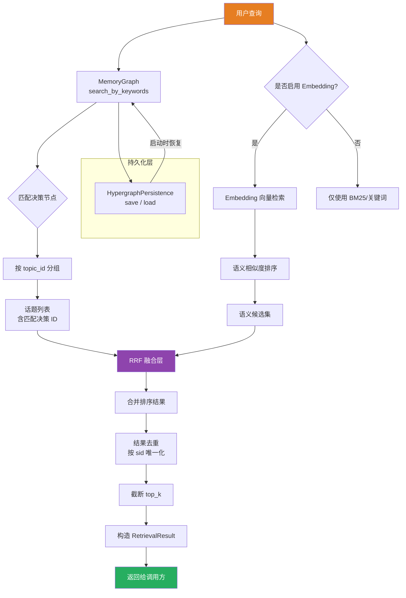

## 三层超图架构

超图（Hypergraph）是系统中用于组织和管理长期记忆的核心数据结构。它采用**层次化超图**（Layered Hypergraph）模型，将不同粒度的知识单元组织为节点，并通过超边（Hyperedge）表达多对多的跨层关联。

系统实际使用四层结构，从底层的事实知识到顶层的主题抽象：

| 层级 | 节点类型 | 超边类型 | 说明 |
|---|---|---|---|
| L0 — 决策层 | `DecisionNode` | `DecisionHyperedge` | 存储决策性知识（谁在何时决定了什么） |
| L1 — 事实层 | `FactNode` | `FactHyperedge` | 存储声明性知识（客观事实、上下文信息） |
| L2 — 对话层 | `EpisodeNode` | `EpisodeHyperedge` | 存储对话轮次（用户与 AI 的交互片段） |
| L3 — 主题层 | `TopicNode` | — | 存储主题抽象（多个对话轮次汇聚成的讨论主题） |

各层之间的超边建立了双向链接（bidirectional link），使得从任意一个节点出发都可以沿超边跨层导航：例如从某个话题出发，找到关联的对话轮次，再找到其中的事实和决策。

## 数据结构映射

`Hypergraph` 容器类（定义于 `structure.py`）是超图的内存表示，其七个字典字段分别对应四层的节点与超边：

```
Hypergraph
├── L0: decisions: Dict[str, DecisionNode]
│       decision_hyperedges: Dict[str, DecisionHyperedge]
├── L1: facts: Dict[str, FactNode]
│       fact_hyperedges: Dict[str, FactHyperedge]
├── L2: episodes: Dict[str, EpisodeNode]
│       episode_hyperedges: Dict[str, EpisodeHyperedge]
└── L3: topics: Dict[str, TopicNode]
```

每个节点通过其 `hyperedge` 字段（`Dict[str, str]`，超边 ID → 角色名）与超边关联；超边通过 `relation` 字段（`Dict[str, str]`，节点 ID → 角色名）与节点关联。这一双向映射机制确保了数据的一致性和可遍历性，`validate_bidirectional_links()` 方法可在构建完成后自动校验全部双向链接的一致性。

`DecisionNode`、`FactNode`、`EpisodeNode`、`TopicNode` 各自支持与对应的数据类（`Decision`、`Fact`、`Episode`、`Topic`）之间的双向转换（`from_xxx()` / `to_xxx()`），使得超图与系统的其他数据管道可以无缝对接。

## 超图构建逻辑

### 构建流程

`HypergraphBuilder` 是超图的构造器，提供两条构建路径：

1. **从对话轮次构建**（`build_from_episodes`）：接收 `Episode.to_dict()` 列表作为输入，按 `chat_id` 分组后，依次创建 EpisodeNode 和 TopicNode，并通过 EpisodeHyperedge 建立关联。若传入了 `existing_hypergraph`，则执行增量合并——跳过已有的 episode，新 episode 按参与者信息尝试匹配已有话题。
2. **从决策构建**（`build_decision_hypergraph`）：接收 `DecisionNode` 列表，按 `topic_id` 分组构建话题维度的决策超图，同时提取节点间的关系边作为超边。

增量合并的逻辑体现了系统的长期运行特征：随着新对话的流入，`build_from_episodes` 被反复调用，每次将新 episode 归入已有话题或创建新话题，而非全量重建。

### 实体关系图



## 分层检索

### 检索机制

`HierarchicalRetriever` 实现了基于超图的层次化检索管道。与传统平面搜索不同，它利用超图的分层结构实现**从粗到细**的检索策略：

1. **L3 → L2 话题路由**：通过 `search_by_keywords(query)` 在 MemoryGraph 中执行关键词匹配，将匹配结果按 `topic_id` 分组，返回匹配度最高的话题列表
2. **路径展开**：每个话题对应一组决策节点，沿超图路径可进一步展开到下层节点（事实、对话轮次）
3. **结果去重**：按 sid 去重并按相关性截断

### 混合搜索与融合

检索器支持 BM25 文本检索与 Embedding 向量检索的混合搜索模式，通过**倒数排序融合（RRF, Reciprocal Rank Fusion）** 算法合并多路结果：

```python
@staticmethod
def reciprocal_rank_fusion(results_list, top_n, k=60):
    doc_scores = {}
    for results in results_list:
        for rank, (doc, _) in enumerate(results):
            doc_id = doc.get("id") or str(hash(str(doc)))
            rrf_score = 1.0 / (k + rank + 1)
            doc_scores[doc_id] = doc_scores.get(doc_id, {"doc": doc, "score": 0})
            doc_scores[doc_id]["score"] += rrf_score
    sorted_results = sorted(doc_scores.values(), key=lambda x: x["score"], reverse=True)
    return sorted_results[:top_n]
```

RRF 的核心思想是：如果一个文档在多路检索结果中排名都靠前，则其融合分数会显著高于仅在单一维度匹配的文档。常数 `k`（默认 60）用于抑制排名靠后文档的贡献。这种算法简洁且无需训练，适合在飞书场景中快速融合不同的检索信号。

### 检索数据流

从用户查询到最终结果的完整流程如下：



检索结果以 `RetrievalResult` 数据结构返回，包含命中的话题列表、决策节点列表、各节点得分及统计数据，可供 MCP 查询接口或飞书消息卡片直接消费。

超图的状态通过 [HypergraphPersistence](https://github.com/your-repo/src/graph/persistence.py) 序列化为 `state.json` 文件，在系统启动时恢复，在每次 episode 处理后全量覆写。