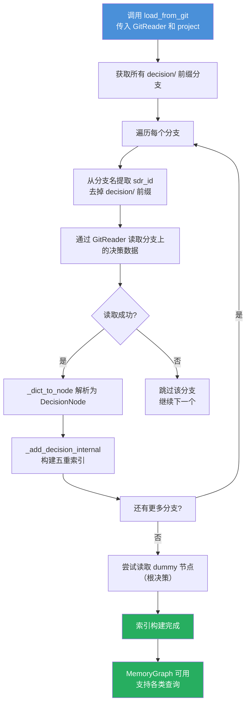

## 1. 内部架构与索引

MemoryGraph 是系统中所有决策节点的运行时内存索引，相当于一份**全量决策缓存**，为 MCP 查询、冲突检测、热点计算和飞书多维表格同步提供 O(1) 级别的数据访问能力。

其内部维护五重索引结构，全部以 Python 字典或集合实现，由 `threading.RLock` 保障并发安全：

| 索引 | 类型 | 用途 |
|---|---|---|
| `_decisions` | `Dict[str, DecisionNode]` | 主键索引，sid → DecisionNode 的直接映射 |
| `_topics` | `Dict[str, List[str]]` | 话题索引，`"{project}/{topic}"` → sid 列表 |
| `_projects` | `Dict[str, List[str]]` | 项目索引，project → topic 名称列表 |
| `_relations` | `Dict[str, List[Relation]]` | 关系索引，sid → Relation 列表 |
| `_dirty_decisions` | `Set[str]` | 脏标记集，记录自上次持久化以来发生过变更的 sid |

这种多重索引的设计使得不同维度的查询都能快速命中，无需遍历全量数据。例如 `query_by_topic(project, topic)` 可以直接通过 `_topics` 拿到该话题下的所有决策 ID，再回表查询 `_decisions` 获取完整节点。

## 2. DecisionNode 模式与状态

DecisionNode 是 MemoryGraph 中存储的基本单元，由 Pydantic BaseModel 定义，拥有丰富的字段来描述一个决策的完整生命周期。

### 关键字段

| 字段 | 类型 | 说明 |
|---|---|---|
| `sid` | `str` | 全局唯一决策 ID，基于内容哈希生成 |
| `summary` / `full_text` | `str` | 决策摘要与完整正文 |
| `topic_id` | `str` | 所属话题 ID |
| `status` | `DecisionStatus` | 生命周期状态枚举 |
| `impact_level` | `ImpactLevel` | 影响级别 (advisory / minor / major / critical) |
| `confidence` | `float` | LLM 提取置信度，范围 [0.0, 1.0] |
| `version` | `int` | 版本号，每次更新递增 |
| `relations` | `List[Relation]` | 关系边列表，描述该节点与其他节点的语义关联 |
| `parent_id` | `str` | 父决策 ID，空值表示根节点 |
| `authority` / `proposer` / `assignee` | `str` | 角色归属字段 |
| `tags` | `List[str]` | 标签列表 |
| `access_stats` | `AccessStats` | 访问统计，用于热点值计算 |
| `created_at` / `updated_at` | `datetime` | 创建与更新时间戳 |

状态枚举 `DecisionStatus` 定义了十个状态值，覆盖从提出到废弃的完整生命周期：`pending`、`pending_confirmation`、`in_discussion`、`decided`、`executing`、`completed`、`shelved`、`rejected`、`superseded`、`deprecated`。其中前六个为活跃状态（`is_active()` 返回 `true`），后四个为非活跃状态。

## 3. 基于关系的冲突检测

MemoryGraph 不依赖外部推理引擎，而是通过预定义的**关系边网络**实现冲突发现。每个 DecisionNode 持有一个 `relations` 列表，其中的 `Relation` 对象包含类型、目标 ID 和描述信息。

关系类型枚举 `RelationType` 定义了八种语义：`DEPENDS_ON`、`SUPERSEDES`、`REFINES`、`CONFLICTS_WITH`、`RELATES_TO`、`OBJECTION`、`PARENT_OF`、`CHILD_OF`。其中 `CONFLICTS_WITH` 是冲突检测的核心关系类型。

### 冲突检测逻辑

`detect_conflicts(new_node)` 方法扫描 `_relations` 索引中所有已存在的节点关系，判断是否有任何已有节点的 `CONFLICTS_WITH` 关系指向新节点的 sid。如果发现匹配，则构造一个 `Conflict` 对象返回给调用方：

```python
def detect_conflicts(self, new_node: DecisionNode) -> List[Conflict]:
    conflicts = []
    for sdr_id, relations in self._relations.items():
        for rel in relations:
            if rel.type == RelationType.CONFLICTS_WITH and rel.target_id == new_node.sid:
                other = self._decisions.get(sdr_id)
                if other:
                    conflicts.append(Conflict(
                        conflict_id=f"conflict_{sdr_id}_{new_node.sid}",
                        decision_a=sdr_id,
                        decision_b=new_node.sid,
                        description=f"'{other.summary}' 与 '{new_node.summary}' 存在冲突",
                    ))
    return conflicts
```

这种设计的好处是冲突关系是**显式声明**的，而非运行时推导——当用户在飞书聊天中确认两个决策互斥时，系统通过 MCP 工具写入 `CONFLICTS_WITH` 关系边，后续所有检测均可即时命中。

## 4. 热点值算法

热点值（Hot Score）是一个 [0, 100] 之间的浮点数，用于衡量一个决策的**当前热度**。系统使用该值在飞书多维表格中对决策进行排序，帮助用户快速聚焦高价值信息。

`recalculate_hot_score(sid)` 方法从四个维度计算加权得分：

| 维度 | 计算方式 | 权重 | 上限 |
|---|---|---|---|
| 引用分数 | `reference_count * 20.0` | 40% | 100 |
| 访问分数 | `access_count * 15.0` | 20% | 100 |
| 关系分数 | `len(relations) * 25.0` | 15% | 100 |
| 基础分数 | `max(0, 25 - 天数 * 1.5)` | 直接加和 | 25 |

最终公式为：

```
hot_score = ref_score * 0.40 + access_score * 0.20 + relation_score * 0.15 + base_score
hot_score = clamp(hot_score, 0, 100)
```

基础分数随创建时间线性衰减（每天衰减 1.5），确保旧决策在不被引用和访问时逐渐降权。引用次数赋予最高权重（40%），因为在实践中，被频繁引用意味着该决策持续具有参考价值。

每次通过 MCP 工具访问决策时，系统自动调用 `update_access_stats(sid)` 递增 `access_count` 并重新计算热点值；`record_reference(sid)` 则单独递增 `reference_count`。

## 5. 脏节点追踪与持久化

MemoryGraph 与 Git 存储之间采用**脏标记 + 批量刷新**的模式同步数据变更，而非每次写入都触发 Git 操作，以兼顾运行效率与数据持久性。

核心机制围绕 `_dirty_decisions` 集合展开：

- **标记脏节点**：`upsert_decision()` 或任何访问统计更新操作都会将对应 sid 加入 `_dirty_decisions`
- **获取并清理**：`get_dirty_and_clean()` 方法返回当前所有脏节点的 DecisionNode 列表，然后清空集合
- **删除处理**：`delete_decision()` 同时从 `_decisions` 和 `_dirty_decisions` 中移除

Engine 的事件循环会在每次睡眠周期（Sleep Cycle）中调用 `get_dirty_and_clean()`，将脏节点批量写入 Git 仓库，从而实现内存索引与磁盘存储的最终一致性。

## 6. GitReader 协议与加载

MemoryGraph 通过 `GitReader` 协议接口从 Git 存储初始化数据。`GitReader` 定义了从 Git 后端读取决策所必需的抽象方法，包括 `list_decision_branches()`、`read_decision_from_branch()`、`read_decision()` 等。`GitStorage` 实现了该协议，使得 MemoryGraph 无需关心具体的存储后端实现。

### 加载数据流

`load_from_git(reader, project)` 是系统的启动入口之一，其完整流程如下：



关键步骤说明：

1. **分支枚举**：调用 `GitReader.list_decision_branches()` 获取所有以 `decision/` 为前缀的 Git 分支，每个分支对应一条决策记录
2. **数据读取**：通过 `read_decision_from_branch(branch, sdr_id)` 在对应分支上读取决策文件内容
3. **反序列化**：`_dict_to_node()` 将字典数据转换为 `DecisionNode` 实例，处理字段映射、字符串到枚举的转换、时间戳解析等
4. **索引构建**：`_add_decision_internal()` 将节点依次注册到 `_decisions`、`_topics`、`_projects`、`_relations` 四个索引中
5. **Dummy 节点**：最后尝试读取项目通用的 dummy 根节点，用于建立决策树的根起始点

## 7. 搜索与检索

MemoryGraph 提供两类基本的搜索能力：

- **精确查找**：`get_decision(sid)` 通过主键索引 O(1) 获取单个决策
- **关键词搜索**：`search_by_keywords(query, topic)` 遍历所有活跃决策，在 `summary`、`full_text`、`topic_id` 三个字段中做大小写不敏感的子串匹配

关键词搜索实现简单直接，适合 MCP 工具做快速过滤。对于更复杂的语义检索需求（如 BM25 + Embedding 混合搜索），由 [Hypergraph Structure & Retrieval](Hypergraph%20Structure%20&%20Retrieval.md) 中的 `HierarchicalRetriever` 层提供，其在 MemoryGraph 之上构建了层次化的检索管道。

## 8. 决策树层级遍历

MemoryGraph 提供三个层级遍历方法，基于 `DecisionNode.parent_id` 字段和 `PARENT_OF` / `CHILD_OF` 关系来构建决策树：

| 方法 | 作用 | 实现方式 |
|------|------|---------|
| `get_children_of(sid)` | 获取直接子决策 | 同时检查 `PARENT_OF` 关系列表和 `parent_id` 字段匹配 |
| `get_descendants(sid)` | 递归获取所有后代 | 从子节点出发，逐层向下递归 |
| `get_ancestors(sid)` | 获取祖先路径 | 从当前节点沿 `parent_id` 链向上回溯，返回 `[根, ..., 父, 当前]` |

这些方法通过 MCP 工具 `decision_children`、`decision_descendants`、`decision_ancestors` 和 `decision_tree` 暴露给客户端，支持 AI 助手理解决策之间的层级关系，如"容器化方案 → K8s → 容器网络(Calico) / 容器监控(Prometheus) / 容器安全(PSS)"。

---

*[回到目录](../technical-report.md)*