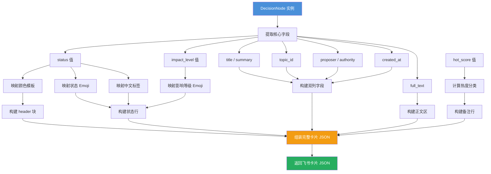
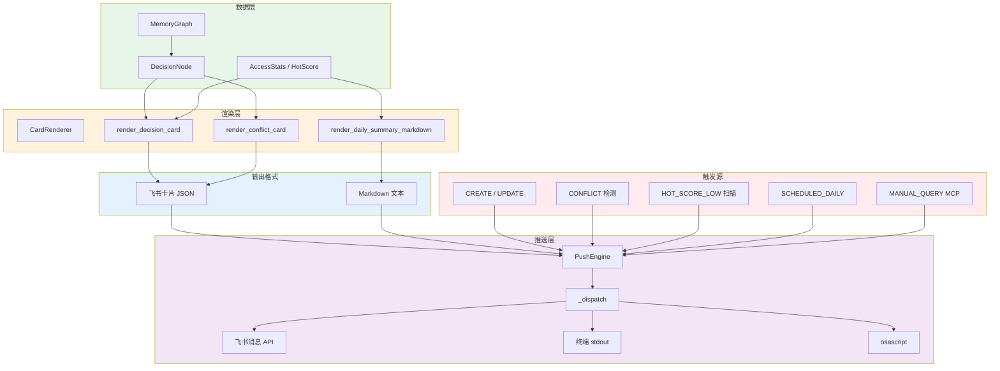

## 核心实现

CardRenderer 是系统中负责将结构化决策数据转化为可视化卡片的渲染模块。它输出两种格式：飞书交互卡片 JSON（用于飞书消息推送）和 Markdown 文本（用于终端输出和 macOS 通知）。

核心渲染方法 `render_decision_card(node, hot_score)` 接收一个 `DecisionNode` 和当前热点值，返回符合飞书消息卡片协议的 JSON 字典。渲染器不依赖外部模板引擎，所有卡片结构通过 Python 字典字面量直接构建。

## 决策卡片布局

一张标准决策卡片包含以下层级结构：

```
┌─ header ─────────────────────────────────┐
│  📋 决策卡片 [sid_前8位]    (颜色模板)     │
├─ elements ───────────────────────────────┤
│  ├─ 状态行: ⏳ 状态: 待处理 | 📊 影响: minor │
│  ├─ 双列字段                            │
│  │  ├─ 📌 标题: <summary>                │
│  │  ├─ 🏷️ 议题: <topic_id>              │
│  │  ├─ 📋 提议者: <authority>            │
│  │  └─ 📅 创建: <created_at>             │
│  ├─ 正文区 (含 full_text 前 300 字符)     │
│  ├─ ───── 分隔线 ──────                  │
│  └─ 备注: 🔥 热点值: 85/100 (活跃)       │
└──────────────────────────────────────────┘
```

颜色模板根据决策状态动态映射：

| 状态 | 模板颜色 |
|------|----------|
| `decided` | 绿色 (green) |
| `in_progress` / `executing` | 蓝色 (blue) |
| `completed` | 绿色 (green) |
| `pending` | 黄色 (yellow) |
| `superseded` / `rejected` / `deprecated` / `shelved` | 红色 (red) |

### 数据流：节点到卡片



## 冲突卡片对比视图

当系统检测到两个决策存在语义冲突时，`render_conflict_card(node_a, node_b, reason)` 生成一张带有红色警告头部的对比卡片，结构如下：

- **警告头部**：红色模板 + "⚠️ 决策冲突需要确认" 标题
- **冲突描述**：检测到的冲突原因文本
- **决策 A 区块**：标题 + 影响等级 + 决策内容（前 200 字符）
- **分隔线**
- **决策 B 区块**：与 A 相同的结构
- **交互按钮**：两个 action 按钮——"✅ 保留 A" 和 "✅ 保留 B"
  - 每个按钮携带 `value` 数据 `{"action": "conflict_resolve", "winner_sdr": ..., "loser_sdr": ...}`
  - 飞书客户端点击后可通过 MCP 工具触发冲突解决
- **操作说明**：底部备注提示用户也可以使用 MCP resolve_conflict 工具

冲突卡片的按钮 value 设计使得飞书卡片交互可以与后端的 MCP 工具链连接：点击按钮后系统读取 value 中的 `winner_sdr` 和 `loser_sdr`，执行保留胜者、标记败者为 superseded 的原子操作。

## 摘要与定期格式

### 每日摘要

`render_daily_summary_markdown(date, new_decisions, forgotten_decisions)` 生成纯文本格式的决策日报，结构为 Markdown 文档：

```
# 📋 决策日报 - 2025-06-15

## ✨ 新增决策 (N 个)
- **决策标题** [sid_前8位] - 🔥热度值

## 💤 遗忘决策提醒 (M 个)
- **决策标题** [sid_前8位] - 🔥热度值
```

- 新增决策列出最近 24 小时内创建的决策，最多展示 5 条
- 遗忘决策仅展示热点值低于阈值的决策，最多展示 3 条
- 所有决策按热度值降序排列

### 配置集成

推送配置通过 `CardConfig.from_env()` 从环境变量加载，关键配置项包括：

| 环境变量 | 默认值 | 说明 |
|----------|--------|------|
| `PUSH_FEISHU_ENABLED` | `false` | 启用飞书推送 |
| `PUSH_TERMINAL_ENABLED` | `true` | 启用终端输出 |
| `PUSH_OSASCRIPT_ENABLED` | `false` | 启用 macOS 通知 |
| `CARD_CHAT_IDS` | `""` | 目标群聊 ID 列表（逗号分隔） |
| `PUSH_DAILY_SUMMARY` | `true` | 启用每日摘要 |
| `PUSH_DAILY_TIME` | `"08:00"` | 每日摘要推送时间 |
| `PUSH_WEEKLY_DAY` | `"6"` | 每周摘要推送日（0=周一, 6=周日） |
| `PUSH_WEEKLY_TIME` | `"21:00"` | 每周摘要推送时间 |

## 系统集成图

CardRenderer 在整个系统中处于"表达层"的位置，连接推理层（PipelineEngine、MemoryGraph）和通信层（PushEngine、飞书消息 API）。下图展示了渲染管道的完整架构：



渲染链路中值得关注的架构决策：

1. **渲染与推送分离** — CardRenderer 只负责数据到卡片的转换，不关心卡片如何发送；PushEngine 负责调度和通道管理，不关心卡片的具体结构。这种关注点分离使得任何一个模块可以独立替换或扩展。

2. **统一的数据源** — 所有卡片渲染都从 MemoryGraph 读取决策节点数据，保证卡片内容的准确性和一致性。PushEngine 不缓存决策数据。

3. **飞书卡片协议耦合** — CardRenderer 输出的 JSON 结构与飞书消息卡片协议（Lark Interactive Card Protocol）紧密绑定。如需支持其他即时通讯平台的消息格式，需扩展渲染器。

4. **降级友好的格式设计** — 单条决策同时生成卡片 JSON（飞书）和 Markdown（终端/osascript），确保飞书不可用时推送不中断。

推送引擎的详细调度逻辑参见 [PushEngine & Scheduling](PushEngine%20%26%20Scheduling.md)。