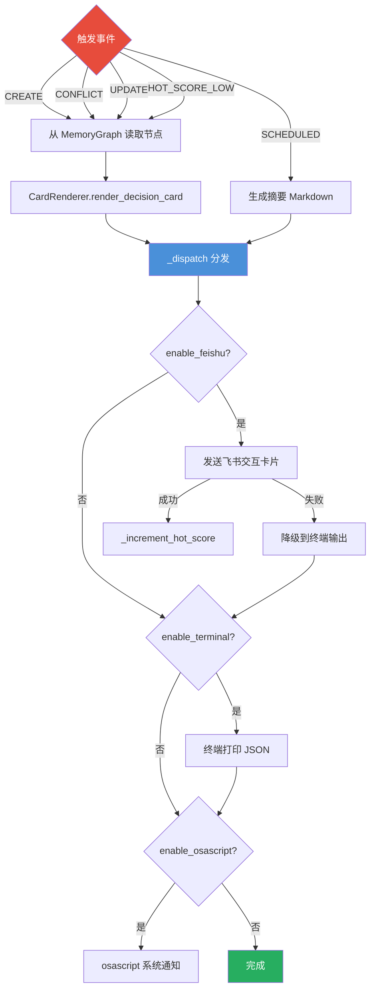

## 推送触发器与事件类型

PushEngine 是整个系统的通知中枢，负责将决策创建、冲突、更新和周期性摘要以卡片或文本形式推送到用户可感知的渠道。推送动作由七种事件类型触发：

| 触发器 | 枚举值 | 触发场景 |
|--------|--------|----------|
| `CREATE` | `"create"` | 新决策被提取并持久化后立即触发 |
| `CONFLICT` | `"conflict"` | 检测到语义冲突时推送对比卡片 |
| `DECISION_UPDATE` | `"decision_update"` | 决策内容或状态被更新时触发 |
| `HOT_SCORE_LOW` | `"hot_score_low"` | 热点扫描发现低热点决策时提醒 |
| `SCHEDULED_DAILY` | `"scheduled_daily"` | 每日定时推送决策摘要 |
| `SCHEDULED_WEEKLY` | `"scheduled_weekly"` | 每周定时推送周度摘要 |
| `MANUAL_QUERY` | `"manual_query"` | 用户通过 MCP 工具主动查询 |

每个触发器可通过环境变量独立启用/禁用，配置项定义在 `CardConfig` 中：

```
PUSH_TRIGGER_CREATE=true
PUSH_TRIGGER_CONFLICT=true
PUSH_TRIGGER_UPDATE=true
PUSH_TRIGGER_HOT_SCORE=true
```

## 系统架构：推送与调度

### 推送逻辑流程

每个推送请求经过统一的数据流管道：从 MemoryGraph 读取决策节点 → 调用 CardRenderer 生成卡片 JSON → 经过 `_dispatch()` 方法按配置分发到已启用的渠道。



## 热点值系统

热点值（Hot Score）是 PushEngine 用于量化决策"受关注程度"的核心指标，取值范围 0~100。系统通过热点值实现两个目标：优先推送高价值决策，以及主动提醒被遗忘的决策。

### 衰减与递增

热点值的变化遵循两个方向的操作：

**递增**（每次推送时触发）：
```
hot_score = min(100.0, hot_score + 10.0)
```
每次成功推送决策卡片后调用 `_increment_hot_score()`，将热点值增加固定增量（默认 10.0），上限 100。

**衰减**（定时扫描循环触发）：
```
hot_score = max(0.0, hot_score * 0.95)
```
`_hot_score_scan_loop` 每 `hot_score_scan_interval`（默认 600s = 10 分钟）扫描一次所有决策，调用 `_decay_all_hot_scores()` 统一执行指数衰减，衰减系数 0.95。

热点值对应四个热度分类：

| 分类 | 阈值 | 说明 | 行为 |
|------|------|------|------|
| ACTIVE | >= 80 | 高频关注的活跃决策 | 卡片显示高亮标记 |
| NORMAL | >= 50 | 正常关注的决策 | 普通展示 |
| FUZZY | >= 20 | 关注度较低的模糊决策 | 触发热点扫描提醒 |
| FORGOTTEN | < 20 | 被遗忘的决策 | 推送遗忘提醒通知 |

当热点值低于 `hot_score_low_threshold`（默认 20.0）时，`push_low_hot_score_decisions()` 会向用户推送遗忘决策提醒，帮助用户回顾被冷落的重要决定。

## 多通道分派

### 通道实现细节

PushEngine 支持三个推送渠道，按优先级依次尝试：

**飞书交互卡片（Feishu Interactive Card）**：
- 使用 `MessageContent.interactive(card_json)` 构造飞书消息体
- 通过 `lark_client.send_message()` 发送到配置的群聊（`CARD_CHAT_IDS`）
- 接收者类型支持 `chat_id` / `open_id` / `user_id` 配置
- 发送失败时自动降级到终端输出，不阻断推送流程

**终端输出（Terminal）**：
- 使用 `print()` 以 JSON 或 Markdown 文本格式直接输出到标准输出
- 带有时间戳和触发类型的格式化头部标识
- 内容长度限制为 2000 字符
- 默认启用（`PUSH_TERMINAL_ENABLED=true`）

**macOS 系统通知（osascript）**：
- 调用 `osascript -e 'display notification'` 发送 macOS 原生通知
- 取 Markdown 首行作为通知标题（最多 50 字符）
- 通知正文限制为 150 字符
- 默认禁用（`PUSH_OSASCRIPT_ENABLED=false`）

### 分派顺序

`_dispatch()` 方法按以下顺序依次尝试各渠道：

```
飞书卡片 → 终端输出 → macOS 通知
```

- 飞书失败时仍继续尝试后续渠道（fail-open 策略）
- 终端和 osascript 没有降级路径，直接执行
- 任一渠道成功即标记 `success = true`
- 所有渠道尝试完毕后返回整体成功状态

## 调度循环

PushEngine 在 `start_push_scheduler()` 被调用后启动三个后台定时任务：

**热点扫描循环**（`_hot_score_scan_loop`）：
- 以 `hot_score_scan_interval` 为间隔循环执行
- 每次扫描先执行全局热点值衰减（`_decay_all_hot_scores`）
- 然后检查是否存在热点值低于阈值的决策并推送提醒
- 由 `trigger_on_hot_score_threshold` 配置控制启停

**每日摘要**（`_scheduled_daily_task`）：
- 读取 `daily_summary_time` 配置（默认 `"08:00"`）
- 计算当前时间到下一个目标时间的延迟
- 到达时间后调用 `push_daily_summary()` 生成本日报告
- 报告内容包括：24 小时内新建的决策列表 + 热点值低于阈值的遗忘决策列表
- 使用 Markdown 格式输出，不是飞书卡片

**每周摘要**（`_scheduled_weekly_task`）：
- 读取 `weekly_summary_day`（默认 `"6"` = 周六）和 `weekly_summary_time`（默认 `"21:00"`）
- 计算到下一个周目标时间的延迟（当天已达则推后一周）
- 到达后调用与每日摘要相同的方法（`push_daily_summary()`）
- 内容与每日摘要相同，区别仅在于调度频率

定时调度的时间计算逻辑：
```python
# 每日调度
target = parse_time("08:00")
next_run = now.replace(hour=8, minute=0, second=0)
if next_run <= now:
    next_run += timedelta(days=1)
delay = (next_run - now).total_seconds()

# 每周调度
days_ahead = (target_day - now.weekday()) % 7
if days_ahead == 0 and now.time() >= target:
    days_ahead = 7
next_run = (now + timedelta(days=days_ahead)).replace(hour=21, minute=0, ...)
```

完整推送配置说明参见 [Getting Started & Configuration](../project_overiew/Getting%20Started%20&%20Configuration.md)。