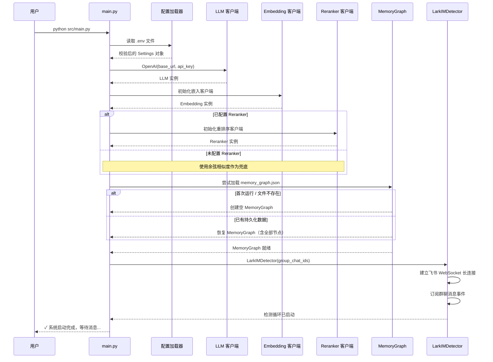

# 环境搭建与配置指南

## 1. 环境搭建

### 1.1 依赖管理

项目采用 **uv** 作为 Python 包管理器。uv 是 Rust 编写的现代包管理工具，相较于 pip/poetry 具有显著的速度优势（依赖解析速度提升 10-100 倍），且与 PEP 621 兼容的 `pyproject.toml` 格式无缝集成。

**前置要求**：

- Python 3.10+
- uv（安装方式：`curl -LsSf https://astral.sh/uv/install.sh | sh` 或 `pip install uv`）

**安装依赖**：

```bash
cd feishu-mem
uv sync
```

`uv sync` 会读取 `pyproject.toml` 中的依赖声明，与 `uv.lock` 锁定文件比对后安装精确版本的依赖包。该命令等价于传统 pip 工作流中的 `pip install -r requirements.txt`，但更快速且可复现。

**依赖分类**（`pyproject.toml` 中的 `[project.dependencies]`）：

| 依赖类别 | 代表性包 | 用途 |
|---|---|---|
| 飞书 SDK | `lark-oapi` | 飞书 IM 消息接收与发送 |
| LLM 接口 | `openai` | 兼容 OpenAI 格式的 LLM 调用 |
| 向量工具 | `sentence-transformers` | 文本嵌入计算 |
| 重排序 | 自定义实现 | 语义相关性重排序 |
| 图结构 | `networkx` | 内存图数据库 |
| MCP | `mcp` | Model Context Protocol 服务端 |
| 工具链 | `python-dotenv`, `pydantic` | 配置加载与数据建模 |

### 1.2 目录结构

项目遵循扁平化布局，核心逻辑集中在 `src/` 目录下，按功能模块组织：

```
feishu-mem/
├── pyproject.toml          # 项目元数据与依赖声明
├── uv.lock                 # 依赖锁定文件（由 uv 自动维护）
├── mcp.json                # MCP 客户端配置（供 Claude Desktop 等使用）
├── .env                    # 环境变量配置（含凭据，不提交版本控制）
├── .env.example            # 配置模板（提交版本控制）
├── src/
│   ├── main.py             # 入口：核心引擎启动
│   ├── memory_graph.py     # MemoryGraph：图结构管理与持久化
│   ├── memory_node.py      # MemoryNode：记忆节点数据模型
│   ├── lark_detector.py    # LarkIMDetector：飞书消息监听器
│   ├── episode_manager.py  # EpisodeManager：消息聚合与决策触发
│   ├── llm_extractor.py    # LLMExtractor：记忆提取决策
│   ├── mcp_server.py       # MCPServer：MCP 协议暴露层
│   ├── config.py           # 配置加载与校验
│   └── utils/              # 工具函数（日志、重试、向量操作等）
├── tests/                  # 测试套件
└── docs/                   # 文档
```

每个模块的职责与依赖关系与架构图中的组件一一对应。`main.py` 是唯一的启动入口，负责按顺序完成所有组件的初始化与编排。

## 2. 配置 (.env)

系统运行时行为完全由 `.env` 文件驱动。项目提供了 `.env.example` 作为模板，首次使用时应复制为 `.env` 并填入真实值。

### 2.1 飞书与LLM凭据

**飞书应用凭据**：系统以飞书自建应用的身份接入 IM。在[飞书开发者后台](https://open.feishu.cn/app)创建应用后，获取以下两项：

```env
LARK_APP_ID=cli_xxxxxxxxxxxxxxx
LARK_APP_SECRET=xxxxxxxxxxxxxxxxxxxxxxxxxxxx
LARK_GROUP_CHAT_IDS=oc_xxxxxxxxxxxxx,oc_xxxxxxxxxxxxx
```

- `LARK_APP_ID` / `LARK_APP_SECRET`：用于获取飞书 API 调用凭证（tenant_access_token）。
- `LARK_GROUP_CHAT_IDS`：逗号分隔的群聊 ID 列表，系统仅监听这些群的实时消息。如需监听所有群，可留空（不推荐）。

**LLM 凭据**：记忆提取依赖大语言模型。项目兼容所有提供 OpenAI 兼容 API 的模型服务商：

```env
LLM_BASE_URL=https://api.deepseek.com/v1
LLM_API_KEY=sk-xxxxxxxxxxxxxxxxxxxxxxxxxxxx
LLM_MODEL_NAME=deepseek-chat
```

这些参数直接传递给 OpenAI SDK 的 `OpenAI(base_url=..., api_key=...)` 构造函数。`LLM_MODEL_NAME` 会在每次提取请求的 `model` 参数中使用。

### 2.2 语义搜索基础设施

记忆检索依赖向量嵌入与相关性重排序两阶段管道，分别由以下配置控制：

```env
EMBEDDING_BASE_URL=https://api.openai.com/v1
EMBEDDING_API_KEY=sk-xxxxxxxxxxxxxxxxxxxxxxxxxxxx
EMBEDDING_MODEL_NAME=text-embedding-3-small

RERANKER_BASE_URL=https://api.some-reranker.com/v1
RERANKER_API_KEY=sk-xxxxxxxxxxxxxxxxxxxxxxxxxxxx
RERANKER_MODEL_NAME=bge-reranker-v2-m3
```

**嵌入（Embedding）**：将文本转换为固定维度的向量表示，用于计算语义相似度。Embedding 模型影响 Episode 聚合的语义阈值判断精度，以及后续语义检索的召回质量。

**重排序（Reranker）**：语义检索得到候选列表后，Reranker 对候选进行精细化的相关性打分排序，提升 Top-K 结果的质量。Reranker 是可选组件——如果未配置，系统直接使用向量余弦相似度排序。

两个组件均使用 OpenAI 兼容的 API 协议。这意味着你可以使用同一服务商，也可分别指定不同的服务商（例如使用 DeepSeek 做 LLM 提取，使用 OpenAI 做 Embedding）。

### 2.3 推送与通知设置

当系统提取到新的记忆时，可选择主动推送通知到飞书：

```env
# 推送开关
PUSH_FEISHU_ENABLED=true

# 推送触发条件（逗号分隔的组合）
PUSH_TRIGGER_CREATE=true      # 新记忆创建时推送
PUSH_TRIGGER_UPDATE=true      # 记忆更新时推送

# 飞书推送目标（不配置则推送到消息来源群）
PUSH_FEISHU_WEBHOOK_URL=
```

推送功能适用于需要实时感知记忆提取结果的场景（如记录会议要点时同步到另一个群）。如果关闭推送，记忆仍会正常存储，只是不会主动通知用户。

**Episode 行为参数**（影响消息聚合策略）：

```env
EPISODE_TIME_GAP=300           # 时间间隔阈值（秒），默认 5 分钟
EPISODE_SEMANTIC_THRESHOLD=0.65  # 语义相似度阈值，低于此值新建 Episode
EPISODE_REOPEN_THRESHOLD=0.85    # 重开相似度阈值，高于此值重开刚关闭的 Episode
```

这些参数直接影响 LLM 调用的频率与提取粒度。`EPISODE_TIME_GAP` 越小，Episode 粒度越细，LLM 调用越频繁，但每条记忆更聚焦；反之亦然。生产环境中建议根据群聊活跃度动态调整。

## 3. MCP 客户端配置

### 3.1 配置结构

MCP（Model Context Protocol）是 AI 客户端发现并调用工具的标准化协议。系统以 MCP Server 模式运行后，需要在 AI 客户端侧配置连接信息。

配置通过项目根目录的 `mcp.json` 文件提供。该文件的完整结构如下：

```json
{
  "mcpServers": {
    "feishu-mem": {
      "command": "uv",
      "args": [
        "--directory",
        "/absolute/path/to/feishu-mem",
        "run",
        "python",
        "src/main.py"
      ],
      "env": {
        "PYTHONPATH": "/absolute/path/to/feishu-mem/src"
      }
    }
  }
}
```

> 对 `mcp.json` 各字段的说明：`command` 指定启动可执行文件——这里使用 `uv run` 而非直接 `python`，以利用 uv 管理的虚拟环境。`args` 中的 `--directory` 必须指向项目根目录的绝对路径，`env.PYTHONPATH` 确保 Python 能正确导入 `src/` 下的模块。

**使用方式**：

- **Claude Desktop**：将上述 `mcp.json` 内容合并到 Claude Desktop 的配置文件（`~/Library/Application Support/Claude/claude_desktop_config.json`）的 `mcpServers` 字段中。重启 Claude Desktop 后即可在对话中调用 `search_memories`、`create_memory` 等记忆工具。
- **Cline / VS Code 扩展**：在扩展的 MCP 配置页面中，添加上述服务器定义。
- **其他 MCP 客户端**：原理相同——任何支持 MCP 协议的客户端均可通过该配置接入。

## 4. 系统初始化与数据流

### 4.1 配置到代码的映射

`.env` 中的每个配置项在启动时由 `config.py` 中的 Pydantic 模型加载并校验。以下是核心配置类（示意）：

```python
class Settings(BaseSettings):
    lark_app_id: str
    lark_app_secret: str
    group_chat_ids: list[str]
    llm_base_url: str
    llm_api_key: str
    llm_model_name: str = "deepseek-chat"
    embedding_base_url: str
    embedding_model_name: str
    episode_time_gap: int = 300
    episode_semantic_threshold: float = 0.65
    push_feishu_enabled: bool = False
    # ...
```

`BaseSettings` 自动从环境变量 / `.env` 文件中读取值。校验失败时（如缺少必填项、类型不匹配），系统会在启动时立即报错，而非运行到中途才崩溃。

### 4.2 首次运行执行流程

系统首次启动时，严格按照以下顺序完成初始化——每个阶段的成功是下一阶段的前提：



流程要点：

- **配置优先**：所有外部依赖（LLM、Embedding、Reranker）的凭据和地址在启动阶段一次性完成初始化。任一凭据不可用会导致启动失败，避免运行时「静默降级」。
- **图恢复**：`MemoryGraph.__init__` 检查持久化文件是否存在。首次运行时文件尚不存在，系统创建空图；后续启动自动从 `memory_graph.json` 恢复所有节点，保证记忆的连续性。
- **检测器后启动**：`LarkIMDetector` 最后启动，确保在开始接收消息之前，所有下游组件（EpisodeManager、LLM Extractor、MemoryGraph）均已就绪。这避免了竞态条件——不会出现「消息已到达但提取管道尚未初始化」的情况。

## 5. 运行系统

### 5.1 启动核心引擎

系统有两种运行模式，由启动方式决定：

**模式一：独立引擎模式（默认）**

```bash
cd feishu-mem
python src/main.py
```

此模式下，系统启动完整的消息检测 → 提取 → 存储管道，并将 MCP Server 嵌入同一进程。适合作为后台服务长时间运行。

**模式二：纯 MCP Server 模式**

```bash
cd feishu-mem
python src/mcp_server.py --transport stdio
```

此模式**不启动**飞书消息监听器，仅提供 MCP Server，适用于你已经通过其他渠道收集消息并希望直接查询记忆的场景。`--transport stdio` 是 MCP 协议的标准传输方式，父进程通过标准输入输出与 Server 通信。

**后台运行（生产环境推荐）**：

```bash
nohup python src/main.py > run.log 2>&1 &
```

系统日志会输出到 `run.log`，包含每个阶段的关键事件（消息接收、Episode 聚合、LLM 决策结果、节点持久化等）。建议配合 `logrotate` 管理日志文件大小。

### 5.2 验证脚本

项目在 `tests/` 目录下提供了一组验证脚本，用于确认各组件正常工作：

| 脚本 | 验证对象 | 典型验证内容 |
|---|---|---|
| `test_config.py` | 配置加载 | `.env` 文件格式正确、所有必填项齐全 |
| `test_detector.py` | 飞书连接 | WebSocket 握手成功、消息订阅返回 200 |
| `test_extractor.py` | LLM 提取 | 调用 LLM 返回合法决策、解析无异常 |
| `test_graph.py` | MemoryGraph | 节点创建/查询/持久化/恢复一致性 |
| `test_mcp.py` | MCP Server | 工具列表发现、search_memories 端到端验证 |

快速验证整个系统是否就绪：

```bash
# 运行所有测试
uv run pytest tests/ -v

# 单独验证核心管道（非 LLM 依赖的测试）
uv run pytest tests/test_config.py tests/test_graph.py -v
```

测试套件使用 `pytest`，建议在首次配置完成后运行完整的测试套件，确认所有组件正常连通后，再启动主程序。

---

> 下一步：了解系统架构与核心设计，参见 [系统架构与数据流](System%20Architecture%20%26%20Data%20Flow.md)。