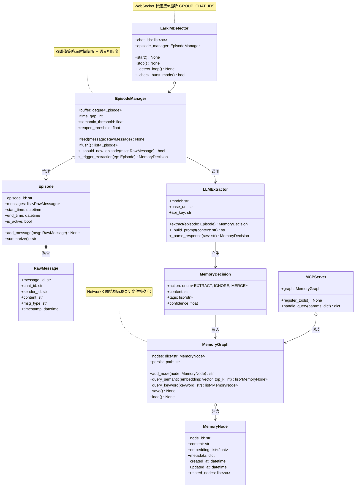

# 系统架构与数据流

## 架构概览

飞书长期记忆系统是一套将飞书即时通讯（IM）消息自动转化为结构化持久记忆的管道系统。其核心设计理念是 **「检测 — 缓冲 — 提取 — 存储 — 暴露」** 五阶段流水线，每条从群聊涌入的消息依次经过这五个阶段的处理，最终以可检索的记忆节点形态存在于图数据库中，并通过 MCP 协议对外暴露。

从宏观视角看，系统由三个层次构成：

- **接入层**：负责与飞书 IM 建立长连接，接收实时消息事件。该层仅有最小的业务逻辑，仅做协议解析与投递。
- **决策层**：核心智能所在。聚合原始消息为语义连贯的「片段」，由 LLM 判断哪些信息值得记忆、以何种粒度存储。这是整个系统中唯一引入外部 AI 模型的部分。
- **存储与暴露层**：将决策结果持久化为图结构，支持语义检索，并通过 MCP Server 暴露给上层应用（如 AI 客户端、知识管理工具）。

这种分层设计确保了每一层的职责清晰、可独立替换——你可以更换 LLM 供应商而不影响消息接收，也可以切换存储后端而不触及决策逻辑。

### 组件角色

系统由以下核心组件构成，每个组件在管道中承担特定职责：

| 组件 | 所属层次 | 核心职责 |
|---|---|---|
| **LarkIMDetector** | 接入层 | 维护飞书 WebSocket 长连接，监听指定群聊的实时消息，执行突发模式检测并将消息投递到 EpisodeManager |
| **EpisodeManager** | 决策层 | 消息缓冲与聚合引擎，根据时间间隔与语义相似度将连续消息合并为 Episode（片段），并触发 LLM 提取决策 |
| **LLM Extractor** | 决策层 | 接收 Episode 内容，调用大语言模型提取结构化记忆信息，返回决策结果（提取/忽略/合并） |
| **MemoryGraph** | 存储层 | 基于 NetworkX 的内存图数据库，管理 MemoryNode 的创建、检索、关联与持久化（JSON 序列化） |
| **MemoryNode** | 存储层 | 记忆的最小单元，包含文本内容、向量嵌入、元数据及时间戳，节点间以语义边相连 |
| **MCP Server** | 暴露层 | 通过 Model Context Protocol 提供标准化的记忆查询接口，支持关键词搜索、语义检索、关联探索 |

## 系统架构图

### 系统实体关系

以下类图描述了系统核心实体及其静态关系。注意 `MemoryGraph` 作为聚合根，管理所有 `MemoryNode` 的生命周期；`EpisodeManager` 内部维护一个 `Episode` 队列，而每个 `Episode` 由若干 `RawMessage` 聚合而成。

## 数据流：从消息到记忆

系统的运行时数据流是一条端到端的单向管道，从飞书 IM 的实时事件出发，经过层层转换，最终形成可供检索的记忆。以下是完整的数据流路径：

1. **消息接收**：`LarkIMDetector` 通过飞书 WebSocket 接口订阅群聊消息事件。每条消息携带消息 ID、发送者、群聊 ID、时间戳及文本内容等元数据。检测器内部维护一个事件循环，持续监听并解析飞书推送的 JSON 载荷。

2. **突发模式检测**：检测器在投递消息之前执行突发模式判断。如果短时间内涌入的消息频率超过阈值（例如 3 秒内收到 5 条以上消息），系统标记为突发状态并启用批量缓冲策略，而非单条触发提取。这一机制有效防止 LLM 在高流量时段被频繁调用，降低 API 成本。

3. **Episode 聚合**：`EpisodeManager` 接收原始消息后，根据双重阈值判断应将消息归入当前 Episode 还是创建新 Episode：
   - **时间阈值**（`EPISODE_TIME_GAP`）：相邻消息超过此间隔（默认 180 秒），自动结束当前 Episode。
   - **语义阈值**（`EPISODE_SEMANTIC_THRESHOLD`）：计算消息嵌入向量的余弦相似度，低于阈值表明话题已切换。
   - **重开阈值**（`EPISODE_REOPEN_THRESHOLD`）：刚结束的 Episode 如果短时间内收到语义高度相关的消息，允许重新打开。

4. **LLM 提取决策**：Episode 达到触发条件（时间窗口关闭或消息数达到上限）后，`EpisodeManager` 将整个 Episode 的对话上下文提交给 `LLMExtractor`。提取器构建包含系统提示与对话历史的 Prompt，调用大模型返回结构化的提取决策。决策结果有三种可能：
   - **EXTRACT**：该 Episode 包含值得记忆的信息，附带提取出的摘要内容与标签。
   - **IGNORE**：日常闲聊或无信息量内容，直接丢弃。
   - **MERGE**：与已有记忆节点高度相关，建议合并更新。

5. **记忆写入**：`MemoryDecision` 为 EXTRACT 时，`MemoryNode` 被创建并写入 `MemoryGraph`。写入操作包括：计算文本的向量嵌入（通过 Embedding 模型）、建立节点间语义边（通过 Reranker 判断相关性）、更新元数据索引。写入完成后，`MemoryGraph` 自动触发持久化保存。

6. **对外暴露**：所有持久化的记忆通过 `MCPServer` 以标准工具接口暴露。MCP 客户端可以通过 `search_memories`、`get_related`、`create_memory` 等工具与记忆系统交互，实现长期记忆的跨会话检索。

## 代码实体空间：变更与存储

理解系统的数据流之后，需进一步追溯代码实体在变更过程中的映射关系。数据在系统内的每次流转都对应着明确的状态跃迁和实体创建。

### 数据转换与持久化

原始消息进入系统后依次经历以下形态转换：

| 阶段 | 数据形态 | 关键字段 | 存储位置 |
|---|---|---|---|
| 飞书事件 | JSON 载荷 | `event.message.content`, `event.sender.sender_id` | 内存（瞬态） |
| RawMessage | Pydantic 模型 | `message_id`, `chat_id`, `content`, `timestamp` | Episode 队列（内存） |
| Episode | 聚合对象 | `episode_id`, `messages[]`, `start_time`, `end_time` | EpisodeManager 缓冲（内存） |
| MemoryDecision | 结构体 | `action`, `content`, `tags`, `confidence` | 瞬态（决策即销毁） |
| MemoryNode | 图节点 | `node_id`, `content`, `embedding`, `metadata` | MemoryGraph（内存 + JSON） |
| 持久化文件 | JSON 文本 | 全图序列化 | `memory_graph.json`（磁盘） |

值得注意的关键设计是：**持久化只在 `MemoryGraph` 层发生**。上游的所有实体（RawMessage、Episode、MemoryDecision）均为内存态，系统重启后不会保留。这意味着 Episode 聚合是一次性的——消息一旦被处理（无论提取或忽略），其原始形态即被丢弃。记忆的持久性始于 `MemoryNode` 被写入图的那一刻。

## 关键设计决策

### 1. The Detector Loop & Burst Mode

**决策**：`LarkIMDetector` 维护一个独立的事件循环线程，而非为每条消息创建异步任务。

**动机**：飞书 WebSocket 推送在高频群聊场景下可能达到每秒数十条消息。若每条消息触发一次独立的 LLM 调用，API 费用和延迟将不可接受。通过检测器循环中的突发模式检测，系统能在高流量时段自动将消息缓冲成批量 Episode，大幅降低 LLM 调用频率。

**实现要点**：检测器内部维护一个滑动时间窗口计数器。当窗口内的消息数超过 `BURST_THRESHOLD` 时，系统标记为突发状态，`EpisodeManager` 切换到批量聚合模式——等待突发窗口关闭后再触发单次 LLM 决策。

### 2. Branch-per-Decision Strategy

**决策**：每次 LLM 提取决策独立运行，决策之间不共享状态或上下文窗口。

**动机**：记忆提取的核心难点在于确定「什么值得记住」。如果让 LLM 维护一个持续增长的上下文窗口，不仅 Token 消耗线性增长，还容易出现「遗忘漂移」——模型倾向于记住最近的内容而忽略早期的关键信息。每次决策独立运行，意味着每条 Episode 的提取结果是纯粹基于该片段内容的，不会受到之前决策的干扰。

**权衡**：这一策略牺牲了跨 Episode 的关联性觉察能力——LLM 无法在决策时感知之前已经记住了什么。`MCP Server` 的语义检索层会在查询时补上这一环，通过相似度匹配将当前查询与所有历史节点关联。

### 3. Dual-Layer Storage

**决策**：采用「内存图 + JSON 文件」双层存储架构，而非传统数据库。

**动机**：
- **内存层**：`MemoryGraph` 基于 NetworkX 在内存中构建图结构，支持实时的图遍历、邻接查询与向量相似度搜索，查询延迟在毫秒级。
- **持久层**：每次变更后以 JSON 格式序列化至磁盘文件，保证进程重启后可恢复。JSON 格式的天然可读性便于调试与手动修正。

**适用场景**：这一架构适用于单机、个人或小团队使用的记忆系统。当数据规模达到百万级节点时，应考虑迁移至向量数据库（如 Milvus、Qdrant）与图数据库（如 Neo4j）的组合方案。

### 4. MCP Exposure

**决策**：通过 MCP（Model Context Protocol）标准协议暴露记忆查询能力，而非自研 REST API。

**动机**：MCP 是 AI 客户端与工具之间的标准化通信协议。采用 MCP 而非自定义 API 的核心好处在于：
- **即插即用**：任何支持 MCP 的 AI 客户端（如 Claude Desktop、Cline）无需额外适配即可接入记忆系统。
- **工具发现**：MCP 协议内置工具列表发现机制，客户端自动获取可用的记忆操作接口。
- **标准化错误处理**：统一的错误码与重试语义，减少客户端适配成本。

**暴露的工具集**：`MCPServer` 注册了 `search_memories`（语义搜索）、`get_related`（关联记忆）、`create_memory`（手动创建）、`update_memory`（更新）等工具。每个工具均有标准化的 JSON Schema 输入输出定义。

---

> 下一步：了解环境搭建与运行配置，参见 [环境搭建与配置指南](Getting%20Started%20%26%20Configuration.md)。