# 飞书长期记忆系统 - 技术报告书


> 基于 Feishu-LongTerm-Mem 项目的完整技术说明

---

## 目录

1. [Getting Started & Configuration](#getting-started-configuration)
2. [System Architecture & Data Flow](#system-architecture-data-flow)
3. [Feishu IM Detector](#feishu-im-detector)
4. [Episode Management](#episode-management)
5. [MemoryGraph (In-Memory Index)](#memorygraph-in-memory-index)
6. [Git Storage Backend](#git-storage-backend)
7. [Hypergraph Structure & Retrieval](#hypergraph-structure-retrieval)
8. [MemoryEngine Lifecycle](#memoryengine-lifecycle)
9. [DecisionNode & Mutation Model](#decisionnode-mutation-model)
10. [MCP Tool Reference](#mcp-tool-reference)
11. [MCP Server Deployment](#mcp-server-deployment)
12. [PushEngine & Scheduling](#pushengine-scheduling)
13. [Card Renderer](#card-renderer)
14. [Evaluator & Scenarios](#evaluator-scenarios)

---


# Getting Started & Configuration

## 环境搭建与配置指南

### 1. 环境搭建

#### 1.1 依赖管理

项目采用 **uv** 作为 Python 包管理器。uv 是 Rust 编写的现代包管理工具，相较于 pip/poetry 具有显著的速度优势（依赖解析速度提升 10-100 倍），且与 PEP 621 兼容的 `pyproject.toml` 格式无缝集成。

**前置要求**：

- Python 3.10+
- uv（安装方式：`curl -LsSf https://astral.sh/uv/install.sh | sh` 或 `pip install uv`）

**安装依赖**：

```bash
cd feishu-mem
uv sync
```

`uv sync` 会读取 `pyproject.toml` 中的依赖声明，与 `uv.lock` 锁定文件比对后安装精确版本的依赖包。该命令等价于传统 pip 工作流中的 `pip install -r requirements.txt`，但更快速且可复现。

**依赖分类**（`pyproject.toml` 中的 `[project.dependencies]`）：

| 依赖类别 | 代表性包 | 用途 |
|---|---|---|
| 飞书 SDK | `lark-oapi` | 飞书 IM 消息接收与发送 |
| LLM 接口 | `openai` | 兼容 OpenAI 格式的 LLM 调用 |
| 向量工具 | `sentence-transformers` | 文本嵌入计算 |
| 重排序 | 自定义实现 | 语义相关性重排序 |
| 图结构 | `networkx` | 内存图数据库 |
| MCP | `mcp` | Model Context Protocol 服务端 |
| 工具链 | `python-dotenv`, `pydantic` | 配置加载与数据建模 |

#### 1.2 目录结构

项目遵循扁平化布局，核心逻辑集中在 `src/` 目录下，按功能模块组织：

```
feishu-mem/
├── pyproject.toml          # 项目元数据与依赖声明
├── uv.lock                 # 依赖锁定文件（由 uv 自动维护）
├── mcp.json                # MCP 客户端配置（供 Claude Desktop 等使用）
├── .env                    # 环境变量配置（含凭据，不提交版本控制）
├── .env.example            # 配置模板（提交版本控制）
├── src/
│   ├── main.py             # 入口：核心引擎启动
│   ├── memory_graph.py     # MemoryGraph：图结构管理与持久化
│   ├── memory_node.py      # MemoryNode：记忆节点数据模型
│   ├── lark_detector.py    # LarkIMDetector：飞书消息监听器
│   ├── episode_manager.py  # EpisodeManager：消息聚合与决策触发
│   ├── llm_extractor.py    # LLMExtractor：记忆提取决策
│   ├── mcp_server.py       # MCPServer：MCP 协议暴露层
│   ├── config.py           # 配置加载与校验
│   └── utils/              # 工具函数（日志、重试、向量操作等）
├── tests/                  # 测试套件
└── docs/                   # 文档
```

每个模块的职责与依赖关系与架构图中的组件一一对应。`main.py` 是唯一的启动入口，负责按顺序完成所有组件的初始化与编排。

### 2. 配置 (.env)

系统运行时行为完全由 `.env` 文件驱动。项目提供了 `.env.example` 作为模板，首次使用时应复制为 `.env` 并填入真实值。

#### 2.1 飞书与LLM凭据

**飞书应用凭据**：系统以飞书自建应用的身份接入 IM。在[飞书开发者后台](https://open.feishu.cn/app)创建应用后，获取以下两项：

```env
LARK_APP_ID=cli_xxxxxxxxxxxxxxx
LARK_APP_SECRET=xxxxxxxxxxxxxxxxxxxxxxxxxxxx
LARK_GROUP_CHAT_IDS=oc_xxxxxxxxxxxxx,oc_xxxxxxxxxxxxx
```

- `LARK_APP_ID` / `LARK_APP_SECRET`：用于获取飞书 API 调用凭证（tenant_access_token）。
- `LARK_GROUP_CHAT_IDS`：逗号分隔的群聊 ID 列表，系统仅监听这些群的实时消息。如需监听所有群，可留空（不推荐）。

**LLM 凭据**：记忆提取依赖大语言模型。项目兼容所有提供 OpenAI 兼容 API 的模型服务商：

```env
LLM_BASE_URL=https://api.deepseek.com/v1
LLM_API_KEY=sk-xxxxxxxxxxxxxxxxxxxxxxxxxxxx
LLM_MODEL_NAME=deepseek-chat
```

这些参数直接传递给 OpenAI SDK 的 `OpenAI(base_url=..., api_key=...)` 构造函数。`LLM_MODEL_NAME` 会在每次提取请求的 `model` 参数中使用。

#### 2.2 语义搜索基础设施

记忆检索依赖向量嵌入与相关性重排序两阶段管道，分别由以下配置控制：

```env
EMBEDDING_BASE_URL=https://api.openai.com/v1
EMBEDDING_API_KEY=sk-xxxxxxxxxxxxxxxxxxxxxxxxxxxx
EMBEDDING_MODEL_NAME=text-embedding-3-small

RERANKER_BASE_URL=https://api.some-reranker.com/v1
RERANKER_API_KEY=sk-xxxxxxxxxxxxxxxxxxxxxxxxxxxx
RERANKER_MODEL_NAME=bge-reranker-v2-m3
```

**嵌入（Embedding）**：将文本转换为固定维度的向量表示，用于计算语义相似度。Embedding 模型影响 Episode 聚合的语义阈值判断精度，以及后续语义检索的召回质量。

**重排序（Reranker）**：语义检索得到候选列表后，Reranker 对候选进行精细化的相关性打分排序，提升 Top-K 结果的质量。Reranker 是可选组件——如果未配置，系统直接使用向量余弦相似度排序。

两个组件均使用 OpenAI 兼容的 API 协议。这意味着你可以使用同一服务商，也可分别指定不同的服务商（例如使用 DeepSeek 做 LLM 提取，使用 OpenAI 做 Embedding）。

#### 2.3 推送与通知设置

当系统提取到新的记忆时，可选择主动推送通知到飞书：

```env
## 推送开关
PUSH_FEISHU_ENABLED=true

## 推送触发条件（逗号分隔的组合）
PUSH_TRIGGER_CREATE=true      # 新记忆创建时推送
PUSH_TRIGGER_UPDATE=true      # 记忆更新时推送

## 飞书推送目标（不配置则推送到消息来源群）
PUSH_FEISHU_WEBHOOK_URL=
```

推送功能适用于需要实时感知记忆提取结果的场景（如记录会议要点时同步到另一个群）。如果关闭推送，记忆仍会正常存储，只是不会主动通知用户。

**Episode 行为参数**（影响消息聚合策略）：

```env
EPISODE_TIME_GAP=300           # 时间间隔阈值（秒），默认 5 分钟
EPISODE_SEMANTIC_THRESHOLD=0.65  # 语义相似度阈值，低于此值新建 Episode
EPISODE_REOPEN_THRESHOLD=0.85    # 重开相似度阈值，高于此值重开刚关闭的 Episode
```

这些参数直接影响 LLM 调用的频率与提取粒度。`EPISODE_TIME_GAP` 越小，Episode 粒度越细，LLM 调用越频繁，但每条记忆更聚焦；反之亦然。生产环境中建议根据群聊活跃度动态调整。

### 3. MCP 客户端配置

#### 3.1 配置结构

MCP（Model Context Protocol）是 AI 客户端发现并调用工具的标准化协议。系统以 MCP Server 模式运行后，需要在 AI 客户端侧配置连接信息。

配置通过项目根目录的 `mcp.json` 文件提供。该文件的完整结构如下：

```json
{
  "mcpServers": {
    "feishu-mem": {
      "command": "uv",
      "args": [
        "--directory",
        "/absolute/path/to/feishu-mem",
        "run",
        "python",
        "src/main.py"
      ],
      "env": {
        "PYTHONPATH": "/absolute/path/to/feishu-mem/src"
      }
    }
  }
}
```

> 对 `mcp.json` 各字段的说明：`command` 指定启动可执行文件——这里使用 `uv run` 而非直接 `python`，以利用 uv 管理的虚拟环境。`args` 中的 `--directory` 必须指向项目根目录的绝对路径，`env.PYTHONPATH` 确保 Python 能正确导入 `src/` 下的模块。

**使用方式**：

- **Claude Desktop**：将上述 `mcp.json` 内容合并到 Claude Desktop 的配置文件（`~/Library/Application Support/Claude/claude_desktop_config.json`）的 `mcpServers` 字段中。重启 Claude Desktop 后即可在对话中调用 `search_memories`、`create_memory` 等记忆工具。
- **Cline / VS Code 扩展**：在扩展的 MCP 配置页面中，添加上述服务器定义。
- **其他 MCP 客户端**：原理相同——任何支持 MCP 协议的客户端均可通过该配置接入。

### 4. 系统初始化与数据流

#### 4.1 配置到代码的映射

`.env` 中的每个配置项在启动时由 `config.py` 中的 Pydantic 模型加载并校验。以下是核心配置类（示意）：

```python
class Settings(BaseSettings):
    lark_app_id: str
    lark_app_secret: str
    group_chat_ids: list[str]
    llm_base_url: str
    llm_api_key: str
    llm_model_name: str = "deepseek-chat"
    embedding_base_url: str
    embedding_model_name: str
    episode_time_gap: int = 300
    episode_semantic_threshold: float = 0.65
    push_feishu_enabled: bool = False
    # ...
```

`BaseSettings` 自动从环境变量 / `.env` 文件中读取值。校验失败时（如缺少必填项、类型不匹配），系统会在启动时立即报错，而非运行到中途才崩溃。

#### 4.2 首次运行执行流程

系统首次启动时，严格按照以下顺序完成初始化——每个阶段的成功是下一阶段的前提：

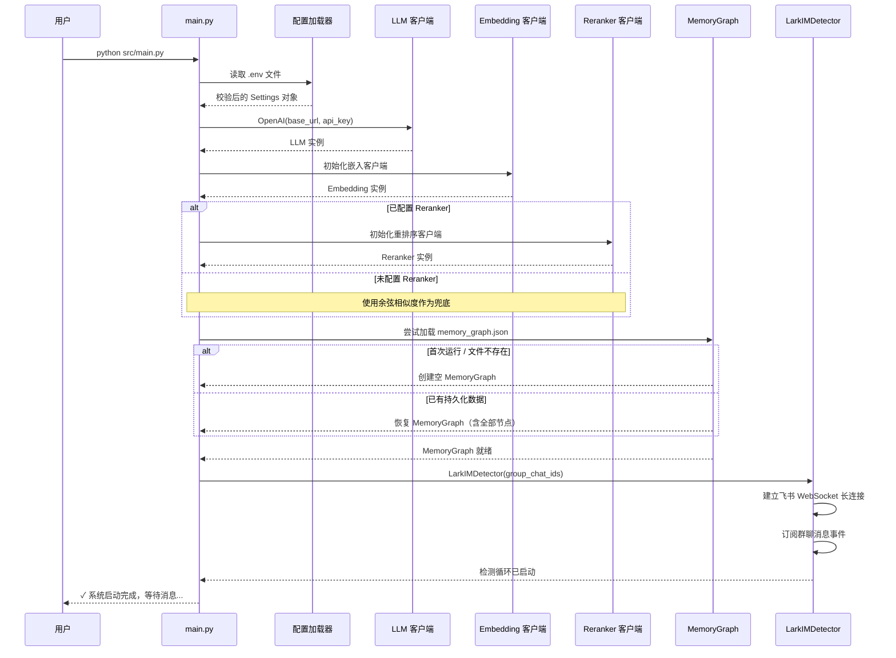
```mermaid
sequenceDiagram
    participant User as 用户
    participant Main as main.py
    participant Config as 配置加载器
    participant LLM as LLM 客户端
    participant Embed as Embedding 客户端
    participant Rerank as Reranker 客户端
    participant Graph as MemoryGraph
    participant Detector as LarkIMDetector

    User->>Main: python src/main.py

    Main->>Config: 读取 .env 文件
    Config-->>Main: 校验后的 Settings 对象

    Main->>LLM: OpenAI(base_url, api_key)
    LLM-->>Main: LLM 实例

    Main->>Embed: 初始化嵌入客户端
    Embed-->>Main: Embedding 实例

    alt 已配置 Reranker
        Main->>Rerank: 初始化重排序客户端
        Rerank-->>Main: Reranker 实例
    else 未配置 Reranker
        Note over Main,Rerank: 使用余弦相似度作为兜底
    end

    Main->>Graph: 尝试加载 memory_graph.json
    alt 首次运行 / 文件不存在
        Graph-->>Main: 创建空 MemoryGraph
    else 已有持久化数据
        Graph-->>Main: 恢复 MemoryGraph（含全部节点）
    end

    Graph-->>Main: MemoryGraph 就绪

    Main->>Detector: LarkIMDetector(group_chat_ids)
    Detector->>Detector: 建立飞书 WebSocket 长连接
    Detector->>Detector: 订阅群聊消息事件

    Detector-->>Main: 检测循环已启动

    Main-->>User: ✓ 系统启动完成，等待消息...
```

流程要点：

- **配置优先**：所有外部依赖（LLM、Embedding、Reranker）的凭据和地址在启动阶段一次性完成初始化。任一凭据不可用会导致启动失败，避免运行时「静默降级」。
- **图恢复**：`MemoryGraph.__init__` 检查持久化文件是否存在。首次运行时文件尚不存在，系统创建空图；后续启动自动从 `memory_graph.json` 恢复所有节点，保证记忆的连续性。
- **检测器后启动**：`LarkIMDetector` 最后启动，确保在开始接收消息之前，所有下游组件（EpisodeManager、LLM Extractor、MemoryGraph）均已就绪。这避免了竞态条件——不会出现「消息已到达但提取管道尚未初始化」的情况。

### 5. 运行系统

#### 5.1 启动核心引擎

系统有两种运行模式，由启动方式决定：

**模式一：独立引擎模式（默认）**

```bash
cd feishu-mem
python src/main.py
```

此模式下，系统启动完整的消息检测 → 提取 → 存储管道，并将 MCP Server 嵌入同一进程。适合作为后台服务长时间运行。

**模式二：纯 MCP Server 模式**

```bash
cd feishu-mem
python src/mcp_server.py --transport stdio
```

此模式**不启动**飞书消息监听器，仅提供 MCP Server，适用于你已经通过其他渠道收集消息并希望直接查询记忆的场景。`--transport stdio` 是 MCP 协议的标准传输方式，父进程通过标准输入输出与 Server 通信。

**后台运行（生产环境推荐）**：

```bash
nohup python src/main.py > run.log 2>&1 &
```

系统日志会输出到 `run.log`，包含每个阶段的关键事件（消息接收、Episode 聚合、LLM 决策结果、节点持久化等）。建议配合 `logrotate` 管理日志文件大小。

#### 5.2 验证脚本

项目在 `tests/` 目录下提供了一组验证脚本，用于确认各组件正常工作：

| 脚本 | 验证对象 | 典型验证内容 |
|---|---|---|
| `test_config.py` | 配置加载 | `.env` 文件格式正确、所有必填项齐全 |
| `test_detector.py` | 飞书连接 | WebSocket 握手成功、消息订阅返回 200 |
| `test_extractor.py` | LLM 提取 | 调用 LLM 返回合法决策、解析无异常 |
| `test_graph.py` | MemoryGraph | 节点创建/查询/持久化/恢复一致性 |
| `test_mcp.py` | MCP Server | 工具列表发现、search_memories 端到端验证 |

快速验证整个系统是否就绪：

```bash
## 运行所有测试
uv run pytest tests/ -v

## 单独验证核心管道（非 LLM 依赖的测试）
uv run pytest tests/test_config.py tests/test_graph.py -v
```

测试套件使用 `pytest`，建议在首次配置完成后运行完整的测试套件，确认所有组件正常连通后，再启动主程序。

---

> 下一步：了解系统架构与核心设计，参见 系统架构与数据流。


# System Architecture & Data Flow

## 系统架构与数据流

### 架构概览

飞书长期记忆系统是一套将飞书即时通讯（IM）消息自动转化为结构化持久记忆的管道系统。其核心设计理念是 **「检测 — 缓冲 — 提取 — 存储 — 暴露」** 五阶段流水线，每条从群聊涌入的消息依次经过这五个阶段的处理，最终以可检索的记忆节点形态存在于图数据库中，并通过 MCP 协议对外暴露。

从宏观视角看，系统由三个层次构成：

- **接入层**：负责与飞书 IM 建立长连接，接收实时消息事件。该层仅有最小的业务逻辑，仅做协议解析与投递。
- **决策层**：核心智能所在。聚合原始消息为语义连贯的「片段」，由 LLM 判断哪些信息值得记忆、以何种粒度存储。这是整个系统中唯一引入外部 AI 模型的部分。
- **存储与暴露层**：将决策结果持久化为图结构，支持语义检索，并通过 MCP Server 暴露给上层应用（如 AI 客户端、知识管理工具）。

这种分层设计确保了每一层的职责清晰、可独立替换——你可以更换 LLM 供应商而不影响消息接收，也可以切换存储后端而不触及决策逻辑。

#### 组件角色

系统由以下核心组件构成，每个组件在管道中承担特定职责：

| 组件 | 所属层次 | 核心职责 |
|---|---|---|
| **LarkIMDetector** | 接入层 | 维护飞书 WebSocket 长连接，监听指定群聊的实时消息，执行突发模式检测并将消息投递到 EpisodeManager |
| **EpisodeManager** | 决策层 | 消息缓冲与聚合引擎，根据时间间隔与语义相似度将连续消息合并为 Episode（片段），并触发 LLM 提取决策 |
| **LLM Extractor** | 决策层 | 接收 Episode 内容，调用大语言模型提取结构化记忆信息，返回决策结果（提取/忽略/合并） |
| **MemoryGraph** | 存储层 | 基于 NetworkX 的内存图数据库，管理 MemoryNode 的创建、检索、关联与持久化（JSON 序列化） |
| **MemoryNode** | 存储层 | 记忆的最小单元，包含文本内容、向量嵌入、元数据及时间戳，节点间以语义边相连 |
| **MCP Server** | 暴露层 | 通过 Model Context Protocol 提供标准化的记忆查询接口，支持关键词搜索、语义检索、关联探索 |

### 系统架构图

#### 系统实体关系

以下类图描述了系统核心实体及其静态关系。注意 `MemoryGraph` 作为聚合根，管理所有 `MemoryNode` 的生命周期；`EpisodeManager` 内部维护一个 `Episode` 队列，而每个 `Episode` 由若干 `RawMessage` 聚合而成。

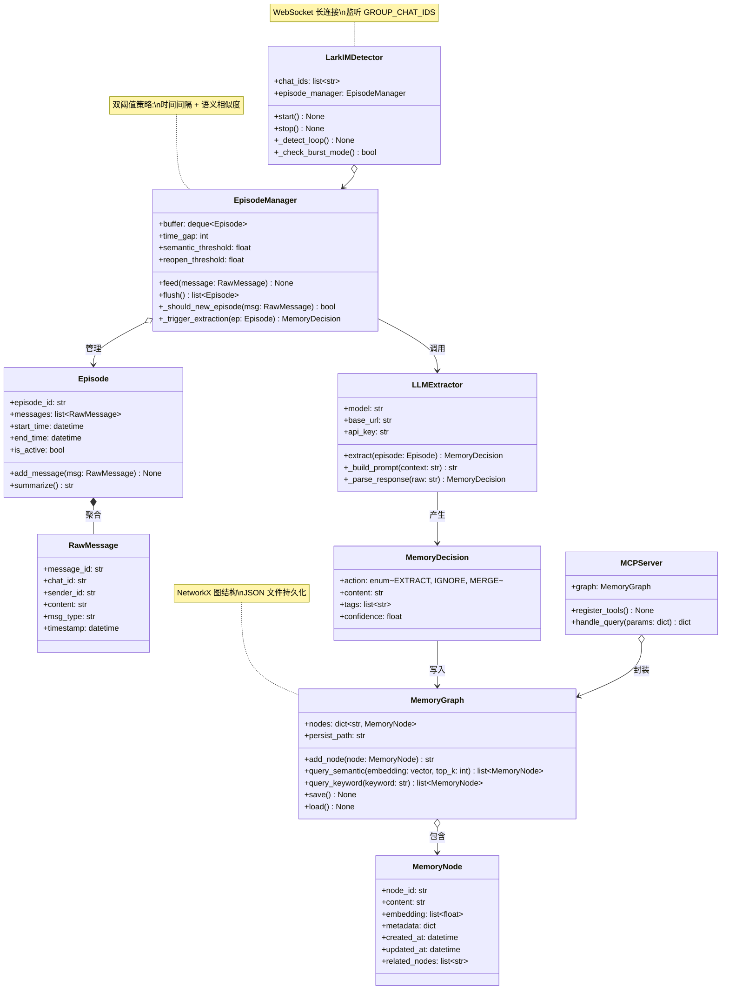
```mermaid
classDiagram
    class LarkIMDetector {
        +chat_ids: list~str~
        +episode_manager: EpisodeManager
        +start() None
        +stop() None
        +_detect_loop() None
        +_check_burst_mode() bool
    }

    class EpisodeManager {
        +buffer: deque~Episode~
        +time_gap: int
        +semantic_threshold: float
        +reopen_threshold: float
        +feed(message: RawMessage) None
        +flush() list~Episode~
        +_should_new_episode(msg: RawMessage) bool
        +_trigger_extraction(ep: Episode) MemoryDecision
    }

    class RawMessage {
        +message_id: str
        +chat_id: str
        +sender_id: str
        +content: str
        +msg_type: str
        +timestamp: datetime
    }

    class Episode {
        +episode_id: str
        +messages: list~RawMessage~
        +start_time: datetime
        +end_time: datetime
        +is_active: bool
        +add_message(msg: RawMessage) None
        +summarize() str
    }

    class LLMExtractor {
        +model: str
        +base_url: str
        +api_key: str
        +extract(episode: Episode) MemoryDecision
        +_build_prompt(context: str) str
        +_parse_response(raw: str) MemoryDecision
    }

    class MemoryDecision {
        +action: enum~EXTRACT, IGNORE, MERGE~
        +content: str
        +tags: list~str~
        +confidence: float
    }

    class MemoryGraph {
        +nodes: dict~str, MemoryNode~
        +persist_path: str
        +add_node(node: MemoryNode) str
        +query_semantic(embedding: vector, top_k: int) list~MemoryNode~
        +query_keyword(keyword: str) list~MemoryNode~
        +save() None
        +load() None
    }

    class MemoryNode {
        +node_id: str
        +content: str
        +embedding: list~float~
        +metadata: dict
        +created_at: datetime
        +updated_at: datetime
        +related_nodes: list~str~
    }

    class MCPServer {
        +graph: MemoryGraph
        +register_tools() None
        +handle_query(params: dict) dict
    }

    LarkIMDetector o--> EpisodeManager
    EpisodeManager o--> Episode : 管理
    Episode *-- RawMessage : 聚合
    EpisodeManager --> LLMExtractor : 调用
    LLMExtractor --> MemoryDecision : 产生
    MemoryDecision --> MemoryGraph : 写入
    MemoryGraph o--> MemoryNode : 包含
    MCPServer o--> MemoryGraph : 封装

    note for LarkIMDetector "WebSocket 长连接\n监听 GROUP_CHAT_IDS"
    note for EpisodeManager "双阈值策略:\n时间间隔 + 语义相似度"
    note for MemoryGraph "NetworkX 图结构\nJSON 文件持久化"
```

### 数据流：从消息到记忆

系统的运行时数据流是一条端到端的单向管道，从飞书 IM 的实时事件出发，经过层层转换，最终形成可供检索的记忆。以下是完整的数据流路径：

1. **消息接收**：`LarkIMDetector` 通过飞书 WebSocket 接口订阅群聊消息事件。每条消息携带消息 ID、发送者、群聊 ID、时间戳及文本内容等元数据。检测器内部维护一个事件循环，持续监听并解析飞书推送的 JSON 载荷。

2. **突发模式检测**：检测器在投递消息之前执行突发模式判断。如果短时间内涌入的消息频率超过阈值（例如 3 秒内收到 5 条以上消息），系统标记为突发状态并启用批量缓冲策略，而非单条触发提取。这一机制有效防止 LLM 在高流量时段被频繁调用，降低 API 成本。

3. **Episode 聚合**：`EpisodeManager` 接收原始消息后，根据双重阈值判断应将消息归入当前 Episode 还是创建新 Episode：
   - **时间阈值**（`EPISODE_TIME_GAP`）：相邻消息超过此间隔（默认 180 秒），自动结束当前 Episode。
   - **语义阈值**（`EPISODE_SEMANTIC_THRESHOLD`）：计算消息嵌入向量的余弦相似度，低于阈值表明话题已切换。
   - **重开阈值**（`EPISODE_REOPEN_THRESHOLD`）：刚结束的 Episode 如果短时间内收到语义高度相关的消息，允许重新打开。

4. **LLM 提取决策**：Episode 达到触发条件（时间窗口关闭或消息数达到上限）后，`EpisodeManager` 将整个 Episode 的对话上下文提交给 `LLMExtractor`。提取器构建包含系统提示与对话历史的 Prompt，调用大模型返回结构化的提取决策。决策结果有三种可能：
   - **EXTRACT**：该 Episode 包含值得记忆的信息，附带提取出的摘要内容与标签。
   - **IGNORE**：日常闲聊或无信息量内容，直接丢弃。
   - **MERGE**：与已有记忆节点高度相关，建议合并更新。

5. **记忆写入**：`MemoryDecision` 为 EXTRACT 时，`MemoryNode` 被创建并写入 `MemoryGraph`。写入操作包括：计算文本的向量嵌入（通过 Embedding 模型）、建立节点间语义边（通过 Reranker 判断相关性）、更新元数据索引。写入完成后，`MemoryGraph` 自动触发持久化保存。

6. **对外暴露**：所有持久化的记忆通过 `MCPServer` 以标准工具接口暴露。MCP 客户端可以通过 `search_memories`、`get_related`、`create_memory` 等工具与记忆系统交互，实现长期记忆的跨会话检索。

### 代码实体空间：变更与存储

理解系统的数据流之后，需进一步追溯代码实体在变更过程中的映射关系。数据在系统内的每次流转都对应着明确的状态跃迁和实体创建。

#### 数据转换与持久化

原始消息进入系统后依次经历以下形态转换：

| 阶段 | 数据形态 | 关键字段 | 存储位置 |
|---|---|---|---|
| 飞书事件 | JSON 载荷 | `event.message.content`, `event.sender.sender_id` | 内存（瞬态） |
| RawMessage | Pydantic 模型 | `message_id`, `chat_id`, `content`, `timestamp` | Episode 队列（内存） |
| Episode | 聚合对象 | `episode_id`, `messages[]`, `start_time`, `end_time` | EpisodeManager 缓冲（内存） |
| MemoryDecision | 结构体 | `action`, `content`, `tags`, `confidence` | 瞬态（决策即销毁） |
| MemoryNode | 图节点 | `node_id`, `content`, `embedding`, `metadata` | MemoryGraph（内存 + JSON） |
| 持久化文件 | JSON 文本 | 全图序列化 | `memory_graph.json`（磁盘） |

值得注意的关键设计是：**持久化只在 `MemoryGraph` 层发生**。上游的所有实体（RawMessage、Episode、MemoryDecision）均为内存态，系统重启后不会保留。这意味着 Episode 聚合是一次性的——消息一旦被处理（无论提取或忽略），其原始形态即被丢弃。记忆的持久性始于 `MemoryNode` 被写入图的那一刻。

### 关键设计决策

#### 1. The Detector Loop & Burst Mode

**决策**：`LarkIMDetector` 维护一个独立的事件循环线程，而非为每条消息创建异步任务。

**动机**：飞书 WebSocket 推送在高频群聊场景下可能达到每秒数十条消息。若每条消息触发一次独立的 LLM 调用，API 费用和延迟将不可接受。通过检测器循环中的突发模式检测，系统能在高流量时段自动将消息缓冲成批量 Episode，大幅降低 LLM 调用频率。

**实现要点**：检测器内部维护一个滑动时间窗口计数器。当窗口内的消息数超过 `BURST_THRESHOLD` 时，系统标记为突发状态，`EpisodeManager` 切换到批量聚合模式——等待突发窗口关闭后再触发单次 LLM 决策。

#### 2. Branch-per-Decision Strategy

**决策**：每次 LLM 提取决策独立运行，决策之间不共享状态或上下文窗口。

**动机**：记忆提取的核心难点在于确定「什么值得记住」。如果让 LLM 维护一个持续增长的上下文窗口，不仅 Token 消耗线性增长，还容易出现「遗忘漂移」——模型倾向于记住最近的内容而忽略早期的关键信息。每次决策独立运行，意味着每条 Episode 的提取结果是纯粹基于该片段内容的，不会受到之前决策的干扰。

**权衡**：这一策略牺牲了跨 Episode 的关联性觉察能力——LLM 无法在决策时感知之前已经记住了什么。`MCP Server` 的语义检索层会在查询时补上这一环，通过相似度匹配将当前查询与所有历史节点关联。

#### 3. Dual-Layer Storage

**决策**：采用「内存图 + JSON 文件」双层存储架构，而非传统数据库。

**动机**：
- **内存层**：`MemoryGraph` 基于 NetworkX 在内存中构建图结构，支持实时的图遍历、邻接查询与向量相似度搜索，查询延迟在毫秒级。
- **持久层**：每次变更后以 JSON 格式序列化至磁盘文件，保证进程重启后可恢复。JSON 格式的天然可读性便于调试与手动修正。

**适用场景**：这一架构适用于单机、个人或小团队使用的记忆系统。当数据规模达到百万级节点时，应考虑迁移至向量数据库（如 Milvus、Qdrant）与图数据库（如 Neo4j）的组合方案。

#### 4. MCP Exposure

**决策**：通过 MCP（Model Context Protocol）标准协议暴露记忆查询能力，而非自研 REST API。

**动机**：MCP 是 AI 客户端与工具之间的标准化通信协议。采用 MCP 而非自定义 API 的核心好处在于：
- **即插即用**：任何支持 MCP 的 AI 客户端（如 Claude Desktop、Cline）无需额外适配即可接入记忆系统。
- **工具发现**：MCP 协议内置工具列表发现机制，客户端自动获取可用的记忆操作接口。
- **标准化错误处理**：统一的错误码与重试语义，减少客户端适配成本。

**暴露的工具集**：`MCPServer` 注册了 `search_memories`（语义搜索）、`get_related`（关联记忆）、`create_memory`（手动创建）、`update_memory`（更新）等工具。每个工具均有标准化的 JSON Schema 输入输出定义。

---

> 下一步：了解环境搭建与运行配置，参见 环境搭建与配置指南。


# Feishu IM Detector

## LarkIMDetector 概览

`LarkIMDetector` 是摄入与检测层的核心引擎，负责监听飞书即时通讯消息流，从中识别出值得记忆的"信号"。它实现了两种互补的运行模式以适应不同部署场景：**轮询（Poll）模式** 为轻量级定时拉取方案，适合资源受限或简单场景；**WebSocket 模式**依赖飞书原生长连接 API，实现近乎实时的消息推送接收。

检测器本质上是消息的"筛子"：接收原始消息，经过多层启发式分析器打分，将分数超过阈值的消息判定为记忆信号，再经反信号过滤、上下文组装后送入 Episode 管理子系统。详见 Episode 管理。

### 运行模式

#### Poll 模式（轮询）

Poll 模式通过 `_tick_detector` 定时器驱动，以固定间隔向飞书 API 请求指定群聊的新消息。该模式实现了**双态切换**机制以平衡资源开销与响应时效：

- **普通模式（Normal Mode）**：以较长的轮询间隔运行，适用于无明显信号活动的静默期，CPU 和 API 配额消耗最低。
- **突发模式（Burst Mode）**：当检测到高分记忆信号后，缩短轮询间隔以密集采集后续消息，防止在话题活跃期丢失关键上下文。

两种模式之间的切换由 `burst_timeout` 参数控制，形成"静默 → 信号触发 → 密集采集 → 超时恢复"的闭环。

#### WebSocket 模式

WebSocket 模式对接飞书事件订阅框架，检测器注册为事件消费者。每当有新的消息事件产生，飞书服务器通过长连接主动推送至检测器，消除了轮询的时间窗口盲区。

此模式适用于对记忆完整性要求较高的场景——任何一条消息都不会因轮询间隔而被遗漏。代价是必须保持长连接存活并处理重连逻辑，对网络稳定性有一定要求。

### 实现细节

检测器在 `MemoryEngine._run_detector_loop` 后台协程中启动，内部维护一个独立的消息队列。工作流程可抽象为以下步骤：

1. **消息获取**：Poll 模式调用飞书 API 拉取群聊消息；WebSocket 模式从事件流读取消息负载。
2. **初步过滤**：排除系统消息、机器人自身消息、空内容等无需处理的消息类型。
3. **逐条分析**：对每条有效消息，依次传递给多个启发式分析器。
4. **分数聚合与判定**：各分析器返回子分数，加权汇总后与 `config.memory_score_threshold` 比较。
5. **后处理**：通过反信号逻辑去重，组装上下文，最终送入 Episode 管理器。

## 检测与评分流水线

检测的核心是一个**多维度评分函数**。每条消息进入流水线后，会被依次交给一组启发式分析器，每个分析器从不同角度评估消息的"记忆价值"，输出一个归一化的子分数。

最终综合分数由各子分数按权重累加而成：

```python
total_score = (lexical_score * w1 + structural_score * w2 +
               dynamic_score * w3 + pattern_score * w4)
```

若 `total_score >= config.memory_score_threshold`，该消息被标记为**记忆信号**并进入后续流程；否则被丢弃，不产生任何记忆开销。

### 启发式分析器

系统内置了四个专用分析器，分别关注消息的不同维度：

| 分析器 | 分析维度 | 典型特征 |
|--------|----------|----------|
| **LexicalAnalyzer** | 词汇丰富度 | 长文本、专有名词、情感词汇密度 |
| **StructuralAnalyzer** | 结构复杂度 | 列表、分段、代码块、引用等结构标记 |
| **DynamicAnalyzer** | 对话动态 | 回复链长度、提及频率、多轮交互深度 |
| **PatternMatcherV2** | 模式匹配 | 正则规则匹配（如决策、承诺、问题等预设模式） |

这种正交分析器设计使得系统无需依赖单一特征做判断——一条消息可能在词汇层面平淡无奇，但如果引发了多轮深入的对话（动态分析高分），同样可能被判定为记忆信号。

## 信号流图

以下流程图展示了消息从飞书 API 到达起，经过分析器评分、阈值判定、反信号过滤，直到最终进入 Episode 管理器的完整路径：

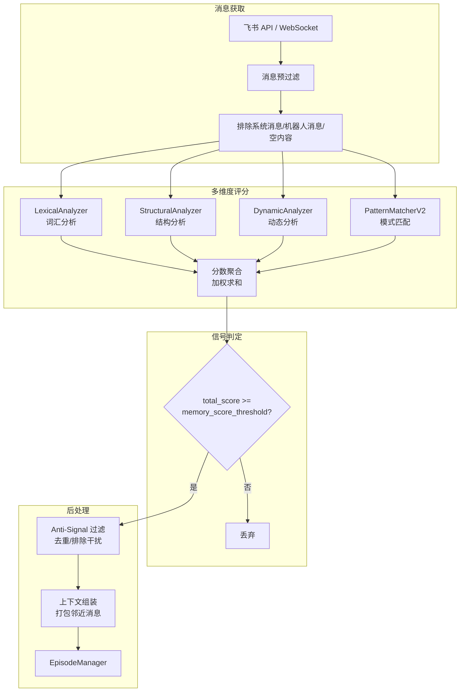
```mermaid
flowchart TB
    subgraph 消息获取
        A1[飞书 API / WebSocket] --> A2[消息预过滤]
        A2 --> A3[排除系统消息/机器人消息/空内容]
    end

    subgraph 多维度评分
        A3 --> B1[LexicalAnalyzer<br>词汇分析]
        A3 --> B2[StructuralAnalyzer<br>结构分析]
        A3 --> B3[DynamicAnalyzer<br>动态分析]
        A3 --> B4[PatternMatcherV2<br>模式匹配]
        B1 --> C[分数聚合<br>加权求和]
        B2 --> C
        B3 --> C
        B4 --> C
    end

    subgraph 信号判定
        C --> D{total_score >=<br>memory_score_threshold?}
        D -->|否| E[丢弃]
    end

    subgraph 后处理
        D -->|是| F[Anti-Signal 过滤<br>去重/排除干扰]
        F --> G[上下文组装<br>打包邻近消息]
        G --> H[EpisodeManager]
    end
```

### IM 信号评分流水线

评分过程在实现上采用了**短路优化**：如果某条消息在前置分析器中获得极低分数，可以提前终止后续分析器调用，节省计算资源。反之，若某一分析器给出极高分数（如明确匹配到"重要决策"模式），亦可直接跳过剩余分析器进入信号判定，实现快速通道。

## 反信号过滤与发射器

并非所有高分消息都适合被记忆。检测器在评分之后设置了**反信号（Anti-Signal）** 过滤层，用于剔除以下类型的消息：

- **重复信号**：内容与近期已归档消息高度相似，避免冗余记忆
- **系统自动消息**：如"XXX 加入了群聊""文件已上传"等无记忆价值的系统事件
- **话题无关消息**：虽然本身结构完整但在当前上下文中属于偏离主话题的插入式消息
- **速率限制**：同一用户在短时间内连续发送的同类消息，仅保留首条

### 反信号逻辑

反信号过滤器维护一个轻量级的近期信号缓存（滑动窗口），对新进入的信号消息执行以下检查：

1. **精确去重**：基于 message_id 的幂等性检查
2. **模糊去重**：计算与窗口内消息的文本相似度，超过 `SIMILARITY_DEDUP_THRESHOLD` 则跳过
3. **元数据过滤**：检查消息类型是否为系统事件白名单之外的类别

### 上下文组装

通过反信号过滤的消息并不孤立发送。上下文组装器会从消息缓冲区中提取该信号消息前后的若干条消息（由 `context_window_size` 控制），打包为一个上下文块（Context Block），结构如下：

```
ContextBlock:
  ├─ signal_message: 触发的信号消息
  ├─ preceding_context: 信号前的 N 条消息
  ├─ following_context: 信号后的 N 条消息
  └─ metadata: 群聊 ID、时间戳、消息 ID 列表
```

这个上下文块最终被送入 `EpisodeManager.add_message()`，进入 Episode 的边界检测与缓冲管理。

## 突发模式轮询逻辑

突发模式是 Poll 模式的核心优化机制，灵感来源于网络拥塞控制中的"慢启动"思想。

### 生命周期状态机

检测器在轮询过程中维护一个简单的状态机，控制轮询频率的动态调整：

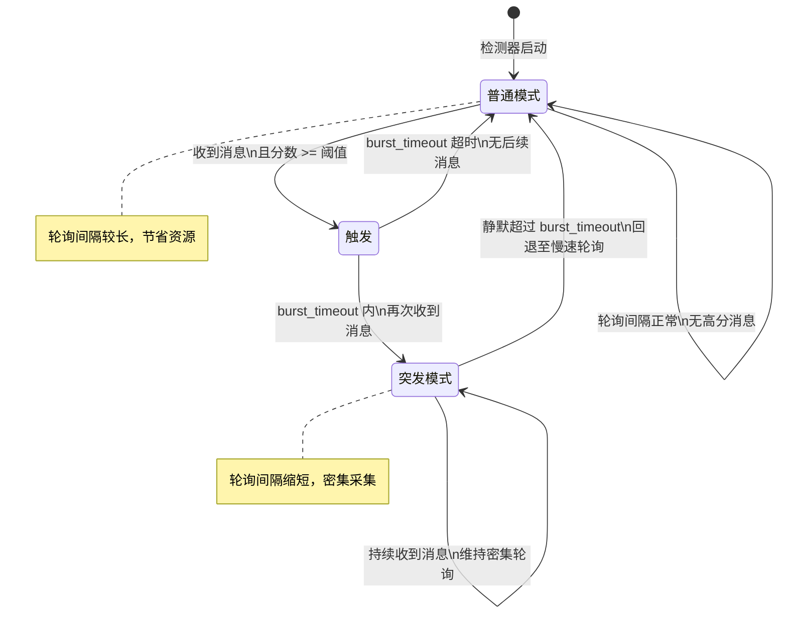
```mermaid
stateDiagram-v2
    [*] --> 普通模式: 检测器启动

    普通模式 --> 触发: 收到消息\n且分数 >= 阈值
    普通模式 --> 普通模式: 轮询间隔正常\n无高分消息

    触发 --> 突发模式: burst_timeout 内\n再次收到消息
    触发 --> 普通模式: burst_timeout 超时\n无后续消息

    突发模式 --> 突发模式: 持续收到消息\n维持密集轮询
    突发模式 --> 普通模式: 静默超过 burst_timeout\n回退至慢速轮询

    note right of 普通模式: 轮询间隔较长，节省资源
    note right of 突发模式: 轮询间隔缩短，密集采集
```

#### 检测器循环架构

检测器循环运行在 `MemoryEngine` 的异步事件循环中，核心逻辑位于 `_tick_detector` 方法。每个 tick 周期内执行以下操作：

1. **检查状态**：读取当前模式（普通/突发）及已持续静默时间
2. **拉取消息**：调用飞书 API 获取指定 chat 的新消息
3. **处理消息**：逐条执行检测与评分流水线
4. **更新状态**：根据本次 tick 是否产生新信号，决定是否切换模式
5. **重置定时器**：若进入突发模式，缩短下一次 tick 的延迟；若超时，恢复普通模式间隔

这种设计确保了检测器能在"低资源消耗"和"快速响应"之间自适应切换，无需人工干预。

## Episode 管理与收割器

检测器的终点是 Episode 管理器。所有通过评分的信号消息连同其上下文块，会调用 `EpisodeManager.add_message()` 方法注入到对应群聊的消息缓冲区中。Episode 管理器在此之上执行更精细的边界检测、缓冲管理、挂起与收割逻辑。

完整的 Episode 生命周期管理详见 Episode 管理。检测器与 Episode 管理器之间的接口简洁明确：检测器只负责"发现信号"，Episode 管理器负责"组织记忆"。


# Episode Management

## Episode 管理

当 LarkIMDetector 从消息流中识别出记忆信号并将上下文块注入后，真正的"记忆组织"工作由 Episode 管理系统承担。其核心职责是将离散的消息聚合为语义连贯的**话题单元（Episode）**，检测话题边界，管理缓冲生命周期，最终将完整的 Episode 分派给 MemoryEngine 进行记忆提取。

从宏观视角看，Episode 管理系统是消息流水线的"胶水层"——它不直接生成记忆，而是决定了"哪些消息属于同一个记忆上下文"。

## 核心组件

Episode 管理体系由三个主要组件协作完成：

- **ChatEpisodeManager**：顶层管理器，为每个群聊维护独立的 Episode 缓冲区，驱动边界检测逻辑，管理 SuspendPool（挂起池）。系统全局仅存在一个实例。

- **EpisodeBuffer**：每个活跃群聊对应的内存缓冲区，存储待处理的消息序列及其嵌入向量，维护缓冲区的起始/结束时间戳。缓冲区是有状态的——一个 buffer 对应一个正在构建中的 Episode。

- **SuspendPool**：持久化存储层，将已关闭但可能被重新打开的 Episode 序列化到 JSON 文件。配合 LRU 淘汰策略，确保池大小不超过 `EPISODE_POOL_MAX_SIZE`。

### 数据模型关系

以下类图展示了 Message、EpisodeBuffer、ChatEpisodeManager 和 Episode 之间的静态关系与关键字段：

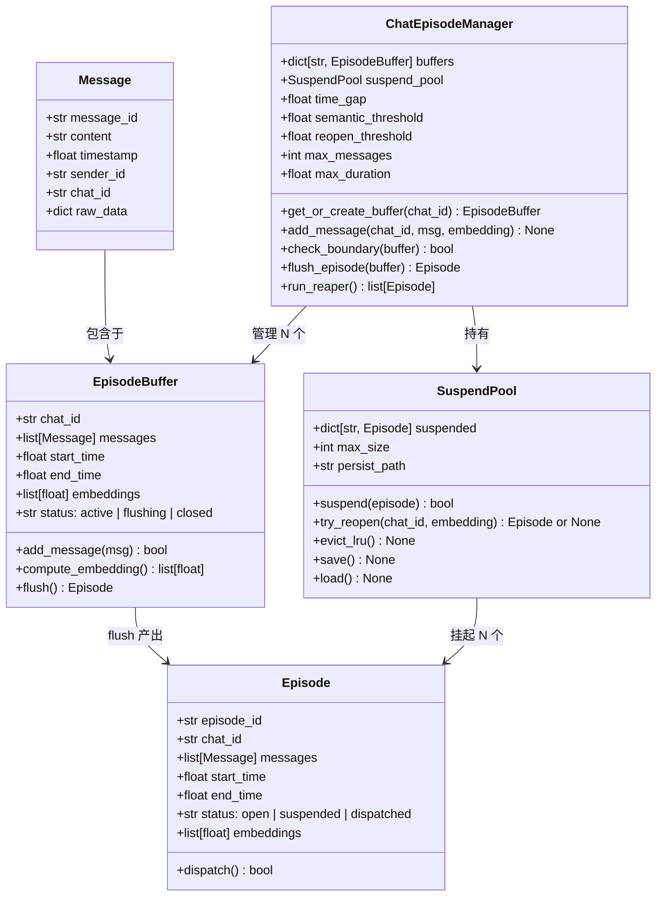
```mermaid
classDiagram
    class Message {
        +str message_id
        +str content
        +float timestamp
        +str sender_id
        +str chat_id
        +dict raw_data
    }

    class EpisodeBuffer {
        +str chat_id
        +list[Message] messages
        +float start_time
        +float end_time
        +list[float] embeddings
        +str status: active | flushing | closed
        +add_message(msg) bool
        +compute_embedding() list[float]
        +flush() Episode
    }

    class ChatEpisodeManager {
        +dict[str, EpisodeBuffer] buffers
        +SuspendPool suspend_pool
        +float time_gap
        +float semantic_threshold
        +float reopen_threshold
        +int max_messages
        +float max_duration
        +get_or_create_buffer(chat_id) EpisodeBuffer
        +add_message(chat_id, msg, embedding) None
        +check_boundary(buffer) bool
        +flush_episode(buffer) Episode
        +run_reaper() list[Episode]
    }

    class SuspendPool {
        +dict[str, Episode] suspended
        +int max_size
        +str persist_path
        +suspend(episode) bool
        +try_reopen(chat_id, embedding) Episode or None
        +evict_lru() None
        +save() None
        +load() None
    }

    class Episode {
        +str episode_id
        +str chat_id
        +list[Message] messages
        +float start_time
        +float end_time
        +str status: open | suspended | dispatched
        +list[float] embeddings
        +dispatch() bool
    }

    Message --> EpisodeBuffer : 包含于
    EpisodeBuffer --> Episode : flush 产出
    ChatEpisodeManager --> EpisodeBuffer : 管理 N 个
    ChatEpisodeManager --> SuspendPool : 持有
    SuspendPool --> Episode : 挂起 N 个
```

#### 图：消息到 Episode 的映射

每个 `Message` 通过 `add_message()` 进入对应的 `EpisodeBuffer`。当边界条件触发时，Buffer 被 flush 为一个闭环的 `Episode` 对象。如果该 Episode 尚未达到分派条件，它会被送入 `SuspendPool` 等待潜在的重开（reopen）；否则直接分派至 MemoryEngine。

## 边界检测逻辑

边界检测是 Episode 管理的核心决策点——系统需要在"尽可能聚合相关消息"和"及时形成闭合 Episode"之间找到平衡。检测器在每次 `add_message()` 调用后触发检查，三个边界条件以**或**逻辑组合：任一条件满足即触发 Episode 关闭。

### 1. 时间间隔边界

当前消息与缓冲区最后一条消息的时间戳之差超过 `EPISODE_TIME_GAP`（默认 **1800 秒 / 30 分钟**）。这是最粗粒度的边界检测，适用于话题自然冷却的场景。

时间边界是兜底机制——即使语义上两个话题仍然相关，超过半小时的静默也意味着对话已经"断开"，应当形成独立 Episode。

### 2. 语义边界（话题切换）

当前消息的嵌入向量与缓冲区内消息嵌入的平均相似度（或最大相似度）低于 `EPISODE_SEMANTIC_THRESHOLD`（默认 **0.50**）。这标志着话题发生了实质性切换。

语义检测的实现流程：

1. 计算新消息的 embedding
2. 计算与缓冲区已有消息 embedding 的余弦相似度矩阵
3. 取平均值或最大值作为聚合相似度
4. 若聚合相似度 < 阈值，触发话题切换边界

这种基于 embedding 的语义边界检测能够感知到"从技术讨论跳转到午餐饮料"之类的话题切换，而单纯的时间间隔无法捕捉这种变化。

### 3. 容量约束

即使时间和语义均未触发边界，以下任一硬限制也会强制关闭 Episode：

- **消息数量上限**：缓冲区消息数超过 `EPISODE_MAX_MESSAGES`（默认 **50** 条）
- **持续时长上限**：缓冲区从创建到当前超过 `EPISODE_MAX_DURATION`（默认 **7200 秒 / 2 小时**）

容量约束防止缓冲区无限制膨胀，确保单个 Episode 的大小在可控范围内，既有利于后续的记忆提取质量，也避免了内存泄漏。

## Reaper 循环 (run_episode_check_loop)

Reaper（收割器）是一个定期运行的后台循环，在 IM 检测器的主循环内执行。它的职责是扫描所有活跃缓冲区，检查哪些满足了边界条件，对它们执行 flush 操作。

Reaper 的工作逻辑：

1. 遍历 `ChatEpisodeManager.buffers` 中所有状态为 `active` 的 buffer
2. 对每个 buffer，调用 `check_boundary()` 执行三个边界条件检查
3. 若触发边界，执行 `flush_episode()`：
   - 从 buffer 中提取消息列表、嵌入向量、时间范围
   - 构建 `Episode` 对象，状态设为 `closed`
   - 清空 buffer 等待新消息
4. 对 closed 状态的 Episode，尝试发送至 MemoryEngine
5. 若 MemoryEngine 暂时无法接受（如正在处理中），将 Episode 转入 SuspendPool 挂起

### 图：Episode 生命周期与分派

以下流程图展示了 Episode 从消息注入到最终分派的完整生命周期，包括边界检测、挂起、重开、LRU 淘汰等关键路径：

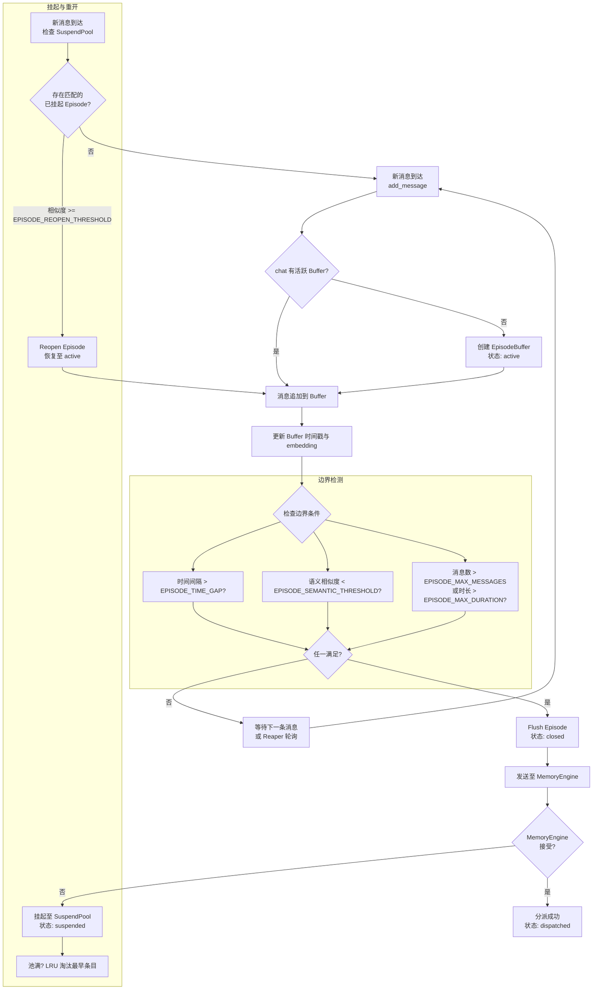
```mermaid
flowchart TD
    A[新消息到达<br>add_message] --> B{chat 有活跃 Buffer?}
    B -->|否| C[创建 EpisodeBuffer<br>状态: active]
    B -->|是| D[消息追加到 Buffer]
    C --> D

    D --> E[更新 Buffer 时间戳与 embedding]

    E --> F{检查边界条件}
    F --> G1[时间间隔 > EPISODE_TIME_GAP?]
    F --> G2[语义相似度 < EPISODE_SEMANTIC_THRESHOLD?]
    F --> G3[消息数 > EPISODE_MAX_MESSAGES<br>或时长 > EPISODE_MAX_DURATION?]

    G1 --> H{任一满足?}
    G2 --> H
    G3 --> H

    H -->|否| I[等待下一条消息<br>或 Reaper 轮询]
    I --> A

    H -->|是| J[Flush Episode<br>状态: closed]
    J --> K[发送至 MemoryEngine]

    K --> L{MemoryEngine<br>接受?}
    L -->|是| M[分派成功<br>状态: dispatched]
    L -->|否| N[挂起至 SuspendPool<br>状态: suspended]

    N --> O[池满? LRU 淘汰最早条目]

    P[新消息到达<br>检查 SuspendPool] --> Q{存在匹配的<br>已挂起 Episode?}
    Q -->|相似度 >= EPISODE_REOPEN_THRESHOLD| R[Reopen Episode<br>恢复至 active]
    Q -->|否| A

    R --> D

    subgraph 边界检测
        F
        G1
        G2
        G3
        H
    end

    subgraph 挂起与重开
        N
        O
        P
        Q
        R
    end
```

#### 关键决策：挂起 vs 淘汰

当 Episode 被挂起而非直接分派时，它进入了**等待重开**状态。重开机制依赖于 Max-similarity 策略：

> 新消息的 embedding 与暂停 Episode 中**每一条消息**的 embedding 逐一比对，取最大相似度。若该最大值 >= `EPISODE_REOPEN_THRESHOLD`（默认 **0.55**），则从 SuspendPool 中移出该 Episode，恢复其 Buffer 为 active，新消息追加至恢复后的 Buffer 末尾。

相比平均相似度，Max-similarity 对话题的"回马枪"更敏感——某人在暂停的讨论中只发了一条关键消息，就足以触发重开。

**LRU 淘汰**：当 SuspendPool 中 Episode 数量达到 `EPISODE_POOL_MAX_SIZE`（默认 **20**），新挂入的 Episode 会导致最早暂停且未被重开的 Episode 被永久淘汰。

## 与 MemoryEngine 的集成

Episode 管理的输出端对接 MemoryEngine 的记忆提取管线。当一个 Episode 被成功分派（dispatched），它作为一个完整的消息集合被送入 MemoryEngine，触发以下操作：

1. **提取摘要**：对 Episode 中的消息进行 LLM 摘要，生成结构化记忆条目
2. **嵌入存储**：将 Episode 整体的 embedding 写入向量数据库
3. **关联索引**：记录 Episode 的时间范围、参与者、群聊来源等元数据，供后续检索

MemoryEngine 可能因负载原因暂时拒绝新 Episode——此时架构的优雅之处在于，Episode 可以被挂起而不会丢失。SuspendPool 的 JSON 持久化确保了即使进程重启，挂起的 Episode 也能被恢复。

## 关键配置常量

以下常量集中定义在系统配置中，控制 Episode 管理的全部行为参数：

| 配置项 | 默认值 | 说明 |
|--------|--------|------|
| `EPISODE_TIME_GAP` | 1800 秒（30 分钟） | 时间间隔边界阈值 |
| `EPISODE_SEMANTIC_THRESHOLD` | 0.50 | 语义边界 - 平均相似度下限 |
| `EPISODE_REOPEN_THRESHOLD` | 0.55 | 重开判定 - 最大相似度下限 |
| `EPISODE_MAX_MESSAGES` | 50 条 | 单 Episode 消息数上限 |
| `EPISODE_MAX_DURATION` | 7200 秒（2 小时） | 单 Episode 持续时长上限 |
| `EPISODE_POOL_MAX_SIZE` | 20 个 | SuspendPool 容量上限 |

这些参数需要在**记忆的粒度**与**计算开销**之间取得平衡。较短的时间间隔和较低的语义阈值会产生更多、更小的 Episode，提供更精细的话题划分，但会增加 MemoryEngine 的处理负载；反之，较宽松的参数会产生更粗粒度的 Episode，降低精度但提升吞吐。


# MemoryGraph (In-Memory Index)

### 1. 内部架构与索引

MemoryGraph 是系统中所有决策节点的运行时内存索引，相当于一份**全量决策缓存**，为 MCP 查询、冲突检测、热点计算和飞书多维表格同步提供 O(1) 级别的数据访问能力。

其内部维护五重索引结构，全部以 Python 字典或集合实现，由 `threading.RLock` 保障并发安全：

| 索引 | 类型 | 用途 |
|---|---|---|
| `_decisions` | `Dict[str, DecisionNode]` | 主键索引，sid → DecisionNode 的直接映射 |
| `_topics` | `Dict[str, List[str]]` | 话题索引，`"{project}/{topic}"` → sid 列表 |
| `_projects` | `Dict[str, List[str]]` | 项目索引，project → topic 名称列表 |
| `_relations` | `Dict[str, List[Relation]]` | 关系索引，sid → Relation 列表 |
| `_dirty_decisions` | `Set[str]` | 脏标记集，记录自上次持久化以来发生过变更的 sid |

这种多重索引的设计使得不同维度的查询都能快速命中，无需遍历全量数据。例如 `query_by_topic(project, topic)` 可以直接通过 `_topics` 拿到该话题下的所有决策 ID，再回表查询 `_decisions` 获取完整节点。

### 2. DecisionNode 模式与状态

DecisionNode 是 MemoryGraph 中存储的基本单元，由 Pydantic BaseModel 定义，拥有丰富的字段来描述一个决策的完整生命周期。

#### 关键字段

| 字段 | 类型 | 说明 |
|---|---|---|
| `sid` | `str` | 全局唯一决策 ID，基于内容哈希生成 |
| `summary` / `full_text` | `str` | 决策摘要与完整正文 |
| `topic_id` | `str` | 所属话题 ID |
| `status` | `DecisionStatus` | 生命周期状态枚举 |
| `impact_level` | `ImpactLevel` | 影响级别 (advisory / minor / major / critical) |
| `confidence` | `float` | LLM 提取置信度，范围 [0.0, 1.0] |
| `version` | `int` | 版本号，每次更新递增 |
| `relations` | `List[Relation]` | 关系边列表，描述该节点与其他节点的语义关联 |
| `parent_id` | `str` | 父决策 ID，空值表示根节点 |
| `authority` / `proposer` / `assignee` | `str` | 角色归属字段 |
| `tags` | `List[str]` | 标签列表 |
| `access_stats` | `AccessStats` | 访问统计，用于热点值计算 |
| `created_at` / `updated_at` | `datetime` | 创建与更新时间戳 |

状态枚举 `DecisionStatus` 定义了十个状态值，覆盖从提出到废弃的完整生命周期：`pending`、`pending_confirmation`、`in_discussion`、`decided`、`executing`、`completed`、`shelved`、`rejected`、`superseded`、`deprecated`。其中前六个为活跃状态（`is_active()` 返回 `true`），后四个为非活跃状态。

### 3. 基于关系的冲突检测

MemoryGraph 不依赖外部推理引擎，而是通过预定义的**关系边网络**实现冲突发现。每个 DecisionNode 持有一个 `relations` 列表，其中的 `Relation` 对象包含类型、目标 ID 和描述信息。

关系类型枚举 `RelationType` 定义了八种语义：`DEPENDS_ON`、`SUPERSEDES`、`REFINES`、`CONFLICTS_WITH`、`RELATES_TO`、`OBJECTION`、`PARENT_OF`、`CHILD_OF`。其中 `CONFLICTS_WITH` 是冲突检测的核心关系类型。

#### 冲突检测逻辑

`detect_conflicts(new_node)` 方法扫描 `_relations` 索引中所有已存在的节点关系，判断是否有任何已有节点的 `CONFLICTS_WITH` 关系指向新节点的 sid。如果发现匹配，则构造一个 `Conflict` 对象返回给调用方：

```python
def detect_conflicts(self, new_node: DecisionNode) -> List[Conflict]:
    conflicts = []
    for sdr_id, relations in self._relations.items():
        for rel in relations:
            if rel.type == RelationType.CONFLICTS_WITH and rel.target_id == new_node.sid:
                other = self._decisions.get(sdr_id)
                if other:
                    conflicts.append(Conflict(
                        conflict_id=f"conflict_{sdr_id}_{new_node.sid}",
                        decision_a=sdr_id,
                        decision_b=new_node.sid,
                        description=f"'{other.summary}' 与 '{new_node.summary}' 存在冲突",
                    ))
    return conflicts
```

这种设计的好处是冲突关系是**显式声明**的，而非运行时推导——当用户在飞书聊天中确认两个决策互斥时，系统通过 MCP 工具写入 `CONFLICTS_WITH` 关系边，后续所有检测均可即时命中。

### 4. 热点值算法

热点值（Hot Score）是一个 [0, 100] 之间的浮点数，用于衡量一个决策的**当前热度**。系统使用该值在飞书多维表格中对决策进行排序，帮助用户快速聚焦高价值信息。

`recalculate_hot_score(sid)` 方法从四个维度计算加权得分：

| 维度 | 计算方式 | 权重 | 上限 |
|---|---|---|---|
| 引用分数 | `reference_count * 20.0` | 40% | 100 |
| 访问分数 | `access_count * 15.0` | 20% | 100 |
| 关系分数 | `len(relations) * 25.0` | 15% | 100 |
| 基础分数 | `max(0, 25 - 天数 * 1.5)` | 直接加和 | 25 |

最终公式为：

```
hot_score = ref_score * 0.40 + access_score * 0.20 + relation_score * 0.15 + base_score
hot_score = clamp(hot_score, 0, 100)
```

基础分数随创建时间线性衰减（每天衰减 1.5），确保旧决策在不被引用和访问时逐渐降权。引用次数赋予最高权重（40%），因为在实践中，被频繁引用意味着该决策持续具有参考价值。

每次通过 MCP 工具访问决策时，系统自动调用 `update_access_stats(sid)` 递增 `access_count` 并重新计算热点值；`record_reference(sid)` 则单独递增 `reference_count`。

### 5. 脏节点追踪与持久化

MemoryGraph 与 Git 存储之间采用**脏标记 + 批量刷新**的模式同步数据变更，而非每次写入都触发 Git 操作，以兼顾运行效率与数据持久性。

核心机制围绕 `_dirty_decisions` 集合展开：

- **标记脏节点**：`upsert_decision()` 或任何访问统计更新操作都会将对应 sid 加入 `_dirty_decisions`
- **获取并清理**：`get_dirty_and_clean()` 方法返回当前所有脏节点的 DecisionNode 列表，然后清空集合
- **删除处理**：`delete_decision()` 同时从 `_decisions` 和 `_dirty_decisions` 中移除

Engine 的事件循环会在每次睡眠周期（Sleep Cycle）中调用 `get_dirty_and_clean()`，将脏节点批量写入 Git 仓库，从而实现内存索引与磁盘存储的最终一致性。

### 6. GitReader 协议与加载

MemoryGraph 通过 `GitReader` 协议接口从 Git 存储初始化数据。`GitReader` 定义了从 Git 后端读取决策所必需的抽象方法，包括 `list_decision_branches()`、`read_decision_from_branch()`、`read_decision()` 等。`GitStorage` 实现了该协议，使得 MemoryGraph 无需关心具体的存储后端实现。

#### 加载数据流

`load_from_git(reader, project)` 是系统的启动入口之一，其完整流程如下：

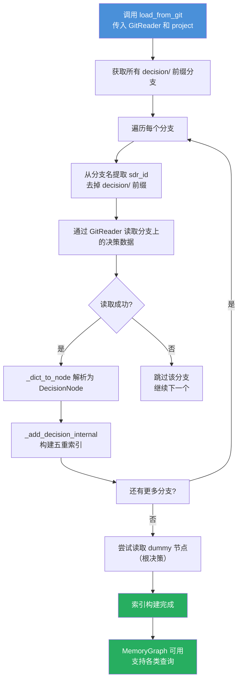
```mermaid
flowchart TD
    A[调用 load_from_git<br/>传入 GitReader 和 project] --> B[获取所有 decision/ 前缀分支]
    B --> C[遍历每个分支]
    C --> D[从分支名提取 sdr_id<br/>去掉 decision/ 前缀]
    D --> E[通过 GitReader 读取分支上的决策数据]
    E --> F{读取成功?}
    F -->|是| G[_dict_to_node 解析为 DecisionNode]
    F -->|否| H[跳过该分支<br/>继续下一个]
    G --> I[_add_decision_internal<br/>构建五重索引]
    I --> J[还有更多分支?]
    J -->|是| C
    J -->|否| K[尝试读取 dummy 节点<br/>（根决策）]
    K --> L[索引构建完成]
    L --> M[MemoryGraph 可用<br/>支持各类查询]

    style A fill:#4a90d9,color:#fff
    style L fill:#27ae60,color:#fff
    style M fill:#27ae60,color:#fff
```

关键步骤说明：

1. **分支枚举**：调用 `GitReader.list_decision_branches()` 获取所有以 `decision/` 为前缀的 Git 分支，每个分支对应一条决策记录
2. **数据读取**：通过 `read_decision_from_branch(branch, sdr_id)` 在对应分支上读取决策文件内容
3. **反序列化**：`_dict_to_node()` 将字典数据转换为 `DecisionNode` 实例，处理字段映射、字符串到枚举的转换、时间戳解析等
4. **索引构建**：`_add_decision_internal()` 将节点依次注册到 `_decisions`、`_topics`、`_projects`、`_relations` 四个索引中
5. **Dummy 节点**：最后尝试读取项目通用的 dummy 根节点，用于建立决策树的根起始点

### 7. 搜索与检索

MemoryGraph 提供两类基本的搜索能力：

- **精确查找**：`get_decision(sid)` 通过主键索引 O(1) 获取单个决策
- **关键词搜索**：`search_by_keywords(query, topic)` 遍历所有活跃决策，在 `summary`、`full_text`、`topic_id` 三个字段中做大小写不敏感的子串匹配

关键词搜索实现简单直接，适合 MCP 工具做快速过滤。对于更复杂的语义检索需求（如 BM25 + Embedding 混合搜索），由 Hypergraph Structure & Retrieval 中的 `HierarchicalRetriever` 层提供，其在 MemoryGraph 之上构建了层次化的检索管道。


# Git Storage Backend

### 1. 架构概览

Git Storage 是整个系统数据持久化的基石，负责将 LLM 从飞书对话中提取的决策、反对意见等结构化知识写入本地 Git 仓库，并提供分支管理、历史追溯、内容搜索等版本控制能力。

`GitStorage` 封装了决策的完整 CRUD 操作（`write_decision`、`read_decision`、`list_decisions` 等）以及反对意见的管理（`write_objection`、`list_objections`），底层依赖 `GitCLI` 执行实际的 Git 命令。此外，`BaseViewSyncer` 在 Git 持久化的基础上，将决策数据同步到飞书多维表格（Base），实现 Git 仓库 ↔ 飞书 Base 的双通道写入。

#### 数据流：自然语言到代码实体

一条决策从用户在飞书聊天中说出的一句话，到最终写入 Git 仓库，经历了一个完整的数据管道：

1. **消息接收**：飞书 IM 事件监听器捕获用户消息
2. **信号检测**：`Detector` 分析消息中是否包含决策意图
3. **LLM 提取**：`DecisionExtractor` 调用大模型从对话中提取结构化决策数据
4. **MCP 写入**：MCP 工具调用 `GitStorage.write_decision()` 持久化
5. **内存同步**：`MemoryGraph.upsert_decision()` 同步更新内存索引
6. **Base 同步**：`BaseViewSyncer.sync_decision()` 写入飞书多维表格

##### 图：决策持久化流程

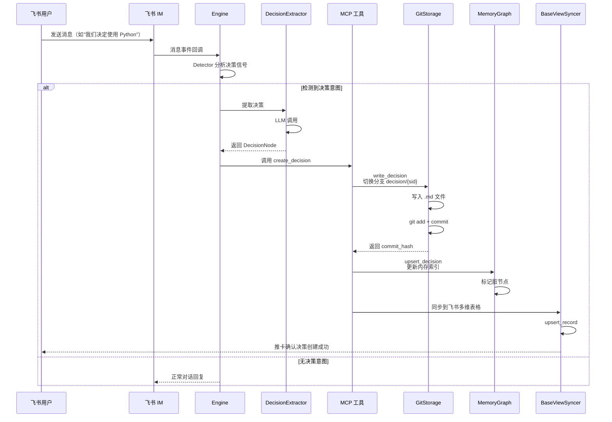
```mermaid
sequenceDiagram
    participant User as 飞书用户
    participant IM as 飞书 IM
    participant Engine as Engine
    participant Extractor as DecisionExtractor
    participant MCP as MCP 工具
    participant Git as GitStorage
    participant Mem as MemoryGraph
    participant Base as BaseViewSyncer

    User->>IM: 发送消息（如"我们决定使用 Python"）
    IM->>Engine: 消息事件回调
    Engine->>Engine: Detector 分析决策信号
    
    alt 检测到决策意图
        Engine->>Extractor: 提取决策
        Extractor->>Extractor: LLM 调用
        Extractor-->>Engine: 返回 DecisionNode
        
        Engine->>MCP: 调用 create_decision
        
        MCP->>Git: write_decision<br/>切换分支 decision/{sid}
        Git->>Git: 写入 .md 文件
        Git->>Git: git add + commit
        Git-->>MCP: 返回 commit_hash
        
        MCP->>Mem: upsert_decision<br/>更新内存索引
        Mem->>Mem: 标记脏节点
        
        MCP->>Base: 同步到飞书多维表格
        Base->>Base: upsert_record
        
        Base-->>User: 推卡确认决策创建成功
    else 无决策意图
        Engine-->>IM: 正常对话回复
    end
```

`GitStorage` 同时支持**分支读取**与**主分支读取**两种方式：`read_decision_from_branch()` 基于 `decision/` 前缀的分支读取历史版本，`read_decision()` 直接从主分支的 `decisions/` 目录读取最新文件。这种双轨制使得 Git 仓库既能充当常规文件系统使用，又能保留按分支管理的版本历史。

### 2. 存储策略：每记录一分支

系统采用**每记录一分支**（Branch-per-Record）的存储策略：每个决策对应一个独立的 Git 分支，命名为 `decision/{sid}`。这种策略在常规代码仓库中较为罕见，但在知识管理场景中具有显著优势：

- **独立版本历史**：每个决策的变更历史完全隔离，`git log` 仅展示该决策的每次更新，不会被其他决策的提交干扰
- **细粒度回滚**：可针对单个决策执行 `git revert` 或切换分支实现时间旅行
- **并行演化**：多个决策可以独立演进，互不阻塞

#### 分支生命周期管理

`write_decision()` 方法每次写入时执行以下分支操作序列：

1. 保存当前分支（通常为 `main`）
2. 检查 `decision/{sid}` 分支是否存在，不存在则从 `main` 创建
3. 切换到目标分支
4. 在 `decisions/{project}/{topic}/{sid}.md` 路径下写入文件
5. 执行 `git add` + `git commit`，使用 `rev-list --count` 计算当前版本号
6. 切换回 `main` 分支

版本号的生成方式为：`rev-list --count decision/{sid} ^main`，即计算从 `main` 分支分叉之后该决策分支上的提交数量。这使得每次更新自动递增版本号，无需额外维护计数器。

### 3. 文件格式与序列化

#### YAML 前置元数据 + Markdown 正文

每条决策存储为一个独立的 `.md` 文件，采用 **YAML frontmatter + Markdown body** 的双段格式。这种格式的优点在于：

- **机器可读**：YAML 前置元数据可以被 `parse_decision_file()` 快速解析为结构化的 Python 字典
- **人工可读**：Markdown 正文方便直接在 Git 编辑器或 GitHub 中阅读
- **双向转换**：`render_decision_file()` 与 `parse_decision_file()` 互为逆操作

##### 文件结构示例：

```markdown
---
sid: "abc123def456"
topic_id: "技术选型"
title: "后端语言选择"
summary: "团队决定主语言选用 Python"
decision: "经讨论，团队决定将 Python 作为后端主语言..."
rationale: "团队 Python 经验丰富，生态成熟"
status: "decided"
impact_level: "major"
version: 3
project: "feishu-mem"
---

## 后端语言选择

### 决策

经讨论，团队决定将 Python 作为后端主语言...

### 依据

团队 Python 经验丰富，生态成熟

### 元数据

- **Topic**: 技术选型
- **Status**: decided
- **Impact Level**: major
- **Proposer**: user_123
```

`render_decision_file()` 将决策字典渲染为上述格式。YAML 部分包含决策的所有元数据字段，Markdown 正文部分则呈现决策标题、决策正文、依据说明和元数据摘要，方便人工阅读。`parse_decision_file()` 在读取时通过正则或 YAML 解析器提取 `---` 分隔符之间的前置元数据。

### 4. GitCLI 实现

`GitCLI` 是对 Git 命令行工具的轻量 Python 封装，所有操作通过 `subprocess.run()` 调用系统 Git 执行。它不依赖任何第三方 Git 库（如 GitPython），保持了零外部依赖和与系统 Git 版本的完全兼容。

#### 关键操作

| 操作 | 方法 | 底层命令 |
|---|---|---|
| 初始化仓库 | `run("init")` | `git init` |
| 提交文件 | `commit(path, msg)` | `git add {path}` → `git commit -m {msg}` |
| 创建分支 | `create_branch(name)` | `git checkout -b {name}` |
| 切换分支 | `switch_branch(name)` | `git checkout {name}` |
| 合并分支 | `merge_branch(name)` | `git merge --no-ff {name}` |
| 获取 HEAD | `get_head_hash()` | `git rev-parse HEAD` |
| 文件历史 | `get_commit_log(path)` | `git log --oneline -- {path}` |
| 全文搜索 | `git_grep(pattern)` | `git grep -i -n {pattern}` |
| 逐行追溯 | `git_blame(path)` | `git blame -p {path}` |
| 分支列表 | `list_branches()` | `git branch -a` |
| 文件清单 | `ls_tree(branch)` | `git ls-tree -r --name-only {branch}` |
| 远程推送 | `run("push", ...)` | `git push -u origin {branch}` |

`GitCLI` 将 `git add` 和 `git commit` 合并为 `commit()` 方法，并处理了"没有变更需要提交"的边界情况。所有错误均以 `GitCLIError` 异常形式抛出，上层调用方可根据异常类型决定是否重试或跳过。

### 5. 目录结构与配置

#### 仓库布局

`GitStorage` 在 `data/` 目录下维护独立的 Git 仓库，其文件结构如下：

```
data/
├── .git/                       # Git 仓库内部数据
├── L0_RULES.md                 # L0 规则文件（初始提交）
├── dummy.md                    # 根节点占位文件
├── decisions/                  # 决策文件目录
│   └── {project}/
│       └── {topic}/
│           └── {sid}.md        # 单个决策文件
├── objections/                 # 反对意见文件目录
│   └── {project}/
│       └── {topic}/
│           └── {oid}.md        # 单个反对意见文件
└── archive/                    # 归档项目
    └── {project}/
```

仓库在首次初始化时自动创建 `L0_RULES.md` 和 `dummy.md` 作为初始提交，确保 Git 仓库的 HEAD 始终有效。`archive_project()` 方法可将已归档的项目整体移动到 `archive/` 目录。

#### 自动推送与同步

`GitStorageConfig` 提供了 `remote` 和 `auto_push` 两个配置项。当 `auto_push = True` 且 `remote` 不为空时，每次 `write_decision()` 写入成功后自动执行 `git push -u origin {branch}`，将变更同步到远程仓库。

`BaseViewSyncer` 在 Git 写入的基础上，通过飞书多维表格 API 将决策数据同步到 Base 视图。`full_sync()` 方法执行全量同步（先清空再重建），`sync_decision(sid)` 执行增量单条同步。这条同步链路由环境变量 `BITABLE_ENABLED` 控制开关。

关于内存索引的详细设计，参见 MemoryGraph (In-Memory Index).md)。关于超图检索与混合搜索的实现，参见 Hypergraph Structure & Retrieval。


# Hypergraph Structure & Retrieval

### 三层超图架构

超图（Hypergraph）是系统中用于组织和管理长期记忆的核心数据结构。它采用**层次化超图**（Layered Hypergraph）模型，将不同粒度的知识单元组织为节点，并通过超边（Hyperedge）表达多对多的跨层关联。

系统实际使用四层结构，从底层的事实知识到顶层的主题抽象：

| 层级 | 节点类型 | 超边类型 | 说明 |
|---|---|---|---|
| L0 — 决策层 | `DecisionNode` | `DecisionHyperedge` | 存储决策性知识（谁在何时决定了什么） |
| L1 — 事实层 | `FactNode` | `FactHyperedge` | 存储声明性知识（客观事实、上下文信息） |
| L2 — 对话层 | `EpisodeNode` | `EpisodeHyperedge` | 存储对话轮次（用户与 AI 的交互片段） |
| L3 — 主题层 | `TopicNode` | — | 存储主题抽象（多个对话轮次汇聚成的讨论主题） |

各层之间的超边建立了双向链接（bidirectional link），使得从任意一个节点出发都可以沿超边跨层导航：例如从某个话题出发，找到关联的对话轮次，再找到其中的事实和决策。

### 数据结构映射

`Hypergraph` 容器类（定义于 `structure.py`）是超图的内存表示，其七个字典字段分别对应四层的节点与超边：

```
Hypergraph
├── L0: decisions: Dict[str, DecisionNode]
│       decision_hyperedges: Dict[str, DecisionHyperedge]
├── L1: facts: Dict[str, FactNode]
│       fact_hyperedges: Dict[str, FactHyperedge]
├── L2: episodes: Dict[str, EpisodeNode]
│       episode_hyperedges: Dict[str, EpisodeHyperedge]
└── L3: topics: Dict[str, TopicNode]
```

每个节点通过其 `hyperedge` 字段（`Dict[str, str]`，超边 ID → 角色名）与超边关联；超边通过 `relation` 字段（`Dict[str, str]`，节点 ID → 角色名）与节点关联。这一双向映射机制确保了数据的一致性和可遍历性，`validate_bidirectional_links()` 方法可在构建完成后自动校验全部双向链接的一致性。

`DecisionNode`、`FactNode`、`EpisodeNode`、`TopicNode` 各自支持与对应的数据类（`Decision`、`Fact`、`Episode`、`Topic`）之间的双向转换（`from_xxx()` / `to_xxx()`），使得超图与系统的其他数据管道可以无缝对接。

### 超图构建逻辑

#### 构建流程

`HypergraphBuilder` 是超图的构造器，提供两条构建路径：

1. **从对话轮次构建**（`build_from_episodes`）：接收 `Episode.to_dict()` 列表作为输入，按 `chat_id` 分组后，依次创建 EpisodeNode 和 TopicNode，并通过 EpisodeHyperedge 建立关联。若传入了 `existing_hypergraph`，则执行增量合并——跳过已有的 episode，新 episode 按参与者信息尝试匹配已有话题。
2. **从决策构建**（`build_decision_hypergraph`）：接收 `DecisionNode` 列表，按 `topic_id` 分组构建话题维度的决策超图，同时提取节点间的关系边作为超边。

增量合并的逻辑体现了系统的长期运行特征：随着新对话的流入，`build_from_episodes` 被反复调用，每次将新 episode 归入已有话题或创建新话题，而非全量重建。

#### 实体关系图

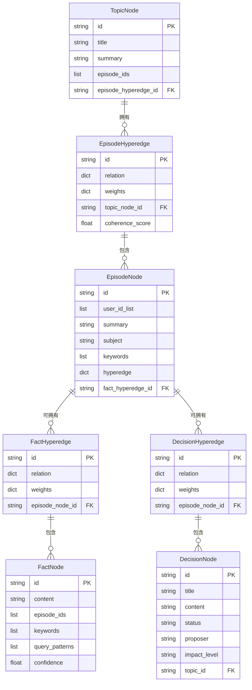
```mermaid
erDiagram
    TopicNode ||--o{ EpisodeHyperedge : "拥有"
    EpisodeHyperedge ||--o{ EpisodeNode : "包含"
    EpisodeNode ||--o{ FactHyperedge : "可拥有"
    FactHyperedge ||--o{ FactNode : "包含"
    EpisodeNode ||--o{ DecisionHyperedge : "可拥有"
    DecisionHyperedge ||--o{ DecisionNode : "包含"
    TopicNode {
        string id PK
        string title
        string summary
        list episode_ids
        string episode_hyperedge_id FK
    }
    EpisodeHyperedge {
        string id PK
        dict relation
        dict weights
        string topic_node_id FK
        float coherence_score
    }
    EpisodeNode {
        string id PK
        list user_id_list
        string summary
        string subject
        list keywords
        dict hyperedge
        string fact_hyperedge_id FK
    }
    FactHyperedge {
        string id PK
        dict relation
        dict weights
        string episode_node_id FK
    }
    FactNode {
        string id PK
        string content
        list episode_ids
        list keywords
        list query_patterns
        float confidence
    }
    DecisionHyperedge {
        string id PK
        dict relation
        dict weights
        string episode_node_id FK
    }
    DecisionNode {
        string id PK
        string title
        string content
        string status
        string proposer
        string impact_level
        string topic_id FK
    }
```

### 分层检索

#### 检索机制

`HierarchicalRetriever` 实现了基于超图的层次化检索管道。与传统平面搜索不同，它利用超图的分层结构实现**从粗到细**的检索策略：

1. **L3 → L2 话题路由**：通过 `search_by_keywords(query)` 在 MemoryGraph 中执行关键词匹配，将匹配结果按 `topic_id` 分组，返回匹配度最高的话题列表
2. **路径展开**：每个话题对应一组决策节点，沿超图路径可进一步展开到下层节点（事实、对话轮次）
3. **结果去重**：按 sid 去重并按相关性截断

#### 混合搜索与融合

检索器支持 BM25 文本检索与 Embedding 向量检索的混合搜索模式，通过**倒数排序融合（RRF, Reciprocal Rank Fusion）** 算法合并多路结果：

```python
@staticmethod
def reciprocal_rank_fusion(results_list, top_n, k=60):
    doc_scores = {}
    for results in results_list:
        for rank, (doc, _) in enumerate(results):
            doc_id = doc.get("id") or str(hash(str(doc)))
            rrf_score = 1.0 / (k + rank + 1)
            doc_scores[doc_id] = doc_scores.get(doc_id, {"doc": doc, "score": 0})
            doc_scores[doc_id]["score"] += rrf_score
    sorted_results = sorted(doc_scores.values(), key=lambda x: x["score"], reverse=True)
    return sorted_results[:top_n]
```

RRF 的核心思想是：如果一个文档在多路检索结果中排名都靠前，则其融合分数会显著高于仅在单一维度匹配的文档。常数 `k`（默认 60）用于抑制排名靠后文档的贡献。这种算法简洁且无需训练，适合在飞书场景中快速融合不同的检索信号。

#### 检索数据流

从用户查询到最终结果的完整流程如下：

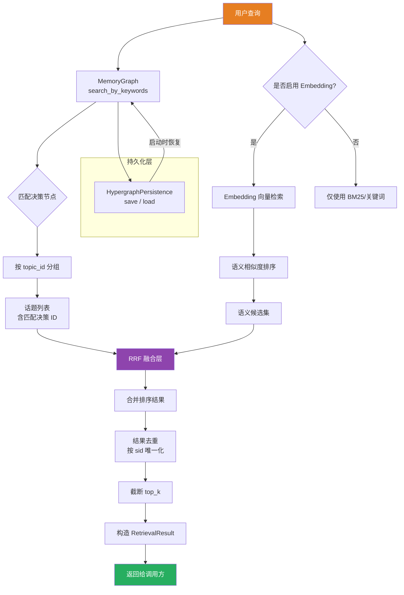
```mermaid
flowchart TD
    A[用户查询] --> B[MemoryGraph<br/>search_by_keywords]
    B --> C{匹配决策节点}
    C --> D[按 topic_id 分组]
    D --> E[话题列表<br/>含匹配决策 ID]
    
    A --> F{是否启用 Embedding?}
    F -->|是| G[Embedding 向量检索]
    G --> H[语义相似度排序]
    H --> I[语义候选集]
    
    F -->|否| J[仅使用 BM25/关键词]
    
    E --> K[RRF 融合层]
    I --> K
    
    K --> L[合并排序结果]
    L --> M[结果去重<br/>按 sid 唯一化]
    M --> N[截断 top_k]
    N --> O[构造 RetrievalResult]
    O --> P[返回给调用方]

    subgraph 持久化层
        Q[HypergraphPersistence<br/>save / load]
    end

    B --> Q
    Q -->|启动时恢复| B
    
    style A fill:#e67e22,color:#fff
    style P fill:#27ae60,color:#fff
    style K fill:#8e44ad,color:#fff
```

检索结果以 `RetrievalResult` 数据结构返回，包含命中的话题列表、决策节点列表、各节点得分及统计数据，可供 MCP 查询接口或飞书消息卡片直接消费。

超图的状态通过 [HypergraphPersistence](https://github.com/your-repo/src/graph/persistence.py) 序列化为 `state.json` 文件，在系统启动时恢复，在每次 episode 处理后全量覆写。


# MemoryEngine Lifecycle

### 1. 初始化与启动

MemoryEngine 是记忆系统的核心后台引擎，负责将飞书对话中提取的决策信息持久化到 MemoryGraph 和 Git 存储中。其生命周期分为"初始化"和"启动"两个阶段。

#### 初始化序列

`MemoryEngine.initialize()` 按严格顺序初始化八个子系统，每个子系统失败时均标记为非致命（non-fatal），保证引擎在部分能力缺失时仍可运行：

1. **GitStorage** — 初始化基于 Git 的决策文件存储后端，工作目录由 `STORAGE_PATH` 环境变量指定
2. **PipelineEngine** — 建立决策管道引擎，绑定 MemoryGraph 和 GitStorage，作为所有变更操作的统一入口
3. **从 Git 加载决策** — 读取 Git 仓库中已有的决策文件，反序列化为 DecisionNode 并填充到 MemoryGraph；同时统计已加载的决策数和主题数
4. **SnapshotManager** — 初始化检测器快照管理器，用于记录每次检测的原始内容快照，便于调试与追溯
5. **HypergraphPersistence** — 从 `data/hypergraph/state.json` 加载超图结构（决策-事实-话题-片段的关联网络），若不存在则创建空超图
6. **BaseViewSyncer** — 初始化基础视图同步器，负责将决策变更同步到飞书多维表格（Base），实现记忆数据的外部可查
7. **SleepManager** — 初始化记忆整理管理器（受 `MEMORY_SLEEP_ENABLED` 控制），负责定期执行重复合并、噪声裁剪和决策提升
8. **PushEngine** — 初始化推送引擎，从环境变量读取推送配置（`CardConfig.from_env()`），注入飞书客户端

```python
## 关键初始化序列（简化）
self._storage = GitStorage(config=...)
self._pipeline = PipelineEngine(memory_graph=self._graph, git_storage=self._storage)
self._graph.load_from_git(self._storage, self._config.project)
self._snapshot_mgr = SnapshotManager(storage_path=...)
self._hg_persistence = HypergraphPersistence(...)
self._hypergraph = self._hg_persistence.load()
self._base_view_syncer = BaseViewSyncer(self._storage, self._graph)
self._sleep_manager = SleepManager(graph=..., pipeline=..., ...)
self._push_engine = PushEngine(config=CardConfig.from_env(), ...)
```

#### 代码实体映射：启动

##### MemoryEngine 启动流程

`MemoryEngine.start()` 被调用时，将 `_running` 置为 `true`，记录启动时间戳，然后创建四个后台异步协程，分别对应不同的生命周期职责：

- **detector-loop** — 检测器主循环，仅当 `detector_enabled=true` 时启动
- **sync-loop** — 脏决策同步循环，始终启动
- **hg-sync-loop** — 超图同步循环，始终启动（将 hypergraph state.json 提交到 Git）
- **sleep-loop** — 定时记忆整理循环，始终启动（但受 `MEMORY_SLEEP_ENABLED` 控制是否实际执行）

同时启动 PushEngine 的推送调度器（`start_push_scheduler()`），注册热点扫描、每日摘要和每周摘要的定时任务。

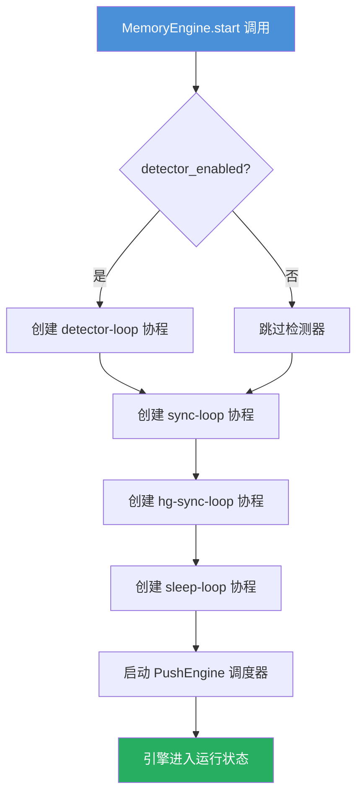
```mermaid
flowchart TD
    A[MemoryEngine.start 调用] --> B{detector_enabled?}
    B -->|是| C[创建 detector-loop 协程]
    B -->|否| D[跳过检测器]
    C --> E[创建 sync-loop 协程]
    D --> E
    E --> F[创建 hg-sync-loop 协程]
    F --> G[创建 sleep-loop 协程]
    G --> H[启动 PushEngine 调度器]
    H --> I[引擎进入运行状态]
    
    style A fill:#4A90D9,color:#fff
    style I fill:#27AE60,color:#fff
```

### 2. 检测器循环

`_run_detector_loop` 是引擎的感知入口，持续轮询消息源以发现潜在的决策信息。其核心工作流程：

1. 调用 `_detector.async_detect()` 获取检测结果
2. 若结果为空，按 `ingester_poll_interval`（默认 30s）休眠后继续
3. 若检测结果包含决策信号（`result.is_decision`），调用 `_process_detection(result)` 进入处理管线

`_process_detection` 的处理管线：

- **Step 1 — 快照保存**：若启用检测器快照，将原始检测内容、上下文和检测结果保存为 `DetectorSnapshot`
- **Step 2 — 决策提取**：构建已有决策上下文（`_build_existing_decisions_context`），注入 LLM 的 system prompt 中，调用 LLM extractor 从内容中提取决策节点（`DecisionNode`）
- **Step 3 — 变更执行**：调用 `_apply_decision_mutations(node, source)` 对提取结果进行语义去重、冲突检测和持久化

对于完整对话上下文（episode），引擎还支持：

- Episode 级别内容去重（基于 SHA256 content hash）
- 过短 episode 自动跳过（消息数 < 2 且长度 < 100 字符）
- 提取后自动构建 Hypergraph（通过 `HypergraphBuilder` 更新超图结构）

```
检测器循环流程图：

┌─────────────┐     ┌──────────────────┐     ┌──────────────────┐
│ async_detect │────>│  判断 is_decision  │────>│ _process_detection │
└─────────────┘     └──────────────────┘     └──────────────────┘
                                                     │
                                           ┌─────────┼─────────┐
                                           ▼         ▼         ▼
                                      保存快照    LLM提取   执行变更
```

### 3. 同步循环与脏节点刷新

引擎维护两个独立的同步回路，均以 `graph_sync_interval`（默认 60s）为调度频率：

**`_sync_loop` — 脏决策同步**：
- 调用 `_graph.get_dirty_and_clean()` 获取自上次同步以来被修改过的"脏"决策列表
- 遍历脏节点，通过 `_storage.write_decision()` 写入 Git 存储（每个决策对应一个 `.md` 文件）
- 同步完成后节点标记为"干净"

**`_hg_sync_loop` — 超图同步**：
- 检查 `_hypergraph_modified` 标记是否被设置
- 如有变更，通过 `_hg_persistence.save()` 将超图序列化为 `state.json`
- 通过 Git CLI 执行 `git add` + `git commit` 提交变更

两个回路职责分离的原因：MemoryGraph 管理的是独立决策文件，Hypergraph 管理的是单一 `state.json` 文件。分开同步可以避免单次提交过于庞大，也便于 Git 历史追溯。

### 4. 语义重连与去重

`_apply_decision_mutations` 是引擎中最核心的方法，它实现了从新决策到存储的完整映射逻辑，包含三级去重策略：

#### 去重流水线

去重判定按优先级从高到低执行：

1. **精确匹配（SID）** — 若新节点 `sid` 已存在于图中，直接生成 UPDATE Mutation，版本递增
2. **语义检索（Embedding + Reranker）** — 在同一 topic 下查找候选决策：
   - 通过 Embedding provider 计算文本向量，余弦相似度检索 top-5
   - 若 `score >= 0.65`：硬约束直接合并，不走 LLM Judge（Plan B 优化）
   - 若 `score > 0.5`：通过 Reranker 精排后，进入 LLM Judge
3. **字符级预过滤（Fast Prefilter）** — 对未命中语义检索的决策，使用 Dice 系数 + 同 topic 约束快速扫描：
   - 通过预过滤后同样进入 LLM Judge

**LLM Judge** 使用 `REALTIME_DEDUP_PROMPT` 判断决策关系，返回四种动作之一：

| 动作 | 含义 | 处理方式 |
|------|------|----------|
| `skip` | 完全重复 | 不执行任何操作 |
| `update` | 覆盖更新 | 使用新内容更新旧决策，追加补充信息 |
| `conflict` | 语义冲突 | 双方标记 `CONFLICTS_WITH` 关系 |
| `create_new` | 全新决策 | 创建版本 1 的新节点 |

此外，父子关系和同父关系（sibling guard）不会进入 LLM Judge，直接判定为 `create_new`。

#### 冲突检测

每个 CREATE Mutation 执行后，引擎调用 `_graph.detect_conflicts(node)` 检测新决策是否与已有决策存在冲突。冲突检测的逻辑基于：

- 同 topic 下的决策对比
- 内容层面的逻辑矛盾识别
- 关系链上的冲突传播

检测到冲突时，引擎自动创建 `CONFLICT_KEEP_BOTH` Mutation，在双方决策上标记 `CONFLICTS_WITH` 关系，并通过 PushEngine 推送冲突通知卡片到飞书。

### 5. 优雅关闭

`MemoryEngine.stop()` 实现了有序的资源释放序列：

1. 设置 `_running = false`，所有后台循环将在下次迭代时检测到并退出
2. 取消所有 asyncio Task（detector-loop, sync-loop, hg-sync-loop, sleep-loop）
3. 等待所有任务通过 `asyncio.gather(..., return_exceptions=True)` 完成
4. 停止 PushEngine 的推送调度器
5. 保存 Hypergraph 状态到 `state.json`（通过 `_hg_persistence.save()`）
6. 执行最后一次脏数据同步（`_sync_dirty_to_storage()`）
7. 输出最终统计信息（累计 applied 和 failed 的 mutation 数量）

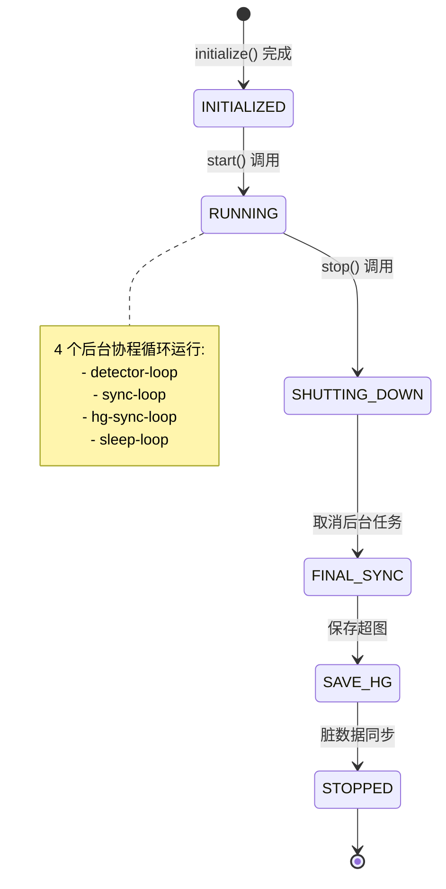
```mermaid
stateDiagram-v2
    [*] --> INITIALIZED: initialize() 完成
    INITIALIZED --> RUNNING: start() 调用
    RUNNING --> SHUTTING_DOWN: stop() 调用
    SHUTTING_DOWN --> FINAL_SYNC: 取消后台任务
    FINAL_SYNC --> SAVE_HG: 保存超图
    SAVE_HG --> STOPPED: 脏数据同步
    STOPPED --> [*]
    
    note right of RUNNING
        4 个后台协程循环运行:
        - detector-loop
        - sync-loop
        - hg-sync-loop
        - sleep-loop
    end note
```

关闭过程设计上的关键考虑：**保存超图优先于脏数据同步**。因为超图是跨会话的结构化记忆表示，丢失后将影响记忆检索的准确性；而脏决策数据在下次启动时仍可从 Git 加载并重建 MemoryGraph。


# DecisionNode & Mutation Model

### DecisionNode 模式

DecisionNode 是整个系统中所有决策信息的标准化表示。它在飞书即时通讯（自然语言空间）和 Git 存储（结构化记录空间）之间充当中介者角色。每个决策节点由 LLM 从对话中提取，经过 PipelineEngine 校验后持久化。

#### 核心字段与角色

| 字段 | 类型 | 说明 |
|------|------|------|
| `sid` | `str` | 唯一标识符（基于内容 MD5 哈希截取 12 位十六进制） |
| `topic_id` | `str` | 所属议题 ID，按议题聚合管理 |
| `title` / `summary` | `str` | 决策标题与摘要 |
| `full_text` | `str` | 决策完整原文 |
| `rationale` | `str` | 决策理由 / 论证过程 |
| `status` | `DecisionStatus` | 当前生命周期状态 |
| `impact_level` | `ImpactLevel` | 影响等级（advisory / minor / major / critical） |
| `confidence` | `float` | LLM 提取置信度（0.0~1.0） |
| `version` | `int` | 版本号（每次 UPDATE 递增） |
| `parent_id` | `str` | 父决策 SDRID，空值表示根节点 |
| `proposer` / `authority` / `assignee` | `str` | 提议者 / 决策者 / 执行者 |
| `tags` | `List[str]` | 标签集合 |
| `relations` | `List[Relation]` | 关系边列表（指向其他决策节点） |
| `access_stats` | `AccessStats` | 访问统计与热点值 |
| `created_at` / `updated_at` | `datetime` | 时间戳 |

#### 决策角色

每个 DecisionNode 携带 `decision_role` 字段，标识该节点在决策流程中的职能角色：

- **decision** — 最终决策，代表团队达成的共识结论
- **plan** — 行动计划，描述如何执行决策的具体步骤
- **consideration** — 考虑项，记录讨论过程中被权衡的方案
- **action** — 执行动作，代表可追踪的任务项

角色的区分有助于 Memory Sleep 阶段的智能整理：同角色的重复节点更倾向于合并，不同角色的节点即使内容相似也应保留。

#### 状态状态机

DecisionStatus 定义了一个包含 10 种状态的枚举体系，可分为活跃态和非活跃态两类：

**活跃态**：`pending` → `pending_confirmation` → `in_discussion` → `decided` → `executing`

**非活跃态**：`completed`, `shelved`, `rejected`, `superseded`, `deprecated`

##### 图：决策状态生命周期

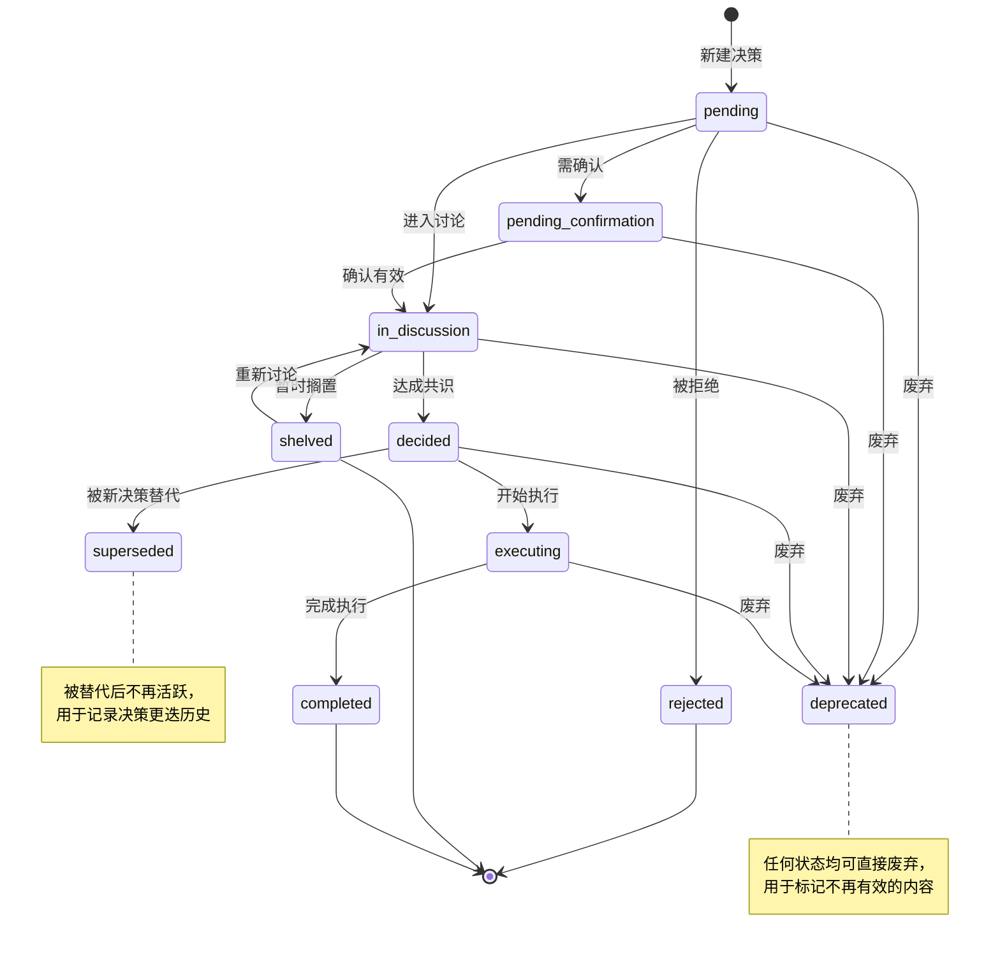
```mermaid
stateDiagram-v2
    [*] --> pending: 新建决策
    pending --> pending_confirmation: 需确认
    pending --> in_discussion: 进入讨论
    pending --> rejected: 被拒绝
    pending_confirmation --> in_discussion: 确认有效
    in_discussion --> decided: 达成共识
    in_discussion --> shelved: 暂时搁置
    decided --> executing: 开始执行
    decided --> superseded: 被新决策替代
    executing --> completed: 完成执行
    rejected --> [*]
    shelved --> in_discussion: 重新讨论
    shelved --> [*]
    completed --> [*]
    
    pending --> deprecated: 废弃
    pending_confirmation --> deprecated: 废弃
    in_discussion --> deprecated: 废弃
    decided --> deprecated: 废弃
    executing --> deprecated: 废弃
    
    note right of superseded
        被替代后不再活跃，
        用于记录决策更迭历史
    end note
    
    note right of deprecated
        任何状态均可直接废弃，
        用于标记不再有效的内容
    end note
```

状态流转的核心规则：

- `pending` 是唯一的新建状态入口
- `decided` → `in_progress`（代码中为 `executing`）→ `completed` 是标准的"决策→执行→完成"路径
- `superseded` 只从 `decided` / `executing` 进入，表示被更优决策替代
- `deprecated` 是任意状态的"紧急出口"，用于标记不再有效的内容
- `shelved` 可回退至 `in_discussion`，支持搁置后重新讨论

### DecisionMutation 模型

DecisionMutation 是引擎中描述变更操作的标准数据契约。当 LLM 提取一个决策后，引擎不会直接修改 MemoryGraph，而是先构建一个 Mutation，然后通过 PipelineEngine 统一执行。这种命令模式（Command Pattern）的设计使所有变更操作可追溯、可重放。

#### 变更类型

| 变更类型 | 枚举值 | 行为 |
|----------|--------|------|
| `CREATE` | `"create"` | 新建决策节点，version = 1 |
| `UPDATE` | `"update"` | 覆盖更新已有节点，version++ |
| `STATUS_CHANGE` | `"status_change"` | 仅变更状态字段 |
| `CONFLICT_MERGE` | `"conflict_merge"` | 合并两个冲突决策为一个新节点 |
| `CONFLICT_KEEP_BOTH` | `"conflict_keep_both"` | 保留双方冲突关系，不合并 |
| `OBJECTION` | `"objection"` | 对决策提出异议 |
| `DEPRECATE` | `"deprecate"` | 废弃决策 |
| `REVERT` | `"revert"` | 回退到历史版本 |

Mutation 的有效性通过 `is_valid` 属性判断：必须有 `sdr_id`，且 CREATE 类型必须有 `summary`，OBJECTION 类型必须有 `objection_reason`。

#### 变更数据流

##### 图：自然语言到代码实体映射

以下展示了从飞书对话内容到最终 Git 存储中决策文件的完整映射路径：

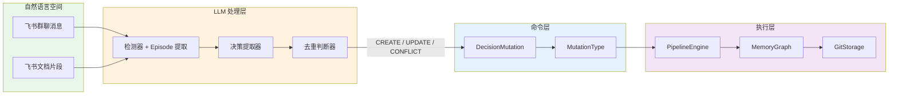
```mermaid
flowchart LR
    subgraph NL[自然语言空间]
        A[飞书群聊消息]
        B[飞书文档片段]
    end
    
    subgraph LLM[LLM 处理层]
        C[检测器 + Episode 提取]
        D[决策提取器]
        E[去重判断器]
    end
    
    subgraph CMD[命令层]
        F[DecisionMutation]
        G[MutationType]
    end
    
    subgraph EXEC[执行层]
        H[PipelineEngine]
        I[MemoryGraph]
        J[GitStorage]
    end
    
    A --> C
    B --> C
    C --> D
    D --> E
    E -->|CREATE / UPDATE / CONFLICT| F
    F --> G
    G --> H
    H --> I
    I --> J
    
    style NL fill:#E8F5E9,color:#333
    style LLM fill:#FFF3E0,color:#333
    style CMD fill:#E3F2FD,color:#333
    style EXEC fill:#F3E5F5,color:#333
```

#### PipelineEngine 分派逻辑

PipelineEngine 的核心是一个基于 MutationType 的分发路由器。每个 Mutation 进入后，先经过有效性校验，然后通过 `dispatcher` 字典映射到对应的处理方法。

##### 变更分派过程

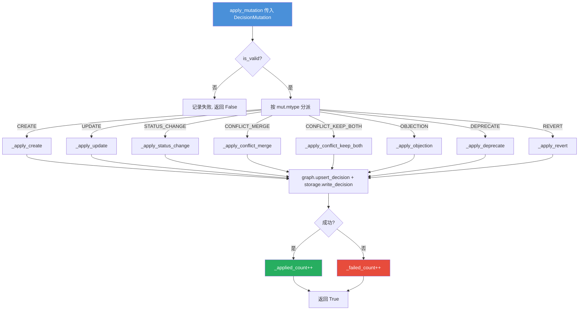
```mermaid
flowchart TD
    A[apply_mutation 传入 DecisionMutation] --> B{is_valid?}
    B -->|否| C[记录失败, 返回 False]
    B -->|是| D[按 mut.mtype 分派]
    
    D -->|CREATE| E[_apply_create]
    D -->|UPDATE| F[_apply_update]
    D -->|STATUS_CHANGE| G[_apply_status_change]
    D -->|CONFLICT_MERGE| H[_apply_conflict_merge]
    D -->|CONFLICT_KEEP_BOTH| I[_apply_conflict_keep_both]
    D -->|OBJECTION| J[_apply_objection]
    D -->|DEPRECATE| K[_apply_deprecate]
    D -->|REVERT| L[_apply_revert]
    
    E --> M[graph.upsert_decision + storage.write_decision]
    F --> M
    G --> M
    H --> M
    I --> M
    J --> M
    K --> M
    L --> M
    
    M --> N{成功?}
    N -->|是| O[_applied_count++]
    N -->|否| P[_failed_count++]
    O --> Q[返回 True]
    P --> Q
    
    style A fill:#4A90D9,color:#fff
    style O fill:#27AE60,color:#fff
    style P fill:#E74C3C,color:#fff
```

##### 图：PipelineEngine 分派逻辑

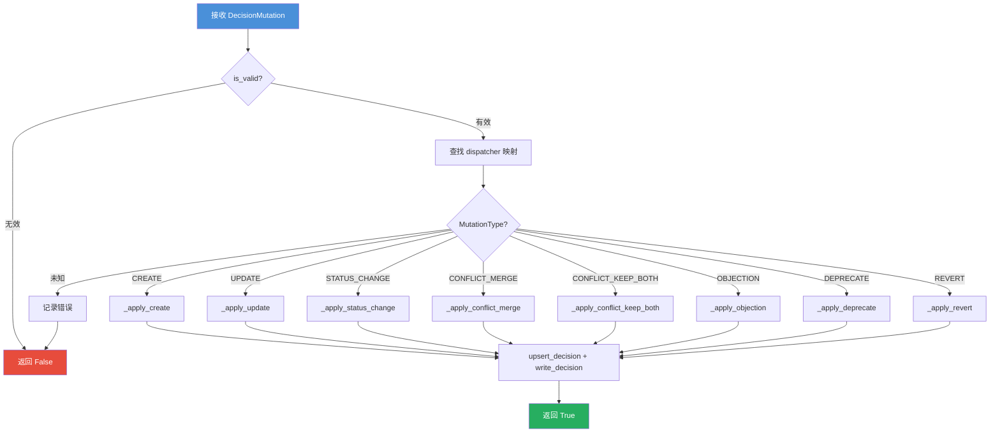
```mermaid
flowchart TD
    START[接收 DecisionMutation] --> CHECK{is_valid?}
    CHECK -->|无效| FAIL[返回 False]
    CHECK -->|有效| DISPATCH[查找 dispatcher 映射]
    DISPATCH --> DISPAT_CREATE{MutationType?}
    
    DISPAT_CREATE -->|CREATE| C[_apply_create]
    DISPAT_CREATE -->|UPDATE| U[_apply_update]
    DISPAT_CREATE -->|STATUS_CHANGE| S[_apply_status_change]
    DISPAT_CREATE -->|CONFLICT_MERGE| CM[_apply_conflict_merge]
    DISPAT_CREATE -->|CONFLICT_KEEP_BOTH| CK[_apply_conflict_keep_both]
    DISPAT_CREATE -->|OBJECTION| OBJ[_apply_objection]
    DISPAT_CREATE -->|DEPRECATE| D[_apply_deprecate]
    DISPAT_CREATE -->|REVERT| R[_apply_revert]
    DISPAT_CREATE -->|未知| ERR[记录错误]
    
    C --> UPSERT[upsert_decision + write_decision]
    U --> UPSERT
    S --> UPSERT
    CM --> UPSERT
    CK --> UPSERT
    OBJ --> UPSERT
    D --> UPSERT
    R --> UPSERT
    ERR --> FAIL
    
    UPSERT --> SUCCESS[返回 True]
    
    style START fill:#4A90D9,color:#fff
    style SUCCESS fill:#27AE60,color:#fff
    style FAIL fill:#E74C3C,color:#fff
```

每个 `_apply_*` 方法的内部逻辑遵循统一模式：

1. 从 MemoryGraph 获取目标决策（`_graph.get_decision()`）
2. 根据 MutationType 修改决策字段
3. 调用 `_graph.upsert_decision()` 更新内存图
4. 若 GitStorage 可用，调用 `_storage.write_decision()` 持久化
5. 记录变更日志并返回 `True` / `False`

#### 关系与超边

决策节点之间通过 `Relation` 边模型建立关联，RelationType 枚举定义了八种关系语义：

- **DEPENDS_ON** — A 依赖 B，A 无法在 B 未完成时推进
- **SUPERSEDES** — A 替代 B（A 是更新的决策）
- **REFINES** — A 细化 B（A 提供更多细节或更窄的范围）
- **CONFLICTS_WITH** — A 与 B 冲突（二者不能同时成立）
- **RELATES_TO** — A 关联 B（一般关联，无特定语义）
- **OBJECTION** — A 有来自某方的异议
- **PARENT_OF** / **CHILD_OF** — 父子关系，用于层级化决策结构

这些关系边在 Hypergraph 结构中映射为超边（hyperedge），实现多对多的跨维度关联——一个超边可以连接决策节点、事实节点、Episode 和话题，形成完整的知识网络。详情参见 Hypergraph Structure & Retrieval。


# MCP Tool Reference

## MCP 工具参考

### 架构数据流

#### 自然语言到代码实体映射

MCP（Model Context Protocol）服务器是飞书协作记忆系统的查询与写入网关。它通过标准化的 stdio 传输协议与 MCP 客户端（如 OpenClaw、Claude Desktop）通信，将用户输入的自然语言请求路由到对应的工具函数，最终映射到 MemoryGraph 内存索引或 GitStorage 持久化存储的操作。

整个请求链路可概括为四层：

- **客户端层**：用户通过 MCP 客户端发起自然语言查询或指令，客户端将请求封装为 JSON-RPC 消息。
- **传输层**：基于 stdio 通道，FastMCP 框架自动解析 JSON-RPC 请求，识别目标工具名称与参数。
- **服务层**：每个工具函数使用 `@mcp.tool()` 装饰器注册，通过 MemoryLoader 单例访问 MemoryGraph 和 GitStorage。
- **数据层**：MemoryGraph 提供内存级索引加速读取，GitStorage 负责持久化写入与版本历史追溯。

```python
## 工具注册示例 — FastMCP 装饰器风格
@mcp.tool(name="search", description="搜索决策记忆")
def search(query: str, topic: str = "", top_k: int = 10) -> str:
    _loader.ensure_loaded()
    graph = _loader.graph
    # ... 语义搜索或关键词降级逻辑
```

**MCP 工具执行流程**

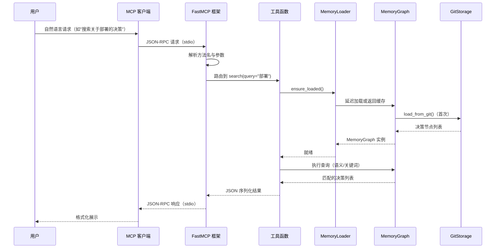
```mermaid
sequenceDiagram
    participant User as 用户
    participant Client as MCP 客户端
    participant FastMCP as FastMCP 框架
    participant Tool as 工具函数
    participant Loader as MemoryLoader
    participant Graph as MemoryGraph
    participant Storage as GitStorage

    User->>Client: 自然语言请求（如"搜索关于部署的决策"）
    Client->>FastMCP: JSON-RPC 请求（stdio）
    FastMCP->>FastMCP: 解析方法名与参数
    FastMCP->>Tool: 路由到 search(query="部署")
    Tool->>Loader: ensure_loaded()
    Loader->>Graph: 延迟加载或返回缓存
    Graph->>Storage: load_from_git()（首次）
    Storage-->>Graph: 决策节点列表
    Graph-->>Loader: MemoryGraph 实例
    Loader-->>Tool: 就绪
    Tool->>Graph: 执行查询（语义/关键词）
    Graph-->>Tool: 匹配的决策列表
    Tool-->>FastMCP: JSON 序列化结果
    FastMCP-->>Client: JSON-RPC 响应（stdio）
    Client-->>User: 格式化展示
```

### 工具分类

系统共暴露 **34 个工具**，按功能划分为四大类别。所有工具均通过 FastMCP 框架的 `@mcp.tool()` 装饰器注册，自动获得 JSON-RPC 协议兼容性、参数校验和错误响应处理。

#### 1. 查询工具

查询工具提供对决策记忆的只读访问，涵盖列表浏览、议题筛选、全文搜索、关系网络和热度分析等场景。共 **12 个工具**。

| 工具名称 | 功能描述 |
|---------|---------|
| `list_decisions` | 列出所有存储的决策，按创建时间倒序排列 |
| `topic` | 按议题 ID 查询决策列表，不传参则返回全部 |
| `search` | 语义搜索（Embedding + Reranker），自动降级为关键词 |
| `decision` | 通过 SDR ID 获取单个决策的完整详情 |
| `timeline` | 获取所有决策的时间线视图 |
| `list_topics` | 列出系统中的所有议题分类 |
| `get_relations` | 获取指定决策的关系网络（关联 + 关系类型） |
| `stats` | 系统统计：决策总数、议题数、状态分布、影响等级分布 |
| `hot_decisions` | 按热度值排序的热点决策排名 |
| `forgotten_decisions` | 热度值低的"被遗忘"决策 |
| `related_decisions` | 获取与指定决策相关的其他决策 |
| `fulltext_search` | 基于关键词匹配的全文搜索 |

**关键实现细节**：
- `search` 工具实现了完整的双阶段语义检索（见下文的"语义搜索与降级逻辑"），当嵌入模型或重排序服务不可用时，自动降级为 `MemoryGraph.search_by_keywords()` 关键词搜索。
- `hot_decisions` 和 `forgotten_decisions` 在每次调用时先通过 `recalculate_hot_score()` 重新计算热度值，确保排名的实时性。
- 所有列表类工具均支持 `top_k` 参数限制返回数量，默认值为 50。

#### 2. 写入与变更工具

写入工具负责决策的创建、更新、状态变更、回滚和冲突解决。每次写入操作同时更新内存索引和 Git 持久化存储。共 **7 个工具**。

| 工具名称 | 功能描述 |
|---------|---------|
| `create_decision` | 创建新决策，生成 SDR ID 并写入 Git |
| `update_decision` | 更新已有决策的内容、状态或影响等级 |
| `confirm_decision` | 批准决策，将状态设为 `decided` |
| `reject_decision` | 拒绝决策，将状态设为 `rejected`，可附带理由 |
| `revert_decision` | 回滚决策到指定 Git 提交版本 |
| `resolve_conflict` | 标记两个决策之间的冲突已解决 |
| `resolve_conflict_action` | 获取解决冲突的建议操作方案 |

**关键实现细节**：
- 每次写入操作都会调用 `_loader.storage.write_decision()` 持久化到 Git 仓库，同时更新 `_loader.decisions` 列表保持内存一致性。
- `revert_decision` 通过 `GitStorage.read_decision_at_commit()` 读取历史版本数据，利用 `MemoryGraph._dict_to_node()` 重建节点后覆盖当前版本。
- 所有变更工具均返回操作后的 SDR ID、摘要和提交哈希，便于客户端追踪。

#### 3. LLM 辅助工具

LLM 辅助工具利用大语言模型进行语义层面的分析，包括决策提取、议题归类、冲突检测和跨议题影响分析。共 **7 个工具**。

| 工具名称 | 功能描述 |
|---------|---------|
| `evaluate_dedup` | 评估两个决策是否重复或冲突 |
| `extract_decision` | 从自由文本中提取决策信息（标题、影响等级、议题） |
| `classify_topic` | 将决策重新归类到指定议题 |
| `detect_crosstopic` | 检测决策对其他议题的跨议题影响 |
| `check_conflict` | 检查新决策内容与现有决策间的潜在冲突 |
| `extract_and_create` | 从文本提取决策信息并自动创建决策记录 |
| `resolve_conflict_action` | 获取冲突解决的智能建议方案 |

**关键实现细节**：
- `extract_decision` 和 `extract_and_create` 直接初始化 `LLMProvider` 和 `SimpleLLMExtractor`，不依赖 `_mcp_llm_client` 全局实例。当 `API_KEY` 未配置时返回明确错误提示。
- `check_conflict` 构造一个临时 `DecisionNode` 并调用 `MemoryGraph.detect_conflicts()` 进行语义层面的矛盾检测。
- `detect_crosstopic` 利用 `MemoryGraph.query_cross_topic()` 在内存图中搜索其他议题中与该决策相关的节点。

#### 4. Git 与系统工具

Git 工具提供版本控制层面的数据追溯能力；系统工具管理服务器的运行时状态。共 **8 个工具**。

| 工具名称 | 功能描述 |
|---------|---------|
| `git_history` | 获取 Git 提交历史记录 |
| `git_search` | 在 Git 历史中搜索决策内容 |
| `git_blame` | 追溯决策文件的每行最后修改人 |
| `conflict_list` | 列出所有已记录的决策冲突关系 |
| `objection_list` | 列出指定议题下的异议（反对意见） |
| `decision_card` | 获取决策的飞书卡片格式 JSON |
| `decision_history` | 获取决策的版本变更历史 |
| `refresh` | 从 Git 存储重新加载所有决策到内存 |

**关键实现细节**：
- `git_blame` 和 `decision_history` 需要同时提供 SDR ID 和议题 ID 以定位 Git 中的决策文件。
- `conflict_list` 遍历所有决策的关系列表，筛选出类型为 `CONFLICTS_WITH` 的关系并构造冲突对。
- `refresh` 调用 `MemoryLoader.reload()` 将 `_loaded` 标志置为 `False`，下次访问时自动重新加载。
- `decision_card` 返回结构化字典，可直接用于飞书消息卡片渲染。


# MCP Server Deployment

## MCP 服务器部署

### 部署概览

MCP 服务器以单进程 Python 应用的形式运行，通过标准输入输出（stdio）与 MCP 客户端建立双向通信信道。它不依赖 HTTP 服务端口，无需反向代理或负载均衡，部署形态极轻——本质是一个长时间运行的 CLI 进程，由 MCP 客户端（如 OpenClaw、Claude Desktop）作为子进程管理其生命周期。

#### 数据流与系统集成

MCP 服务器在系统架构中扮演**数据访问层网关**的角色，位于 MCP 客户端与底层存储引擎之间。其数据流分为两条路径：

- **读取路径**：客户端请求 → FastMCP 解析 → 工具函数 → MemoryGraph 内存索引 → 返回 JSON 结果。MemoryGraph 在启动时从 GitStorage 全量加载决策数据到内存，后续读取完全在内存中完成，延迟在毫秒级。
- **写入路径**：客户端请求 → 工具函数 → MemoryGraph 更新内存索引 → GitStorage 写入 Git 仓库 → 可选触发 BaseViewSyncer 同步到飞书多维表格。每次写入产生一个 Git 提交，形成完整的版本历史。

此外，LLM 辅助工具通过 `LLMClient` 或 `LLMProvider` 调用外部大语言模型 API，这些调用独立于主数据流。

#### 系统组件关联

核心组件之间的依赖关系采用**组合模式**设计：`MemoryLoader` 作为外观（Facade），统一管理 `MemoryGraph`、`GitStorage` 和 `BaseViewSyncer` 的生命周期；`EmbeddingProvider` 和 `RerankerProvider` 作为策略组件注入到语义搜索流程中。

**MCP 工具到代码实体的映射**

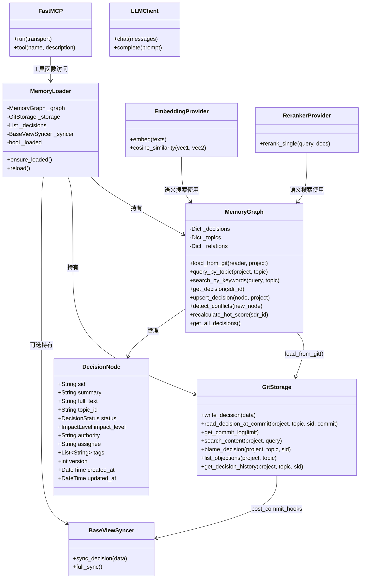
```mermaid
classDiagram
    class FastMCP {
        +run(transport)
        +tool(name, description)
    }
    class MemoryLoader {
        -MemoryGraph _graph
        -GitStorage _storage
        -List _decisions
        -BaseViewSyncer _syncer
        -bool _loaded
        +ensure_loaded()
        +reload()
    }
    class MemoryGraph {
        -Dict _decisions
        -Dict _topics
        -Dict _relations
        +load_from_git(reader, project)
        +query_by_topic(project, topic)
        +search_by_keywords(query, topic)
        +get_decision(sdr_id)
        +upsert_decision(node, project)
        +detect_conflicts(new_node)
        +recalculate_hot_score(sdr_id)
        +get_all_decisions()
    }
    class GitStorage {
        +write_decision(data)
        +read_decision_at_commit(project, topic, sid, commit)
        +get_commit_log(limit)
        +search_content(project, query)
        +blame_decision(project, topic, sid)
        +list_objections(project, topic)
        +get_decision_history(project, topic, sid)
    }
    class LLMClient {
        +chat(messages)
        +complete(prompt)
    }
    class EmbeddingProvider {
        +embed(texts)
        +cosine_similarity(vec1, vec2)
    }
    class RerankerProvider {
        +rerank_single(query, docs)
    }
    class BaseViewSyncer {
        +sync_decision(data)
        +full_sync()
    }
    class DecisionNode {
        +String sid
        +String summary
        +String full_text
        +String topic_id
        +DecisionStatus status
        +ImpactLevel impact_level
        +String authority
        +String assignee
        +List~String~ tags
        +int version
        +DateTime created_at
        +DateTime updated_at
    }

    FastMCP --> MemoryLoader : 工具函数访问
    MemoryLoader --> MemoryGraph : 持有
    MemoryLoader --> GitStorage : 持有
    MemoryLoader --> BaseViewSyncer : 可选持有
    MemoryGraph --> GitStorage : load_from_git()
    MemoryGraph --> DecisionNode : 管理
    EmbeddingProvider --> MemoryGraph : 语义搜索使用
    RerankerProvider --> MemoryGraph : 语义搜索使用
    GitStorage --> BaseViewSyncer : post_commit_hooks
```

#### 环境依赖与启动方式

**必须环境变量**：

| 变量名 | 用途 |
|-------|------|
| `MODEL_NAME` | LLM 模型名称（如 `deepseek-chat`） |
| `BASE_URL` | LLM API 的基础地址 |
| `API_KEY` | LLM API 的认证密钥 |
| `STORAGE_PATH` | Git 工作目录路径，用于存储决策文件 |

**可选环境变量**：

| 变量名 | 用途 |
|-------|------|
| `EMBEDDING_BASE_URL` | 嵌入模型服务地址，不配置则影响语义搜索功能 |
| `RERANKER_BASE_URL` | 重排序模型服务地址，不配置则影响语义搜索排序质量 |
| `BITABLE_ENABLED` | 是否启用飞书多维表格同步，默认不启用 |
| `BITABLE_APP_TOKEN` | 飞书多维表格的 App Token（启用同步时必须） |

**启动命令**：

```bash
uv run python scripts/mcp_server.py
```

**MCP 客户端配置（mcp.json）**：

```json
{
  "feishu-mem": {
    "command": "uv",
    "args": ["run", "python", "scripts/mcp_server.py"],
    "cwd": "/path/to/feishu-mem"
  }
}
```

### 实现细节

#### 服务器生命周期与内存加载

MCP 服务器的生命周期可分为三个阶段：

1. **初始化阶段**：`scripts/mcp_server.py` 作为入口，将项目根目录加入 Python 路径、加载 `.env` 环境变量、导入 `run_server` 函数并调用 `mcp.run(transport="stdio")`。FastMCP 框架在此阶段完成工具注册和协议初始化。
2. **延迟加载阶段**：首次工具调用触发 `MemoryLoader.ensure_loaded()`，执行全量数据加载。这是一种**懒加载**策略——服务器启动时不做任何 IO 密集型操作，避免冷启动延迟。
3. **运行阶段**：持续监听 stdio 通道，处理 JSON-RPC 请求。支持通过 `refresh` 工具触发热重载。

**内存初始化时序**

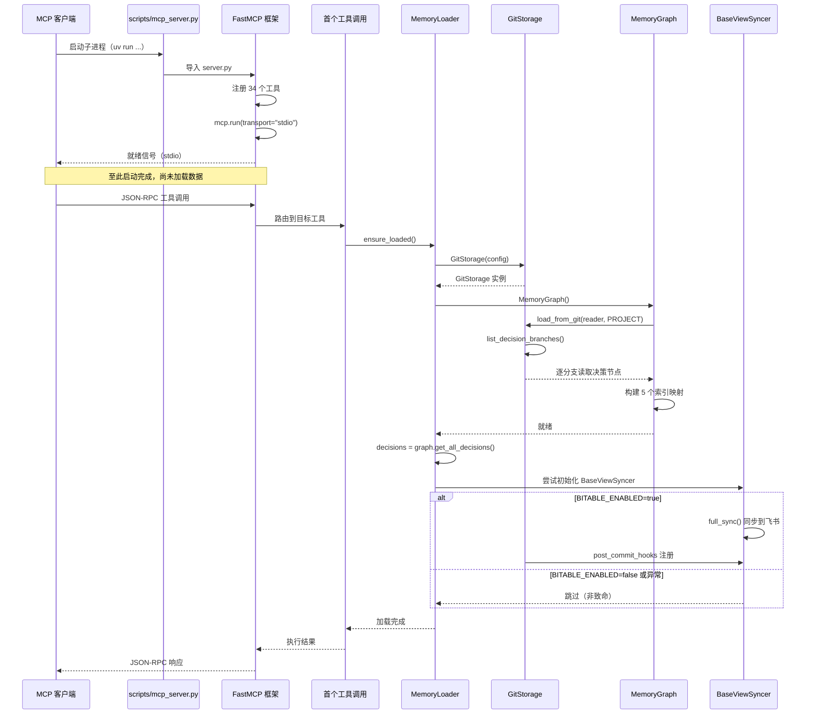
```mermaid
sequenceDiagram
    participant Client as MCP 客户端
    participant Entry as scripts/mcp_server.py
    participant FastMCP as FastMCP 框架
    participant Tool as 首个工具调用
    participant Loader as MemoryLoader
    participant Storage as GitStorage
    participant Graph as MemoryGraph
    participant Syncer as BaseViewSyncer

    Client->>Entry: 启动子进程（uv run ...）
    Entry->>FastMCP: 导入 server.py
    FastMCP->>FastMCP: 注册 34 个工具
    FastMCP->>FastMCP: mcp.run(transport="stdio")
    FastMCP-->>Client: 就绪信号（stdio）
    Note over FastMCP,Client: 至此启动完成，尚未加载数据

    Client->>FastMCP: JSON-RPC 工具调用
    FastMCP->>Tool: 路由到目标工具
    Tool->>Loader: ensure_loaded()

    Loader->>Storage: GitStorage(config)
    Storage-->>Loader: GitStorage 实例
    Loader->>Graph: MemoryGraph()
    Graph->>Storage: load_from_git(reader, PROJECT)
    Storage->>Storage: list_decision_branches()
    Storage-->>Graph: 逐分支读取决策节点
    Graph->>Graph: 构建 5 个索引映射
    Graph-->>Loader: 就绪
    Loader->>Loader: decisions = graph.get_all_decisions()
    Loader->>Syncer: 尝试初始化 BaseViewSyncer
    alt BITABLE_ENABLED=true
        Syncer->>Syncer: full_sync() 同步到飞书
        Storage->>Syncer: post_commit_hooks 注册
    else BITABLE_ENABLED=false 或异常
        Syncer-->>Loader: 跳过（非致命）
    end
    Loader-->>Tool: 加载完成
    Tool-->>FastMCP: 执行结果
    FastMCP-->>Client: JSON-RPC 响应
```

#### 语义搜索与降级逻辑

`search` 工具实现了业界通用的**双阶段检索**（Two-Stage Retrieval）架构，在精度和鲁棒性之间取得平衡。整体流程如下：

**第一阶段 — 向量召回（Embedding）**：

1. 初始化 `EmbeddingProvider`，对所有候选决策文本（`full_text` 或 `summary`）批量计算嵌入向量。
2. 对用户查询同样计算嵌入向量。
3. 使用余弦相似度计算查询向量与每个文档向量的相似度得分。
4. 取 Top-K×2 的候选结果进入下一阶段（K 为用户指定的 `top_k`，乘以 2 提供重排序的冗余窗口）。

**第二阶段 — 重排序（Reranker）**：

1. 初始化 `RerankerProvider`，将查询与第一阶段候选文档逐对输入交叉编码器。
2. 重排序模型计算每个候选的精确相关性得分。
3. 将嵌入得分与重排序得分融合，按重排序得分降序排列。

```python
## 语义搜索核心逻辑示意
query_vec = np.array(embedder.embed([query])[0])
doc_vectors = np.array(embedder.embed(texts))
scores = embedder.cosine_similarity(query_vec, doc_vectors)

top_indices = np.argsort(scores)[::-1][:top_k * 2]
scored = [(candidates[i], float(scores[i])) for i in top_indices]
docs = [d.full_text or d.summary for d, _ in scored]
rerank_scores = reranker.rerank_single(query, docs)

combined = sorted(
    [(_node_to_dict(n), es, float(rerank_scores[i]))
     for i, (n, es) in enumerate(scored)],
    key=lambda x: x[2], reverse=True,
)[:top_k]
```

**降级逻辑**：

当 Embedding 或 Reranker 服务不可用时（例如 API 地址未配置、网络异常、服务端返回错误），`search` 工具捕获所有异常并降级为纯关键词搜索：

```python
try:
    # 双阶段语义检索 ...
except Exception:
    logger.info("[search] Model unavailable, fallback to keyword")
    kw = graph.search_by_keywords(query, topic)
    results = [_node_to_dict(d) for d in kw[:top_k]]
```

`search_by_keywords` 在 `MemoryGraph` 内部实现，对决策的 `summary`、`full_text` 和 `tags` 字段进行大小写不敏感的子串匹配，按匹配字段优先级（标题 > 正文 > 标签）排序。降级模式下，返回结果会附加 `method: "keyword"` 标记，便于客户端区分检索方式。

**架构权衡**：

- 双阶段检索相比单次嵌入检索，多一次网络调用和交叉编码计算，但显著提升了搜索结果的相关性排序质量。
- 降级到关键词搜索虽损失语义理解能力，但保证了服务的**基本可用性**——即便 LLM 基础设施完全不可用，用户仍能通过精确匹配找到决策记录。
- 整个检索过程的超时和异常处理由调用方（工具函数）统一管理，`EmbeddingProvider` 和 `RerankerProvider` 自身不实现重试逻辑，保持关注点分离。


# PushEngine & Scheduling

### 推送触发器与事件类型

PushEngine 是整个系统的通知中枢，负责将决策创建、冲突、更新和周期性摘要以卡片或文本形式推送到用户可感知的渠道。推送动作由七种事件类型触发：

| 触发器 | 枚举值 | 触发场景 |
|--------|--------|----------|
| `CREATE` | `"create"` | 新决策被提取并持久化后立即触发 |
| `CONFLICT` | `"conflict"` | 检测到语义冲突时推送对比卡片 |
| `DECISION_UPDATE` | `"decision_update"` | 决策内容或状态被更新时触发 |
| `HOT_SCORE_LOW` | `"hot_score_low"` | 热点扫描发现低热点决策时提醒 |
| `SCHEDULED_DAILY` | `"scheduled_daily"` | 每日定时推送决策摘要 |
| `SCHEDULED_WEEKLY` | `"scheduled_weekly"` | 每周定时推送周度摘要 |
| `MANUAL_QUERY` | `"manual_query"` | 用户通过 MCP 工具主动查询 |

每个触发器可通过环境变量独立启用/禁用，配置项定义在 `CardConfig` 中：

```
PUSH_TRIGGER_CREATE=true
PUSH_TRIGGER_CONFLICT=true
PUSH_TRIGGER_UPDATE=true
PUSH_TRIGGER_HOT_SCORE=true
```

### 系统架构：推送与调度

#### 推送逻辑流程

每个推送请求经过统一的数据流管道：从 MemoryGraph 读取决策节点 → 调用 CardRenderer 生成卡片 JSON → 经过 `_dispatch()` 方法按配置分发到已启用的渠道。

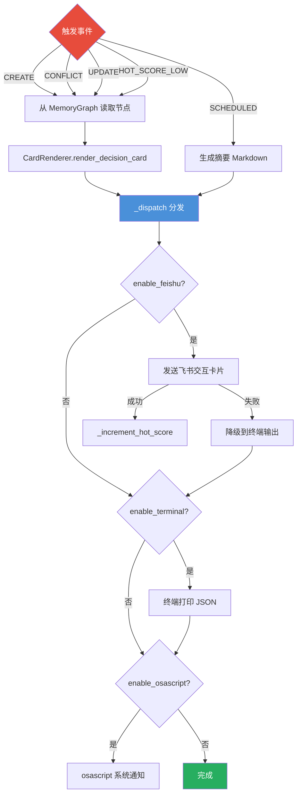
```mermaid
flowchart TD
    TRIGGER{触发事件}
    TRIGGER -->|CREATE| READ[从 MemoryGraph 读取节点]
    TRIGGER -->|CONFLICT| READ
    TRIGGER -->|UPDATE| READ
    TRIGGER -->|HOT_SCORE_LOW| READ
    TRIGGER -->|SCHEDULED| GEN_SUMMARY[生成摘要 Markdown]
    
    READ --> RENDER[CardRenderer.render_decision_card]
    RENDER --> DISPATCH[_dispatch 分发]
    GEN_SUMMARY --> DISPATCH
    
    DISPATCH --> CHK_FEISHU{enable_feishu?}
    CHK_FEISHU -->|是| SEND_FEISHU[发送飞书交互卡片]
    CHK_FEISHU -->|否| CHK_TERMINAL{enable_terminal?}
    
    SEND_FEISHU -->|失败| DEGRADE[降级到终端输出]
    SEND_FEISHU -->|成功| INCR_HOT[_increment_hot_score]
    DEGRADE --> CHK_TERMINAL
    
    CHK_TERMINAL -->|是| PRINT_TERM[终端打印 JSON]
    CHK_TERMINAL -->|否| CHK_OSA{enable_osascript?}
    PRINT_TERM --> CHK_OSA
    CHK_OSA -->|是| OSA_CMD[osascript 系统通知]
    CHK_OSA -->|否| DONE[完成]
    
    style TRIGGER fill:#E74C3C,color:#fff
    style DISPATCH fill:#4A90D9,color:#fff
    style DONE fill:#27AE60,color:#fff
```

### 热点值系统

热点值（Hot Score）是 PushEngine 用于量化决策"受关注程度"的核心指标，取值范围 0~100。系统通过热点值实现两个目标：优先推送高价值决策，以及主动提醒被遗忘的决策。

#### 衰减与递增

热点值的变化遵循两个方向的操作：

**递增**（每次推送时触发）：
```
hot_score = min(100.0, hot_score + 10.0)
```
每次成功推送决策卡片后调用 `_increment_hot_score()`，将热点值增加固定增量（默认 10.0），上限 100。

**衰减**（定时扫描循环触发）：
```
hot_score = max(0.0, hot_score * 0.95)
```
`_hot_score_scan_loop` 每 `hot_score_scan_interval`（默认 600s = 10 分钟）扫描一次所有决策，调用 `_decay_all_hot_scores()` 统一执行指数衰减，衰减系数 0.95。

热点值对应四个热度分类：

| 分类 | 阈值 | 说明 | 行为 |
|------|------|------|------|
| ACTIVE | >= 80 | 高频关注的活跃决策 | 卡片显示高亮标记 |
| NORMAL | >= 50 | 正常关注的决策 | 普通展示 |
| FUZZY | >= 20 | 关注度较低的模糊决策 | 触发热点扫描提醒 |
| FORGOTTEN | < 20 | 被遗忘的决策 | 推送遗忘提醒通知 |

当热点值低于 `hot_score_low_threshold`（默认 20.0）时，`push_low_hot_score_decisions()` 会向用户推送遗忘决策提醒，帮助用户回顾被冷落的重要决定。

### 多通道分派

#### 通道实现细节

PushEngine 支持三个推送渠道，按优先级依次尝试：

**飞书交互卡片（Feishu Interactive Card）**：
- 使用 `MessageContent.interactive(card_json)` 构造飞书消息体
- 通过 `lark_client.send_message()` 发送到配置的群聊（`CARD_CHAT_IDS`）
- 接收者类型支持 `chat_id` / `open_id` / `user_id` 配置
- 发送失败时自动降级到终端输出，不阻断推送流程

**终端输出（Terminal）**：
- 使用 `print()` 以 JSON 或 Markdown 文本格式直接输出到标准输出
- 带有时间戳和触发类型的格式化头部标识
- 内容长度限制为 2000 字符
- 默认启用（`PUSH_TERMINAL_ENABLED=true`）

**macOS 系统通知（osascript）**：
- 调用 `osascript -e 'display notification'` 发送 macOS 原生通知
- 取 Markdown 首行作为通知标题（最多 50 字符）
- 通知正文限制为 150 字符
- 默认禁用（`PUSH_OSASCRIPT_ENABLED=false`）

#### 分派顺序

`_dispatch()` 方法按以下顺序依次尝试各渠道：

```
飞书卡片 → 终端输出 → macOS 通知
```

- 飞书失败时仍继续尝试后续渠道（fail-open 策略）
- 终端和 osascript 没有降级路径，直接执行
- 任一渠道成功即标记 `success = true`
- 所有渠道尝试完毕后返回整体成功状态

### 调度循环

PushEngine 在 `start_push_scheduler()` 被调用后启动三个后台定时任务：

**热点扫描循环**（`_hot_score_scan_loop`）：
- 以 `hot_score_scan_interval` 为间隔循环执行
- 每次扫描先执行全局热点值衰减（`_decay_all_hot_scores`）
- 然后检查是否存在热点值低于阈值的决策并推送提醒
- 由 `trigger_on_hot_score_threshold` 配置控制启停

**每日摘要**（`_scheduled_daily_task`）：
- 读取 `daily_summary_time` 配置（默认 `"08:00"`）
- 计算当前时间到下一个目标时间的延迟
- 到达时间后调用 `push_daily_summary()` 生成本日报告
- 报告内容包括：24 小时内新建的决策列表 + 热点值低于阈值的遗忘决策列表
- 使用 Markdown 格式输出，不是飞书卡片

**每周摘要**（`_scheduled_weekly_task`）：
- 读取 `weekly_summary_day`（默认 `"6"` = 周六）和 `weekly_summary_time`（默认 `"21:00"`）
- 计算到下一个周目标时间的延迟（当天已达则推后一周）
- 到达后调用与每日摘要相同的方法（`push_daily_summary()`）
- 内容与每日摘要相同，区别仅在于调度频率

定时调度的时间计算逻辑：
```python
## 每日调度
target = parse_time("08:00")
next_run = now.replace(hour=8, minute=0, second=0)
if next_run <= now:
    next_run += timedelta(days=1)
delay = (next_run - now).total_seconds()

## 每周调度
days_ahead = (target_day - now.weekday()) % 7
if days_ahead == 0 and now.time() >= target:
    days_ahead = 7
next_run = (now + timedelta(days=days_ahead)).replace(hour=21, minute=0, ...)
```

完整推送配置说明参见 Getting Started & Configuration。


# Card Renderer

### 核心实现

CardRenderer 是系统中负责将结构化决策数据转化为可视化卡片的渲染模块。它输出两种格式：飞书交互卡片 JSON（用于飞书消息推送）和 Markdown 文本（用于终端输出和 macOS 通知）。

核心渲染方法 `render_decision_card(node, hot_score)` 接收一个 `DecisionNode` 和当前热点值，返回符合飞书消息卡片协议的 JSON 字典。渲染器不依赖外部模板引擎，所有卡片结构通过 Python 字典字面量直接构建。

### 决策卡片布局

一张标准决策卡片包含以下层级结构：

```
┌─ header ─────────────────────────────────┐
│  📋 决策卡片 [sid_前8位]    (颜色模板)     │
├─ elements ───────────────────────────────┤
│  ├─ 状态行: ⏳ 状态: 待处理 | 📊 影响: minor │
│  ├─ 双列字段                            │
│  │  ├─ 📌 标题: <summary>                │
│  │  ├─ 🏷️ 议题: <topic_id>              │
│  │  ├─ 📋 提议者: <authority>            │
│  │  └─ 📅 创建: <created_at>             │
│  ├─ 正文区 (含 full_text 前 300 字符)     │
│  ├─ ───── 分隔线 ──────                  │
│  └─ 备注: 🔥 热点值: 85/100 (活跃)       │
└──────────────────────────────────────────┘
```

颜色模板根据决策状态动态映射：

| 状态 | 模板颜色 |
|------|----------|
| `decided` | 绿色 (green) |
| `in_progress` / `executing` | 蓝色 (blue) |
| `completed` | 绿色 (green) |
| `pending` | 黄色 (yellow) |
| `superseded` / `rejected` / `deprecated` / `shelved` | 红色 (red) |

#### 数据流：节点到卡片

```mermaid
flowchart TD
    INPUT[DecisionNode 实例] --> EXTRACT[提取核心字段]
    
    EXTRACT --> STATUS[status 值]
    EXTRACT --> IMPACT[impact_level 值]
    EXTRACT --> SUMMARY[title / summary]
    EXTRACT --> TOPIC[topic_id]
    EXTRACT --> AUTHOR[proposer / authority]
    EXTRACT --> TIME[created_at]
    EXTRACT --> FULL[full_text]
    
    STATUS --> MAP_TEMPLATE[映射颜色模板]
    STATUS --> MAP_EMOJI[映射状态 Emoji]
    STATUS --> MAP_LABEL[映射中文标签]
    IMPACT --> MAP_IMPACT_EMOJI[映射影响等级 Emoji]
    
    MAP_TEMPLATE --> BUILD_HEADER[构建 header 块]
    MAP_EMOJI --> BUILD_STATUS_LINE[构建状态行]
    MAP_LABEL --> BUILD_STATUS_LINE
    MAP_IMPACT_EMOJI --> BUILD_STATUS_LINE
    
    SUMMARY --> BUILD_FIELDS[构建双列字段]
    TOPIC --> BUILD_FIELDS
    AUTHOR --> BUILD_FIELDS
    TIME --> BUILD_FIELDS
    
    FULL --> BUILD_BODY[构建正文区]
    
    BUILD_HEADER --> ASSEMBLE[组装完整卡片 JSON]
    BUILD_STATUS_LINE --> ASSEMBLE
    BUILD_FIELDS --> ASSEMBLE
    BUILD_BODY --> ASSEMBLE
    
    HOT[hot_score 值] --> GET_CATEGORY[计算热度分类]
    GET_CATEGORY --> BUILD_NOTE[构建备注行]
    BUILD_NOTE --> ASSEMBLE
    
    ASSEMBLE --> OUTPUT[返回飞书卡片 JSON]
    
    style INPUT fill:#4A90D9,color:#fff
    style OUTPUT fill:#27AE60,color:#fff
    style ASSEMBLE fill:#F39C12,color:#fff
```

### 冲突卡片对比视图

当系统检测到两个决策存在语义冲突时，`render_conflict_card(node_a, node_b, reason)` 生成一张带有红色警告头部的对比卡片，结构如下：

- **警告头部**：红色模板 + "⚠️ 决策冲突需要确认" 标题
- **冲突描述**：检测到的冲突原因文本
- **决策 A 区块**：标题 + 影响等级 + 决策内容（前 200 字符）
- **分隔线**
- **决策 B 区块**：与 A 相同的结构
- **交互按钮**：两个 action 按钮——"✅ 保留 A" 和 "✅ 保留 B"
  - 每个按钮携带 `value` 数据 `{"action": "conflict_resolve", "winner_sdr": ..., "loser_sdr": ...}`
  - 飞书客户端点击后可通过 MCP 工具触发冲突解决
- **操作说明**：底部备注提示用户也可以使用 MCP resolve_conflict 工具

冲突卡片的按钮 value 设计使得飞书卡片交互可以与后端的 MCP 工具链连接：点击按钮后系统读取 value 中的 `winner_sdr` 和 `loser_sdr`，执行保留胜者、标记败者为 superseded 的原子操作。

### 摘要与定期格式

#### 每日摘要

`render_daily_summary_markdown(date, new_decisions, forgotten_decisions)` 生成纯文本格式的决策日报，结构为 Markdown 文档：

```
## 📋 决策日报 - 2025-06-15

### ✨ 新增决策 (N 个)
- **决策标题** [sid_前8位] - 🔥热度值

### 💤 遗忘决策提醒 (M 个)
- **决策标题** [sid_前8位] - 🔥热度值
```

- 新增决策列出最近 24 小时内创建的决策，最多展示 5 条
- 遗忘决策仅展示热点值低于阈值的决策，最多展示 3 条
- 所有决策按热度值降序排列

#### 配置集成

推送配置通过 `CardConfig.from_env()` 从环境变量加载，关键配置项包括：

| 环境变量 | 默认值 | 说明 |
|----------|--------|------|
| `PUSH_FEISHU_ENABLED` | `false` | 启用飞书推送 |
| `PUSH_TERMINAL_ENABLED` | `true` | 启用终端输出 |
| `PUSH_OSASCRIPT_ENABLED` | `false` | 启用 macOS 通知 |
| `CARD_CHAT_IDS` | `""` | 目标群聊 ID 列表（逗号分隔） |
| `PUSH_DAILY_SUMMARY` | `true` | 启用每日摘要 |
| `PUSH_DAILY_TIME` | `"08:00"` | 每日摘要推送时间 |
| `PUSH_WEEKLY_DAY` | `"6"` | 每周摘要推送日（0=周一, 6=周日） |
| `PUSH_WEEKLY_TIME` | `"21:00"` | 每周摘要推送时间 |

### 系统集成图

CardRenderer 在整个系统中处于"表达层"的位置，连接推理层（PipelineEngine、MemoryGraph）和通信层（PushEngine、飞书消息 API）。下图展示了渲染管道的完整架构：

```mermaid
flowchart TD
    subgraph DATA[数据层]
        G[MemoryGraph]
        N[DecisionNode]
        S[AccessStats / HotScore]
    end
    
    subgraph RENDER[渲染层]
        R[CardRenderer]
        RDC[render_decision_card]
        RCC[render_conflict_card]
        RDS[render_daily_summary_markdown]
    end
    
    subgraph FORMAT[输出格式]
        FJC[飞书卡片 JSON]
        FMD[Markdown 文本]
    end
    
    subgraph PUSH[推送层]
        PE[PushEngine]
        DISPATCH[_dispatch]
        CH1[飞书消息 API]
        CH2[终端 stdout]
        CH3[osascript]
    end
    
    subgraph TRIGGER[触发源]
        T1[CREATE / UPDATE]
        T2[CONFLICT 检测]
        T3[HOT_SCORE_LOW 扫描]
        T4[SCHEDULED_DAILY]
        T5[MANUAL_QUERY MCP]
    end
    
    G --> N
    N --> RDC
    S --> RDC
    N --> RCC
    S --> RDS
    
    RDC --> FJC
    RCC --> FJC
    RDS --> FMD
    
    FJC --> PE
    FMD --> PE
    
    PE --> DISPATCH
    DISPATCH --> CH1
    DISPATCH --> CH2
    DISPATCH --> CH3
    
    T1 --> PE
    T2 --> PE
    T3 --> PE
    T4 --> PE
    T5 --> PE
    
    style DATA fill:#E8F5E9,color:#333
    style RENDER fill:#FFF3E0,color:#333
    style FORMAT fill:#E3F2FD,color:#333
    style PUSH fill:#F3E5F5,color:#333
    style TRIGGER fill:#FFEBEE,color:#333
```

渲染链路中值得关注的架构决策：

1. **渲染与推送分离** — CardRenderer 只负责数据到卡片的转换，不关心卡片如何发送；PushEngine 负责调度和通道管理，不关心卡片的具体结构。这种关注点分离使得任何一个模块可以独立替换或扩展。

2. **统一的数据源** — 所有卡片渲染都从 MemoryGraph 读取决策节点数据，保证卡片内容的准确性和一致性。PushEngine 不缓存决策数据。

3. **飞书卡片协议耦合** — CardRenderer 输出的 JSON 结构与飞书消息卡片协议（Lark Interactive Card Protocol）紧密绑定。如需支持其他即时通讯平台的消息格式，需扩展渲染器。

4. **降级友好的格式设计** — 单条决策同时生成卡片 JSON（飞书）和 Markdown（终端/osascript），确保飞书不可用时推送不中断。

推送引擎的详细调度逻辑参见 PushEngine & Scheduling。


# Evaluator & Scenarios

## 评估框架与场景

### 评估框架概览

项目提供两套互补的评估模式，分别从不同维度衡量决策提取系统的效果：

- **EvalRunner（实时流模拟评估）**：从 `eval_data/test_data.txt` 读取消息序列，模拟真实的群聊消息流，逐条送入引擎处理并统计决策提取结果。适用于评估端到端的系统行为，包括决策创建、更新、跳过以及 Episode 生命周期管理。
- **ExtractionEvaluator（结构化 QA 评估）**：使用 `eval_data/decision_extraction/` 下的人工标注数据集，通过多轮选择题的形式逐维度评估 LLM 的决策提取能力。适用于精细化评估模型在检测、内容、提议者、执行者等维度上的准确率。

两种模式定位不同：EvalRunner 侧重模拟真实场景中的系统行为完整性，ExtractionEvaluator 侧重结构化、可量化的维度级准确性评测。

---

### EvalRunner 实时流模拟

#### 执行流程

EvalRunner 的执行过程可以分为以下几个阶段：

```mermaid
flowchart TD
    A[加载 test_data.txt] --> B[初始化 MemoryEngine]
    B --> C[加载 SuspendPool]
    C --> D[初始化 ChatEpisodeManager]
    D --> E[逐条处理消息]
    E --> F{消息处理循环}
    F --> G[分配群聊 round-robin]
    G --> H[送入 EpisodeBuffer]
    H --> I[检测 SuspendPool 变化]
    I --> J[送入引擎提取决策]
    J --> K[彩色终端输出状态]
    K --> L[等待可配延迟]
    L --> M{还有下一条?}
    M -->|是| F
    M -->|否| N[等待异步任务完成]
    N --> O[关闭所有 Buffer]
    O --> P[停止引擎]
    P --> Q[打印统计报告]
```

#### 数据来源

测试数据位于 `eval_data/test_data.txt`，包含约 **250 条**非空消息（来源为 strip 后的纯文本行）。消息内容覆盖多个技术话题，各话题交织排列以模拟真实群聊的多线讨论特征：

- **数据库选型**：PostgreSQL 与 MySQL 的对比讨论，涉及连接池、迁移工具、备份策略、读写分离等
- **前端技术**：React、Vue.js 的选择，状态管理、构建工具、CDN 缓存等
- **容器化方案**：Kubernetes 集群、监控（Prometheus/Grafana）、网络插件（Calico）、安全策略等
- **消息队列**：Kafka、RabbitMQ 的选型讨论
- **监控告警**：业务指标采集（OpenTelemetry）、告警规则设计、日志收集等

`eval_data/user_only_messages.py` 提供了另一种消息构造方式，以单用户视角生成包含明确场景标签和决策类型标注的结构化消息（约 400 条），可用于更精细的模拟测试。

#### 核心参数

| 参数 | 默认值 | 说明 |
|------|--------|------|
| `--input` | `eval_data/test_data.txt` | 输入文件路径，支持 .txt 和 .json 格式 |
| `--delay` | `1.0` | 消息间模拟延迟（秒），控制处理节奏 |
| `--max-messages` | `0` | 最大处理消息数，0 表示全部处理 |
| `--group-num` | `1` | 群聊数量，大于 1 时启用 round-robin 分配 |

#### 群聊模拟机制

当 `--group-num N`（N > 1）时，消息按轮询方式分配到 `eval_0`、`eval_1`、…、`eval_{N-1}` 等多个群聊。每个群聊拥有独立的 EpisodeBuffer 和 SuspendPool 上下文，可模拟多群并行讨论的场景。统计报告会分别输出每群的消息分布和 Buffer 状态。

#### 评估指标

EvalRunner 在报告阶段输出以下指标：

- **总消息数**：处理的消息总量
- **决策提取数**：引擎返回的检测结果总数
- **决策创建/更新/跳过数**：按操作类型区分的决策变更计数
- **Episode 挂起/重新打开数**：SuspendPool 中 Episode 的挂起与恢复频次
- **群聊消息分布**：各群聊的消息量及可视化条图
- **每群 Buffer 状态**：各群聊当前 Episode 的 ID 和消息数
- **LLM 调用统计**：调用次数、Token 消耗（输入/输出）、耗时统计

#### 彩色终端输出

运行过程中，终端使用不同颜色标识不同状态：

- **青色（cyan）**：Episode 重新打开（reopen）
- **黄色（yellow）**：Episode 挂起（suspend）
- **绿色（green）**：新决策创建（new）
- **品红（magenta）**：决策相关状态（decision）
- **灰色（gray）**：跳过或错误（skip）

---

### 精度评估：Embedding 语义匹配

#### 概述

在 EvalRunner 基础上，系统新增了**精度评估（Precision/Recall/F1）**能力：通过 `--expected` 参数传入人工标注的期望决策（JSONL 格式），在全部消息处理完成后，使用 Embedding 语义相似度将实际提取的决策与期望决策进行自动匹配，计算 Precision、Recall、F1 指标。

```mermaid
flowchart TD
    A[加载 expected.jsonl] --> B[处理消息 → 提取实际决策]
    B --> C[Embedding Batch: 所有摘要]
    C --> D[构建余弦相似度矩阵]
    D --> E[贪心匹配: 每期望找最佳]
    E --> F[TP / FP / FN 统计]
    F --> G[Precision / Recall / F1]
```

#### 匹配算法

匹配过程在 `src/eval/comparator.py` 中实现，核心步骤：

1. **Embedding 向量化**：调用 qwen3-embedding-4b 将所有期望摘要和实际摘要一次性 batch embed（去重后），得到 2560 维向量
2. **余弦相似度矩阵**：计算 `matrix[i][j] = cosine(exp[i], act[j])`，形状 `(n_expected, n_actual)`
3. **约束过滤**：`chat_id` 必须匹配（多群隔离）、`topic` 必须匹配（实际 topic="general" 时跳过话题约束）
4. **类型阈值**：suggestion 同类型匹配阈值 0.3，跨类型匹配阈值 0.45
5. **贪心匹配**：遍历每个期望，取未被匹配且相似度最高的实际决策作为 TP

如果 embedding 不可用，自动回退到字符重叠率相似度。

#### 数据集格式

`eval_dataset/<dataset_name>/expected.jsonl` 每行一个期望决策：

```json
{
  "msg_id": "m042",
  "chat_id": "chat_0",
  "expected_topic": "多智能体循环架构",
  "expected_summary": "采用四Agent架构（Main+Reviewer+Planner+Stall）",
  "is_suggestion": false,
  "status": "decided",
  "impact_level": "major"
}
```

#### 最新测试结果（2026-06-05）

| 数据集 | 消息数 | 期望决策 | 实际提取 | P | R | F1 | Decision R | Suggestion R |
|--------|--------|----------|----------|------|------|------|-----------|-------------|
| argusbot_single | 200 | 39 | 49 | **79.6%** | **100.0%** | **88.6%** | 100.0% | 100.0% |
| argusbot_multi | 320 | 69 | 54 | **96.3%** | **75.4%** | **84.5%** | 93.1% | 62.5% |

- **single**：所有 39 个期望决策全部匹配（FN=0），FP=10 来自非技术决策（聚餐、团建等）
- **multi**：8 个群聊跨群隔离 100%，Precision 96.3%（仅 2 FP），Recall 75.4% 受限于 LLM 提取环节的 recall 不足
- **跨群隔离**：两个数据集均为 100.0%，不同群的决策从未互相混淆

#### 运行精度评估

```bash
# 单群评估
python -m src.eval_runner --eval --input eval_dataset/argusbot_single/messages.jsonl \
  --expected eval_dataset/argusbot_single/expected.jsonl --delay 0.3

# 多群评估
python -m src.eval_runner --eval --input eval_dataset/argusbot_multi/messages.jsonl \
  --expected eval_dataset/argusbot_multi/expected.jsonl --delay 0.3 --group-num 8
```

报告输出到 `eval_dataset/<dataset_name>/eval_report.json`。

#### Embedding Provider 修复

在实现 embedding 语义匹配时，发现并修复了 `src/model/embedding_provider.py` 中的模型名大小写检查 bug：

```python
# 修复前（模型名为小写时永远报错）
if 'Qwen3' not in self.model_name:
    raise ValueError(...)

# 修复后
if 'qwen3' not in self.model_name.lower():
    raise ValueError(...)
```

同时修复了 `resume()` 方法中 `_baseline_size` 缺失导致的 AttributeError。

---

### ExtractionEvaluator 结构化 QA 评估

#### 数据集概述

数据集位于 `eval_data/decision_extraction/` 目录，配置文件 `config.yaml` 定义了数据集的元信息：

```yaml
name: "decision-extraction-eval"
description: "HyperMem DecisionExtractor decision extraction correctness evaluation dataset"
version: "1.0"
total_scenarios: 12
total_samples: 170
dimensions:
  - detection
  - content
  - proposer
  - executor
  - impact_level
  - status
  - conflict
```

总计 **12 个场景、170 个样本**，每个样本包含一段对话（dialogue.json）和一组对应的选择题（qa.json）。

#### 评估流程

```mermaid
flowchart TD
    A[加载场景列表] --> B[遍历场景]
    B --> C[加载 dialogue.json]
    C --> D[加载 qa.json]
    D --> E[提取所有对话段落]
    E --> F[遍历 QA 分组]
    F --> G[构造 prompt: 对话 + 问题 + 选项]
    G --> H[调用 LLM]
    H --> I[标准化答案]
    I --> J{与标准答案比对}
    J --> K[按维度记录正确/错误]
    K --> L[可选: 写入 GitStorage 验证]
    L --> M{本场景完成?}
    M -->|否| F
    M -->|是| N[计算场景维度准确率]
    N --> O{所有场景完成?}
    O -->|否| B
    O -->|是| P[汇总整体报告]
    P --> Q[输出总体准确率 + 各维度准确率]
```

#### Prompt 构造策略

每个 QA 题目由以下部分组成：

1. **对话内容**：从 dialogue.json 中提取对应段落的发言记录
2. **问题**：qa.json 中的 `Q` 字段
3. **选项**：qa.json 中的 `options` 字段，格式化为 `A. xxx\nB. xxx\nC. xxx`
4. **维度引导**：根据不同维度附加规则提示，如 proposer 维度强调"第一个提出具体方案的人是提议者"，executor 维度强调"明确指派句式中的被指派人为执行者"

系统提示固定为："你是一个对话决策分析专家。根据对话内容做选择题，只输出选项字母（A/B/C/D），不要输出其他内容。"

LLM 配置：temperature=0.0（确定性输出）、max_tokens=10（仅需输出简短选项字母）。

#### 评估维度详解

| 维度 | 评测目标 | 评分标准 | 示例问题 |
|------|---------|---------|---------|
| `detection` | 检测对话中是否形成了决策 | 正确判断"有决策"或"无决策" | "以上对话中是否做出了决策？" |
| `content` | 识别决策的具体内容 | 正确选出决策对应的方案/参数 | "决策内容是什么？" |
| `proposer` | 识别决策的提议者 | 正确找出第一个提出具体方案的人 | "这个决策是谁提出的？" |
| `executor` | 识别决策的执行者 | 正确找出被指派或主动承担任务的人 | "这个决策由谁执行？" |
| `impact_level` | 判断决策的影响级别 | 正确区分 major / minor / advisory | "这个决策的影响级别是？" |
| `status` | 判断决策的当前状态 | 正确区分 decided / in_progress / completed / pending_confirmation / superseded | "这个决策的当前状态是？" |
| `conflict` | 检测决策是否存在前后矛盾 | 正确判断是否出现"确认后又反悔"模式 | "对话中的决策是否存在冲突？" |

#### 评估结果

`evaluate_extraction()` 函数返回每个场景的 `EvalResult`，包含：

- `scenario`：场景名称
- `dim_accuracies`：各维度的准确率字典
- `total` / `correct` / `accuracy`：该场景的整体统计
- `token_summary`：Token 消耗统计
- `storage_stored` / `storage_verified` / `storage_failed`：GitStorage 写入与验证计数

`run_extraction_eval()` 汇总所有场景结果，输出 `SummaryReport`，包含整体准确率、各维度跨场景综合准确率、总 Token 消耗等。

---

### 场景分类

数据集覆盖 12 个场景，每个场景包含特定类型的决策模式：

| 编号 | 场景名称 | 样本数 | 场景说明 |
|------|---------|--------|---------|
| 01 | 技术选型 | 20 | 数据库、框架、架构等技术方案的讨论与确定，包含明确的赞成和拍板 |
| 02 | 任务分配 | 15 | 指派人员或团队负责特定任务，含主动承担和指派两种模式 |
| 03 | 参数锁定 | 10 | 技术参数的最终确定，如超时时间、并发限制、副本数等 |
| 04 | 隐性共识 | 15 | 通过简短回应（"好""可以""👍"）达成的非显式共识决策 |
| 05 | 冲突决策 | 10 | 先确认一个方案后又推翻改用另一方案的前后矛盾场景 |
| 06 | 拒绝覆盖 | 10 | 推翻既有决策，改用全新方案的场景 |
| 07 | 纯讨论 | 20 | 仅有讨论没有结论的场景，用于检测假阳性 |
| 08 | 状态更新 | 15 | 仅报告进度或状态变更，不构成新决策的场景 |
| 09 | 仅建议 | 15 | 提出建议但未得到确认或落地的场景 |
| 10 | 闲聊 | 10 | 与工作无关的日常对话，不应被检测为决策 |
| 11 | 混合场景 | 20 | 单轮对话中包含多个议题，部分有决策部分无决策的复杂场景 |
| 12 | 边界情况 | 10 | 模糊表达、条件性决策、单句回复等边界案例 |

---

### 数据目录结构

```
eval_data/
├── test_data.txt                    # 实时流模拟测试数据（~250条交叠话题消息）
├── user_only_messages.py            # 单用户消息生成脚本（含场景标签和决策类型标注）
└── decision_extraction/             # 结构化QA评估数据集
    ├── config.yaml                  # 数据集配置（12场景、170样本、7个评估维度）
    ├── generate.py                  # 数据生成脚本（种子42的随机生成）
    ├── 01-technical-selection/      # 技术选型
    │   ├── dialogue.json
    │   └── qa.json
    ├── 02-task-assignment/          # 任务分配
    │   ├── dialogue.json
    │   └── qa.json
    ├── 03-parameter-lock/           # 参数锁定
    │   ├── dialogue.json
    │   └── qa.json
    ├── 04-implicit-consensus/       # 隐性共识
    │   ├── dialogue.json
    │   └── qa.json
    ├── 05-conflict-decisions/       # 冲突决策
    │   ├── dialogue.json
    │   └── qa.json
    ├── 06-rejection-override/       # 拒绝覆盖
    │   ├── dialogue.json
    │   └── qa.json
    ├── 07-pure-discussion/          # 纯讨论
    │   ├── dialogue.json
    │   └── qa.json
    ├── 08-status-update/            # 状态更新
    │   ├── dialogue.json
    │   └── qa.json
    ├── 09-suggestion-only/          # 仅建议
    │   ├── dialogue.json
    │   └── qa.json
    ├── 10-small-talk/               # 闲聊
    │   ├── dialogue.json
    │   └── qa.json
    ├── 11-mixed-scenario/           # 混合场景
    │   ├── dialogue.json
    │   └── qa.json
    └── 12-boundary-case/            # 边界情况
        ├── dialogue.json
        └── qa.json
```

---

### 如何运行评估

#### EvalRunner 实时流模拟

通过 `main.py` 的 `--eval` 入口启动：

```bash
## 基础运行（单群聊，默认1秒延迟）
python main.py --eval

## 自定义参数
python main.py --eval --delay 1.0 --group-num 3 --max-messages 100

## 使用自定义输入文件
python main.py --eval --input eval_data/test_data.txt
```

参数说明：

- `--eval`：启用评估模式（必需）
- `--delay`：消息间延迟秒数
- `--group-num`：模拟群聊数量
- `--max-messages`：最大处理消息数（0 为全部）
- `--input`：输入文件路径

#### ExtractionEvaluator 结构化 QA 评估

评估逻辑封装在 `src/eval/evaluator.py` 中，通过 `evaluate_extraction()` 对单个场景进行评估，通过 `run_extraction_eval()` 对所有场景进行全量评估：

```python
from src.llm.client import LLMClient
from src.eval.evaluator import run_extraction_eval

client = LLMClient()
report = run_extraction_eval(client, enable_storage=False)
print(report.overall_accuracy)
print(report.overall_dim_accuracies)
```

评估报告包含以下内容：

- 总体准确率
- 各维度跨场景综合准确率
- 每个场景的分维度准确率
- LLM 调用次数和 Token 消耗
- 可选：决策数据写入 GitStorage 的验证结果

#### 运行测试

项目提供了测试文件 `tests/test_eval.py`，验证数据集加载和场景发现的正确性：

```bash
pytest tests/test_eval.py -v
```

该测试验证所有 12 个场景的 `dialogue.json` 和 `qa.json` 文件均可正确加载，以及数据集发现功能的正确性。
