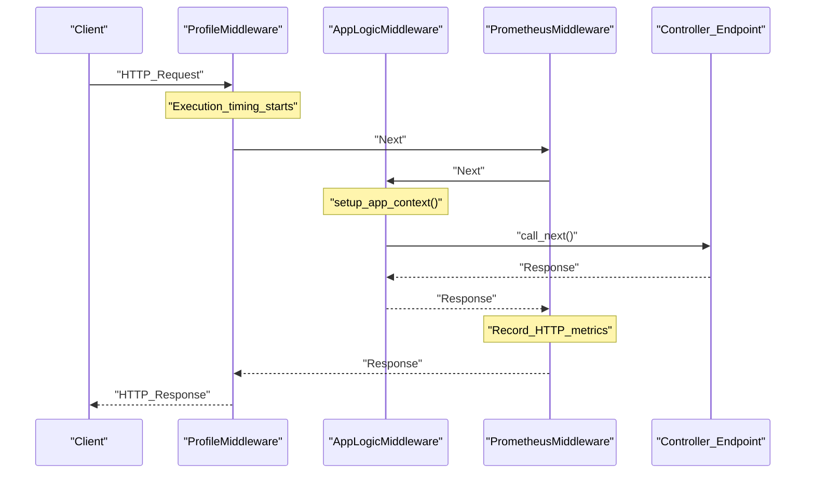

# Application Bootstrap and Server Startup
Relevant source files
- [methods/evermemos/.dockerignore](https://github.com/EverMind-AI/EverOS/blob/d40b8703/methods/evermemos/.dockerignore)
- [methods/evermemos/docs/installation/SETUP.md](https://github.com/EverMind-AI/EverOS/blob/d40b8703/methods/evermemos/docs/installation/SETUP.md?plain=1)

This page describes the initialization sequence of the EverOS memory system. The bootstrap process ensures that the dependency injection (DI) container is populated, infrastructure connections (MongoDB, Milvus, Elasticsearch) are established via FastAPI lifespans, and database migrations are applied before the server begins handling requests.

## Entrypoint: run.py

The primary entrypoint for the application is `src/run.py`[src/run.py1-10](https://github.com/EverMind-AI/EverOS/blob/d40b8703/src/run.py#L1-L10) It handles command-line argument parsing, environment variable loading, and orchestrates the transition from a synchronous Python script to an asynchronous FastAPI application.

### Startup Sequence

1. **Argument Parsing**: The `parse_args()` function extracts configurations such as `--host`, `--port`, `--env-file`, `--mock`, and `--longjob`[src/run.py26-62](https://github.com/EverMind-AI/EverOS/blob/d40b8703/src/run.py#L26-L62)
2. **Environment Setup**: Calls `setup_environment()` to load the specified `.env` file and verify critical variables like `MONGODB_HOST`[src/run.py80-87](https://github.com/EverMind-AI/EverOS/blob/d40b8703/src/run.py#L80-L87)
3. **Mock Mode Detection**: If `--mock` is passed or `MOCK_MODE=true` is set in the environment, the system calls `enable_mock_mode()`, which directs the DI container to prefer `@mock_impl` beans [src/run.py105-113](https://github.com/EverMind-AI/EverOS/blob/d40b8703/src/run.py#L105-L113)
4. **DI & Task Initialization**: Executes `setup_all()` from `application_startup.py`. This scans the codebase for decorators and registers them in the global bean registry [src/run.py127-130](https://github.com/EverMind-AI/EverOS/blob/d40b8703/src/run.py#L127-L130)
5. **Migrations**: Invokes `MigrationManager.run_migrations_on_startup()` to ensure the MongoDB schema is up-to-date, unless `--skip-migrations` is provided [src/run.py133-135](https://github.com/EverMind-AI/EverOS/blob/d40b8703/src/run.py#L133-L135)
6. **Uvicorn Launch**: Starts the FastAPI `app` using the configured host and port [src/run.py150-152](https://github.com/EverMind-AI/EverOS/blob/d40b8703/src/run.py#L150-L152)

### Bootstrap Logic Flow

The following diagram illustrates the transition from the shell to the running FastAPI instance.

**Diagram: Server Startup Flow**

[Flowchart Diagram]

**Sources:**[src/run.py26-62](https://github.com/EverMind-AI/EverOS/blob/d40b8703/src/run.py#L26-L62)[src/run.py65-152](https://github.com/EverMind-AI/EverOS/blob/d40b8703/src/run.py#L65-L152)[methods/evermemos/docs/installation/SETUP.md202-219](https://github.com/EverMind-AI/EverOS/blob/d40b8703/methods/evermemos/docs/installation/SETUP.md?plain=1#L202-L219)

---

## Infrastructure Lifespans

EverOS utilizes FastAPI lifespan handlers to manage the lifecycle of external service connections. The `LifespanFactory`[src/base_app.py46-49](https://github.com/EverMind-AI/EverOS/blob/d40b8703/src/base_app.py#L46-L49) creates a combined context manager that executes `startup` and `shutdown` methods for registered `LifespanProvider` components.

### Core Providers

| Provider | Class | Responsibility |
| --- | --- | --- |
| **MongoDB** | `MongoDBLifespanProvider` | Initializes `Beanie` ODM by scanning for `DocumentBase` subclasses and binding them to `Motor` clients [src/core/lifespan/mongodb_lifespan.py22-76](https://github.com/EverMind-AI/EverOS/blob/d40b8703/src/core/lifespan/mongodb_lifespan.py#L22-L76) |
| **Milvus** | `MilvusLifespanProvider` | Discovers `MilvusCollectionBase` subclasses, establishes connections via `MilvusClientFactory`, and ensures collection schemas are created [src/core/lifespan/milvus_lifespan.py19-93](https://github.com/EverMind-AI/EverOS/blob/d40b8703/src/core/lifespan/milvus_lifespan.py#L19-L93) |
| **LongJob** | `LongJobLifespanProvider` | If `LONGJOB_NAME` is set, it spawns an `asyncio.Task` to run the background consumer [src/core/lifespan/longjob_lifespan.py19-65](https://github.com/EverMind-AI/EverOS/blob/d40b8703/src/core/lifespan/longjob_lifespan.py#L19-L65) |

**Diagram: Infrastructure Initialization (Code Entity Space)**

[Flowchart Diagram]

**Sources:**[src/core/lifespan/mongodb_lifespan.py37-76](https://github.com/EverMind-AI/EverOS/blob/d40b8703/src/core/lifespan/mongodb_lifespan.py#L37-L76)[src/core/lifespan/milvus_lifespan.py34-93](https://github.com/EverMind-AI/EverOS/blob/d40b8703/src/core/lifespan/milvus_lifespan.py#L34-L93)[src/core/lifespan/longjob_lifespan.py34-65](https://github.com/EverMind-AI/EverOS/blob/d40b8703/src/core/lifespan/longjob_lifespan.py#L34-L65)

---

## Operational Modes

### 1. Web Mode (Default)

The standard mode where the FastAPI REST API is served. The application is created via `create_business_app()`[src/app.py92-131](https://github.com/EverMind-AI/EverOS/blob/d40b8703/src/app.py#L92-L131) which attaches `AppLogicMiddleware` and `PrometheusMiddleware`[src/app.py124-129](https://github.com/EverMind-AI/EverOS/blob/d40b8703/src/app.py#L124-L129) The default port is `1995`[methods/evermemos/docs/installation/SETUP.md207-210](https://github.com/EverMind-AI/EverOS/blob/d40b8703/methods/evermemos/docs/installation/SETUP.md?plain=1#L207-L210)

### 2. LongJob Consumer Mode

Triggered by `--longjob <job_name>` (e.g., `kafka_consumer`). The system sets the `LONGJOB_NAME` environment variable [src/run.py138-140](https://github.com/EverMind-AI/EverOS/blob/d40b8703/src/run.py#L138-L140) During the lifespan startup, `LongJobLifespanProvider` retrieves the specified `LongJobInterface` bean from the DI container and calls its `start()` method [src/core/longjob/longjob_runner.py33-65](https://github.com/EverMind-AI/EverOS/blob/d40b8703/src/core/longjob/longjob_runner.py#L33-L65)

### 3. Mock Mode

Used for local development. When enabled, `enable_mock_mode()` is called before DI initialization [src/run.py110](https://github.com/EverMind-AI/EverOS/blob/d40b8703/src/run.py#L110-L110) This configures the container to resolve dependencies using mock implementations, bypassing real network I/O for services like LLMs or external databases.

---

## Tenant-Aware Initialization

The `run_tenant_init()` function in `src/core/tenants/init_tenant_all.py` is a specialized bootstrap sequence for setting up a new tenant's infrastructure [src/core/tenants/init_tenant_all.py166-226](https://github.com/EverMind-AI/EverOS/blob/d40b8703/src/core/tenants/init_tenant_all.py#L166-L226)

It performs the following:

1. Loads tenant configuration based on `TENANT_SINGLE_TENANT_ID`[src/core/tenants/init_tenant_all.py188-189](https://github.com/EverMind-AI/EverOS/blob/d40b8703/src/core/tenants/init_tenant_all.py#L188-L189)
2. Manually invokes the `startup` methods of `MongoDBLifespanProvider`, `MilvusLifespanProvider`, and `ElasticsearchLifespanProvider` using a `MockApp`[src/core/tenants/init_tenant_all.py47-163](https://github.com/EverMind-AI/EverOS/blob/d40b8703/src/core/tenants/init_tenant_all.py#L47-L163)
3. This triggers the creation of tenant-specific databases (e.g., `{tenant_id}_memsys`) and Milvus collections [src/core/tenants/tenantize/oxm/mongo/config_utils.py54-62](https://github.com/EverMind-AI/EverOS/blob/d40b8703/src/core/tenants/tenantize/oxm/mongo/config_utils.py#L54-L62)

**Sources:**[src/core/tenants/init_tenant_all.py1-227](https://github.com/EverMind-AI/EverOS/blob/d40b8703/src/core/tenants/init_tenant_all.py#L1-L227)[src/core/tenants/tenantize/oxm/mongo/config_utils.py19-100](https://github.com/EverMind-AI/EverOS/blob/d40b8703/src/core/tenants/tenantize/oxm/mongo/config_utils.py#L19-L100)

---

## Request Lifecycle & Middleware

Once the server is started, every incoming request passes through a stack of middleware registered in `create_base_app` and `create_business_app`[src/base_app.py85-98](https://github.com/EverMind-AI/EverOS/blob/d40b8703/src/base_app.py#L85-L98)[src/app.py123-130](https://github.com/EverMind-AI/EverOS/blob/d40b8703/src/app.py#L123-L130)

**Diagram: Request Ingestion Pipeline (Natural Language to Code)**

**Sources:**[src/base_app.py94-98](https://github.com/EverMind-AI/EverOS/blob/d40b8703/src/base_app.py#L94-L98)[src/app.py123-130](https://github.com/EverMind-AI/EverOS/blob/d40b8703/src/app.py#L123-L130)[src/core/middleware/prometheus_middleware.py1-15](https://github.com/EverMind-AI/EverOS/blob/d40b8703/src/core/middleware/prometheus_middleware.py#L1-L15)