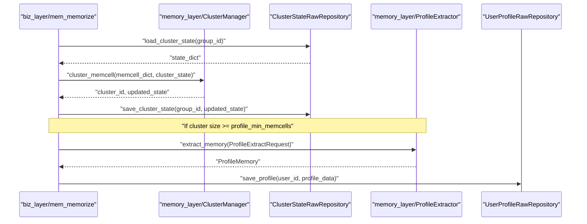

# Clustering and Memory Consolidation
Relevant source files
- [methods/evermemos/demo/agent_clustering_test_demo.py](https://github.com/EverMind-AI/EverOS/blob/d40b8703/methods/evermemos/demo/agent_clustering_test_demo.py)
- [methods/evermemos/demo/chat_agent_demo.py](https://github.com/EverMind-AI/EverOS/blob/d40b8703/methods/evermemos/demo/chat_agent_demo.py)
- [methods/evermemos/docs/OVERVIEW.md](https://github.com/EverMind-AI/EverOS/blob/d40b8703/methods/evermemos/docs/OVERVIEW.md?plain=1)

Clustering and Memory Consolidation is the process of grouping discrete `MemCell` entities into semantically related clusters to facilitate long-term memory structures like User and Group Profiles. This stage bridges the gap between short-term conversational snapshots and long-term behavioral understanding by distilling incremental updates from clustered episodes. It also handles the specialized clustering of agent trajectories into "MemScenes" to derive Agent Skills.

## Clustering Logic and Constraints

The `ClusterManager` is a core component responsible for determining if a new `MemCell` belongs to an existing cluster or should initiate a new one. This process is governed by semantic similarity and temporal proximity to maintain coherent narratives.

### Key Clustering Parameters

Clustering behavior is tuned via `MemorizeConfig`[methods/evermemos/src/biz_layer/memorize_config.py14-21](https://github.com/EverMind-AI/EverOS/blob/d40b8703/methods/evermemos/src/biz_layer/memorize_config.py#L14-L21):

- **Similarity Threshold**: Defaults to `0.3`. `MemCell` objects exceeding this semantic similarity are grouped together [methods/evermemos/src/biz_layer/memorize_config.py19](https://github.com/EverMind-AI/EverOS/blob/d40b8703/methods/evermemos/src/biz_layer/memorize_config.py#L19-L19)
- **Time-Gap Constraint**: Defaults to `7` days. `MemCell` objects separated by more than this duration are not clustered, regardless of similarity [methods/evermemos/src/biz_layer/memorize_config.py21](https://github.com/EverMind-AI/EverOS/blob/d40b8703/methods/evermemos/src/biz_layer/memorize_config.py#L21-L21)

### The Clustering Workflow

When a `MemCell` is created, `_trigger_clustering` is invoked [methods/evermemos/src/biz_layer/mem_memorize.py97-102](https://github.com/EverMind-AI/EverOS/blob/d40b8703/methods/evermemos/src/biz_layer/mem_memorize.py#L97-L102)

1. **State Loading**: The current `ClusterState` for the `group_id` is loaded from MongoDB via `ClusterStateRawRepository.load_cluster_state`[methods/evermemos/src/biz_layer/mem_memorize.py149-152](https://github.com/EverMind-AI/EverOS/blob/d40b8703/methods/evermemos/src/biz_layer/mem_memorize.py#L149-L152)
2. **Data Preparation**: The `MemCell` is converted into a dictionary format including `event_id`, `episode` (summary), `timestamp`, and `participants`[methods/evermemos/src/biz_layer/mem_memorize.py158-164](https://github.com/EverMind-AI/EverOS/blob/d40b8703/methods/evermemos/src/biz_layer/mem_memorize.py#L158-L164)
3. **Similarity Check**: `ClusterManager.cluster_memcell` compares the new `MemCell` against existing cluster centroids [methods/evermemos/src/biz_layer/mem_memorize.py174-176](https://github.com/EverMind-AI/EverOS/blob/d40b8703/methods/evermemos/src/biz_layer/mem_memorize.py#L174-L176)
4. **State Persistence**: The updated `ClusterState` (including new `event_id` mappings in `eventid_to_cluster`) is saved back to MongoDB [methods/evermemos/src/biz_layer/mem_memorize.py179-180](https://github.com/EverMind-AI/EverOS/blob/d40b8703/methods/evermemos/src/biz_layer/mem_memorize.py#L179-L180)

**Sources:**[methods/evermemos/src/biz_layer/mem_memorize.py97-182](https://github.com/EverMind-AI/EverOS/blob/d40b8703/methods/evermemos/src/biz_layer/mem_memorize.py#L97-L182)[methods/evermemos/src/biz_layer/memorize_config.py14-21](https://github.com/EverMind-AI/EverOS/blob/d40b8703/methods/evermemos/src/biz_layer/memorize_config.py#L14-L21)[methods/evermemos/src/infra_layer/adapters/out/persistence/repository/cluster_state_raw_repository.py37-45](https://github.com/EverMind-AI/EverOS/blob/d40b8703/methods/evermemos/src/infra_layer/adapters/out/persistence/repository/cluster_state_raw_repository.py#L37-L45)

## Memory Consolidation: Profile Extraction

Consolidation occurs when a cluster reaches sufficient maturity to update long-term profiles. This is primarily handled by the `ProfileExtractor` which performs incremental updates using LLM-based operations.

### Profile Extraction Strategy

The `ProfileExtractor`[methods/evermemos/src/memory_layer/memory_extractor/profile_extractor.py119](https://github.com/EverMind-AI/EverOS/blob/d40b8703/methods/evermemos/src/memory_layer/memory_extractor/profile_extractor.py#L119-L119) uses a sophisticated approach to manage token limits and reduce hallucinations:

- **ID Mapping**: Long episode IDs are mapped to short IDs (e.g., `ep1`, `ep2`) to save context window tokens during LLM calls [methods/evermemos/src/memory_layer/memory_extractor/profile_extractor.py36-37](https://github.com/EverMind-AI/EverOS/blob/d40b8703/methods/evermemos/src/memory_layer/memory_extractor/profile_extractor.py#L36-L37)
- **Incremental Operations**: The system uses `ProfileAction` (ADD, UPDATE, DELETE) to modify `explicit_info` and `implicit_traits`[methods/evermemos/src/memory_layer/memory_extractor/profile_extractor.py71-75](https://github.com/EverMind-AI/EverOS/blob/d40b8703/methods/evermemos/src/memory_layer/memory_extractor/profile_extractor.py#L71-L75)
- **Scenario Awareness**: Supports both `SOLO` (1 user + N agents) and `TEAM` (multi-user) scenarios [methods/evermemos/src/memory_layer/memory_extractor/profile_extractor.py93-95](https://github.com/EverMind-AI/EverOS/blob/d40b8703/methods/evermemos/src/memory_layer/memory_extractor/profile_extractor.py#L93-L95) In `TEAM` scenes, it resolves target user names to disambiguate speakers [methods/evermemos/src/memory_layer/memory_extractor/profile_extractor.py181-185](https://github.com/EverMind-AI/EverOS/blob/d40b8703/methods/evermemos/src/memory_layer/memory_extractor/profile_extractor.py#L181-L185)

### Triggering Profile Extraction

The system checks if a cluster meets the threshold for consolidation [methods/evermemos/src/biz_layer/mem_memorize.py195-200](https://github.com/EverMind-AI/EverOS/blob/d40b8703/methods/evermemos/src/biz_layer/mem_memorize.py#L195-L200):

- **Minimum Size**: Controlled by `profile_min_memcells` (default: 1) [methods/evermemos/src/biz_layer/memorize_config.py25](https://github.com/EverMind-AI/EverOS/blob/d40b8703/methods/evermemos/src/biz_layer/memorize_config.py#L25-L25)
- **Profile Memory Model**: The `ProfileMemory` object stores structured user information including `processed_episode_ids` to ensure each episode is only processed once [methods/evermemos/src/memory_layer/memory_extractor/profile_extractor.py166-168](https://github.com/EverMind-AI/EverOS/blob/d40b8703/methods/evermemos/src/memory_layer/memory_extractor/profile_extractor.py#L166-L168)

**Sources:**[methods/evermemos/src/memory_layer/memory_extractor/profile_extractor.py11-196](https://github.com/EverMind-AI/EverOS/blob/d40b8703/methods/evermemos/src/memory_layer/memory_extractor/profile_extractor.py#L11-L196)[methods/evermemos/src/biz_layer/mem_memorize.py195-240](https://github.com/EverMind-AI/EverOS/blob/d40b8703/methods/evermemos/src/biz_layer/mem_memorize.py#L195-L240)[methods/evermemos/src/api_specs/memory_types.py14-27](https://github.com/EverMind-AI/EverOS/blob/d40b8703/methods/evermemos/src/api_specs/memory_types.py#L14-L27)

## Agent Memory Clustering: MemScenes

For agent-specific memories, the system clusters trajectories into `MemScenes`. This is critical for distinguishing between different task patterns, such as "Code Debugging" vs. "Data Analysis" [methods/evermemos/demo/agent_clustering_test_demo.py7-10](https://github.com/EverMind-AI/EverOS/blob/d40b8703/methods/evermemos/demo/agent_clustering_test_demo.py#L7-L10)

- **Trajectory Separation**: Similar patterns (e.g., multiple debugging sessions) are merged into the same cluster, while distinct tasks remain separate [methods/evermemos/demo/agent_clustering_test_demo.py12-15](https://github.com/EverMind-AI/EverOS/blob/d40b8703/methods/evermemos/demo/agent_clustering_test_demo.py#L12-L15)
- **Skill Maturity**: Once a `MemScene` cluster reaches a certain size, the system triggers `AgentSkillExtractor` to distill reusable skills from the repetitive patterns [methods/evermemos/demo/chat_agent_demo.py12-13](https://github.com/EverMind-AI/EverOS/blob/d40b8703/methods/evermemos/demo/chat_agent_demo.py#L12-L13)

**Sources:**[methods/evermemos/demo/agent_clustering_test_demo.py1-23](https://github.com/EverMind-AI/EverOS/blob/d40b8703/methods/evermemos/demo/agent_clustering_test_demo.py#L1-L23)[methods/evermemos/demo/chat_agent_demo.py1-13](https://github.com/EverMind-AI/EverOS/blob/d40b8703/methods/evermemos/demo/chat_agent_demo.py#L1-L13)

## Data Flow: From MemCell to Vector Store

The consolidation pipeline ensures that while raw data lives in MongoDB, searchable indices are maintained in Milvus and Elasticsearch for hybrid retrieval.

### Consolidation Pipeline Diagram

The following diagram illustrates the flow from `MemCell` creation to the update of long-term profiles and vector synchronization to `Milvus`.

[Flowchart Diagram]

**Sources:**[methods/evermemos/src/biz_layer/mem_memorize.py97-240](https://github.com/EverMind-AI/EverOS/blob/d40b8703/methods/evermemos/src/biz_layer/mem_memorize.py#L97-L240)[methods/evermemos/src/memory_layer/memory_extractor/profile_extractor.py128-130](https://github.com/EverMind-AI/EverOS/blob/d40b8703/methods/evermemos/src/memory_layer/memory_extractor/profile_extractor.py#L128-L130)[methods/evermemos/src/api_specs/memory_types.py133-158](https://github.com/EverMind-AI/EverOS/blob/d40b8703/methods/evermemos/src/api_specs/memory_types.py#L133-L158)

## Implementation Detail: System Entities

The transition from Natural Language space (conversations) to Code Entity space (storage and processing) is handled by specific classes and repository patterns.

### Code Entity Mapping

| Concept | Code Entity | Storage Backend |
| --- | --- | --- |
| **Clustering Logic** | `ClusterManager` | N/A (Logic) |
| **Cluster State** | `ClusterState` | MongoDB (`cluster_state`) |
| **Profile Extraction** | `ProfileExtractor` | N/A (Logic) |
| **Profile Memory** | `ProfileMemory` | MongoDB (`user_profile`) |
| **Vector Sync** | `MemorySyncService` | Milvus / Elasticsearch |
| **Agent Memory Type** | `RawDataType.AGENTCONVERSATION` | MongoDB / Milvus |

### Component Interaction Diagram

This diagram shows how the business layer interacts with the persistence and memory layers during consolidation, specifically highlighting the `ProfileExtractor`'s role.

**Sources:**[methods/evermemos/src/biz_layer/mem_memorize.py116-240](https://github.com/EverMind-AI/EverOS/blob/d40b8703/methods/evermemos/src/biz_layer/mem_memorize.py#L116-L240)[methods/evermemos/src/memory_layer/memory_extractor/profile_extractor.py128-196](https://github.com/EverMind-AI/EverOS/blob/d40b8703/methods/evermemos/src/memory_layer/memory_extractor/profile_extractor.py#L128-L196)[methods/evermemos/src/infra_layer/adapters/out/persistence/repository/cluster_state_raw_repository.py37-45](https://github.com/EverMind-AI/EverOS/blob/d40b8703/methods/evermemos/src/infra_layer/adapters/out/persistence/repository/cluster_state_raw_repository.py#L37-L45)[methods/evermemos/src/api_specs/memory_types.py14-54](https://github.com/EverMind-AI/EverOS/blob/d40b8703/methods/evermemos/src/api_specs/memory_types.py#L14-L54)