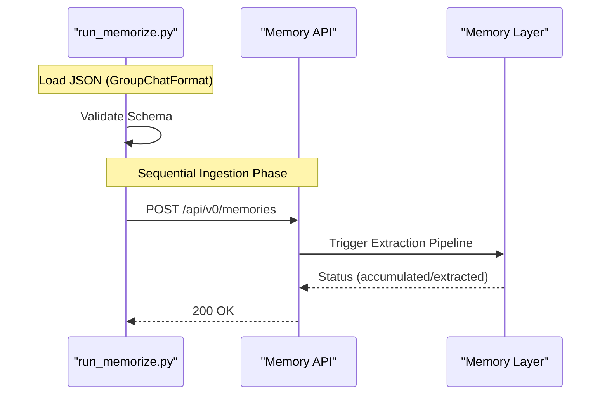

# Conversation Meta and Data Formats
Relevant source files
- [methods/evermemos/docs/advanced/TEAM_CHAT_GUIDE.md](https://github.com/EverMind-AI/EverOS/blob/d40b8703/methods/evermemos/docs/advanced/TEAM_CHAT_GUIDE.md?plain=1)
- [methods/evermemos/docs/usage/BATCH_OPERATIONS.md](https://github.com/EverMind-AI/EverOS/blob/d40b8703/methods/evermemos/docs/usage/BATCH_OPERATIONS.md?plain=1)

EverMemOS utilizes a structured metadata system to provide rich context for memory extraction and retrieval. This system allows the platform to distinguish between different conversational scenarios, manage multi-user interactions, and handle large-scale batch data ingestion through a standardized format.

## ConversationMeta System

The `ConversationMeta` system is the central mechanism for managing conversation context. It stores information about the participants, the conversational scene, and organizational grouping. This metadata is critical for the memory layer to attribute facts to the correct individuals and for the retrieval system to filter results accurately.

### Core Components

- **ScenarioType**: Distinguishes between `solo` (1:1 human-AI dialogue) and `team` (group chat) [methods/evermemos/docs/usage/BATCH_OPERATIONS.md79-82](https://github.com/EverMind-AI/EverOS/blob/d40b8703/methods/evermemos/docs/usage/BATCH_OPERATIONS.md?plain=1#L79-L82)
- **UserDetail Model**: Stores participant information including `full_name`, `role` (user/assistant), `nickname`, and `custom_role`[methods/evermemos/docs/advanced/TEAM_CHAT_GUIDE.md186-198](https://github.com/EverMind-AI/EverOS/blob/d40b8703/methods/evermemos/docs/advanced/TEAM_CHAT_GUIDE.md?plain=1#L186-L198)
- **Group ID Logic**: `group_id` is used to isolate memory contexts and prevent cross-contamination [methods/evermemos/docs/advanced/TEAM_CHAT_GUIDE.md29-32](https://github.com/EverMind-AI/EverOS/blob/d40b8703/methods/evermemos/docs/advanced/TEAM_CHAT_GUIDE.md?plain=1#L29-L32) While `group_id` is recommended for multi-user scenarios to build richer episodic context [methods/evermemos/docs/advanced/TEAM_CHAT_GUIDE.md67-68](https://github.com/EverMind-AI/EverOS/blob/d40b8703/methods/evermemos/docs/advanced/TEAM_CHAT_GUIDE.md?plain=1#L67-L68) it is optional; if omitted, the system defaults to a group based on the `sender`[methods/evermemos/docs/advanced/TEAM_CHAT_GUIDE.md38](https://github.com/EverMind-AI/EverOS/blob/d40b8703/methods/evermemos/docs/advanced/TEAM_CHAT_GUIDE.md?plain=1#L38-L38)
- **Upsert Behavior**: The system supports synchronization of metadata, allowing the platform to update participant roles and group descriptions dynamically during ingestion [methods/evermemos/docs/usage/BATCH_OPERATIONS.md143-149](https://github.com/EverMind-AI/EverOS/blob/d40b8703/methods/evermemos/docs/usage/BATCH_OPERATIONS.md?plain=1#L143-L149)

### Metadata Entity Mapping

The following diagram bridges the Natural Language concepts of a "Chat Room" to the specific code entities used in the system.

**Title: Conversation Metadata Entity Mapping**

[Flowchart Diagram]

Sources: [methods/evermemos/docs/advanced/TEAM_CHAT_GUIDE.md22-33](https://github.com/EverMind-AI/EverOS/blob/d40b8703/methods/evermemos/docs/advanced/TEAM_CHAT_GUIDE.md?plain=1#L22-L33)[methods/evermemos/docs/advanced/TEAM_CHAT_GUIDE.md181-200](https://github.com/EverMind-AI/EverOS/blob/d40b8703/methods/evermemos/docs/advanced/TEAM_CHAT_GUIDE.md?plain=1#L181-L200)[methods/evermemos/docs/usage/BATCH_OPERATIONS.md130-149](https://github.com/EverMind-AI/EverOS/blob/d40b8703/methods/evermemos/docs/usage/BATCH_OPERATIONS.md?plain=1#L130-L149)

---

## GroupChatFormat JSON Specification

To facilitate batch import of historical data or integration with third-party platforms (e.g., Slack, Discord), EverMemOS defines the `GroupChatFormat` (also referred to as `ConversationFormat`). This JSON schema ensures that message sequences are ingested with full context.

### High-Level Schema

- **`version`**: Schema version (e.g., "1.0.0") [methods/evermemos/docs/usage/BATCH_OPERATIONS.md94](https://github.com/EverMind-AI/EverOS/blob/d40b8703/methods/evermemos/docs/usage/BATCH_OPERATIONS.md?plain=1#L94-L94)
- **`session_meta`**: Defines the `group_id`, `name`, `scene`, `user_details`, and `timezone` for the entire batch [methods/evermemos/docs/usage/BATCH_OPERATIONS.md95-112](https://github.com/EverMind-AI/EverOS/blob/d40b8703/methods/evermemos/docs/usage/BATCH_OPERATIONS.md?plain=1#L95-L112)
- **`conversation_list`**: A chronological list of message objects containing `message_id`, `sender`, `content`, and `create_time`[methods/evermemos/docs/usage/BATCH_OPERATIONS.md113-127](https://github.com/EverMind-AI/EverOS/blob/d40b8703/methods/evermemos/docs/usage/BATCH_OPERATIONS.md?plain=1#L113-L127)

For a complete field-by-field reference and validation rules, see **[GroupChatFormat Specification](/EverMind-AI/EverOS/7.1-groupchatformat-specification)**.

Sources: [methods/evermemos/docs/usage/BATCH_OPERATIONS.md88-128](https://github.com/EverMind-AI/EverOS/blob/d40b8703/methods/evermemos/docs/usage/BATCH_OPERATIONS.md?plain=1#L88-L128)

---

## Batch Ingestion with run_memorize.py

The system provides a CLI tool, `run_memorize.py`, designed to process `GroupChatFormat` files. It acts as an orchestrator for bulk memory storage.

### Key Capabilities

1. **Validation**: A `--validate-only` mode allows users to check JSON formatting against the schema without performing API calls [methods/evermemos/docs/usage/BATCH_OPERATIONS.md61-65](https://github.com/EverMind-AI/EverOS/blob/d40b8703/methods/evermemos/docs/usage/BATCH_OPERATIONS.md?plain=1#L61-L65)
2. **Scene Selection**: The `--scene` parameter (`solo` vs `team`) determines which memory extraction pipeline the backend will trigger [methods/evermemos/docs/usage/BATCH_OPERATIONS.md77-85](https://github.com/EverMind-AI/EverOS/blob/d40b8703/methods/evermemos/docs/usage/BATCH_OPERATIONS.md?plain=1#L77-L85)
3. **Sequential Processing**: The script reads the input file and sequentially posts messages to the API endpoint (default: `http://localhost:1995/api/v0/memories`) [methods/evermemos/docs/usage/BATCH_OPERATIONS.md50-59](https://github.com/EverMind-AI/EverOS/blob/d40b8703/methods/evermemos/docs/usage/BATCH_OPERATIONS.md?plain=1#L50-L59)

For detailed CLI arguments and setup instructions, see **[Batch Ingestion with run_memorize.py](/EverMind-AI/EverOS/7.2-batch-ingestion-with-run_memorize.py)**.

### Ingestion Flow Diagram

This diagram illustrates the transition from a raw JSON file to the internal system API calls.

**Title: Batch Ingestion Execution Flow**

Sources: [methods/evermemos/docs/usage/BATCH_OPERATIONS.md44-66](https://github.com/EverMind-AI/EverOS/blob/d40b8703/methods/evermemos/docs/usage/BATCH_OPERATIONS.md?plain=1#L44-L66)[methods/evermemos/docs/usage/BATCH_OPERATIONS.md157-185](https://github.com/EverMind-AI/EverOS/blob/d40b8703/methods/evermemos/docs/usage/BATCH_OPERATIONS.md?plain=1#L157-L185)

---

## Child Pages

- **[GroupChatFormat Specification](/EverMind-AI/EverOS/7.1-groupchatformat-specification)**: Complete reference for the JSON schema, including `user_details` mapping, versioning, and required vs. optional fields for metadata and message lists.
- **[Batch Ingestion with run_memorize.py](/EverMind-AI/EverOS/7.2-batch-ingestion-with-run_memorize.py)**: Detailed guide on using the CLI tool, including command-line arguments, scene parameter selection, and troubleshooting batch imports.