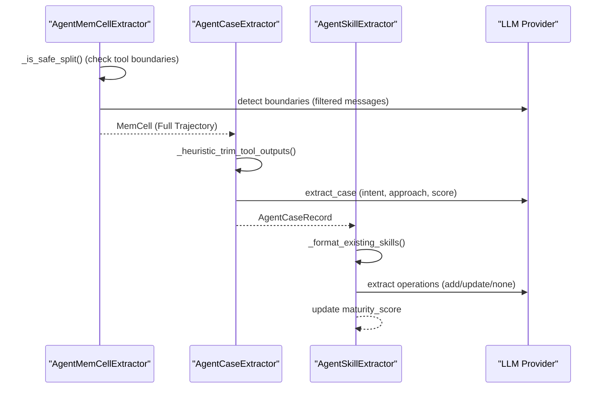

# Core Concepts and Terminology
Relevant source files
- [README.md](https://github.com/EverMind-AI/EverOS/blob/d40b8703/README.md?plain=1)
- [methods/evermemos/docs/usage/USAGE_EXAMPLES.md](https://github.com/EverMind-AI/EverOS/blob/d40b8703/methods/evermemos/docs/usage/USAGE_EXAMPLES.md?plain=1)
- [methods/evermemos/src/api_specs/memory_types.py](https://github.com/EverMind-AI/EverOS/blob/d40b8703/methods/evermemos/src/api_specs/memory_types.py)
- [methods/evermemos/src/memory_layer/memcell_extractor/agent_memcell_extractor.py](https://github.com/EverMind-AI/EverOS/blob/d40b8703/methods/evermemos/src/memory_layer/memcell_extractor/agent_memcell_extractor.py)
- [methods/evermemos/src/memory_layer/memory_extractor/profile_extractor.py](https://github.com/EverMind-AI/EverOS/blob/d40b8703/methods/evermemos/src/memory_layer/memory_extractor/profile_extractor.py)
- [methods/evermemos/tests/test_agent_memcell_extractor.py](https://github.com/EverMind-AI/EverOS/blob/d40b8703/methods/evermemos/tests/test_agent_memcell_extractor.py)
- [methods/evermemos/tests/test_profile_memory.py](https://github.com/EverMind-AI/EverOS/blob/d40b8703/methods/evermemos/tests/test_profile_memory.py)

This page provides a technical deep dive into the fundamental data entities, operational modes, and the three-stage processing pipeline of EverMemOS. It bridges the gap between natural language conversation concepts and the specific code entities implemented in the system, updated to include agent-specific memory types and retrieval concepts.

## 1. Fundamental Data Entities

EverMemOS transforms raw conversation streams into a hierarchy of structured memory objects, ranging from atomic facts to long-term behavioral profiles and agent self-evolution skills.

### 1.1 MemCell

The **MemCell** is the atomic unit of memory ingestion. It represents a "meaningful segment" of a conversation, identified through LLM-based boundary detection or hard constraints (token limits/time gaps).

- **Implementation**: Defined as a dataclass `MemCell` in [methods/evermemos/src/api_specs/memory_types.py133-165](https://github.com/EverMind-AI/EverOS/blob/d40b8703/methods/evermemos/src/api_specs/memory_types.py#L133-L165)
- **Agent Support**: The `AgentMemCellExtractor` extends the standard extractor to respect tool-call boundaries, ensuring that tool interactions are not split mid-turn [methods/evermemos/src/memory_layer/memcell_extractor/agent_memcell_extractor.py71-94](https://github.com/EverMind-AI/EverOS/blob/d40b8703/methods/evermemos/src/memory_layer/memcell_extractor/agent_memcell_extractor.py#L71-L94)
- **Filtered View**: The property `conversation_data` automatically filters out intermediate tool steps for LLM-based summary tasks while preserving the full trajectory in `original_data`[methods/evermemos/src/api_specs/memory_types.py171-191](https://github.com/EverMind-AI/EverOS/blob/d40b8703/methods/evermemos/src/api_specs/memory_types.py#L171-L191)

### 1.2 Episode (Episodic Memory)

A narrative summary of a specific event or conversation segment, providing higher-level semantic understanding and story continuity.

- **Implementation**: `EpisodeMemory` in [methods/evermemos/src/api_specs/memory_types.py27](https://github.com/EverMind-AI/EverOS/blob/d40b8703/methods/evermemos/src/api_specs/memory_types.py#L27-L27)
- **Types**: Supports both **Group Episodes** (third-person, group-wide narrative) and **Personal Episodes** (first-person view for a specific participant).

### 1.3 Foresight

Temporal predictions about the potential impact of current events on the user's future life, tasks, and decisions.

- **Implementation**: `Foresight` defined in [methods/evermemos/src/api_specs/memory_types.py27](https://github.com/EverMind-AI/EverOS/blob/d40b8703/methods/evermemos/src/api_specs/memory_types.py#L27-L27)
- **Extraction**: Generated by the `ForesightExtractor` using LLM prompts to guide proactive behavior.

### 1.4 AtomicFact (EventLog)

Atomic facts extracted directly from conversations; every fact is an independent, vectorized retrieval unit for precise recall.

- **Implementation**: Often referred to as `EventLog` or `AtomicFact` in the codebase [methods/evermemos/src/api_specs/memory_types.py67-71](https://github.com/EverMind-AI/EverOS/blob/d40b8703/methods/evermemos/src/api_specs/memory_types.py#L67-L71)

### 1.5 Agent Memory: Case and Skill

Specific entities designed for agent self-evolution and task-oriented persistence.

- **AgentCase**: Captures a single problem-solving experience, including `task_intent`, `approach`, and `quality_score`[methods/evermemos/src/memory_layer/memory_extractor/agent_case_extractor.py75-86](https://github.com/EverMind-AI/EverOS/blob/d40b8703/methods/evermemos/src/memory_layer/memory_extractor/agent_case_extractor.py#L75-L86)
- **AgentSkill**: A distilled, reusable skill derived from multiple `AgentCase` records. It includes `maturity_score` and `confidence`[methods/evermemos/src/memory_layer/memory_extractor/agent_skill_extractor.py54-63](https://github.com/EverMind-AI/EverOS/blob/d40b8703/methods/evermemos/src/memory_layer/memory_extractor/agent_skill_extractor.py#L54-L63)

### 1.6 Profile (User & Group)

Long-term structured knowledge including explicit info (name, job) and implicit traits (personality, habits).

- **Implementation**: `ProfileMemory` in [methods/evermemos/src/api_specs/memory_types.py27](https://github.com/EverMind-AI/EverOS/blob/d40b8703/methods/evermemos/src/api_specs/memory_types.py#L27-L27)
- **Management**: The `ProfileExtractor` uses incremental operations (`ADD`, `UPDATE`, `DELETE`) and ID mapping to save tokens [methods/evermemos/src/memory_layer/memory_extractor/profile_extractor.py119-126](https://github.com/EverMind-AI/EverOS/blob/d40b8703/methods/evermemos/src/memory_layer/memory_extractor/profile_extractor.py#L119-L126)

**Sources**: [methods/evermemos/src/api_specs/memory_types.py1-200](https://github.com/EverMind-AI/EverOS/blob/d40b8703/methods/evermemos/src/api_specs/memory_types.py#L1-L200)[methods/evermemos/src/memory_layer/memory_extractor/profile_extractor.py1-130](https://github.com/EverMind-AI/EverOS/blob/d40b8703/methods/evermemos/src/memory_layer/memory_extractor/profile_extractor.py#L1-L130)[methods/evermemos/src/memory_layer/memory_extractor/agent_case_extractor.py1-86](https://github.com/EverMind-AI/EverOS/blob/d40b8703/methods/evermemos/src/memory_layer/memory_extractor/agent_case_extractor.py#L1-L86)[methods/evermemos/src/memory_layer/memory_extractor/agent_skill_extractor.py1-63](https://github.com/EverMind-AI/EverOS/blob/d40b8703/methods/evermemos/src/memory_layer/memory_extractor/agent_skill_extractor.py#L1-L63)

---

## 2. Operational Modes

EverMemOS optimizes its extraction and retrieval strategies based on the context of the interaction.

| Mode | Scenario Type | Data Type | Key Characteristics |
| --- | --- | --- | --- |
| **Solo/Team** | `solo` / `team` | `CONVERSATION` | Standard human-to-human or human-to-agent chat [methods/evermemos/src/api_specs/memory_types.py14-18](https://github.com/EverMind-AI/EverOS/blob/d40b8703/methods/evermemos/src/api_specs/memory_types.py#L14-L18) |
| **Agentic** | `assistant` | `AGENTCONVERSATION` | Includes tool calls and responses; uses `AgentMemCellExtractor` to filter intermediate steps for LLM but keep full trajectory for storage [methods/evermemos/src/memory_layer/memcell_extractor/agent_memcell_extractor.py41-57](https://github.com/EverMind-AI/EverOS/blob/d40b8703/methods/evermemos/src/memory_layer/memcell_extractor/agent_memcell_extractor.py#L41-L57) |

**Sources**: [methods/evermemos/src/api_specs/memory_types.py14-57](https://github.com/EverMind-AI/EverOS/blob/d40b8703/methods/evermemos/src/api_specs/memory_types.py#L14-L57)[methods/evermemos/src/memory_layer/memcell_extractor/agent_memcell_extractor.py1-40](https://github.com/EverMind-AI/EverOS/blob/d40b8703/methods/evermemos/src/memory_layer/memcell_extractor/agent_memcell_extractor.py#L1-L40)

---

## 3. The Three-Stage Pipeline

The system processes data through a linear pipeline: **Encoding → Consolidation → Retrieval**.

### 3.1 Stage 1: Encoding (Extraction)

1. **MemCell Extraction**: Raw data is segmented. For agents, the `AgentMemCellExtractor` ensures splits only happen at "safe" boundaries (final assistant responses) [methods/evermemos/src/memory_layer/memcell_extractor/agent_memcell_extractor.py159-174](https://github.com/EverMind-AI/EverOS/blob/d40b8703/methods/evermemos/src/memory_layer/memcell_extractor/agent_memcell_extractor.py#L159-L174)
2. **Intermediate Filtering**: In agent mode, tool calls/responses are filtered out for the LLM boundary detection prompt via `is_intermediate_agent_step` but retained in the `original_data` of the `MemCell`[methods/evermemos/src/api_specs/memory_types.py117-130](https://github.com/EverMind-AI/EverOS/blob/d40b8703/methods/evermemos/src/api_specs/memory_types.py#L117-L130)

### 3.2 Stage 2: Consolidation

1. **Case Extraction**: `AgentCaseExtractor` performs heuristic trimming of tool outputs before extracting the task intent and approach [methods/evermemos/src/memory_layer/memory_extractor/agent_case_extractor.py182-185](https://github.com/EverMind-AI/EverOS/blob/d40b8703/methods/evermemos/src/memory_layer/memory_extractor/agent_case_extractor.py#L182-L185)
2. **Skill Distillation**: `AgentSkillExtractor` takes new cases and updates existing skills in a cluster using incremental LLM operations [methods/evermemos/src/memory_layer/memory_extractor/agent_skill_extractor.py54-63](https://github.com/EverMind-AI/EverOS/blob/d40b8703/methods/evermemos/src/memory_layer/memory_extractor/agent_skill_extractor.py#L54-L63)
3. **Profile Updates**: `ProfileExtractor` updates user traits using short IDs (`ep1`, `ep2`) to represent episodes, reducing prompt size and preventing hallucination [methods/evermemos/src/memory_layer/memory_extractor/profile_extractor.py36-37](https://github.com/EverMind-AI/EverOS/blob/d40b8703/methods/evermemos/src/memory_layer/memory_extractor/profile_extractor.py#L36-L37)

### 3.3 Stage 3: Retrieval

1. **Hybrid Search**: Combines keyword search and vector similarity (RRF).
2. **Agentic Retrieval**: Includes searching for `AGENT_CASE` and `AGENT_SKILL` types to provide the agent with relevant past experiences and refined techniques [methods/evermemos/src/api_specs/memory_models.py](https://github.com/EverMind-AI/EverOS/blob/d40b8703/methods/evermemos/src/api_specs/memory_models.py)

**Sources**: [methods/evermemos/src/memory_layer/memcell_extractor/agent_memcell_extractor.py158-174](https://github.com/EverMind-AI/EverOS/blob/d40b8703/methods/evermemos/src/memory_layer/memcell_extractor/agent_memcell_extractor.py#L158-L174)[methods/evermemos/src/memory_layer/memory_extractor/agent_case_extractor.py50-100](https://github.com/EverMind-AI/EverOS/blob/d40b8703/methods/evermemos/src/memory_layer/memory_extractor/agent_case_extractor.py#L50-L100)[methods/evermemos/src/memory_layer/memory_extractor/agent_skill_extractor.py1-63](https://github.com/EverMind-AI/EverOS/blob/d40b8703/methods/evermemos/src/memory_layer/memory_extractor/agent_skill_extractor.py#L1-L63)[methods/evermemos/src/memory_layer/memory_extractor/profile_extractor.py30-65](https://github.com/EverMind-AI/EverOS/blob/d40b8703/methods/evermemos/src/memory_layer/memory_extractor/profile_extractor.py#L30-L65)

---

## 4. Technical Diagrams

### 4.1 Natural Language to Code Entity Mapping (Ingestion)

This diagram shows how conversation and agent concepts map to specific classes in the `api_specs` and `memory_layer`.

[Flowchart Diagram]

**Sources**: [methods/evermemos/src/api_specs/memory_types.py133-191](https://github.com/EverMind-AI/EverOS/blob/d40b8703/methods/evermemos/src/api_specs/memory_types.py#L133-L191)[methods/evermemos/src/memory_layer/memory_extractor/agent_case_extractor.py75-86](https://github.com/EverMind-AI/EverOS/blob/d40b8703/methods/evermemos/src/memory_layer/memory_extractor/agent_case_extractor.py#L75-L86)[methods/evermemos/src/memory_layer/memory_extractor/agent_skill_extractor.py49-52](https://github.com/EverMind-AI/EverOS/blob/d40b8703/methods/evermemos/src/memory_layer/memory_extractor/agent_skill_extractor.py#L49-L52)

### 4.2 Agent Memory Extraction Flow

Detailing the specialized pipeline for extracting agent experiences and skills.

**Sources**: [methods/evermemos/src/memory_layer/memcell_extractor/agent_memcell_extractor.py159-174](https://github.com/EverMind-AI/EverOS/blob/d40b8703/methods/evermemos/src/memory_layer/memcell_extractor/agent_memcell_extractor.py#L159-L174)[methods/evermemos/src/memory_layer/memory_extractor/agent_case_extractor.py182-185](https://github.com/EverMind-AI/EverOS/blob/d40b8703/methods/evermemos/src/memory_layer/memory_extractor/agent_case_extractor.py#L182-L185)[methods/evermemos/src/memory_layer/memory_extractor/agent_skill_extractor.py54-63](https://github.com/EverMind-AI/EverOS/blob/d40b8703/methods/evermemos/src/memory_layer/memory_extractor/agent_skill_extractor.py#L54-L63)