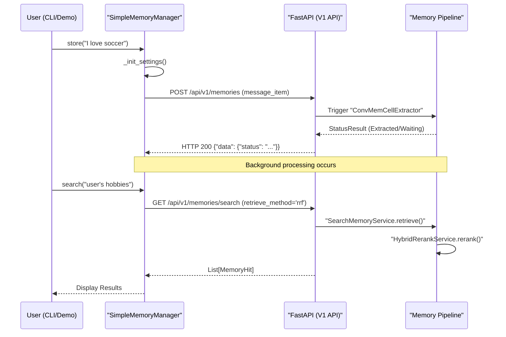

# Demo Applications and Client Tools
Relevant source files
- [methods/evermemos/demo/utils/simple_memory_manager.py](https://github.com/EverMind-AI/EverOS/blob/d40b8703/methods/evermemos/demo/utils/simple_memory_manager.py)
- [methods/evermemos/docs/usage/DEMOS.md](https://github.com/EverMind-AI/EverOS/blob/d40b8703/methods/evermemos/docs/usage/DEMOS.md?plain=1)
- [methods/evermemos/env.template](https://github.com/EverMind-AI/EverOS/blob/d40b8703/methods/evermemos/env.template)
- [methods/evermemos/src/agentic_layer/get_mem_service.py](https://github.com/EverMind-AI/EverOS/blob/d40b8703/methods/evermemos/src/agentic_layer/get_mem_service.py)
- [use-cases/README.md](https://github.com/EverMind-AI/EverOS/blob/d40b8703/use-cases/README.md?plain=1)

This section provides an overview of the demonstration ecosystem and client-side utilities designed to interact with the EverOS memory services. These tools range from high-level Python wrappers for rapid prototyping to full-featured interactive chat interfaces and diagnostic tools for testing retrieval performance.

### Ecosystem Overview

The demo layer bridges the gap between the core memory infrastructure and end-user applications. It demonstrates how to ingest raw conversation data, manage metadata, and perform multi-modal searches using the REST API.

| Tool | Purpose | Key Components |
| --- | --- | --- |
| **SimpleMemoryManager** | High-level SDK wrapper | `store()`, `search()`, `wait_for_index()` |
| **Chat Demo** | Interactive CLI assistant | `ChatSession`, `ChatOrchestrator`, `ChatUI` |
| **Retrieval Tester** | Performance & accuracy benchmarking | `RetrievalTester`, multi-mode sweeps |
| **Extraction Tools** | Bulk data ingestion | `test_memorize_api`, `upsert_conversation_meta` |
| **Game of Thrones Demo** | Story-based React/Node.js web demo | `EverMemOSService`, `SSE streaming` |

---

### SimpleMemoryManager and Chat Demo

The `SimpleMemoryManager` is the primary entry point for developers looking for a simplified interface to the EverOS API. It abstracts the complexities of message ID generation, timezone handling, and conversation metadata management [methods/evermemos/demo/utils/simple_memory_manager.py70-80](https://github.com/EverMind-AI/EverOS/blob/d40b8703/methods/evermemos/demo/utils/simple_memory_manager.py#L70-L80) It includes utility functions like `extract_event_time_from_memory` to parse temporal information from extracted subjects or episode content using regex patterns for ISO and Chinese date formats [methods/evermemos/demo/utils/simple_memory_manager.py14-64](https://github.com/EverMind-AI/EverOS/blob/d40b8703/methods/evermemos/demo/utils/simple_memory_manager.py#L14-L64)

The **Chat Demo** provides a complete implementation of a memory-augmented agent. It uses a `ChatSession` to orchestrate parallel memory retrieval (Episodes, Event Logs, and Profiles) and constructs prompts for an `LLMProvider` to generate context-aware responses.

#### Key Features:

- **High-level API**: Simple `store()` and `search()` methods that handle the underlying HTTP requests to `/api/v1/memories` and `/api/v1/memories/search`[methods/evermemos/demo/utils/simple_memory_manager.py104-113](https://github.com/EverMind-AI/EverOS/blob/d40b8703/methods/evermemos/demo/utils/simple_memory_manager.py#L104-L113)[methods/evermemos/demo/utils/simple_memory_manager.py228-237](https://github.com/EverMind-AI/EverOS/blob/d40b8703/methods/evermemos/demo/utils/simple_memory_manager.py#L228-L237)
- **Interactive Orchestration**: A CLI-based `ChatOrchestrator` that handles language selection, scenario picking (Assistant vs. Group Chat), and session persistence [methods/evermemos/docs/usage/DEMOS.md228-270](https://github.com/EverMind-AI/EverOS/blob/d40b8703/methods/evermemos/docs/usage/DEMOS.md?plain=1#L228-L270)
- **Visual Retrieval Feedback**: The `ChatUI` displays exactly which memories were retrieved, their relevance scores, and the latency of the retrieval pipeline [methods/evermemos/docs/usage/DEMOS.md84-96](https://github.com/EverMind-AI/EverOS/blob/d40b8703/methods/evermemos/docs/usage/DEMOS.md?plain=1#L84-L96)
- **Wait for Indexing**: The `wait_for_index()` method provides a polling mechanism to ensure background memory extraction is complete before proceeding with searches [methods/evermemos/demo/utils/simple_memory_manager.py202-211](https://github.com/EverMind-AI/EverOS/blob/d40b8703/methods/evermemos/demo/utils/simple_memory_manager.py#L202-L211)

For details, see [SimpleMemoryManager and Chat Demo](/EverMind-AI/EverOS/8.1-simplememorymanager-and-chat-demo).

**Sources:**[methods/evermemos/demo/utils/simple_memory_manager.py1-250](https://github.com/EverMind-AI/EverOS/blob/d40b8703/methods/evermemos/demo/utils/simple_memory_manager.py#L1-L250)[methods/evermemos/docs/usage/DEMOS.md30-112](https://github.com/EverMind-AI/EverOS/blob/d40b8703/methods/evermemos/docs/usage/DEMOS.md?plain=1#L30-L112)

---

### OpenClaw Plugin Integration

EverOS provides integration for the **OpenClaw** agent framework, allowing agents to maintain persistent, long-term memory across sessions. The integration focuses on two primary lifecycle hooks:

1. **Context Injection**: Using `assemble()` to fetch relevant memories before the agent generates a reply.
2. **Memory Storage**: Using `afterTurn()` to store the latest interaction back into the EverOS pipeline.

The plugin is highly configurable, allowing developers to specify `baseUrl`, `userId`, `groupId`, `topK`, `memoryTypes` (e.g., episodic vs. foresight), and `retrieveMethod` (e.g., hybrid vs. agentic).

For details, see [OpenClaw Plugin Integration](/EverMind-AI/EverOS/8.2-openclaw-plugin-integration).

---

### Game of Thrones Story Memory Demo

The **EverMem Story Memory Demo** is a specialized use case demonstrating memory capabilities in a narrative context. It features a React/TypeScript frontend and a Node.js/Express backend that interacts with EverOS.

#### Key Features:

- **Side-by-Side Comparison**: Shows LLM responses with and without memory context to highlight the value of long-term storage.
- **SSE Streaming**: Uses Server-Sent Events (SSE) for real-time response generation.
- **Mock Mode**: Includes a `MockMemoryService` for testing the UI without a running EverOS instance.

For details, see [Game of Thrones Story Memory Demo](/EverMind-AI/EverOS/8.3-game-of-thrones-story-memory-demo).

---

### Diagnostic and Testing Tools

To ensure the reliability of the memory pipeline, the codebase includes comprehensive testing scripts and sample data loaders.

#### Memory Extraction Demo

The `demo/extract_memory.py` script demonstrates how to load structured JSON conversation data and push it through the ingestion pipeline. It handles the critical `upsert_conversation_meta` step, which ensures the server has the necessary context (scene, user details) for subsequent profile and episode extraction [methods/evermemos/docs/usage/DEMOS.md138-166](https://github.com/EverMind-AI/EverOS/blob/d40b8703/methods/evermemos/docs/usage/DEMOS.md?plain=1#L138-L166)

#### V1 Retrieval Service

The `GetMemoryService` provides the backend logic for browsing stored memories through the `POST /api/v1/memories/get` endpoint. It supports filtering by `user_id` or `group_id` and handles specialized memory types like `agent_case` and `agent_skill`[methods/evermemos/src/agentic_layer/get_mem_service.py58-64](https://github.com/EverMind-AI/EverOS/blob/d40b8703/methods/evermemos/src/agentic_layer/get_mem_service.py#L58-L64)[methods/evermemos/src/agentic_layer/get_mem_service.py177-185](https://github.com/EverMind-AI/EverOS/blob/d40b8703/methods/evermemos/src/agentic_layer/get_mem_service.py#L177-L185) It utilizes specialized repositories such as `EpisodicMemoryRawRepository` and `AgentSkillRawRepository` for direct database access [methods/evermemos/src/agentic_layer/get_mem_service.py65-69](https://github.com/EverMind-AI/EverOS/blob/d40b8703/methods/evermemos/src/agentic_layer/get_mem_service.py#L65-L69)

#### Environment Configuration

All demo tools rely on a standard `.env` configuration for API keys (OpenRouter, OpenAI), vectorization providers (vLLM, DeepInfra), and database connection strings [methods/evermemos/env.template1-195](https://github.com/EverMind-AI/EverOS/blob/d40b8703/methods/evermemos/env.template#L1-L195)

**Sources:**[methods/evermemos/docs/usage/DEMOS.md115-206](https://github.com/EverMind-AI/EverOS/blob/d40b8703/methods/evermemos/docs/usage/DEMOS.md?plain=1#L115-L206)[methods/evermemos/env.template1-225](https://github.com/EverMind-AI/EverOS/blob/d40b8703/methods/evermemos/env.template#L1-L225)[methods/evermemos/src/agentic_layer/get_mem_service.py1-185](https://github.com/EverMind-AI/EverOS/blob/d40b8703/methods/evermemos/src/agentic_layer/get_mem_service.py#L1-L185)

---

### System Integration Diagram: Demo to Code Entities

The following diagram illustrates how the Demo applications interact with the core system components and specific code entities.

**Demo to System Mapping**

[Flowchart Diagram]

**Sources:**[methods/evermemos/demo/utils/simple_memory_manager.py98-100](https://github.com/EverMind-AI/EverOS/blob/d40b8703/methods/evermemos/demo/utils/simple_memory_manager.py#L98-L100)[methods/evermemos/docs/usage/DEMOS.md41-47](https://github.com/EverMind-AI/EverOS/blob/d40b8703/methods/evermemos/docs/usage/DEMOS.md?plain=1#L41-L47)[methods/evermemos/docs/usage/DEMOS.md211-218](https://github.com/EverMind-AI/EverOS/blob/d40b8703/methods/evermemos/docs/usage/DEMOS.md?plain=1#L211-L218)[methods/evermemos/src/agentic_layer/get_mem_service.py58-70](https://github.com/EverMind-AI/EverOS/blob/d40b8703/methods/evermemos/src/agentic_layer/get_mem_service.py#L58-L70)

---

### Data Flow: Message Ingestion to Retrieval

This diagram maps the data flow from a raw message in the demo tool to the internal code structures used for processing.

**Ingestion and Retrieval Flow**

**Sources:**[methods/evermemos/demo/utils/simple_memory_manager.py104-161](https://github.com/EverMind-AI/EverOS/blob/d40b8703/methods/evermemos/demo/utils/simple_memory_manager.py#L104-L161)[methods/evermemos/demo/utils/simple_memory_manager.py172-195](https://github.com/EverMind-AI/EverOS/blob/d40b8703/methods/evermemos/demo/utils/simple_memory_manager.py#L172-L195)[methods/evermemos/demo/utils/simple_memory_manager.py228-265](https://github.com/EverMind-AI/EverOS/blob/d40b8703/methods/evermemos/demo/utils/simple_memory_manager.py#L228-L265)