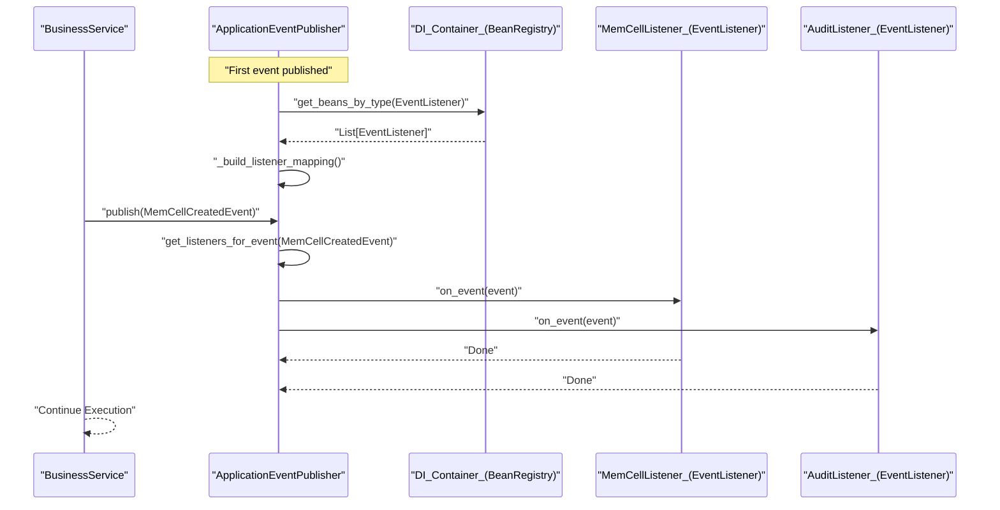

# Event System and Async Task Infrastructure
Relevant source files
- [methods/evermemos/docs/OVERVIEW.md](https://github.com/EverMind-AI/EverOS/blob/d40b8703/methods/evermemos/docs/OVERVIEW.md?plain=1)
- [methods/evermemos/docs/usage/CONFIGURATION_GUIDE.md](https://github.com/EverMind-AI/EverOS/blob/d40b8703/methods/evermemos/docs/usage/CONFIGURATION_GUIDE.md?plain=1)

EverOS utilizes an event-driven architecture to decouple core business logic from side effects such as background memory extraction, indexing, and external notifications. This system is built on a custom publisher-subscriber pattern integrated with the Dependency Injection (DI) framework, supporting both local in-process dispatching and distributed task execution.

## Core Event Abstractions

The system defines a standardized contract for all internal signals using the `BaseEvent` and `EventListener` abstractions.

### BaseEvent

All business events inherit from `BaseEvent`[src/core/events/base_event.py24-51](https://github.com/EverMind-AI/EverOS/blob/d40b8703/src/core/events/base_event.py#L24-L51) It provides:

- **Automatic Metadata**: Generates a unique `event_id` (UUID) and `created_at` timestamp (ISO format) upon instantiation [src/core/events/base_event.py54-57](https://github.com/EverMind-AI/EverOS/blob/d40b8703/src/core/events/base_event.py#L54-L57)
- **Serialization**: Built-in support for `to_json_str()` and `to_bson_bytes()`, essential for Kafka transmission and MongoDB storage [src/core/events/base_event.py105-121](https://github.com/EverMind-AI/EverOS/blob/d40b8703/src/core/events/base_event.py#L105-L121)
- **Type Tracking**: Includes an `_event_type` field in its dictionary representation to facilitate polymorphic deserialization [src/core/events/base_event.py71-83](https://github.com/EverMind-AI/EverOS/blob/d40b8703/src/core/events/base_event.py#L71-L83)

### EventListener

Listeners are abstract consumers that define which events they are interested in via `get_event_types()`[src/core/events/event_listener.py41-56](https://github.com/EverMind-AI/EverOS/blob/d40b8703/src/core/events/event_listener.py#L41-L56) They implement business logic in the asynchronous `on_event()` method [src/core/events/event_listener.py58-74](https://github.com/EverMind-AI/EverOS/blob/d40b8703/src/core/events/event_listener.py#L58-L74)

**Sources:**[src/core/events/base_event.py24-121](https://github.com/EverMind-AI/EverOS/blob/d40b8703/src/core/events/base_event.py#L24-L121)[src/core/events/event_listener.py15-85](https://github.com/EverMind-AI/EverOS/blob/d40b8703/src/core/events/event_listener.py#L15-L85)

## Application Event Publisher

The `ApplicationEventPublisher` acts as the central dispatching hub. It is registered as a singleton service in the DI container [src/core/events/event_publisher.py21-22](https://github.com/EverMind-AI/EverOS/blob/d40b8703/src/core/events/event_publisher.py#L21-L22)

### Dispatch Logic

1. **Lazy Discovery**: On the first call to `publish()`, the publisher queries the DI container for all beans of type `EventListener`[src/core/events/event_publisher.py56-81](https://github.com/EverMind-AI/EverOS/blob/d40b8703/src/core/events/event_publisher.py#L56-L81)
2. **Mapping**: It builds an internal registry mapping `BaseEvent` types to lists of interested `EventListener` instances [src/core/events/event_publisher.py88-107](https://github.com/EverMind-AI/EverOS/blob/d40b8703/src/core/events/event_publisher.py#L88-L107)
3. **Concurrent Execution**: When an event is published, the system uses `asyncio.gather` to invoke all matching listeners concurrently [src/core/events/event_publisher.py154-200](https://github.com/EverMind-AI/EverOS/blob/d40b8703/src/core/events/event_publisher.py#L154-L200)
4. **Error Isolation**: Each listener is wrapped in a `safe_invoke` coroutine. Exceptions in one listener are logged but do not prevent other listeners from executing [src/core/events/event_publisher.py184-200](https://github.com/EverMind-AI/EverOS/blob/d40b8703/src/core/events/event_publisher.py#L184-L200)

### Event Dispatch Data Flow

The following diagram illustrates how a business action triggers multiple parallel listeners.

Title: Event Dispatch Sequence

**Sources:**[src/core/events/event_publisher.py47-200](https://github.com/EverMind-AI/EverOS/blob/d40b8703/src/core/events/event_publisher.py#L47-L200)[src/core/events/event_listener.py41-74](https://github.com/EverMind-AI/EverOS/blob/d40b8703/src/core/events/event_listener.py#L41-L74)

## Kafka Integration and Async Infrastructure

For distributed workloads, EverOS integrates with Kafka to move heavy processing (like LLM-based memory extraction) out of the request-response cycle.

### Kafka Producer Factory

The `KafkaProducerFactory` manages `AIOKafkaProducer` instances. It includes critical performance patches for `aiokafka`:

- **Idempotent Start**: Prevents multiple sender tasks from being created if `start()` is called repeatedly [src/core/component/kafka_producer_factory.py54-70](https://github.com/EverMind-AI/EverOS/blob/d40b8703/src/core/component/kafka_producer_factory.py#L54-L70)
- **Optimized Drain**: Replaces inefficient `asyncio.wait` calls with `async_timeout` for lower overhead during message flushing [src/core/component/kafka_producer_factory.py32-48](https://github.com/EverMind-AI/EverOS/blob/d40b8703/src/core/component/kafka_producer_factory.py#L32-L48)

### Producer Configuration

The system uses environment-prefixed variables (e.g., `PRODUCER_KAFKA_SERVERS`) to configure SSL/CA paths, acknowledgment modes (`acks`), and compression types like `zstd`[src/core/component/kafka_producer_factory.py78-162](https://github.com/EverMind-AI/EverOS/blob/d40b8703/src/core/component/kafka_producer_factory.py#L78-L162)

### Background Memorize Worker Lifecycle

Asynchronous tasks are discovered via the `TaskScanDirectoriesRegistry`[src/addon.py28-35](https://github.com/EverMind-AI/EverOS/blob/d40b8703/src/addon.py#L28-L35) These tasks typically involve:

1. **Ingestion**: A `MemCellCreatedEvent` is published [src/infra_layer/adapters/out/event/memcell_created_event.py16-32](https://github.com/EverMind-AI/EverOS/blob/d40b8703/src/infra_layer/adapters/out/event/memcell_created_event.py#L16-L32)
2. **Queueing**: A Kafka-based listener serializes the event to BSON and pushes it to a topic [src/core/events/base_event.py114-121](https://github.com/EverMind-AI/EverOS/blob/d40b8703/src/core/events/base_event.py#L114-L121)
3. **Consumption**: A "LongJob" consumer (running in a separate process/container) retrieves the message and triggers the Memory Pipeline (Encoding → Consolidation).

### Code Entity Mapping: Infrastructure to Events

This diagram bridges the high-level infrastructure concepts to specific classes in the codebase.

Title: Event Infrastructure Mapping

[Flowchart Diagram]

**Sources:**[src/core/events/base_event.py24-51](https://github.com/EverMind-AI/EverOS/blob/d40b8703/src/core/events/base_event.py#L24-L51)[src/core/events/event_publisher.py22-34](https://github.com/EverMind-AI/EverOS/blob/d40b8703/src/core/events/event_publisher.py#L22-L34)[src/core/component/kafka_producer_factory.py17-70](https://github.com/EverMind-AI/EverOS/blob/d40b8703/src/core/component/kafka_producer_factory.py#L17-L70)[src/infra_layer/adapters/out/event/memcell_created_event.py16-27](https://github.com/EverMind-AI/EverOS/blob/d40b8703/src/infra_layer/adapters/out/event/memcell_created_event.py#L16-L27)[src/addon.py28-35](https://github.com/EverMind-AI/EverOS/blob/d40b8703/src/addon.py#L28-L35)

## Serialization and Data Flow

EverOS prioritizes BSON for internal event transmission due to its efficiency with binary data (like embeddings) and better type preservation compared to standard JSON.

| Feature | Implementation | File Reference |
| --- | --- | --- |
| **JSON Serialization** | `to_json_str()` using `json.dumps` | [src/core/events/base_event.py105-112](https://github.com/EverMind-AI/EverOS/blob/d40b8703/src/core/events/base_event.py#L105-L112) |
| **BSON Serialization** | `to_bson_bytes()` using `bson.encode` | [src/core/events/base_event.py114-121](https://github.com/EverMind-AI/EverOS/blob/d40b8703/src/core/events/base_event.py#L114-L121) |
| **Deserialization** | `from_dict()` (must be implemented by subclasses) | [src/core/events/base_event.py86-103](https://github.com/EverMind-AI/EverOS/blob/d40b8703/src/core/events/base_event.py#L86-L103) |
| **Event Identification** | `_event_type` field in dictionary | [src/core/events/base_event.py71-83](https://github.com/EverMind-AI/EverOS/blob/d40b8703/src/core/events/base_event.py#L71-L83) |

### Service Topology

The infrastructure depends on a suite of backing services, typically orchestrated via Docker Compose [methods/evermemos/docs/usage/CONFIGURATION_GUIDE.md68-96](https://github.com/EverMind-AI/EverOS/blob/d40b8703/methods/evermemos/docs/usage/CONFIGURATION_GUIDE.md?plain=1#L68-L96)

Title: Infrastructure Service Topology

[Flowchart Diagram]

**Sources:**[src/core/events/base_event.py71-161](https://github.com/EverMind-AI/EverOS/blob/d40b8703/src/core/events/base_event.py#L71-L161)[methods/evermemos/docs/usage/CONFIGURATION_GUIDE.md68-96](https://github.com/EverMind-AI/EverOS/blob/d40b8703/methods/evermemos/docs/usage/CONFIGURATION_GUIDE.md?plain=1#L68-L96)[src/addon.py28-35](https://github.com/EverMind-AI/EverOS/blob/d40b8703/src/addon.py#L28-L35)