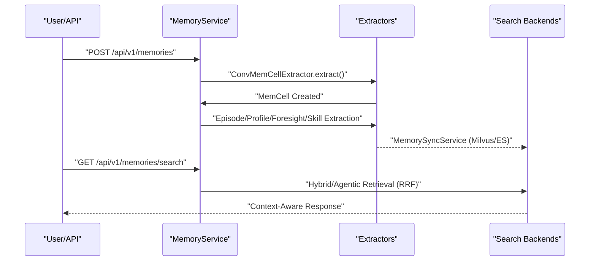

# EverMemOS Overview
Relevant source files
- [.gitignore](https://github.com/EverMind-AI/EverOS/blob/d40b8703/.gitignore)
- [README.md](https://github.com/EverMind-AI/EverOS/blob/d40b8703/README.md?plain=1)
- [methods/evermemos/docs/OVERVIEW.md](https://github.com/EverMind-AI/EverOS/blob/d40b8703/methods/evermemos/docs/OVERVIEW.md?plain=1)

EverMemOS is an enterprise-grade, open-source long-term memory system designed for conversational AI agents. Unlike traditional memory buffers that simply store raw message history, EverMemOS implements a sophisticated cognitive loop of **Memory Construction** and **Memory Perception**. It extracts structured insights from unstructured dialogues, organizes them into a hierarchical narrative, and utilizes agentic multi-round retrieval to provide AI agents with deep contextual awareness, self-evolving skills, and "foresight" [README.md63-67](https://github.com/EverMind-AI/EverOS/blob/d40b8703/README.md?plain=1#L63-L67)[methods/evermemos/docs/OVERVIEW.md9-17](https://github.com/EverMind-AI/EverOS/blob/d40b8703/methods/evermemos/docs/OVERVIEW.md?plain=1#L9-L17)

On the **LoCoMo** benchmark, EverMemOS achieves a reasoning accuracy of **92.3%**, significantly outperforming baseline memory methods by understanding the meaning behind stored data rather than just performing keyword matching [methods/evermemos/docs/OVERVIEW.md15-17](https://github.com/EverMind-AI/EverOS/blob/d40b8703/methods/evermemos/docs/OVERVIEW.md?plain=1#L15-L17)

## Core Value Proposition

- **Coherent Narratives**: Connects scattered conversation fragments into thematic "Episodes," allowing the AI to follow complex project threads over long durations [methods/evermemos/docs/OVERVIEW.md27-34](https://github.com/EverMind-AI/EverOS/blob/d40b8703/methods/evermemos/docs/OVERVIEW.md?plain=1#L27-L34)
- **Evidence-Based Perception**: Uses "Foresight" and "Event Logs" to proactively capture deep connections (e.g., remembering a user's recent surgery when recommending food) [methods/evermemos/docs/OVERVIEW.md35-42](https://github.com/EverMind-AI/EverOS/blob/d40b8703/methods/evermemos/docs/OVERVIEW.md?plain=1#L35-L42)
- **Self-Evolving Agents**: Beyond user memory, EverMemOS supports **AgentCase** and **AgentSkill** extraction, allowing agents to learn from their own past performance and refine their tool-use capabilities [README.md107-111](https://github.com/EverMind-AI/EverOS/blob/d40b8703/README.md?plain=1#L107-L111)
- **Living Profiles**: Dynamically updates user preferences, traits, and behavioral roles in real-time, evolving the AI's understanding of the user with every interaction [methods/evermemos/docs/OVERVIEW.md43-50](https://github.com/EverMind-AI/EverOS/blob/d40b8703/methods/evermemos/docs/OVERVIEW.md?plain=1#L43-L50)
- **Production-Ready Infrastructure**: Built on a robust stack including **MongoDB** (persistence), **Elasticsearch** (BM25 search), and **Milvus** (vector search) [README.md37-48](https://github.com/EverMind-AI/EverOS/blob/d40b8703/README.md?plain=1#L37-L48)

## System Architecture

EverMemOS follows a layered architecture that separates concerns between raw data ingestion, memory extraction logic, and multi-modal retrieval orchestration.

### High-Level System Layers

The following diagram illustrates the relationship between the conceptual system layers and the primary code entities that implement them.

**Diagram: Layered Architecture and Code Mapping**

```

```

Sources: [README.md37-48](https://github.com/EverMind-AI/EverOS/blob/d40b8703/README.md?plain=1#L37-L48)[methods/evermemos/docs/OVERVIEW.md56-106](https://github.com/EverMind-AI/EverOS/blob/d40b8703/methods/evermemos/docs/OVERVIEW.md?plain=1#L56-L106)

## Key Concepts

The system operates on several fundamental data entities that represent different dimensions of memory [methods/evermemos/docs/OVERVIEW.md68-72](https://github.com/EverMind-AI/EverOS/blob/d40b8703/methods/evermemos/docs/OVERVIEW.md?plain=1#L68-L72):

| Concept | Description | Code Entity |
| --- | --- | --- |
| **MemCell** | The atomic unit of memory. A single structured fact or event distilled from raw messages. | `MemCell` |
| **Episode** | A collection of related MemCells forming a coherent narrative or "storyline" around a theme. | `EpisodicMemory` |
| **Profile** | Long-term traits, preferences, and roles of users or groups, updated dynamically. | `UserProfile` / `GroupProfile` |
| **Foresight** | Temporal predictions and expectations derived from past events to guide future decisions. | `ForesightRecord` |
| **AgentCase** | A specific instance of an agent performing a task, including intent, approach, and quality. | `AgentCase` |
| **AgentSkill** | Distilled expertise derived from multiple AgentCases, representing an agent's evolved capability. | `AgentSkill` |

## The Memory Pipeline

The lifecycle of a memory follows a three-stage pipeline: **Encoding** (Extraction), **Consolidation** (Storage), and **Retrieval** (Perception) [methods/evermemos/docs/OVERVIEW.md56-106](https://github.com/EverMind-AI/EverOS/blob/d40b8703/methods/evermemos/docs/OVERVIEW.md?plain=1#L56-L106)

**Diagram: Memory Construction and Perception Flow**



Sources: [methods/evermemos/docs/OVERVIEW.md56-106](https://github.com/EverMind-AI/EverOS/blob/d40b8703/methods/evermemos/docs/OVERVIEW.md?plain=1#L56-L106)

## Navigation

For deeper technical dives, please explore the following child pages:

- **[Getting Started](/EverMind-AI/EverOS/1.1-getting-started)**: Step-by-step guide for setting up the environment using `uv`, Docker infrastructure (MongoDB, Milvus, Elasticsearch), and running your first smoke test.
- **[Core Concepts and Terminology](/EverMind-AI/EverOS/1.2-core-concepts-and-terminology)**: Detailed breakdown of data entities (MemCell, Episode, Foresight, AgentCase, AgentSkill, Profile) and the internal three-stage processing pipeline.

For information on the REST API, see the **[REST API Reference](/EverMind-AI/EverOS/5-rest-api-reference)**. For details on the persistence strategy, see the **[Persistence Layer](/EverMind-AI/EverOS/6-persistence-layer)** documentation.

Sources: [README.md23-48](https://github.com/EverMind-AI/EverOS/blob/d40b8703/README.md?plain=1#L23-L48)[methods/evermemos/docs/OVERVIEW.md135-142](https://github.com/EverMind-AI/EverOS/blob/d40b8703/methods/evermemos/docs/OVERVIEW.md?plain=1#L135-L142)