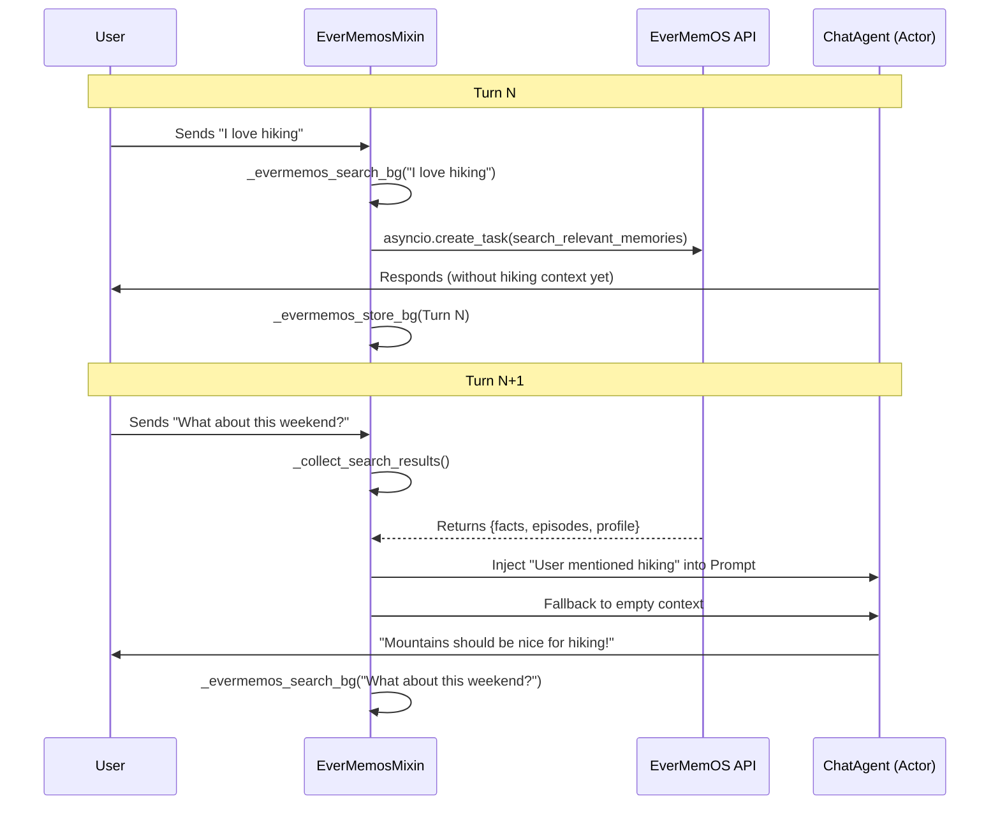

# EverMemosMixin and Session Context
Relevant source files
- [use-cases/openher/.env.example](https://github.com/EverMind-AI/EverOS/blob/d40b8703/use-cases/openher/.env.example)
- [use-cases/openher/README.md](https://github.com/EverMind-AI/EverOS/blob/d40b8703/use-cases/openher/README.md?plain=1)
- [use-cases/openher/demo/evermemos_demo.py](https://github.com/EverMind-AI/EverOS/blob/d40b8703/use-cases/openher/demo/evermemos_demo.py)
- [use-cases/openher/integration/context_features.py](https://github.com/EverMind-AI/EverOS/blob/d40b8703/use-cases/openher/integration/context_features.py)
- [use-cases/openher/integration/evermemos_mixin.py](https://github.com/EverMind-AI/EverOS/blob/d40b8703/use-cases/openher/integration/evermemos_mixin.py)
- [use-cases/openher/integration/memory_types.py](https://github.com/EverMind-AI/EverOS/blob/d40b8703/use-cases/openher/integration/memory_types.py)

The `EverMemosMixin` serves as the primary integration bridge between the **OpenHer** AI persona engine and **EverMemOS**. It provides a lifecycle-aware mechanism for managing long-term declarative memory, allowing AI personas to maintain a consistent understanding of users across sessions. By expanding the persona's perception from 8D to 12D, it enables emergent behavioral changes based on historical relationship depth and trust.

## SessionContext Data Structure

The `SessionContext` is the foundational data structure loaded at the start of a session. It encapsulates both qualitative narrative data and quantitative relationship metrics used by the neural network.

| Field | Type | Description |
| --- | --- | --- |
| `user_profile` | `str` | Accumulated facts about the user (name, preferences, occupation). |
| `episode_summary` | `str` | Narrative history of past interactions. |
| `foresight_text` | `str` | Unresolved topics or future concerns predicted by EverMemOS. |
| `relationship_depth` | `float` | 0 (stranger) to 1 (old friend) based on interaction volume. |
| `emotional_valence` | `float` | -1 (negative history) to 1 (positive history). |
| `trust_level` | `float` | 0 (no trust) to 1 (deep trust) score. |
| `pending_foresight` | `float` | Binary-ish signal (0 or 1) indicating unresolved narrative threads. |
| `has_history` | `bool` | Flag to gate search operations if no prior data exists. |

**Sources:**`<FileRef file-url="https://github.com/EverMind-AI/EverOS/blob/d40b8703/use-cases/openher/integration/memory_types.py#L36-L67" min=36 max=67 file-path="use-cases/openher/integration/memory_types.py">Hii</FileRef>`, `<FileRef file-url="https://github.com/EverMind-AI/EverOS/blob/d40b8703/use-cases/openher/integration/context_features.py#L48-L53" min=48 max=53 file-path="use-cases/openher/integration/context_features.py">Hii</FileRef>`

## EverMemosMixin Lifecycle

The `EverMemosMixin` hooks into the `ChatAgent` lifecycle at specific steps to ensure memory operations do not block the persona's responsiveness.

### Session Initialization (`_evermemos_gather`)

On the first turn of a session (`_turn_count == 1`), the mixin calls `load_session_context()` to populate the `_session_ctx`. This data is cached for the remainder of the session. It returns a 4D relationship vector derived from the context to initialize the persona's internal state.

**Sources:**`<FileRef file-url="https://github.com/EverMind-AI/EverOS/blob/d40b8703/use-cases/openher/integration/evermemos_mixin.py#L25-L60" min=25 max=60 file-path="use-cases/openher/integration/evermemos_mixin.py">Hii</FileRef>`

### Relationship Evolution (`_apply_relationship_ema`)

Relationship metrics are updated using a **Semi-Emergent** pattern. The system calculates a posterior value by adding an LLM-judged delta (from the Critic LLM) to the current prior, then applies an Exponential Moving Average (EMA) to smooth the transition.

**The EMA Formula:**`state_t = alpha * posterior + (1 - alpha) * state_{t-1}`

The `alpha` value is modulated by `conversation_depth`:

- **Shallow conversation (0.0):** Alpha defaults to 0.15 (trusts long-term history more).
- **Deep conversation (1.0):** Alpha scales up to 0.65 (allows current interaction to shift the relationship more significantly).

**Sources:**`<FileRef file-url="https://github.com/EverMind-AI/EverOS/blob/d40b8703/use-cases/openher/integration/evermemos_mixin.py#L61-L104" min=61 max=104 file-path="use-cases/openher/integration/evermemos_mixin.py">Hii</FileRef>`, `<FileRef file-url="https://github.com/EverMind-AI/EverOS/blob/d40b8703/use-cases/openher/demo/evermemos_demo.py#L151-L178" min=151 max=178 file-path="use-cases/openher/demo/evermemos_demo.py">Hii</FileRef>`

### Background Tasks and Fallbacks

To maintain a "human-like" flow, memory operations are performed asynchronously.

1. **`_evermemos_store_bg()`**: Uses `asyncio.create_task` to perform fire-and-forget storage of the conversation turn via `evermemos.store_turn`.
2. **`_evermemos_search_bg()`**: Triggers an async search for the current message in the background. It cancels any pending search from a previous turn to prevent resource leakage.
3. **`_collect_search_results()`**: Attempt to retrieve results from the previous turn's search.

#### The 500ms Timeout Pattern

Retrieval implements a strict **500ms timeout fallback**. If the search task does not complete within this window (using `asyncio.wait_for`), the system gracefully degrades by using empty strings for `_relevant_facts`, `_relevant_episodes`, and `_relevant_profile`. This ensures the AI Being never "freezes" while trying to remember.

**Sources:**`<FileRef file-url="https://github.com/EverMind-AI/EverOS/blob/d40b8703/use-cases/openher/integration/evermemos_mixin.py#L106-L127" min=106 max=127 file-path="use-cases/openher/integration/evermemos_mixin.py">Hii</FileRef>`, `<FileRef file-url="https://github.com/EverMind-AI/EverOS/blob/d40b8703/use-cases/openher/integration/evermemos_mixin.py#L128-L156" min=128 max=156 file-path="use-cases/openher/integration/evermemos_mixin.py">Hii</FileRef>`, `<FileRef file-url="https://github.com/EverMind-AI/EverOS/blob/d40b8703/use-cases/openher/integration/evermemos_mixin.py#L157-L190" min=157 max=190 file-path="use-cases/openher/integration/evermemos_mixin.py">Hii</FileRef>`, `<FileRef file-url="https://github.com/EverMind-AI/EverOS/blob/d40b8703/use-cases/openher/README.md?plain=1#L73-L90" min=73 max=90 file-path="use-cases/openher/README.md">Hii</FileRef>`

## Data Flow: From Memory to Neural Signals

The following diagram illustrates how EverMemOS entities map to the `GenomeEngine` input space, bridging the gap between stored declarative memory and active behavioral signals.

### Memory-to-Persona Mapping

[Flowchart Diagram]

**Sources:**`<FileRef file-url="https://github.com/EverMind-AI/EverOS/blob/d40b8703/use-cases/openher/integration/context_features.py#L37-L67" min=37 max=67 file-path="use-cases/openher/integration/context_features.py">Hii</FileRef>`, `<FileRef file-url="https://github.com/EverMind-AI/EverOS/blob/d40b8703/use-cases/openher/integration/memory_types.py#L49-L55" min=49 max=55 file-path="use-cases/openher/integration/memory_types.py">Hii</FileRef>`, `<FileRef file-url="https://github.com/EverMind-AI/EverOS/blob/d40b8703/use-cases/openher/README.md?plain=1#L46-L67" min=46 max=67 file-path="use-cases/openher/README.md">Hii</FileRef>`

## Async Retrieval Pipeline

This diagram tracks the lifecycle of a single memory search across two conversation turns, highlighting the asynchronous nature of the `EverMemosMixin` methods.

### Asynchronous Turn-Based Search

**Sources:**`<FileRef file-url="https://github.com/EverMind-AI/EverOS/blob/d40b8703/use-cases/openher/integration/evermemos_mixin.py#L128-L190" min=128 max=190 file-path="use-cases/openher/integration/evermemos_mixin.py">Hii</FileRef>`, `<FileRef file-url="https://github.com/EverMind-AI/EverOS/blob/d40b8703/use-cases/openher/README.md?plain=1#L73-L90" min=73 max=90 file-path="use-cases/openher/README.md">Hii</FileRef>`, `<FileRef file-url="https://github.com/EverMind-AI/EverOS/blob/d40b8703/use-cases/openher/README.md?plain=1#L92-L123" min=92 max=123 file-path="use-cases/openher/README.md">Hii</FileRef>`