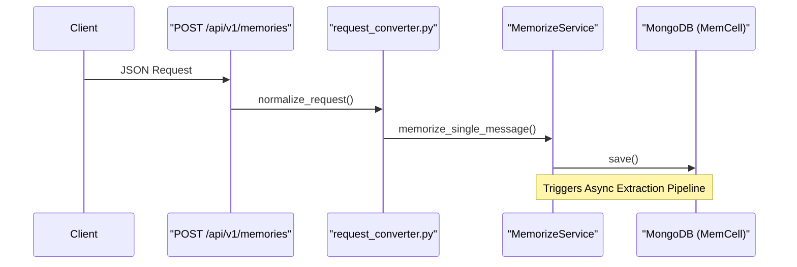

# Getting Started
Relevant source files
- [methods/evermemos/.devcontainer/devcontainer.json](https://github.com/EverMind-AI/EverOS/blob/d40b8703/methods/evermemos/.devcontainer/devcontainer.json)
- [methods/evermemos/.devcontainer/docker-compose.devcontainer.yaml](https://github.com/EverMind-AI/EverOS/blob/d40b8703/methods/evermemos/.devcontainer/docker-compose.devcontainer.yaml)
- [methods/evermemos/.devcontainer/postCreate.sh](https://github.com/EverMind-AI/EverOS/blob/d40b8703/methods/evermemos/.devcontainer/postCreate.sh)
- [methods/evermemos/.devcontainer/postStart.sh](https://github.com/EverMind-AI/EverOS/blob/d40b8703/methods/evermemos/.devcontainer/postStart.sh)
- [methods/evermemos/docs/dev_docs/getting_started.md](https://github.com/EverMind-AI/EverOS/blob/d40b8703/methods/evermemos/docs/dev_docs/getting_started.md?plain=1)
- [methods/evermemos/docs/installation/SETUP.md](https://github.com/EverMind-AI/EverOS/blob/d40b8703/methods/evermemos/docs/installation/SETUP.md?plain=1)

This guide provides a step-by-step walkthrough for setting up the **EverMemOS** development environment. It covers prerequisites, dependency management using `uv`, infrastructure deployment via Docker Compose, and initial service verification.

## 1. Prerequisites

Before starting, ensure your system meets the following requirements:

- **Operating System**: macOS (Intel/Silicon), Linux (Ubuntu 20.04+), or Windows (via WSL2) [methods/evermemos/docs/installation/SETUP.md39-45](https://github.com/EverMind-AI/EverOS/blob/d40b8703/methods/evermemos/docs/installation/SETUP.md?plain=1#L39-L45)
- **Python**: Version 3.10 or higher (3.12+ recommended) [methods/evermemos/docs/installation/SETUP.md26](https://github.com/EverMind-AI/EverOS/blob/d40b8703/methods/evermemos/docs/installation/SETUP.md?plain=1#L26-L26)[methods/evermemos/docs/dev_docs/getting_started.md21](https://github.com/EverMind-AI/EverOS/blob/d40b8703/methods/evermemos/docs/dev_docs/getting_started.md?plain=1#L21-L21)
- **Memory**: At least 4GB RAM available for infrastructure services (8GB+ recommended) [methods/evermemos/docs/installation/SETUP.md30-35](https://github.com/EverMind-AI/EverOS/blob/d40b8703/methods/evermemos/docs/installation/SETUP.md?plain=1#L30-L35)
- **Tools**: `docker` (20.10+) and `docker-compose` (2.0+) [methods/evermemos/docs/installation/SETUP.md28-29](https://github.com/EverMind-AI/EverOS/blob/d40b8703/methods/evermemos/docs/installation/SETUP.md?plain=1#L28-L29)

## 2. Environment Setup

EverMemOS uses `uv` for high-performance dependency management and virtual environment isolation.

### Step 1: Install uv

```
# macOS/Linux
curl -LsSf https://astral.sh/uv/install.sh | sh
 
# Windows (PowerShell)
powershell -c "irm https://astral.sh/uv/install.ps1 | iex"
```

Sources: [methods/evermemos/docs/installation/SETUP.md96-100](https://github.com/EverMind-AI/EverOS/blob/d40b8703/methods/evermemos/docs/installation/SETUP.md?plain=1#L96-L100)[methods/evermemos/docs/dev_docs/getting_started.md33-42](https://github.com/EverMind-AI/EverOS/blob/d40b8703/methods/evermemos/docs/dev_docs/getting_started.md?plain=1#L33-L42)

### Step 2: Clone and Install

```
git clone https://github.com/EverMind-AI/EverMemOS.git
cd EverMemOS/methods/evermemos
uv sync
```

Sources: [methods/evermemos/docs/installation/SETUP.md61-66](https://github.com/EverMind-AI/EverOS/blob/d40b8703/methods/evermemos/docs/installation/SETUP.md?plain=1#L61-L66)[methods/evermemos/docs/installation/SETUP.md117](https://github.com/EverMind-AI/EverOS/blob/d40b8703/methods/evermemos/docs/installation/SETUP.md?plain=1#L117-L117)

### Step 3: Infrastructure Launch

EverMemOS relies on a multi-database backbone (MongoDB, Elasticsearch, Milvus, Redis). Start these using the provided Compose file:

```
docker-compose up -d
```

This command initializes MongoDB (27017), Elasticsearch (19200), Milvus (19530), and Redis (6379) [methods/evermemos/docs/installation/SETUP.md72-80](https://github.com/EverMind-AI/EverOS/blob/d40b8703/methods/evermemos/docs/installation/SETUP.md?plain=1#L72-L80)

## 3. Configuration (.env)

The system requires specific environment variables for LLM providers and database connectivity.

1. Copy the template: `cp env.template .env`[methods/evermemos/docs/installation/SETUP.md132](https://github.com/EverMind-AI/EverOS/blob/d40b8703/methods/evermemos/docs/installation/SETUP.md?plain=1#L132-L132)
2. Configure your **LLM Provider** (OpenRouter or OpenAI) [methods/evermemos/docs/dev_docs/getting_started.md74-88](https://github.com/EverMind-AI/EverOS/blob/d40b8703/methods/evermemos/docs/dev_docs/getting_started.md?plain=1#L74-L88)
3. Set the **Vectorize** (Embedding) and **Rerank** providers. DeepInfra is recommended for managed APIs [methods/evermemos/docs/installation/SETUP.md171-180](https://github.com/EverMind-AI/EverOS/blob/d40b8703/methods/evermemos/docs/installation/SETUP.md?plain=1#L171-L180)

### Key Configuration Variables

| Category | Variable | Default/Example | Description |
| --- | --- | --- | --- |
| **Tenant** | `TENANT_SINGLE_TENANT_ID` | `t_yourname` | Required for resource isolation [methods/evermemos/docs/dev_docs/getting_started.md117-118](https://github.com/EverMind-AI/EverOS/blob/d40b8703/methods/evermemos/docs/dev_docs/getting_started.md?plain=1#L117-L118) |
| **LLM** | `LLM_MODEL` | `x-ai/grok-4-fast` | Model for extraction/summarization [methods/evermemos/docs/dev_docs/getting_started.md79](https://github.com/EverMind-AI/EverOS/blob/d40b8703/methods/evermemos/docs/dev_docs/getting_started.md?plain=1#L79-L79) |
| **Vector** | `VECTORIZE_MODEL` | `Qwen/Qwen3-Embedding-4B` | Model for text embeddings [methods/evermemos/docs/dev_docs/getting_started.md97](https://github.com/EverMind-AI/EverOS/blob/d40b8703/methods/evermemos/docs/dev_docs/getting_started.md?plain=1#L97-L97) |
| **Rerank** | `RERANK_MODEL` | `Qwen/Qwen3-Reranker-4B` | Model for relevance scoring [methods/evermemos/docs/dev_docs/getting_started.md108](https://github.com/EverMind-AI/EverOS/blob/d40b8703/methods/evermemos/docs/dev_docs/getting_started.md?plain=1#L108-L108) |

Sources: [methods/evermemos/docs/installation/SETUP.md148-198](https://github.com/EverMind-AI/EverOS/blob/d40b8703/methods/evermemos/docs/installation/SETUP.md?plain=1#L148-L198)[methods/evermemos/docs/dev_docs/getting_started.md70-136](https://github.com/EverMind-AI/EverOS/blob/d40b8703/methods/evermemos/docs/dev_docs/getting_started.md?plain=1#L70-L136)

## 4. System Architecture Overview

The following diagram illustrates the relationship between the setup components and the code entities responsible for initializing the system.

### Startup and Dependency Flow

```

```

Sources: [methods/evermemos/docs/dev_docs/getting_started.md145-172](https://github.com/EverMind-AI/EverOS/blob/d40b8703/methods/evermemos/docs/dev_docs/getting_started.md?plain=1#L145-L172)[methods/evermemos/docs/dev_docs/getting_started.md216-218](https://github.com/EverMind-AI/EverOS/blob/d40b8703/methods/evermemos/docs/dev_docs/getting_started.md?plain=1#L216-L218)[methods/evermemos/docs/installation/SETUP.md70-82](https://github.com/EverMind-AI/EverOS/blob/d40b8703/methods/evermemos/docs/installation/SETUP.md?plain=1#L70-L82)

## 5. Running the Server

Start the REST API server on the default port `1995`:

```
uv run python src/run.py --port 1995
```

Sources: [methods/evermemos/docs/installation/SETUP.md207](https://github.com/EverMind-AI/EverOS/blob/d40b8703/methods/evermemos/docs/installation/SETUP.md?plain=1#L207-L207)[methods/evermemos/docs/dev_docs/getting_started.md165](https://github.com/EverMind-AI/EverOS/blob/d40b8703/methods/evermemos/docs/dev_docs/getting_started.md?plain=1#L165-L165)

### Service Verification (Smoke Test)

Check the health endpoint to ensure all database connections are established:

```
curl http://localhost:1995/health
```

Expected response: A healthy status indicating the service is ready [methods/evermemos/docs/installation/SETUP.md238-241](https://github.com/EverMind-AI/EverOS/blob/d40b8703/methods/evermemos/docs/installation/SETUP.md?plain=1#L238-L241)

## 6. Quick Smoke Test: Memory Ingestion

To verify the full pipeline (Ingestion -> Extraction -> Search), you can run the provided simple demo:

```
uv run python src/bootstrap.py demo/simple_demo.py
```

This script performs the following sequence:

1. Stores sample conversation messages using `SimpleMemoryManager`.
2. Waits for indexing via `wait_for_index()`.
3. Searches for relevant memories.
4. Displays the results.

Sources: [methods/evermemos/docs/installation/SETUP.md247-258](https://github.com/EverMind-AI/EverOS/blob/d40b8703/methods/evermemos/docs/installation/SETUP.md?plain=1#L247-L258)[methods/evermemos/docs/dev_docs/getting_started.md225-226](https://github.com/EverMind-AI/EverOS/blob/d40b8703/methods/evermemos/docs/dev_docs/getting_started.md?plain=1#L225-L226)

### Data Flow: Ingestion to Code

The diagram below maps the ingestion request to the specific code components handling the data.



Sources: [methods/evermemos/docs/dev_docs/getting_started.md161-183](https://github.com/EverMind-AI/EverOS/blob/d40b8703/methods/evermemos/docs/dev_docs/getting_started.md?plain=1#L161-L183)[methods/evermemos/docs/installation/SETUP.md252-255](https://github.com/EverMind-AI/EverOS/blob/d40b8703/methods/evermemos/docs/installation/SETUP.md?plain=1#L252-L255)

## 7. Development Tools

### VSCode Integration

The project includes `.vscode/launch.json` for debugging:

- `Python 调试程序: run`: Starts the API service using `src/run.py`[methods/evermemos/docs/dev_docs/getting_started.md207](https://github.com/EverMind-AI/EverOS/blob/d40b8703/methods/evermemos/docs/dev_docs/getting_started.md?plain=1#L207-L207)
- `Python 调试程序: task`: Starts the `arq` task worker using `task.WorkerSettings`[methods/evermemos/docs/dev_docs/getting_started.md191](https://github.com/EverMind-AI/EverOS/blob/d40b8703/methods/evermemos/docs/dev_docs/getting_started.md?plain=1#L191-L191)
- `Python 调试程序: longjob`: Starts background consumers via `src/run.py --longjob`[methods/evermemos/docs/dev_docs/getting_started.md198](https://github.com/EverMind-AI/EverOS/blob/d40b8703/methods/evermemos/docs/dev_docs/getting_started.md?plain=1#L198-L198)

Sources: [methods/evermemos/docs/dev_docs/getting_started.md201-212](https://github.com/EverMind-AI/EverOS/blob/d40b8703/methods/evermemos/docs/dev_docs/getting_started.md?plain=1#L201-L212)[methods/evermemos/.devcontainer/devcontainer.json19-29](https://github.com/EverMind-AI/EverOS/blob/d40b8703/methods/evermemos/.devcontainer/devcontainer.json#L19-L29)

### Dev Container

A pre-configured Dev Container is available for VSCode, providing an isolated environment based on `ghcr.io/astral-sh/uv:python3.12-bookworm`. It pre-links all infrastructure services like `mongodb`, `elasticsearch`, `milvus-standalone`, and `redis`[methods/evermemos/.devcontainer/docker-compose.devcontainer.yaml1-24](https://github.com/EverMind-AI/EverOS/blob/d40b8703/methods/evermemos/.devcontainer/docker-compose.devcontainer.yaml#L1-L24)[methods/evermemos/.devcontainer/devcontainer.json1-63](https://github.com/EverMind-AI/EverOS/blob/d40b8703/methods/evermemos/.devcontainer/devcontainer.json#L1-L63)

The `postCreate.sh` script handles the installation of system dependencies (e.g., `libgl1`, `ffmpeg`) and automatically synchronizes Python dependencies using `uv sync --dev`[methods/evermemos/.devcontainer/postCreate.sh1-34](https://github.com/EverMind-AI/EverOS/blob/d40b8703/methods/evermemos/.devcontainer/postCreate.sh#L1-L34) Upon starting, `postStart.sh` verifies the health of infrastructure services before the environment is ready for use [methods/evermemos/.devcontainer/postStart.sh1-43](https://github.com/EverMind-AI/EverOS/blob/d40b8703/methods/evermemos/.devcontainer/postStart.sh#L1-L43)

Sources: [methods/evermemos/.devcontainer/postCreate.sh1-45](https://github.com/EverMind-AI/EverOS/blob/d40b8703/methods/evermemos/.devcontainer/postCreate.sh#L1-L45)[methods/evermemos/.devcontainer/postStart.sh1-43](https://github.com/EverMind-AI/EverOS/blob/d40b8703/methods/evermemos/.devcontainer/postStart.sh#L1-L43)