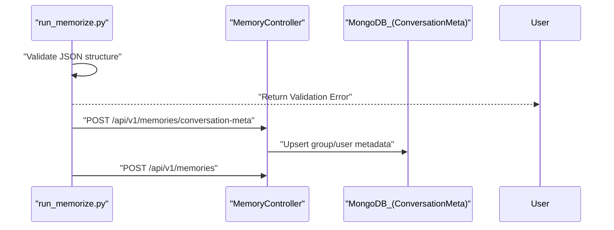

# GroupChatFormat Specification
Relevant source files
- [methods/evermemos/docs/advanced/TEAM_CHAT_GUIDE.md](https://github.com/EverMind-AI/EverOS/blob/d40b8703/methods/evermemos/docs/advanced/TEAM_CHAT_GUIDE.md?plain=1)
- [methods/evermemos/docs/usage/BATCH_OPERATIONS.md](https://github.com/EverMind-AI/EverOS/blob/d40b8703/methods/evermemos/docs/usage/BATCH_OPERATIONS.md?plain=1)

The `GroupChatFormat` is the standardized JSON schema used by EverMemOS for batch ingestion of conversation history. It provides a structured way to import multi-turn dialogues while preserving critical context such as participant roles, group identifiers, and temporal metadata. This format is essential for the system to perform accurate episodic memory extraction and profile building.

## 1. Schema Overview

The format consists of two primary sections: `session_meta` (global context) and `conversation_list` (the sequence of messages). Note that in some documentation and sample files, the metadata field is referred to as `conversation_meta` or `session_meta` interchangeably; the batch processing script handles these mappings.

### 1.1 Root Object

| Field | Type | Required | Description |
| --- | --- | --- | --- |
| `version` | string | Yes | Schema version (currently `1.0.0`) |
| `session_meta` | object | Yes | Metadata defining the group and participants |
| `conversation_list` | array | Yes | List of message objects in chronological order |

**Sources:**[methods/evermemos/docs/usage/BATCH_OPERATIONS.md92-94](https://github.com/EverMind-AI/EverOS/blob/d40b8703/methods/evermemos/docs/usage/BATCH_OPERATIONS.md?plain=1#L92-L94)[methods/evermemos/docs/advanced/TEAM_CHAT_GUIDE.md179-181](https://github.com/EverMind-AI/EverOS/blob/d40b8703/methods/evermemos/docs/advanced/TEAM_CHAT_GUIDE.md?plain=1#L179-L181)

---

## 2. Conversation Metadata (`session_meta`)

This object defines the environment in which the conversation takes place. It allows EverMemOS to distinguish between 1:1 assistant interactions and multi-user group chats.

### 2.1 Metadata Fields

| Field | Type | Required | Description |
| --- | --- | --- | --- |
| `group_id` | string | No* | Unique ID for the group. If null, a default is generated based on the sender. |
| `name` | string | No | Human-readable name (e.g., "Project Alpha Discussion"). |
| `scene` | string | No | Internal scene descriptor: `solo` (1:1) or `team` (group chat). |
| `description` | string | No | Human-readable description of the group's purpose. |
| `user_details` | object | Yes | Map of `user_id` to user information objects. |
| `timezone` | string | No | IANA timezone (e.g., `UTC`, `Asia/Shanghai`). |

**Note: `group_id` is highly recommended for multi-user contexts. When messages share a `group_id`, the system builds richer episodic memories by understanding relationships between different senders. Starting from v1.2.0, if omitted, the API automatically creates a default group based on the `sender` field.*

### 2.2 User Details Object

Each key in `user_details` must match a `sender` ID in the `conversation_list`.

| Field | Type | Description |
| --- | --- | --- |
| `full_name` | string | Display name of the participant. |
| `role` | string | Professional title or functional role (e.g., "Product Manager"). |
| `nickname` | string | Preferred informal name. |
| `custom_role` | string | Additional role specification used in team contexts. |
| `extra` | object | Arbitrary metadata (e.g., `{"department": "Engineering"}`). |

**Sources:**[methods/evermemos/docs/advanced/TEAM_CHAT_GUIDE.md37-38](https://github.com/EverMind-AI/EverOS/blob/d40b8703/methods/evermemos/docs/advanced/TEAM_CHAT_GUIDE.md?plain=1#L37-L38)[methods/evermemos/docs/advanced/TEAM_CHAT_GUIDE.md67-78](https://github.com/EverMind-AI/EverOS/blob/d40b8703/methods/evermemos/docs/advanced/TEAM_CHAT_GUIDE.md?plain=1#L67-L78)[methods/evermemos/docs/advanced/TEAM_CHAT_GUIDE.md181-200](https://github.com/EverMind-AI/EverOS/blob/d40b8703/methods/evermemos/docs/advanced/TEAM_CHAT_GUIDE.md?plain=1#L181-L200)[methods/evermemos/docs/usage/BATCH_OPERATIONS.md95-112](https://github.com/EverMind-AI/EverOS/blob/d40b8703/methods/evermemos/docs/usage/BATCH_OPERATIONS.md?plain=1#L95-L112)

---

## 3. Conversation List (`conversation_list`)

The list contains individual message objects. The order must be chronological to ensure the `MemCell` extraction logic correctly identifies session boundaries and temporal gaps.

### 3.1 Message Object Fields

| Field | Type | Required | Description |
| --- | --- | --- | --- |
| `message_id` | string | Yes | Unique identifier for the message. |
| `create_time` | string | Yes | ISO 8601 timestamp with timezone. |
| `sender` | string | Yes | ID matching a key in `user_details`. |
| `content` | string | Yes | The actual text of the message. |
| `sender_name` | string | No | Override for the display name. |
| `type` | string | No | Message type (e.g., `text`). |
| `refer_list` | array | No | List of message IDs this message refers to (e.g., replies). |

**Sources:**[methods/evermemos/docs/usage/BATCH_OPERATIONS.md113-127](https://github.com/EverMind-AI/EverOS/blob/d40b8703/methods/evermemos/docs/usage/BATCH_OPERATIONS.md?plain=1#L113-L127)[methods/evermemos/docs/usage/BATCH_OPERATIONS.md137-152](https://github.com/EverMind-AI/EverOS/blob/d40b8703/methods/evermemos/docs/usage/BATCH_OPERATIONS.md?plain=1#L137-L152)[methods/evermemos/docs/advanced/TEAM_CHAT_GUIDE.md201-221](https://github.com/EverMind-AI/EverOS/blob/d40b8703/methods/evermemos/docs/advanced/TEAM_CHAT_GUIDE.md?plain=1#L201-L221)

---

## 4. Implementation and Data Flow

When a `GroupChatFormat` file is processed via the `run_memorize.py` CLI tool, it follows a pipeline to synchronize metadata and ingest messages.

### 4.1 Ingestion Data Flow

The following diagram illustrates how the JSON structure is mapped to internal system entities and API calls.

**Title: GroupChatFormat to System Entity Mapping**

[Flowchart Diagram]

**Sources:**[methods/evermemos/docs/usage/BATCH_OPERATIONS.md50-66](https://github.com/EverMind-AI/EverOS/blob/d40b8703/methods/evermemos/docs/usage/BATCH_OPERATIONS.md?plain=1#L50-L66)[methods/evermemos/docs/advanced/TEAM_CHAT_GUIDE.md243-246](https://github.com/EverMind-AI/EverOS/blob/d40b8703/methods/evermemos/docs/advanced/TEAM_CHAT_GUIDE.md?plain=1#L243-L246)

### 4.2 Scene-Based Processing

The `--scene` parameter in the ingestion script determines the extraction strategy applied by the backend.

| CLI Scene | Internal Logic | Use Case |
| --- | --- | --- |
| `solo` | `AssistantScenario` | 1:1 interactions with an AI assistant. |
| `team` | `GroupChatScenario` | Multi-person discussions where participant dynamics matter. |

**Sources:**[methods/evermemos/docs/usage/BATCH_OPERATIONS.md77-85](https://github.com/EverMind-AI/EverOS/blob/d40b8703/methods/evermemos/docs/usage/BATCH_OPERATIONS.md?plain=1#L77-L85)

---

## 5. Sample Data Reference

The repository provides several examples demonstrating different conversation types.

### 5.1 Team Standup (Multi-party)

This format is used for group discussions where context between multiple users is critical for episodic memory.

```
{
  "version": "1.0.0",
  "session_meta": {
    "group_id": "team_standup",
    "name": "Daily Standup",
    "user_details": {
      "alice": {"full_name": "Alice Smith"},
      "bob": {"full_name": "Bob Jones"}
    }
  },
  "conversation_list": [
    {
      "message_id": "msg_1",
      "create_time": "2025-02-01T09:00:00+00:00",
      "sender": "alice",
      "content": "Yesterday I completed the login feature"
    }
  ]
}
```

**Sources:**[methods/evermemos/docs/usage/BATCH_OPERATIONS.md159-185](https://github.com/EverMind-AI/EverOS/blob/d40b8703/methods/evermemos/docs/usage/BATCH_OPERATIONS.md?plain=1#L159-L185)

### 5.2 One-on-One Assistant Chat

Used for individual user interactions where the goal is building a personal user profile.

```
{
  "version": "1.0.0",
  "session_meta": {
    "group_id": "user_assistant_001",
    "name": "Personal Assistant",
    "scene": "solo",
    "user_details": {
      "user_001": { "full_name": "Alex" }
    }
  },
  "conversation_list": [
    {
      "message_id": "chat_001",
      "create_time": "2025-02-01T10:00:00+00:00",
      "sender": "user_001",
      "content": "I love playing soccer on weekends"
    }
  ]
}
```

**Sources:**[methods/evermemos/docs/usage/BATCH_OPERATIONS.md232-262](https://github.com/EverMind-AI/EverOS/blob/d40b8703/methods/evermemos/docs/usage/BATCH_OPERATIONS.md?plain=1#L232-L262)

---

## 6. Validation and Error Handling

The `run_memorize.py` tool provides a `--validate-only` flag to verify files against the schema before ingestion.

**Title: Validation and Ingestion Sequence**



**Sources:**[methods/evermemos/docs/usage/BATCH_OPERATIONS.md61-66](https://github.com/EverMind-AI/EverOS/blob/d40b8703/methods/evermemos/docs/usage/BATCH_OPERATIONS.md?plain=1#L61-L66)[methods/evermemos/docs/advanced/TEAM_CHAT_GUIDE.md243-246](https://github.com/EverMind-AI/EverOS/blob/d40b8703/methods/evermemos/docs/advanced/TEAM_CHAT_GUIDE.md?plain=1#L243-L246)