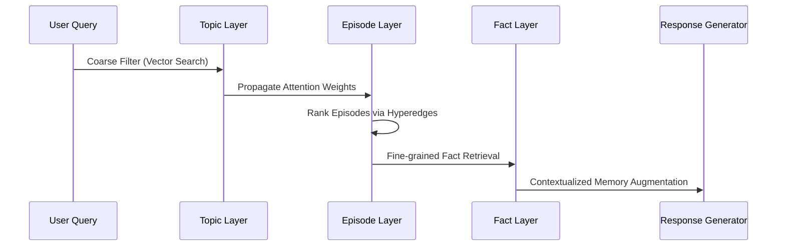

# HyperMem: Hypergraph Memory Architecture
Relevant source files
- [.gitignore](https://github.com/EverMind-AI/EverOS/blob/d40b8703/.gitignore)
- [README.md](https://github.com/EverMind-AI/EverOS/blob/d40b8703/README.md?plain=1)

HyperMem is a hierarchical, hypergraph-based memory architecture designed to capture high-order associations in long-term conversations. Unlike traditional flat vector-based RAG or simple graph-based memories, HyperMem organizes information into a three-level structure—**Topics**, **Episodes**, and **Facts**—and utilizes hyperedges to model complex relationships that span multiple memory units. This architecture enables coarse-to-fine retrieval and high-order embedding propagation, achieving a 92.73% accuracy on the LoCoMo benchmark. [README.md74-78](https://github.com/EverMind-AI/EverOS/blob/d40b8703/README.md?plain=1#L74-L78)

### Architecture Overview

HyperMem transforms raw conversation streams into a structured hypergraph. This structure allows the system to maintain the narrative context of a conversation while extracting atomic facts that can be cross-referenced across different time periods.

The system is defined by three primary node types:

1. **Topic Nodes**: High-level semantic clusters representing the "what" of the conversation.
2. **Episode Nodes**: Narrative segments representing specific conversational sessions or events.
3. **Fact Nodes**: Atomic pieces of information extracted from episodes.

Hyperedges are then constructed to connect these nodes, where a single hyperedge can link a Topic to all its constituent Episodes, or an Episode to all its extracted Facts. [README.md74-78](https://github.com/EverMind-AI/EverOS/blob/d40b8703/README.md?plain=1#L74-L78)

#### HyperMem Structural Model

The following diagram illustrates how the HyperMem conceptual layers map to the internal data structures and processing logic within the `methods/HyperMem/` directory.

[Flowchart Diagram]

**Sources:**

- [README.md38-41](https://github.com/EverMind-AI/EverOS/blob/d40b8703/README.md?plain=1#L38-L41)
- [README.md74-78](https://github.com/EverMind-AI/EverOS/blob/d40b8703/README.md?plain=1#L74-L78)

---

### HyperMem Construction Pipeline

The construction of the hypergraph is a multi-stage pipeline that begins with raw message ingestion. The system performs boundary detection to create episodes, aggregates those episodes into topics, and decomposes them into facts.

- **Episode Detection**: Uses LLM-driven boundary detection to identify logical breaks in conversation.
- **Topic Aggregation**: Employs streaming matching to group related episodes into persistent topic clusters.
- **Fact Extraction**: Distills atomic facts from the narrative content of episodes to populate the finest grain of the memory.
- **Weight Assignment**: Assigns importance weights to hyperedges based on semantic relevance and temporal proximity.

For a detailed breakdown of the construction algorithms and LLM prompts, see **[HyperMem Construction Pipeline](/EverMind-AI/EverOS/11.1-hypermem-construction-pipeline)**.

---

### Retrieval and Embedding Propagation

HyperMem utilizes a "coarse-to-fine" retrieval strategy. Instead of searching millions of atomic facts directly, it traverses the hypergraph from the top down to ensure contextual relevance. [README.md76-77](https://github.com/EverMind-AI/EverOS/blob/d40b8703/README.md?plain=1#L76-L77)

#### Retrieval Flow

The retrieval process follows a specific path through the hypergraph hierarchy:

1. **Topic-Level Filtering**: Narrow down the search space to relevant semantic domains.
2. **Episode-Level Ranking**: Identify specific events or time periods relevant to the query.
3. **Fact-Level Retrieval**: Extract the precise atomic information needed for the response.

A key innovation in HyperMem is **Embedding Propagation**. This technique uses attention-weighted aggregation to allow information from "neighboring" nodes in the hypergraph to influence the embeddings of the target nodes, effectively "smoothing" the memory space and improving recall for queries that use different terminology than the original source.

#### System Retrieval Logic

This diagram maps the retrieval stages to the logical flow of the HyperMem method.

For details on the propagation algorithms and benchmark comparisons against RAG, see **[HyperMem Retrieval and Embedding Propagation](/EverMind-AI/EverOS/11.2-hypermem-retrieval-and-embedding-propagation)**.

**Sources:**

- [README.md76-78](https://github.com/EverMind-AI/EverOS/blob/d40b8703/README.md?plain=1#L76-L78)

---

### Performance and Benchmarks

HyperMem has been evaluated against several state-of-the-art memory systems using the **LoCoMo** (Long-Context Memory) benchmark. It significantly outperforms standard RAG and basic graph-based approaches. [README.md76-78](https://github.com/EverMind-AI/EverOS/blob/d40b8703/README.md?plain=1#L76-L78)

| System | LoCoMo Accuracy | Architecture Type |
| --- | --- | --- |
| **HyperMem** | **92.73%** | **Hierarchical Hypergraph** |
| Mem0 | 78.4% | Flat/Entity Graph |
| MemOS | 74.2% | Segmented |
| Zep | 71.6% | Vector-only |

**Sources:**

- [README.md76-78](https://github.com/EverMind-AI/EverOS/blob/d40b8703/README.md?plain=1#L76-L78)
- [README.md133-136](https://github.com/EverMind-AI/EverOS/blob/d40b8703/README.md?plain=1#L133-L136)