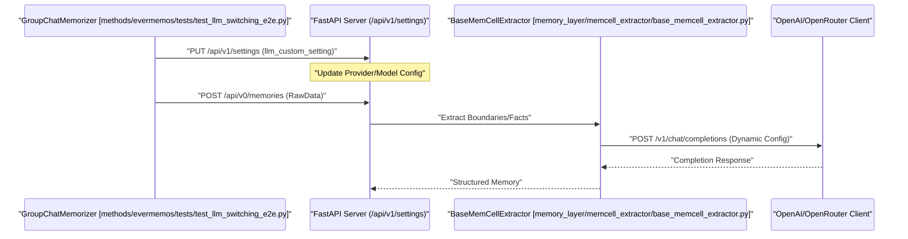

# LLM Provider and Tokenizer Integration
Relevant source files
- [methods/evermemos/docs/usage/CONFIGURATION_GUIDE.md](https://github.com/EverMind-AI/EverOS/blob/d40b8703/methods/evermemos/docs/usage/CONFIGURATION_GUIDE.md?plain=1)
- [methods/evermemos/tests/test_embedding_reranker_providers.py](https://github.com/EverMind-AI/EverOS/blob/d40b8703/methods/evermemos/tests/test_embedding_reranker_providers.py)
- [methods/evermemos/tests/test_llm_switching_e2e.py](https://github.com/EverMind-AI/EverOS/blob/d40b8703/methods/evermemos/tests/test_llm_switching_e2e.py)
- [methods/evermemos/tests/test_pickle_size_analysis.py](https://github.com/EverMind-AI/EverOS/blob/d40b8703/methods/evermemos/tests/test_pickle_size_analysis.py)
- [methods/evermemos/tests/test_rawdata_json_serialization.py](https://github.com/EverMind-AI/EverOS/blob/d40b8703/methods/evermemos/tests/test_rawdata_json_serialization.py)
- [methods/evermemos/tests/test_smart_text_parser.py](https://github.com/EverMind-AI/EverOS/blob/d40b8703/methods/evermemos/tests/test_smart_text_parser.py)

This page describes the abstraction layer for Large Language Models (LLMs), tokenization, and text processing within EverOS. The system utilizes an OpenAI-compatible client architecture to interface with various backends, including OpenAI, Google Gemini, Anthropic, and vLLM (via OpenRouter or direct access), while maintaining a unified tokenizer factory and smart text parser for precise context management and multilingual memory extraction.

## LLM Configuration and Backends

EverOS manages LLM provider settings through environment variables and centralized configuration logic. This allows for dynamic switching between cloud providers and local deployments (vLLM) without modifying application logic.

### Configuration Environment (`.env`)

The system supports multiple providers with a priority-based configuration. Key settings include `LLM_PROVIDER`, `LLM_MODEL`, and provider-specific API keys and base URLs [methods/evermemos/docs/usage/CONFIGURATION_GUIDE.md10-26](https://github.com/EverMind-AI/EverOS/blob/d40b8703/methods/evermemos/docs/usage/CONFIGURATION_GUIDE.md?plain=1#L10-L26)

| Variable | Description | Example / Default |
| --- | --- | --- |
| `LLM_PROVIDER` | Default backend provider | `openrouter`[methods/evermemos/docs/usage/CONFIGURATION_GUIDE.md18](https://github.com/EverMind-AI/EverOS/blob/d40b8703/methods/evermemos/docs/usage/CONFIGURATION_GUIDE.md?plain=1#L18-L18) |
| `LLM_MODEL` | Default model identifier | `gpt-4o-mini`[methods/evermemos/docs/usage/CONFIGURATION_GUIDE.md19](https://github.com/EverMind-AI/EverOS/blob/d40b8703/methods/evermemos/docs/usage/CONFIGURATION_GUIDE.md?plain=1#L19-L19) |
| `VECTORIZE_PROVIDER` | Provider for embeddings | `deepinfra` or `vllm`[methods/evermemos/docs/usage/CONFIGURATION_GUIDE.md35](https://github.com/EverMind-AI/EverOS/blob/d40b8703/methods/evermemos/docs/usage/CONFIGURATION_GUIDE.md?plain=1#L35-L35) |
| `RERANK_PROVIDER` | Provider for reranking | `deepinfra` or `vllm`[methods/evermemos/docs/usage/CONFIGURATION_GUIDE.md56](https://github.com/EverMind-AI/EverOS/blob/d40b8703/methods/evermemos/docs/usage/CONFIGURATION_GUIDE.md?plain=1#L56-L56) |

**Sources:**[methods/evermemos/docs/usage/CONFIGURATION_GUIDE.md10-66](https://github.com/EverMind-AI/EverOS/blob/d40b8703/methods/evermemos/docs/usage/CONFIGURATION_GUIDE.md?plain=1#L10-L66)

---

## LLM Provider Abstraction

The system abstracts the underlying implementation via an OpenAI-compatible client capable of handling most modern LLM APIs. This abstraction is critical for the memory extraction pipeline and the agentic retrieval layers.

### Dynamic Switching Logic

The system supports end-to-end dynamic switching of LLM providers and models. This is facilitated by the `llm_custom_setting` within the system settings, allowing the memory extraction pipeline or chat sessions to switch between providers (e.g., `openrouter` to `openai`) or models within the same provider between messages [methods/evermemos/tests/test_llm_switching_e2e.py59-64](https://github.com/EverMind-AI/EverOS/blob/d40b8703/methods/evermemos/tests/test_llm_switching_e2e.py#L59-L64)

### LLM Invocation Sequence

The following diagram illustrates how the system routes requests to the concrete client implementation during the memory extraction process.

**LLM Generation Data Flow**

**Sources:**[methods/evermemos/tests/test_llm_switching_e2e.py59-170](https://github.com/EverMind-AI/EverOS/blob/d40b8703/methods/evermemos/tests/test_llm_switching_e2e.py#L59-L170)[methods/evermemos/tests/test_rawdata_json_serialization.py8-29](https://github.com/EverMind-AI/EverOS/blob/d40b8703/methods/evermemos/tests/test_rawdata_json_serialization.py#L8-L29)

---

## Tokenizer Factory and SmartTextParser

To ensure accurate context window management and cost estimation, EverOS uses a specialized text parser for multilingual content.

### Tokenizer Factory

- **Primary Encoding**: The system typically defaults to the `o200k_base` encoding via the `tiktoken` library, which is the standard for GPT-4o and newer models.
- **Integration with Extraction**: The tokenizer is used by the memory pipeline to detect boundaries and force-split conversations when they exceed the defined token budget (e.g., `LLM_MAX_TOKENS`[methods/evermemos/docs/usage/CONFIGURATION_GUIDE.md25](https://github.com/EverMind-AI/EverOS/blob/d40b8703/methods/evermemos/docs/usage/CONFIGURATION_GUIDE.md?plain=1#L25-L25)

### SmartTextParser for Multilingual Truncation

The `SmartTextParser` provides fine-grained control over text segmentation, especially for CJK (Chinese, Japanese, Korean) and English mixed content [methods/evermemos/tests/test_smart_text_parser.py84-107](https://github.com/EverMind-AI/EverOS/blob/d40b8703/methods/evermemos/tests/test_smart_text_parser.py#L84-L107) It categorizes text into specific `TokenType` enums:

- `CJK_CHAR`: Chinese/Japanese/Korean characters [methods/evermemos/tests/test_smart_text_parser.py29](https://github.com/EverMind-AI/EverOS/blob/d40b8703/methods/evermemos/tests/test_smart_text_parser.py#L29-L29)
- `ENGLISH_WORD`: Continuous English alphabetic strings [methods/evermemos/tests/test_smart_text_parser.py30](https://github.com/EverMind-AI/EverOS/blob/d40b8703/methods/evermemos/tests/test_smart_text_parser.py#L30-L30)
- `CONTINUOUS_NUMBER`: Numeric strings [methods/evermemos/tests/test_smart_text_parser.py31](https://github.com/EverMind-AI/EverOS/blob/d40b8703/methods/evermemos/tests/test_smart_text_parser.py#L31-L31)
- `PUNCTUATION`: Symbols and marks [methods/evermemos/tests/test_smart_text_parser.py32](https://github.com/EverMind-AI/EverOS/blob/d40b8703/methods/evermemos/tests/test_smart_text_parser.py#L32-L32)

The `smart_truncate_text` function uses these types to truncate text while preserving semantic integrity (e.g., not splitting in the middle of an English word) [methods/evermemos/tests/test_smart_text_parser.py14-21](https://github.com/EverMind-AI/EverOS/blob/d40b8703/methods/evermemos/tests/test_smart_text_parser.py#L14-L21)

**Sources:**[methods/evermemos/tests/test_smart_text_parser.py14-164](https://github.com/EverMind-AI/EverOS/blob/d40b8703/methods/evermemos/tests/test_smart_text_parser.py#L14-L164)[methods/evermemos/docs/usage/CONFIGURATION_GUIDE.md25](https://github.com/EverMind-AI/EverOS/blob/d40b8703/methods/evermemos/docs/usage/CONFIGURATION_GUIDE.md?plain=1#L25-L25)

---

## Embedding and Reranking Services

EverOS integrates specialized services for vectorization and relevance scoring, supporting both cloud (DeepInfra) and local (vLLM) backends [methods/evermemos/docs/usage/CONFIGURATION_GUIDE.md29-66](https://github.com/EverMind-AI/EverOS/blob/d40b8703/methods/evermemos/docs/usage/CONFIGURATION_GUIDE.md?plain=1#L29-L66)

### Vectorize Service

The `HybridVectorizeService` (retrieved via `get_vectorize_service`) handles text-to-vector conversion [methods/evermemos/tests/test_embedding_reranker_providers.py5-50](https://github.com/EverMind-AI/EverOS/blob/d40b8703/methods/evermemos/tests/test_embedding_reranker_providers.py#L5-L50)

- **Instruction Support**: Supports task-specific instructions for query embeddings (e.g., "Given a search query, retrieve relevant passages...") [methods/evermemos/tests/test_embedding_reranker_providers.py36-54](https://github.com/EverMind-AI/EverOS/blob/d40b8703/methods/evermemos/tests/test_embedding_reranker_providers.py#L36-L54)
- **Normalization**: Ensures consistent dimensions (e.g., 1024 for Qwen3-Embedding-4B) [methods/evermemos/tests/test_embedding_reranker_providers.py55-75](https://github.com/EverMind-AI/EverOS/blob/d40b8703/methods/evermemos/tests/test_embedding_reranker_providers.py#L55-L75)

### Rerank Service

The `HybridRerankService` (retrieved via `get_rerank_service`) refines retrieval results by calculating a relevance score between a query and a list of documents [methods/evermemos/tests/test_embedding_reranker_providers.py6-118](https://github.com/EverMind-AI/EverOS/blob/d40b8703/methods/evermemos/tests/test_embedding_reranker_providers.py#L6-L118)

- **vLLM Integration**: Uses the `--task reward` flag when serving reranker models via vLLM [methods/evermemos/docs/usage/CONFIGURATION_GUIDE.md147-151](https://github.com/EverMind-AI/EverOS/blob/d40b8703/methods/evermemos/docs/usage/CONFIGURATION_GUIDE.md?plain=1#L147-L151)

**Sources:**[methods/evermemos/tests/test_embedding_reranker_providers.py5-128](https://github.com/EverMind-AI/EverOS/blob/d40b8703/methods/evermemos/tests/test_embedding_reranker_providers.py#L5-L128)[methods/evermemos/docs/usage/CONFIGURATION_GUIDE.md29-66](https://github.com/EverMind-AI/EverOS/blob/d40b8703/methods/evermemos/docs/usage/CONFIGURATION_GUIDE.md?plain=1#L29-L66)

---

## System Integration and Code Entities

The LLM and Tokenizer integration bridges the "Natural Language Space" with the "Code Entity Space".

### Provider and Configuration Mapping

This diagram shows how environment configurations map to the services used during runtime.

**Configuration to Entity Mapping**

[Flowchart Diagram]

**Sources:**[methods/evermemos/docs/usage/CONFIGURATION_GUIDE.md10-66](https://github.com/EverMind-AI/EverOS/blob/d40b8703/methods/evermemos/docs/usage/CONFIGURATION_GUIDE.md?plain=1#L10-L66)[methods/evermemos/tests/test_embedding_reranker_providers.py5-28](https://github.com/EverMind-AI/EverOS/blob/d40b8703/methods/evermemos/tests/test_embedding_reranker_providers.py#L5-L28)[methods/evermemos/tests/test_smart_text_parser.py14-21](https://github.com/EverMind-AI/EverOS/blob/d40b8703/methods/evermemos/tests/test_smart_text_parser.py#L14-L21)[methods/evermemos/tests/test_rawdata_json_serialization.py8-38](https://github.com/EverMind-AI/EverOS/blob/d40b8703/methods/evermemos/tests/test_rawdata_json_serialization.py#L8-L38)

### Data Flow for Retrieval

The retrieval pipeline utilizes both the Vectorize and Rerank services to ensure high-quality memory recall.

**Retrieval and Scoring Logic**

[Flowchart Diagram]

**Sources:**[methods/evermemos/tests/test_embedding_reranker_providers.py50-120](https://github.com/EverMind-AI/EverOS/blob/d40b8703/methods/evermemos/tests/test_embedding_reranker_providers.py#L50-L120)[methods/evermemos/docs/usage/CONFIGURATION_GUIDE.md113-140](https://github.com/EverMind-AI/EverOS/blob/d40b8703/methods/evermemos/docs/usage/CONFIGURATION_GUIDE.md?plain=1#L113-L140)

---

## Summary of LLM and Tokenizer Settings

| Parameter | Default Value | Description |
| --- | --- | --- |
| `LLM_TEMPERATURE` | `0.3` | Controls randomness in generation [methods/evermemos/docs/usage/CONFIGURATION_GUIDE.md24](https://github.com/EverMind-AI/EverOS/blob/d40b8703/methods/evermemos/docs/usage/CONFIGURATION_GUIDE.md?plain=1#L24-L24) |
| `LLM_MAX_TOKENS` | `32768` | Upper bound for context/response length [methods/evermemos/docs/usage/CONFIGURATION_GUIDE.md25](https://github.com/EverMind-AI/EverOS/blob/d40b8703/methods/evermemos/docs/usage/CONFIGURATION_GUIDE.md?plain=1#L25-L25) |
| `VECTORIZE_DIMENSIONS` | `1024` | Expected vector size for the embedding model [methods/evermemos/docs/usage/CONFIGURATION_GUIDE.md39](https://github.com/EverMind-AI/EverOS/blob/d40b8703/methods/evermemos/docs/usage/CONFIGURATION_GUIDE.md?plain=1#L39-L39) |
| `CJK_CHAR_SCORE` | `1.0` | Weight assigned to CJK characters in SmartTextParser [methods/evermemos/tests/test_smart_text_parser.py65](https://github.com/EverMind-AI/EverOS/blob/d40b8703/methods/evermemos/tests/test_smart_text_parser.py#L65-L65) |
| `ENGLISH_WORD_SCORE` | `1.5` | Weight assigned to English words in SmartTextParser [methods/evermemos/tests/test_smart_text_parser.py66](https://github.com/EverMind-AI/EverOS/blob/d40b8703/methods/evermemos/tests/test_smart_text_parser.py#L66-L66) |

**Sources:**[methods/evermemos/docs/usage/CONFIGURATION_GUIDE.md10-66](https://github.com/EverMind-AI/EverOS/blob/d40b8703/methods/evermemos/docs/usage/CONFIGURATION_GUIDE.md?plain=1#L10-L66)[methods/evermemos/tests/test_smart_text_parser.py59-83](https://github.com/EverMind-AI/EverOS/blob/d40b8703/methods/evermemos/tests/test_smart_text_parser.py#L59-L83)