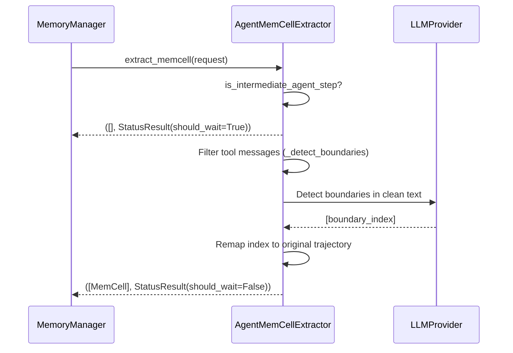

# MemCell Extraction and Boundary Detection
Relevant source files
- [methods/evermemos/src/api_specs/memory_types.py](https://github.com/EverMind-AI/EverOS/blob/d40b8703/methods/evermemos/src/api_specs/memory_types.py)
- [methods/evermemos/src/memory_layer/memcell_extractor/agent_memcell_extractor.py](https://github.com/EverMind-AI/EverOS/blob/d40b8703/methods/evermemos/src/memory_layer/memcell_extractor/agent_memcell_extractor.py)
- [methods/evermemos/src/memory_layer/memory_extractor/profile_extractor.py](https://github.com/EverMind-AI/EverOS/blob/d40b8703/methods/evermemos/src/memory_layer/memory_extractor/profile_extractor.py)
- [methods/evermemos/tests/test_agent_memcell_extractor.py](https://github.com/EverMind-AI/EverOS/blob/d40b8703/methods/evermemos/tests/test_agent_memcell_extractor.py)
- [methods/evermemos/tests/test_profile_memory.py](https://github.com/EverMind-AI/EverOS/blob/d40b8703/methods/evermemos/tests/test_profile_memory.py)

The first stage of the EverMemOS memory pipeline is **MemCell Extraction**. This process transforms a continuous stream of raw conversation messages into discrete, semantically meaningful units called `MemCells`. A `MemCell` represents a completed "event" or "segment" of a conversation, serving as the foundational building block for all downstream extraction (Episodes, Foresights, Event Logs, and Agent Cases).

## Core Architecture

The extraction process is orchestrated by the `MemoryManager` and executed by specialized extractors: `ConvMemCellExtractor` for standard chat and `AgentMemCellExtractor` for tool-using agents. It involves analyzing incoming "new" messages against "historical" context to determine if a conversational boundary has been reached.

### Key Entities

| Entity | Role | File Reference |
| --- | --- | --- |
| `MemCell` | The primary data structure containing raw messages, participants, and metadata. | [methods/evermemos/src/api_specs/memory_types.py133-164](https://github.com/EverMind-AI/EverOS/blob/d40b8703/methods/evermemos/src/api_specs/memory_types.py#L133-L164) |
| `ConvMemCellExtractor` | Logic provider for standard conversation boundary detection. | [methods/evermemos/src/memory_layer/memcell_extractor/conv_memcell_extractor.py71-112](https://github.com/EverMind-AI/EverOS/blob/d40b8703/methods/evermemos/src/memory_layer/memcell_extractor/conv_memcell_extractor.py#L71-L112) |
| `AgentMemCellExtractor` | Extends `ConvMemCellExtractor` with tool-call-aware segmentation logic. | [methods/evermemos/src/memory_layer/memcell_extractor/agent_memcell_extractor.py71-94](https://github.com/EverMind-AI/EverOS/blob/d40b8703/methods/evermemos/src/memory_layer/memcell_extractor/agent_memcell_extractor.py#L71-L94) |
| `StatusResult` | Control flow object indicating if a boundary was found or if the system should wait. | [methods/evermemos/src/memory_layer/memcell_extractor/base_memcell_extractor.py51-57](https://github.com/EverMind-AI/EverOS/blob/d40b8703/methods/evermemos/src/memory_layer/memcell_extractor/base_memcell_extractor.py#L51-L57) |
| `RawData` | Wrapper for individual incoming messages/items before they are grouped. | [methods/evermemos/src/api_specs/dtos.py22](https://github.com/EverMind-AI/EverOS/blob/d40b8703/methods/evermemos/src/api_specs/dtos.py#L22-L22) |
| `RawDataType` | Enum distinguishing between `CONVERSATION` and `AGENTCONVERSATION`. | [methods/evermemos/src/api_specs/memory_types.py26-31](https://github.com/EverMind-AI/EverOS/blob/d40b8703/methods/evermemos/src/api_specs/memory_types.py#L26-L31) |

### Code Entity Space Mapping

The following diagram illustrates how raw conversation data is processed into code entities during the extraction stage.

**Conversation Segmentation Mapping**

[Flowchart Diagram]

Sources: [methods/evermemos/src/api_specs/memory_types.py133-191](https://github.com/EverMind-AI/EverOS/blob/d40b8703/methods/evermemos/src/api_specs/memory_types.py#L133-L191)[methods/evermemos/src/memory_layer/memcell_extractor/agent_memcell_extractor.py100-152](https://github.com/EverMind-AI/EverOS/blob/d40b8703/methods/evermemos/src/memory_layer/memcell_extractor/agent_memcell_extractor.py#L100-L152)[methods/evermemos/src/api_specs/dtos.py22](https://github.com/EverMind-AI/EverOS/blob/d40b8703/methods/evermemos/src/api_specs/dtos.py#L22-L22)

## Boundary Detection Logic

EverMemOS uses a hybrid approach to detect boundaries, combining LLM-based semantic analysis with hard structural limits and agent-specific state guards.

### 1. LLM-Based Semantic Detection

The system calls an LLM to analyze the conversation flow. The LLM evaluates whether the current topic has concluded or if there is a significant shift in intent. For standard conversations, this uses the `ConvMemCellExtractor`. For agentic workflows, the `AgentMemCellExtractor` filters out intermediate tool messages before sending the clean conversation to the LLM for boundary detection, then remaps the indices back to the original message space to ensure tool calls are preserved in the resulting `MemCell`[methods/evermemos/src/memory_layer/memcell_extractor/agent_memcell_extractor.py12-40](https://github.com/EverMind-AI/EverOS/blob/d40b8703/methods/evermemos/src/memory_layer/memcell_extractor/agent_memcell_extractor.py#L12-L40)

### 2. Hard Limits (Force-Split)

To prevent context window overflow, the system enforces "force-split" logic:

- **Hard Token Limit:** Default 32,768 for agents [methods/evermemos/src/memory_layer/memcell_extractor/agent_memcell_extractor.py60](https://github.com/EverMind-AI/EverOS/blob/d40b8703/methods/evermemos/src/memory_layer/memcell_extractor/agent_memcell_extractor.py#L60-L60)
- **Hard Message Limit:** Default 64 for agents [methods/evermemos/src/memory_layer/memcell_extractor/agent_memcell_extractor.py61](https://github.com/EverMind-AI/EverOS/blob/d40b8703/methods/evermemos/src/memory_layer/memcell_extractor/agent_memcell_extractor.py#L61-L61)
- **Safe Splits:** The `AgentMemCellExtractor` implements `_is_safe_split` to ensure that force-splits do not occur in the middle of a tool-call sequence, requiring the split point to follow a final assistant response [methods/evermemos/src/memory_layer/memcell_extractor/agent_memcell_extractor.py159-174](https://github.com/EverMind-AI/EverOS/blob/d40b8703/methods/evermemos/src/memory_layer/memcell_extractor/agent_memcell_extractor.py#L159-L174)

### 3. Agent State Guards

The `AgentMemCellExtractor` implements specific guards in `extract_memcell` to avoid premature segmentation:

- **In-Progress Guard:** Skips detection if the last message is an intermediate step (role is `tool` or `assistant` with `tool_calls`) via `is_intermediate_agent_step`[methods/evermemos/src/memory_layer/memcell_extractor/agent_memcell_extractor.py140-150](https://github.com/EverMind-AI/EverOS/blob/d40b8703/methods/evermemos/src/memory_layer/memcell_extractor/agent_memcell_extractor.py#L140-L150)
- **User-Only Guard:** Skips if new messages are exclusively from the user, waiting for the assistant's response to complete the turn [methods/evermemos/src/memory_layer/memcell_extractor/agent_memcell_extractor.py128-138](https://github.com/EverMind-AI/EverOS/blob/d40b8703/methods/evermemos/src/memory_layer/memcell_extractor/agent_memcell_extractor.py#L128-L138)

## Extraction Control Flow

The extraction process follows a specific state machine defined by the `StatusResult`.

**MemCell Extraction Sequence**

Sources: [methods/evermemos/src/memory_layer/memcell_extractor/agent_memcell_extractor.py100-152](https://github.com/EverMind-AI/EverOS/blob/d40b8703/methods/evermemos/src/memory_layer/memcell_extractor/agent_memcell_extractor.py#L100-L152)[methods/evermemos/src/api_specs/memory_types.py117-129](https://github.com/EverMind-AI/EverOS/blob/d40b8703/methods/evermemos/src/api_specs/memory_types.py#L117-L129)

## Implementation Details

### Supported Message Types and Tool Calls

The system supports complex message structures via `get_text_from_content_items`, which handles text, file summaries, and metadata [methods/evermemos/src/api_specs/memory_types.py73-114](https://github.com/EverMind-AI/EverOS/blob/d40b8703/methods/evermemos/src/api_specs/memory_types.py#L73-L114)

- **Tool Messages:** Identified by `role="tool"` or `assistant` with `tool_calls`[methods/evermemos/src/api_specs/memory_types.py117-129](https://github.com/EverMind-AI/EverOS/blob/d40b8703/methods/evermemos/src/api_specs/memory_types.py#L117-L129)
- **Trajectory Filtering:** The `MemCell` class provides a `conversation_data` property that automatically filters out these intermediate steps for LLM-based summarization while preserving them in `original_data` for agent training [methods/evermemos/src/api_specs/memory_types.py171-191](https://github.com/EverMind-AI/EverOS/blob/d40b8703/methods/evermemos/src/api_specs/memory_types.py#L171-L191)

### Profile-Aware Extraction

The `ProfileExtractor` uses these `MemCells` (grouped into episodes) to perform incremental updates to user profiles. It employs an ID mapping system (`ep1`, `ep2`) via `_create_id_mapping` to reduce token consumption during LLM calls [methods/evermemos/src/memory_layer/memory_extractor/profile_extractor.py36-37](https://github.com/EverMind-AI/EverOS/blob/d40b8703/methods/evermemos/src/memory_layer/memory_extractor/profile_extractor.py#L36-L37) It supports `ADD`, `UPDATE`, and `DELETE` operations on profile items defined in `ProfileAction`[methods/evermemos/src/memory_layer/memory_extractor/profile_extractor.py71-75](https://github.com/EverMind-AI/EverOS/blob/d40b8703/methods/evermemos/src/memory_layer/memory_extractor/profile_extractor.py#L71-L75)

### Time-Gap Categorization

While not explicitly detailed in the provided snippets, the system utilizes the `timestamp` field in `MemCell` and `RawData` to facilitate time-based clustering in the downstream `ClusterManager`[methods/evermemos/src/api_specs/memory_types.py147](https://github.com/EverMind-AI/EverOS/blob/d40b8703/methods/evermemos/src/api_specs/memory_types.py#L147-L147)

Sources:

- [methods/evermemos/src/memory_layer/memcell_extractor/agent_memcell_extractor.py1-185](https://github.com/EverMind-AI/EverOS/blob/d40b8703/methods/evermemos/src/memory_layer/memcell_extractor/agent_memcell_extractor.py#L1-L185)
- [methods/evermemos/src/api_specs/memory_types.py1-191](https://github.com/EverMind-AI/EverOS/blob/d40b8703/methods/evermemos/src/api_specs/memory_types.py#L1-L191)
- [methods/evermemos/src/memory_layer/memory_extractor/profile_extractor.py1-196](https://github.com/EverMind-AI/EverOS/blob/d40b8703/methods/evermemos/src/memory_layer/memory_extractor/profile_extractor.py#L1-L196)
- [methods/evermemos/src/api_specs/dtos.py22](https://github.com/EverMind-AI/EverOS/blob/d40b8703/methods/evermemos/src/api_specs/dtos.py#L22-L22)