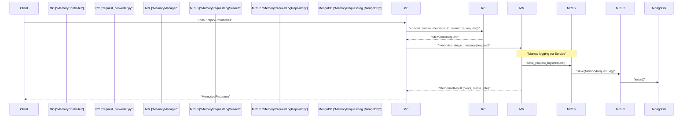

# Memory Ingestion and Fetch Endpoints
Relevant source files
- [methods/evermemos/docs/api_docs/memory_api.md](https://github.com/EverMind-AI/EverOS/blob/d40b8703/methods/evermemos/docs/api_docs/memory_api.md?plain=1)
- [methods/evermemos/tests/integration/test_delete_api_integration.py](https://github.com/EverMind-AI/EverOS/blob/d40b8703/methods/evermemos/tests/integration/test_delete_api_integration.py)
- [methods/evermemos/tests/test_get_mem_service_e2e.py](https://github.com/EverMind-AI/EverOS/blob/d40b8703/methods/evermemos/tests/test_get_mem_service_e2e.py)

This page provides a detailed technical reference for the core memory lifecycle endpoints. It covers how raw conversational data is ingested, how the system tracks the processing status of messages, and the mechanisms for fetching and soft-deleting structured memories from the persistence layer.

## 1. Memory Ingestion Pipeline

The primary entry point for conversational data is `POST /api/v1/memories`. This endpoint handles single-message ingestion and routes data through the extraction pipeline.

### Ingestion Flow

When a message is posted, it is converted into a `MemorizeRequest` using the `convert_simple_message_to_memorize_request` utility [methods/evermemos/src/api_specs/request_converter.py32](https://github.com/EverMind-AI/EverOS/blob/d40b8703/methods/evermemos/src/api_specs/request_converter.py#L32-L32) and processed by the `MemoryManager`[methods/evermemos/src/infra_layer/adapters/input/api/memory/memory_controller.py162-182](https://github.com/EverMind-AI/EverOS/blob/d40b8703/methods/evermemos/src/infra_layer/adapters/input/api/memory/memory_controller.py#L162-L182) The system uses a "window accumulation" strategy where messages are collected until a conversational boundary (MemCell) is detected.

#### Automatic Grouping

If a `group_id` is not provided in the request, the system automatically generates a deterministic `group_id` based on the MD5 hash of the `sender`[methods/evermemos/src/api_specs/request_converter.py24-41](https://github.com/EverMind-AI/EverOS/blob/d40b8703/methods/evermemos/src/api_specs/request_converter.py#L24-L41) This ensures that single-user interactions are isolated into their own memory space even without explicit session management by the client [methods/evermemos/docs/api_docs/memory_api.md58-72](https://github.com/EverMind-AI/EverOS/blob/d40b8703/methods/evermemos/docs/api_docs/memory_api.md?plain=1#L58-L72)

#### Status Transitions

The ingestion result returns a `status_info` field indicating the current state of the message:

- **`accumulated`**: The message was successfully saved but did not trigger a conversational boundary. It is stored in the `MemoryRequestLog` with `sync_status = 0`[methods/evermemos/src/infra_layer/adapters/out/persistence/document/request/memory_request_log.py69-70](https://github.com/EverMind-AI/EverOS/blob/d40b8703/methods/evermemos/src/infra_layer/adapters/out/persistence/document/request/memory_request_log.py#L69-L70)
- **`extracted`**: The message triggered a boundary (e.g., a long time gap or a topic shift). The system has extracted one or more `MemCell` objects and associated memories (Episodes, Events, etc.) [methods/evermemos/docs/api_docs/memory_api.md94-105](https://github.com/EverMind-AI/EverOS/blob/d40b8703/methods/evermemos/docs/api_docs/memory_api.md?plain=1#L94-L105)

### Data Flow: Ingestion to Logging

The following diagram illustrates the path from the REST controller to the underlying request logging service.

**Memory Ingestion Sequence**

**Sources:**[methods/evermemos/src/infra_layer/adapters/input/api/memory/memory_controller.py162-182](https://github.com/EverMind-AI/EverOS/blob/d40b8703/methods/evermemos/src/infra_layer/adapters/input/api/memory/memory_controller.py#L162-L182)[methods/evermemos/src/api_specs/request_converter.py24-41](https://github.com/EverMind-AI/EverOS/blob/d40b8703/methods/evermemos/src/api_specs/request_converter.py#L24-L41)[methods/evermemos/src/service/memory_request_log_service.py48-73](https://github.com/EverMind-AI/EverOS/blob/d40b8703/methods/evermemos/src/service/memory_request_log_service.py#L48-L73)[methods/evermemos/src/infra_layer/adapters/out/persistence/repository/memory_request_log_repository.py37-63](https://github.com/EverMind-AI/EverOS/blob/d40b8703/methods/evermemos/src/infra_layer/adapters/out/persistence/repository/memory_request_log_repository.py#L37-L63)

---

## 2. Memory Fetching and Filtering

The `GET /api/v1/memories` endpoint (internally handled by `GetMemoryService` via `fetch_memories`) allows for the retrieval of structured memories based on `MemoryType` and various filters [methods/evermemos/docs/api_docs/memory_api.md122-136](https://github.com/EverMind-AI/EverOS/blob/d40b8703/methods/evermemos/docs/api_docs/memory_api.md?plain=1#L122-L136)

### Fetch Parameters and Validation

The retrieval process involves filter parsing and scope validation [methods/evermemos/src/agentic_layer/get_mem_service.py152-160](https://github.com/EverMind-AI/EverOS/blob/d40b8703/methods/evermemos/src/agentic_layer/get_mem_service.py#L152-L160):

- **Scope Requirement**: At least one of `user_id` or `group_id` must be provided; they cannot both be `__all__`[methods/evermemos/docs/api_docs/memory_api.md138](https://github.com/EverMind-AI/EverOS/blob/d40b8703/methods/evermemos/docs/api_docs/memory_api.md?plain=1#L138-L138)
- **User-Specific Constraints**: Certain types like `profile`, `agent_case`, and `agent_skill` strictly require a `user_id` in the filter [methods/evermemos/src/agentic_layer/get_mem_service.py105-110](https://github.com/EverMind-AI/EverOS/blob/d40b8703/methods/evermemos/src/agentic_layer/get_mem_service.py#L105-L110)
- **Temporal and Sorting**: If a `timestamp` field is missing (e.g., for `profile`), the system falls back to `updated_at` for sorting [methods/evermemos/src/agentic_layer/get_mem_service.py113-125](https://github.com/EverMind-AI/EverOS/blob/d40b8703/methods/evermemos/src/agentic_layer/get_mem_service.py#L113-L125)

### Memory Types and DTOs

| Type | Enum Value | DTO Class | Description |
| --- | --- | --- | --- |
| **Episodic** | `episodic_memory` | `EpisodeItem` | Summarized narrative episodes of conversations. |
| **Profile** | `profile` | `ProfileItem` | User-specific traits and preferences. |
| **Foresight** | `foresight` | `ForesightItem` | Prospective memories or predictions. |
| **Atomic Fact** | `atomic_fact` | `AtomicFactItem` | Granular, discrete facts extracted from text. |
| **Agent Case** | `agent_case` | `AgentCaseItem` | Specific task executions and results for agents. |
| **Agent Skill** | `agent_skill` | `AgentSkillItem` | Distilled capabilities and instructions for agents. |

**Sources:**[methods/evermemos/src/agentic_layer/get_mem_service.py57-110](https://github.com/EverMind-AI/EverOS/blob/d40b8703/methods/evermemos/src/agentic_layer/get_mem_service.py#L57-L110)[methods/evermemos/src/api_specs/memory_models.py13](https://github.com/EverMind-AI/EverOS/blob/d40b8703/methods/evermemos/src/api_specs/memory_models.py#L13-L13)[methods/evermemos/src/api_specs/dtos/memory.py18-24](https://github.com/EverMind-AI/EverOS/blob/d40b8703/methods/evermemos/src/api_specs/dtos/memory.py#L18-L24)[methods/evermemos/docs/api_docs/memory_api.md140-148](https://github.com/EverMind-AI/EverOS/blob/d40b8703/methods/evermemos/docs/api_docs/memory_api.md?plain=1#L140-L148)

---

## 3. Persistence and Logging: MemoryRequestLog

The system replaces traditional volatile message buffers with a persistent `MemoryRequestLog` in MongoDB. This serves as the "source of truth" for raw data before it is processed into the vector/graph memory layers.

### Sync Status Lifecycle

The `sync_status` field in the `MemoryRequestLog` document tracks the message through the pipeline [methods/evermemos/src/infra_layer/adapters/out/persistence/document/request/memory_request_log.py67-74](https://github.com/EverMind-AI/EverOS/blob/d40b8703/methods/evermemos/src/infra_layer/adapters/out/persistence/document/request/memory_request_log.py#L67-L74):

1. **`-1` (Log Record)**: The raw request is logged but not yet accepted into the window accumulation.
2. **`0` (Window Accumulating)**: The message is actively being used for conversational boundary detection and extraction [methods/evermemos/src/infra_layer/adapters/out/persistence/repository/conversation_data_raw_repository.py148-149](https://github.com/EverMind-AI/EverOS/blob/d40b8703/methods/evermemos/src/infra_layer/adapters/out/persistence/repository/conversation_data_raw_repository.py#L148-L149)
3. **`1` (Already Used)**: The message has been successfully incorporated into a `MemCell` and is no longer needed for active extraction [methods/evermemos/src/infra_layer/adapters/out/persistence/repository/conversation_data_raw_repository.py150](https://github.com/EverMind-AI/EverOS/blob/d40b8703/methods/evermemos/src/infra_layer/adapters/out/persistence/repository/conversation_data_raw_repository.py#L150-L150)

### Repository Implementation

The `ConversationDataRepositoryImpl` acts as a bridge, converting `RawData` entities into `MemoryRequestLog` persistence operations [methods/evermemos/src/infra_layer/adapters/out/persistence/repository/conversation_data_raw_repository.py118-135](https://github.com/EverMind-AI/EverOS/blob/d40b8703/methods/evermemos/src/infra_layer/adapters/out/persistence/repository/conversation_data_raw_repository.py#L118-L135) It utilizes `MemoryRequestLogMapper` for bidirectional conversion between the document model and the internal `RawData` DTO [methods/evermemos/src/infra_layer/adapters/out/persistence/mapper/memory_request_log_mapper.py26-32](https://github.com/EverMind-AI/EverOS/blob/d40b8703/methods/evermemos/src/infra_layer/adapters/out/persistence/mapper/memory_request_log_mapper.py#L26-L32)

**Entity Mapping: Natural Language to Code Space**

[Class Diagram]

**Sources:**[methods/evermemos/src/infra_layer/adapters/input/api/dto/memory_dto.py14-37](https://github.com/EverMind-AI/EverOS/blob/d40b8703/methods/evermemos/src/infra_layer/adapters/input/api/dto/memory_dto.py#L14-L37)[methods/evermemos/src/infra_layer/adapters/out/persistence/document/request/memory_request_log.py17-74](https://github.com/EverMind-AI/EverOS/blob/d40b8703/methods/evermemos/src/infra_layer/adapters/out/persistence/document/request/memory_request_log.py#L17-L74)[methods/evermemos/src/infra_layer/adapters/out/persistence/repository/conversation_data_raw_repository.py118-135](https://github.com/EverMind-AI/EverOS/blob/d40b8703/methods/evermemos/src/infra_layer/adapters/out/persistence/repository/conversation_data_raw_repository.py#L118-L135)[methods/evermemos/src/infra_layer/adapters/out/persistence/mapper/memory_request_log_mapper.py34-75](https://github.com/EverMind-AI/EverOS/blob/d40b8703/methods/evermemos/src/infra_layer/adapters/out/persistence/mapper/memory_request_log_mapper.py#L34-L75)

---

## 4. Background Processing and Status Tracking

For long-running extraction tasks, EverOS can move processing to the background. Clients can track the status of a `request_id` via the `StatusController`.

### Status API: `GET /api/v1/stats/request`

This endpoint provides the execution state of a specific request, including duration and HTTP results [methods/evermemos/src/infra_layer/adapters/input/api/status/status_controller.py55-85](https://github.com/EverMind-AI/EverOS/blob/d40b8703/methods/evermemos/src/infra_layer/adapters/input/api/status/status_controller.py#L55-L85)

- **Service**: `RequestStatusService` handles the lookup [methods/evermemos/src/infra_layer/adapters/input/api/status/status_controller.py158-160](https://github.com/EverMind-AI/EverOS/blob/d40b8703/methods/evermemos/src/infra_layer/adapters/input/api/status/status_controller.py#L158-L160)
- **TTL**: Status records are typically kept for 1 hour in Redis [methods/evermemos/src/infra_layer/adapters/input/api/status/status_controller.py81](https://github.com/EverMind-AI/EverOS/blob/d40b8703/methods/evermemos/src/infra_layer/adapters/input/api/status/status_controller.py#L81-L81)
- **Tenant Awareness**: Status lookups are isolated by `organization_id` and `space_id` via the `RequestTenantProvider`[methods/evermemos/src/infra_layer/adapters/input/api/status/status_controller.py153-156](https://github.com/EverMind-AI/EverOS/blob/d40b8703/methods/evermemos/src/infra_layer/adapters/input/api/status/status_controller.py#L153-L156)

**Sources:**[methods/evermemos/src/infra_layer/adapters/input/api/status/status_controller.py25-45](https://github.com/EverMind-AI/EverOS/blob/d40b8703/methods/evermemos/src/infra_layer/adapters/input/api/status/status_controller.py#L25-L45)[methods/evermemos/src/infra_layer/adapters/input/api/dto/status_dto.py30-56](https://github.com/EverMind-AI/EverOS/blob/d40b8703/methods/evermemos/src/infra_layer/adapters/input/api/dto/status_dto.py#L30-L56)

---

## 5. Soft Deletion

The `DELETE /api/v1/memories` endpoint (or `POST /api/v1/memories/delete` for complex requests) provides a unified way to remove memories across different storage backends.

### Deletion Logic

- **Soft Delete**: Records are marked as deleted in MongoDB rather than being physically removed immediately. The `deleted_at` field is updated to a non-null timestamp [methods/evermemos/tests/integration/test_delete_api_integration.py160-163](https://github.com/EverMind-AI/EverOS/blob/d40b8703/methods/evermemos/tests/integration/test_delete_api_integration.py#L160-L163)
- **Scope**: Deletion can be scoped by `user_id`, `group_id`, `session_id`, or specific time ranges [methods/evermemos/tests/integration/test_delete_api_integration.py145-172](https://github.com/EverMind-AI/EverOS/blob/d40b8703/methods/evermemos/tests/integration/test_delete_api_integration.py#L145-L172)
- **Cascade**: When a parent `MemCell` is targeted for deletion, its child records—including `episodic_memory`, `atomic_fact_records`, and `foresight_records`—are also marked as deleted [methods/evermemos/tests/integration/test_delete_api_integration.py50-54](https://github.com/EverMind-AI/EverOS/blob/d40b8703/methods/evermemos/tests/integration/test_delete_api_integration.py#L50-L54)
- **Service**: Handled by the `MemCellDeleteService` via the `MemoryController`[methods/evermemos/src/infra_layer/adapters/input/api/memory/memory_controller.py58](https://github.com/EverMind-AI/EverOS/blob/d40b8703/methods/evermemos/src/infra_layer/adapters/input/api/memory/memory_controller.py#L58-L58)

**Sources:**[methods/evermemos/src/infra_layer/adapters/input/api/memory/memory_controller.py58](https://github.com/EverMind-AI/EverOS/blob/d40b8703/methods/evermemos/src/infra_layer/adapters/input/api/memory/memory_controller.py#L58-L58)[methods/evermemos/src/infra_layer/adapters/input/api/dto/memory_dto.py15-37](https://github.com/EverMind-AI/EverOS/blob/d40b8703/methods/evermemos/src/infra_layer/adapters/input/api/dto/memory_dto.py#L15-L37)[methods/evermemos/tests/integration/test_delete_api_integration.py38-65](https://github.com/EverMind-AI/EverOS/blob/d40b8703/methods/evermemos/tests/integration/test_delete_api_integration.py#L38-L65)