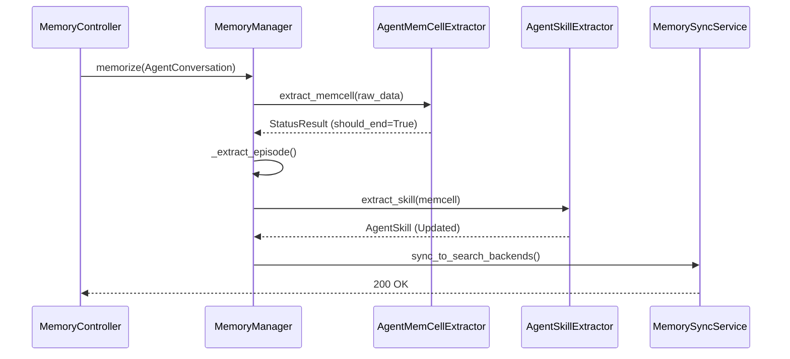

# Memory Pipeline
Relevant source files
- [README.md](https://github.com/EverMind-AI/EverOS/blob/d40b8703/README.md?plain=1)
- [methods/evermemos/docs/OVERVIEW.md](https://github.com/EverMind-AI/EverOS/blob/d40b8703/methods/evermemos/docs/OVERVIEW.md?plain=1)

The **Memory Pipeline** is the core engine of EverOS, responsible for transforming raw, unstructured conversation data into a structured, multi-dimensional memory graph. It handles the full lifecycle of a memory—from the moment a message is received to its long-term storage, consolidation, and agent-specific skill distillation.

This pipeline operates as an asynchronous, multi-stage process that balances real-time ingestion with deep semantic extraction for both human users and autonomous agents.

## Pipeline Overview

The pipeline is orchestrated by the `MemoryManager`[methods/evermemos/src/memory_layer/memory_manager.py49-58](https://github.com/EverMind-AI/EverOS/blob/d40b8703/methods/evermemos/src/memory_layer/memory_manager.py#L49-L58) and follows a structured flow:

1. **Encoding & Segmentation**: Raw messages are ingested via `MemorizeRequest`[methods/evermemos/src/api_specs/dtos.py13](https://github.com/EverMind-AI/EverOS/blob/d40b8703/methods/evermemos/src/api_specs/dtos.py#L13-L13) and grouped into logical units called **MemCells**.
2. **Extraction**: Semantic layers (Episodes, Atomic Facts, Foresights) are extracted from MemCells using LLMs. For agentic workflows, **AgentCases** and **AgentSkills** are derived.
3. **Consolidation**: MemCells are clustered, and long-term **Profiles** are updated based on consolidated behavior.

### System Flow: Natural Language to Code Entities

The following diagram illustrates how natural language input and agent trajectories are transformed into specific code entities and stored across the system's infrastructure.

**Memory Ingestion Flow**

[Flowchart Diagram]

Sources: [methods/evermemos/src/biz_layer/mem_memorize.py117-146](https://github.com/EverMind-AI/EverOS/blob/d40b8703/methods/evermemos/src/biz_layer/mem_memorize.py#L117-L146)[methods/evermemos/src/memory_layer/memcell_extractor/agent_memcell_extractor.py71-94](https://github.com/EverMind-AI/EverOS/blob/d40b8703/methods/evermemos/src/memory_layer/memcell_extractor/agent_memcell_extractor.py#L71-L94)[methods/evermemos/src/memory_layer/memory_manager.py75-135](https://github.com/EverMind-AI/EverOS/blob/d40b8703/methods/evermemos/src/memory_layer/memory_manager.py#L75-L135)[methods/evermemos/src/api_specs/memory_types.py133-158](https://github.com/EverMind-AI/EverOS/blob/d40b8703/methods/evermemos/src/api_specs/memory_types.py#L133-L158)

---

## 1. MemCell Extraction and Boundary Detection

The first stage of the pipeline is **Boundary Detection**. Since conversations are continuous, the system must decide when a "topic" or "session" has ended to create a discrete `MemCell`[methods/evermemos/src/api_specs/memory_types.py133-158](https://github.com/EverMind-AI/EverOS/blob/d40b8703/methods/evermemos/src/api_specs/memory_types.py#L133-L158)

The `ConvMemCellExtractor`[methods/evermemos/src/memory_layer/memcell_extractor/conv_memcell_extractor.py55-71](https://github.com/EverMind-AI/EverOS/blob/d40b8703/methods/evermemos/src/memory_layer/memcell_extractor/conv_memcell_extractor.py#L55-L71) and its agent-aware sibling `AgentMemCellExtractor`[methods/evermemos/src/memory_layer/memcell_extractor/agent_memcell_extractor.py71-79](https://github.com/EverMind-AI/EverOS/blob/d40b8703/methods/evermemos/src/memory_layer/memcell_extractor/agent_memcell_extractor.py#L71-L79) use:

- **LLM-based Detection**: Analyzing semantic flow via `CONV_BOUNDARY_DETECTION_PROMPT`.
- **Hard Limits**: Enforcing splits at 64 messages (`AGENT_DEFAULT_HARD_MESSAGE_LIMIT`) or 32,768 tokens (`AGENT_DEFAULT_HARD_TOKEN_LIMIT`) for agents [methods/evermemos/src/memory_layer/memcell_extractor/agent_memcell_extractor.py60-61](https://github.com/EverMind-AI/EverOS/blob/d40b8703/methods/evermemos/src/memory_layer/memcell_extractor/agent_memcell_extractor.py#L60-L61)
- **Agent Awareness**: `AgentMemCellExtractor` skips boundary detection if the turn is still in progress (e.g., waiting for a tool response) [methods/evermemos/src/memory_layer/memcell_extractor/agent_memcell_extractor.py100-152](https://github.com/EverMind-AI/EverOS/blob/d40b8703/methods/evermemos/src/memory_layer/memcell_extractor/agent_memcell_extractor.py#L100-L152)

For details, see [MemCell Extraction and Boundary Detection](/EverMind-AI/EverOS/3.1-memcell-extraction-and-boundary-detection).

## 2. Memory Extraction: Episodes, Event Logs, and Foresight

Once a `MemCell` is finalized, it enters the **Extraction** phase. The `MemoryManager`[methods/evermemos/src/memory_layer/memory_manager.py137-169](https://github.com/EverMind-AI/EverOS/blob/d40b8703/methods/evermemos/src/memory_layer/memory_manager.py#L137-L169) triggers parallel extractors:

- **Episodes**: Narrative summaries of what happened, extracted by `EpisodeMemoryExtractor`.
- **Atomic Facts**: Fine-grained, discrete facts handled by `AtomicFactExtractor`.
- **Foresight**: Temporal predictions (e.g., "User will likely ask about X tomorrow"), generated by `ForesightExtractor`[methods/evermemos/src/api_specs/memory_types.py66-71](https://github.com/EverMind-AI/EverOS/blob/d40b8703/methods/evermemos/src/api_specs/memory_types.py#L66-L71)

For details, see [Memory Extraction: Episodes, Event Logs, and Foresight](/EverMind-AI/EverOS/3.2-memory-extraction:-episodes-event-logs-and-foresight).

## 3. Profile and Group Profile Management

EverOS maintains long-term state via `ProfileExtractor`[methods/evermemos/src/memory_layer/memory_extractor/profile_extractor.py119-126](https://github.com/EverMind-AI/EverOS/blob/d40b8703/methods/evermemos/src/memory_layer/memory_extractor/profile_extractor.py#L119-L126) It tracks:

- **Explicit Info**: Facts, skills, and interests.
- **Implicit Traits**: Behavioral patterns and personality traits.
- **ID Mapping**: Uses `ep1`, `ep2` aliases to reduce token consumption during LLM-based profile updates [methods/evermemos/src/memory_layer/memory_extractor/profile_extractor.py36-38](https://github.com/EverMind-AI/EverOS/blob/d40b8703/methods/evermemos/src/memory_layer/memory_extractor/profile_extractor.py#L36-L38)

This stage uses **LLM Operations** (ADD, UPDATE, DELETE) to incrementally evolve the `UserProfile` or `GroupProfile`.

For details, see [Profile and Group Profile Management](/EverMind-AI/EverOS/3.3-profile-and-group-profile-management).

## 4. Clustering and Memory Consolidation

The `ClusterManager` groups related `MemCells` into clusters based on semantic similarity and temporal proximity. When a cluster reaches a specific size threshold, it triggers deeper extraction processes, such as updating the user's core profile or refining agent skills.

For details, see [Clustering and Memory Consolidation](/EverMind-AI/EverOS/3.4-clustering-and-memory-consolidation).

## 5. Agent Memory: Cases and Skills

For self-evolving agents, the pipeline includes specialized extractors:

- **AgentCase**: Captures the "how" of a task—the intent, approach, and quality score of a specific execution [methods/evermemos/src/memory_layer/memcell_extractor/agent_memcell_extractor.py38-39](https://github.com/EverMind-AI/EverOS/blob/d40b8703/methods/evermemos/src/memory_layer/memcell_extractor/agent_memcell_extractor.py#L38-L39)
- **AgentSkill**: Distills successful patterns from multiple Cases into reusable skills, utilizing maturity scoring and incremental updates (add/update/delete).

For details, see [Agent Memory: Cases and Skills](/EverMind-AI/EverOS/3.5-agent-memory:-cases-and-skills).

---

### Component Interaction Diagram

This diagram shows how internal services interact during the ingestion of an agent conversation.

**Agent Memory Service Interaction**

Sources: [methods/evermemos/src/memory_layer/memory_manager.py137-175](https://github.com/EverMind-AI/EverOS/blob/d40b8703/methods/evermemos/src/memory_layer/memory_manager.py#L137-L175)[methods/evermemos/src/memory_layer/memcell_extractor/agent_memcell_extractor.py100-152](https://github.com/EverMind-AI/EverOS/blob/d40b8703/methods/evermemos/src/memory_layer/memcell_extractor/agent_memcell_extractor.py#L100-L152)[methods/evermemos/src/api_specs/memory_types.py171-190](https://github.com/EverMind-AI/EverOS/blob/d40b8703/methods/evermemos/src/api_specs/memory_types.py#L171-L190)

### Data Persistence Summary

| Entity | Primary Storage | Search Backend | Purpose |
| --- | --- | --- | --- |
| **MemCell** | MongoDB | N/A | Raw message grouping |
| **Episode** | MongoDB | Milvus & ES | Narrative retrieval |
| **AgentCase** | MongoDB | Milvus & ES | Task-specific examples |
| **AgentSkill** | MongoDB | Milvus & ES | General capability reuse |
| **Profile** | MongoDB | N/A | Long-term personalization |

Sources: [methods/evermemos/src/api_specs/memory_types.py26-31](https://github.com/EverMind-AI/EverOS/blob/d40b8703/methods/evermemos/src/api_specs/memory_types.py#L26-L31)[methods/evermemos/src/memory_layer/memory_extractor/profile_extractor.py128-135](https://github.com/EverMind-AI/EverOS/blob/d40b8703/methods/evermemos/src/memory_layer/memory_extractor/profile_extractor.py#L128-L135)