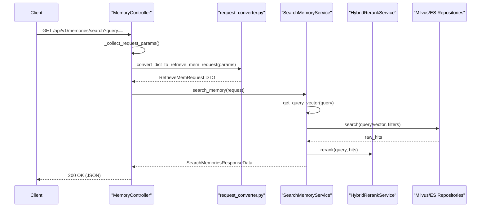

# Memory Search and Conversation Meta Endpoints
Relevant source files
- [methods/evermemos/docs/advanced/TEAM_CHAT_GUIDE.md](https://github.com/EverMind-AI/EverOS/blob/d40b8703/methods/evermemos/docs/advanced/TEAM_CHAT_GUIDE.md?plain=1)
- [methods/evermemos/docs/api_docs/memory_api.md](https://github.com/EverMind-AI/EverOS/blob/d40b8703/methods/evermemos/docs/api_docs/memory_api.md?plain=1)
- [methods/evermemos/src/agentic_layer/search_mem_service.py](https://github.com/EverMind-AI/EverOS/blob/d40b8703/methods/evermemos/src/agentic_layer/search_mem_service.py)

This page provides a technical deep dive into the specialized endpoints for searching memories and managing conversation-level metadata. These components enable multi-modal retrieval (vector, keyword, and agentic) and provide the contextual "scene" information required for high-quality memory extraction, including support for specialized agent memory types like `agent_case` and `agent_skill`.

## Memory Search API

The search endpoint allows for sophisticated retrieval across different memory types (Episodic, Foresight, Atomic Fact, Agent Case, Agent Skill) using various search strategies.

### Multi-Modal Search Flow

The search process is handled by the `MemoryController`[methods/evermemos/src/infra_layer/adapters/input/api/memory/memory_controller.py74](https://github.com/EverMind-AI/EverOS/blob/d40b8703/methods/evermemos/src/infra_layer/adapters/input/api/memory/memory_controller.py#L74-L74) which converts incoming HTTP requests into a `RetrieveMemRequest` DTO using `convert_dict_to_retrieve_mem_request`[methods/evermemos/src/infra_layer/adapters/input/api/memory/memory_controller.py255-263](https://github.com/EverMind-AI/EverOS/blob/d40b8703/methods/evermemos/src/infra_layer/adapters/input/api/memory/memory_controller.py#L255-L263) This request is then passed to the `SearchMemoryService`[methods/evermemos/src/agentic_layer/search_mem_service.py132-137](https://github.com/EverMind-AI/EverOS/blob/d40b8703/methods/evermemos/src/agentic_layer/search_mem_service.py#L132-L137)

**Key Parameters:**

- **retrieve_method**: Supports `keyword`, `vector`, `hybrid`, `rrf`, and `agentic`[methods/evermemos/src/api_specs/memory_models.py27](https://github.com/EverMind-AI/EverOS/blob/d40b8703/methods/evermemos/src/api_specs/memory_models.py#L27-L27)
- **memory_types**: A list of types to search, including `episodic_memory`, `foresight`, `atomic_fact`, `agent_case`, and `agent_skill`[methods/evermemos/src/api_specs/memory_models.py24](https://github.com/EverMind-AI/EverOS/blob/d40b8703/methods/evermemos/src/api_specs/memory_models.py#L24-L24)
- **MAGIC_ALL**: A special constant string (`__all__`) used in `user_id` or `group_id` fields to bypass specific filters and search across the entire tenant scope [methods/evermemos/src/core/oxm/constants.py2](https://github.com/EverMind-AI/EverOS/blob/d40b8703/methods/evermemos/src/core/oxm/constants.py#L2-L2)

### Search Sequence Diagram

The following diagram illustrates the data flow from the REST API through the conversion logic to the retrieval services, including the integration of agent-specific repositories.

"Search Request Data Flow"

Sources: [methods/evermemos/src/infra_layer/adapters/input/api/memory/memory_controller.py236-285](https://github.com/EverMind-AI/EverOS/blob/d40b8703/methods/evermemos/src/infra_layer/adapters/input/api/memory/memory_controller.py#L236-L285)[methods/evermemos/src/agentic_layer/search_mem_service.py132-191](https://github.com/EverMind-AI/EverOS/blob/d40b8703/methods/evermemos/src/agentic_layer/search_mem_service.py#L132-L191)[methods/evermemos/src/api_specs/request_converter.py184-225](https://github.com/EverMind-AI/EverOS/blob/d40b8703/methods/evermemos/src/api_specs/request_converter.py#L184-L225)[methods/evermemos/src/agentic_layer/search_mem_service.py141-158](https://github.com/EverMind-AI/EverOS/blob/d40b8703/methods/evermemos/src/agentic_layer/search_mem_service.py#L141-L158)

## Conversation Metadata Management

The `ConversationMeta` system stores the high-level context of a conversation, including the "scene" (e.g., `assistant` vs `group_chat`), participant details, and default timezones. This metadata is critical for the `ProfileManager` and `EpisodeMemoryExtractor` to understand the social dynamics of the interaction.

### Data Model and Scene Types

Metadata is persisted in the `conversation_metas` collection [methods/evermemos/src/infra_layer/adapters/out/persistence/document/memory/conversation_meta.py82](https://github.com/EverMind-AI/EverOS/blob/d40b8703/methods/evermemos/src/infra_layer/adapters/out/persistence/document/memory/conversation_meta.py#L82-L82)

- **ScenarioType**: Defines whether the interaction is a 1:1 `assistant` session or a multi-user `group_chat`[methods/evermemos/src/infra_layer/adapters/out/persistence/document/memory/conversation_meta.py11-14](https://github.com/EverMind-AI/EverOS/blob/d40b8703/methods/evermemos/src/infra_layer/adapters/out/persistence/document/memory/conversation_meta.py#L11-L14)
- **UserDetailModel**: Stores `full_name`, `role` (user/assistant), and an `extra` dictionary for arbitrary user attributes like "department" or "preferences" [methods/evermemos/src/infra_layer/adapters/out/persistence/document/memory/conversation_meta.py16-28](https://github.com/EverMind-AI/EverOS/blob/d40b8703/methods/evermemos/src/infra_layer/adapters/out/persistence/document/memory/conversation_meta.py#L16-L28)

### Fallback Logic

The `ConversationMetaRawRepository` implements a fallback mechanism. When a specific `group_id` is requested but not found, the system attempts to retrieve a "default" configuration (where `group_id` is `None`) for that tenant [methods/evermemos/src/infra_layer/adapters/out/persistence/repository/conversation_meta_raw_repository.py89-99](https://github.com/EverMind-AI/EverOS/blob/d40b8703/methods/evermemos/src/infra_layer/adapters/out/persistence/repository/conversation_meta_raw_repository.py#L89-L99) This allows developers to set global scene descriptions and user roles that apply to all new conversations by default.

### Implementation Classes

"Conversation Meta Code Entities"

[Class Diagram]

Sources: [methods/evermemos/src/infra_layer/adapters/out/persistence/document/memory/conversation_meta.py31-79](https://github.com/EverMind-AI/EverOS/blob/d40b8703/methods/evermemos/src/infra_layer/adapters/out/persistence/document/memory/conversation_meta.py#L31-L79)[methods/evermemos/src/infra_layer/adapters/out/persistence/repository/conversation_meta_raw_repository.py26-110](https://github.com/EverMind-AI/EverOS/blob/d40b8703/methods/evermemos/src/infra_layer/adapters/out/persistence/repository/conversation_meta_raw_repository.py#L26-L110)[methods/evermemos/src/service/conversation_meta_service.py30-48](https://github.com/EverMind-AI/EverOS/blob/d40b8703/methods/evermemos/src/service/conversation_meta_service.py#L30-L48)

## Internal Tenant Initialization

Before a tenant can use search or metadata endpoints, the infrastructure must be initialized. The system uses a tenant initialization logic to ensure the database and search indexes are ready. This includes creating MongoDB collections and specialized Milvus collections like `EpisodicMemoryCollection`[methods/evermemos/src/infra_layer/adapters/out/search/milvus/memory/episodic_memory_collection.py16](https://github.com/EverMind-AI/EverOS/blob/d40b8703/methods/evermemos/src/infra_layer/adapters/out/search/milvus/memory/episodic_memory_collection.py#L16-L16)`AgentCaseCollection`[methods/evermemos/src/infra_layer/adapters/out/search/milvus/memory/agent_case_collection.py17](https://github.com/EverMind-AI/EverOS/blob/d40b8703/methods/evermemos/src/infra_layer/adapters/out/search/milvus/memory/agent_case_collection.py#L17-L17) and `AgentSkillCollection`[methods/evermemos/src/infra_layer/adapters/out/search/milvus/memory/agent_skill_collection.py17](https://github.com/EverMind-AI/EverOS/blob/d40b8703/methods/evermemos/src/infra_layer/adapters/out/search/milvus/memory/agent_skill_collection.py#L17-L17)

| Endpoint | Method | Description |
| --- | --- | --- |
| `/internal/tenant/init-db` | POST | Initializes MongoDB collections, Milvus collections, and Elasticsearch indices for the tenant specified in `X-Organization-Id` and `X-Space-Id` headers. |

Sources: [methods/evermemos/src/infra_layer/adapters/out/search/milvus/memory/episodic_memory_collection.py27-139](https://github.com/EverMind-AI/EverOS/blob/d40b8703/methods/evermemos/src/infra_layer/adapters/out/search/milvus/memory/episodic_memory_collection.py#L27-L139)[methods/evermemos/src/infra_layer/adapters/out/search/milvus/memory/agent_case_collection.py31-143](https://github.com/EverMind-AI/EverOS/blob/d40b8703/methods/evermemos/src/infra_layer/adapters/out/search/milvus/memory/agent_case_collection.py#L31-L143)[methods/evermemos/src/infra_layer/adapters/out/search/milvus/memory/agent_skill_collection.py31-143](https://github.com/EverMind-AI/EverOS/blob/d40b8703/methods/evermemos/src/infra_layer/adapters/out/search/milvus/memory/agent_skill_collection.py#L31-L143)

## Summary of Endpoints

| Path | Method | Description |
| --- | --- | --- |
| `/api/v1/memories/search` | GET/POST | Multi-modal search. Supports `keyword`, `vector`, `hybrid`, `rrf`, `agentic`. [methods/evermemos/src/infra_layer/adapters/input/api/memory/memory_controller.py236](https://github.com/EverMind-AI/EverOS/blob/d40b8703/methods/evermemos/src/infra_layer/adapters/input/api/memory/memory_controller.py#L236-L236) |
| `/api/v1/memories/conversation-meta` | GET | Retrieve metadata for a `group_id` with fallback to default. [methods/evermemos/src/infra_layer/adapters/input/api/memory/memory_controller.py348](https://github.com/EverMind-AI/EverOS/blob/d40b8703/methods/evermemos/src/infra_layer/adapters/input/api/memory/memory_controller.py#L348-L348) |
| `/api/v1/memories/conversation-meta` | POST | Upsert (create or full update) metadata. [methods/evermemos/src/infra_layer/adapters/input/api/memory/memory_controller.py387](https://github.com/EverMind-AI/EverOS/blob/d40b8703/methods/evermemos/src/infra_layer/adapters/input/api/memory/memory_controller.py#L387-L387) |
| `/api/v1/memories/conversation-meta` | PATCH | Partial update of specific metadata fields (e.g., `tags` or `user_details`). [methods/evermemos/src/infra_layer/adapters/input/api/memory/memory_controller.py441](https://github.com/EverMind-AI/EverOS/blob/d40b8703/methods/evermemos/src/infra_layer/adapters/input/api/memory/memory_controller.py#L441-L441) |

Sources: [methods/evermemos/src/infra_layer/adapters/input/api/memory/memory_controller.py348-460](https://github.com/EverMind-AI/EverOS/blob/d40b8703/methods/evermemos/src/infra_layer/adapters/input/api/memory/memory_controller.py#L348-L460)[methods/evermemos/docs/api_docs/memory_api.md17](https://github.com/EverMind-AI/EverOS/blob/d40b8703/methods/evermemos/docs/api_docs/memory_api.md?plain=1#L17-L17)[methods/evermemos/src/agentic_layer/search_mem_service.py132-158](https://github.com/EverMind-AI/EverOS/blob/d40b8703/methods/evermemos/src/agentic_layer/search_mem_service.py#L132-L158)