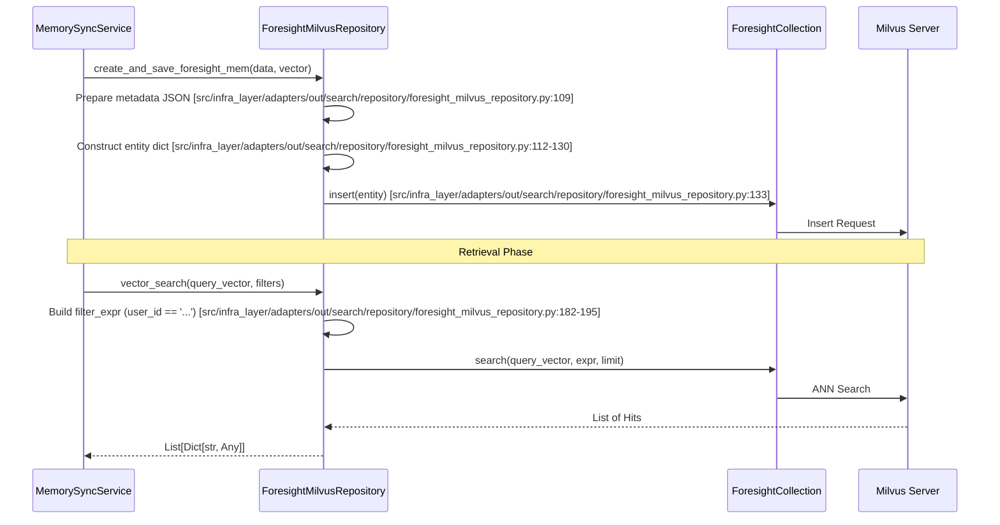

# Milvus Vector Collections and Repositories
Relevant source files
- [methods/evermemos/docs/installation/SETUP.md](https://github.com/EverMind-AI/EverOS/blob/d40b8703/methods/evermemos/docs/installation/SETUP.md?plain=1)
- [methods/evermemos/src/core/oxm/milvus/async_collection.py](https://github.com/EverMind-AI/EverOS/blob/d40b8703/methods/evermemos/src/core/oxm/milvus/async_collection.py)
- [methods/evermemos/src/core/oxm/mongo/mongo_utils.py](https://github.com/EverMind-AI/EverOS/blob/d40b8703/methods/evermemos/src/core/oxm/mongo/mongo_utils.py)
- [methods/evermemos/src/infra_layer/adapters/out/persistence/repository/agent_skill_raw_repository.py](https://github.com/EverMind-AI/EverOS/blob/d40b8703/methods/evermemos/src/infra_layer/adapters/out/persistence/repository/agent_skill_raw_repository.py)

This page details the vector persistence layer of EverOS, focusing on the Milvus implementation. The system uses Milvus for high-performance similarity searching across various memory types, including Episodic, Foresight, Atomic Facts, Agent Cases, Agent Skills, and User Profiles. It leverages a multi-tenant architecture through collection suffixes and provides a structured repository pattern for vector operations.

## Architecture Overview

The Milvus persistence layer is built on a hierarchy of collection management classes and specialized repositories. It bridges the gap between the application's high-level memory concepts and Milvus's low-level collection schemas.

### From Natural Language to Vector Space

The following diagram illustrates how natural language memory entities are transformed and stored into specific Milvus code entities.

**Memory to Vector Mapping**

[Flowchart Diagram]

**Sources:**[methods/evermemos/src/infra_layer/adapters/out/search/milvus/memory/episodic_memory_collection.py16-24](https://github.com/EverMind-AI/EverOS/blob/d40b8703/methods/evermemos/src/infra_layer/adapters/out/search/milvus/memory/episodic_memory_collection.py#L16-L24)[methods/evermemos/src/infra_layer/adapters/out/search/milvus/memory/event_log_collection.py17-28](https://github.com/EverMind-AI/EverOS/blob/d40b8703/methods/evermemos/src/infra_layer/adapters/out/search/milvus/memory/event_log_collection.py#L17-L28)[methods/evermemos/src/infra_layer/adapters/out/search/milvus/memory/foresight_collection.py17-27](https://github.com/EverMind-AI/EverOS/blob/d40b8703/methods/evermemos/src/infra_layer/adapters/out/search/milvus/memory/foresight_collection.py#L17-L27)[methods/evermemos/src/infra_layer/adapters/out/search/milvus/memory/agent_case_collection.py17-28](https://github.com/EverMind-AI/EverOS/blob/d40b8703/methods/evermemos/src/infra_layer/adapters/out/search/milvus/memory/agent_case_collection.py#L17-L28)[methods/evermemos/src/infra_layer/adapters/out/search/milvus/memory/agent_skill_collection.py17-28](https://github.com/EverMind-AI/EverOS/blob/d40b8703/methods/evermemos/src/infra_layer/adapters/out/search/milvus/memory/agent_skill_collection.py#L17-L28)[methods/evermemos/src/infra_layer/adapters/out/search/milvus/memory/user_profile_collection.py17-28](https://github.com/EverMind-AI/EverOS/blob/d40b8703/methods/evermemos/src/infra_layer/adapters/out/search/milvus/memory/user_profile_collection.py#L17-L28)

---

## Core Collection Infrastructure

### AsyncCollection Proxy

Because the standard `pymilvus` library is synchronous and performs blocking I/O (gRPC network waits), EverOS wraps it in `AsyncCollection`[methods/evermemos/src/core/oxm/milvus/async_collection.py51-56](https://github.com/EverMind-AI/EverOS/blob/d40b8703/methods/evermemos/src/core/oxm/milvus/async_collection.py#L51-L56)

- **Thread Pool Execution**: It uses a dedicated, pre-warmed `ThreadPoolExecutor` named `_milvus_executor` with a default size of 25 [methods/evermemos/src/core/oxm/milvus/async_collection.py18-25](https://github.com/EverMind-AI/EverOS/blob/d40b8703/methods/evermemos/src/core/oxm/milvus/async_collection.py#L18-L25)
- **Context Propagation**: The `async_wrap` decorator uses `contextvars.copy_context()` to ensure that tenant context and other local variables are accessible within the thread pool [methods/evermemos/src/core/oxm/milvus/async_collection.py28-48](https://github.com/EverMind-AI/EverOS/blob/d40b8703/methods/evermemos/src/core/oxm/milvus/async_collection.py#L28-L48)
- **Interface**: It provides async equivalents for `insert`, `search`, `query`, `delete`, and `load`[methods/evermemos/src/core/oxm/milvus/async_collection.py85-163](https://github.com/EverMind-AI/EverOS/blob/d40b8703/methods/evermemos/src/core/oxm/milvus/async_collection.py#L85-L163)

### MilvusCollectionBase

The `MilvusCollectionBase` class [methods/evermemos/src/core/oxm/milvus/milvus_collection_base.py85-124](https://github.com/EverMind-AI/EverOS/blob/d40b8703/methods/evermemos/src/core/oxm/milvus/milvus_collection_base.py#L85-L124) is the foundation for all collection managers. It handles:

- **Lazy Loading**: Collections are initialized only when `ensure_loaded()` is called [methods/evermemos/src/core/oxm/milvus/milvus_collection_base.py193-198](https://github.com/EverMind-AI/EverOS/blob/d40b8703/methods/evermemos/src/core/oxm/milvus/milvus_collection_base.py#L193-L198)
- **Async Proxy Integration**: It provides an `AsyncCollection` instance for non-blocking I/O via `async_collection()`[methods/evermemos/src/core/oxm/milvus/milvus_collection_base.py158-166](https://github.com/EverMind-AI/EverOS/blob/d40b8703/methods/evermemos/src/core/oxm/milvus/milvus_collection_base.py#L158-L166)
- **Schema Enforcement**: It manages `CollectionSchema` and `IndexConfig` definitions [methods/evermemos/src/core/oxm/milvus/milvus_collection_base.py127-132](https://github.com/EverMind-AI/EverOS/blob/d40b8703/methods/evermemos/src/core/oxm/milvus/milvus_collection_base.py#L127-L132)

### Multi-Tenancy: TenantAwareCollection

EverOS implements tenant isolation at the collection level using a suffixing strategy.

- **Suffix Mechanism**: Collections use a suffix derived from environment variables like `SELF_MILVUS_COLLECTION_NS`[methods/evermemos/src/core/oxm/milvus/milvus_collection_base.py69-83](https://github.com/EverMind-AI/EverOS/blob/d40b8703/methods/evermemos/src/core/oxm/milvus/milvus_collection_base.py#L69-L83)
- **TenantAwareMilvusCollectionWithSuffix**: This class ensures that every tenant operates on its own set of physical collections, preventing data leakage [methods/evermemos/src/infra_layer/adapters/out/search/milvus/memory/foresight_collection.py11-13](https://github.com/EverMind-AI/EverOS/blob/d40b8703/methods/evermemos/src/infra_layer/adapters/out/search/milvus/memory/foresight_collection.py#L11-L13)
- **Alias/Suffix Logic**: The system supports generating new collection names with timestamps via `generate_new_collection_name`[methods/evermemos/src/core/oxm/milvus/milvus_collection_base.py17-20](https://github.com/EverMind-AI/EverOS/blob/d40b8703/methods/evermemos/src/core/oxm/milvus/milvus_collection_base.py#L17-L20)

**Sources:**[methods/evermemos/src/core/oxm/milvus/async_collection.py18-163](https://github.com/EverMind-AI/EverOS/blob/d40b8703/methods/evermemos/src/core/oxm/milvus/async_collection.py#L18-L163)[methods/evermemos/src/core/oxm/milvus/milvus_collection_base.py17-198](https://github.com/EverMind-AI/EverOS/blob/d40b8703/methods/evermemos/src/core/oxm/milvus/milvus_collection_base.py#L17-L198)

---

## Memory Collection Schemas

All collections utilize specific dimensions (typically 1024 or 1536 depending on the model) and use `COSINE` similarity for vector metrics [methods/evermemos/src/infra_layer/adapters/out/search/milvus/memory/foresight_collection.py139](https://github.com/EverMind-AI/EverOS/blob/d40b8703/methods/evermemos/src/infra_layer/adapters/out/search/milvus/memory/foresight_collection.py#L139-L139)

### 1. Episodic Memory Collection

Stores narrative summaries of conversation segments.

- **Key Fields**: `id`, `vector`, `user_id`, `group_id`, `episode` (description), `search_content`, and `metadata` (JSON string) [methods/evermemos/src/infra_layer/adapters/out/search/milvus/memory/episodic_memory_collection.py30-116](https://github.com/EverMind-AI/EverOS/blob/d40b8703/methods/evermemos/src/infra_layer/adapters/out/search/milvus/memory/episodic_memory_collection.py#L30-L116)
- **Indexing**: Uses `HNSW` for the vector field and `AUTOINDEX` for scalar fields like `timestamp` and `user_id`[methods/evermemos/src/infra_layer/adapters/out/search/milvus/memory/episodic_memory_collection.py119-139](https://github.com/EverMind-AI/EverOS/blob/d40b8703/methods/evermemos/src/infra_layer/adapters/out/search/milvus/memory/episodic_memory_collection.py#L119-L139)

### 2. Event Log (Atomic Fact) Collection

Stores atomic facts for fine-grained retrieval.

- **Key Fields**: `atomic_fact`, `participants`, `event_type`, and `parent_id` (linking back to the source MemCell or Episode) [methods/evermemos/src/infra_layer/adapters/out/search/milvus/memory/event_log_collection.py34-120](https://github.com/EverMind-AI/EverOS/blob/d40b8703/methods/evermemos/src/infra_layer/adapters/out/search/milvus/memory/event_log_collection.py#L34-L120)

### 3. Agent Memory Collections

- **Agent Case**: Stores specific instances of agent task execution, including `task_intent`, `approach`, and `quality_score`[methods/evermemos/src/infra_layer/adapters/out/search/milvus/memory/agent_case_collection.py34-121](https://github.com/EverMind-AI/EverOS/blob/d40b8703/methods/evermemos/src/infra_layer/adapters/out/search/milvus/memory/agent_case_collection.py#L34-L121)
- **Agent Skill**: Stores distilled reusable skills with `name`, `description`, `usage_notes`, and `confidence`[methods/evermemos/src/infra_layer/adapters/out/search/milvus/memory/agent_skill_collection.py34-122](https://github.com/EverMind-AI/EverOS/blob/d40b8703/methods/evermemos/src/infra_layer/adapters/out/search/milvus/memory/agent_skill_collection.py#L34-L122)

### 4. User Profile Collection

Stores long-term user traits and explicit information.

- **Key Fields**: `user_id`, `profile_type` (ImplicitTraits/ExplicitInfo), `content`, and `vector`[methods/evermemos/src/infra_layer/adapters/out/search/milvus/memory/user_profile_collection.py34-118](https://github.com/EverMind-AI/EverOS/blob/d40b8703/methods/evermemos/src/infra_layer/adapters/out/search/milvus/memory/user_profile_collection.py#L34-L118)

**Sources:**[methods/evermemos/src/infra_layer/adapters/out/search/milvus/memory/episodic_memory_collection.py30-139](https://github.com/EverMind-AI/EverOS/blob/d40b8703/methods/evermemos/src/infra_layer/adapters/out/search/milvus/memory/episodic_memory_collection.py#L30-L139)[methods/evermemos/src/infra_layer/adapters/out/search/milvus/memory/event_log_collection.py34-143](https://github.com/EverMind-AI/EverOS/blob/d40b8703/methods/evermemos/src/infra_layer/adapters/out/search/milvus/memory/event_log_collection.py#L34-L143)[methods/evermemos/src/infra_layer/adapters/out/search/milvus/memory/agent_case_collection.py34-144](https://github.com/EverMind-AI/EverOS/blob/d40b8703/methods/evermemos/src/infra_layer/adapters/out/search/milvus/memory/agent_case_collection.py#L34-L144)[methods/evermemos/src/infra_layer/adapters/out/search/milvus/memory/agent_skill_collection.py34-145](https://github.com/EverMind-AI/EverOS/blob/d40b8703/methods/evermemos/src/infra_layer/adapters/out/search/milvus/memory/agent_skill_collection.py#L34-L145)[methods/evermemos/src/infra_layer/adapters/out/search/milvus/memory/user_profile_collection.py34-141](https://github.com/EverMind-AI/EverOS/blob/d40b8703/methods/evermemos/src/infra_layer/adapters/out/search/milvus/memory/user_profile_collection.py#L34-L141)

---

## Repository Implementation

Repositories provide the high-level API for the business layer to interact with Milvus.

### Data Flow: Save and Search

The `ForesightMilvusRepository`[methods/evermemos/src/infra_layer/adapters/out/search/repository/foresight_milvus_repository.py29-41](https://github.com/EverMind-AI/EverOS/blob/d40b8703/methods/evermemos/src/infra_layer/adapters/out/search/repository/foresight_milvus_repository.py#L29-L41) demonstrates the standard pattern for data persistence.

**Vector Search and Storage Flow**



### Specialized Repositories

- **`EventLogMilvusRepository`**: Specializes in `atomic_fact` storage and retrieval [methods/evermemos/src/infra_layer/adapters/out/search/repository/event_log_milvus_repository.py25-40](https://github.com/EverMind-AI/EverOS/blob/d40b8703/methods/evermemos/src/infra_layer/adapters/out/search/repository/event_log_milvus_repository.py#L25-L40)
- **`AgentCaseMilvusRepository`**: Manages vector search for agent experiences [methods/evermemos/src/infra_layer/adapters/out/search/repository/agent_case_milvus_repository.py26-37](https://github.com/EverMind-AI/EverOS/blob/d40b8703/methods/evermemos/src/infra_layer/adapters/out/search/repository/agent_case_milvus_repository.py#L26-L37)
- **`AgentSkillRawRepository`**: A MongoDB-based repository that manages skills extracted from clusters, using `build_id_filter` for flexible ID matching [methods/evermemos/src/infra_layer/adapters/out/persistence/repository/agent_skill_raw_repository.py24-65](https://github.com/EverMind-AI/EverOS/blob/d40b8703/methods/evermemos/src/infra_layer/adapters/out/persistence/repository/agent_skill_raw_repository.py#L24-L65)

### Key Functions

- **`create_and_save_*`**: Handles timestamp generation, metadata serialization into JSON strings, and entity insertion [methods/evermemos/src/infra_layer/adapters/out/search/repository/event_log_milvus_repository.py44-125](https://github.com/EverMind-AI/EverOS/blob/d40b8703/methods/evermemos/src/infra_layer/adapters/out/search/repository/event_log_milvus_repository.py#L44-L125)
- **`vector_search`**: Implements similarity search with optional radius filtering and complex boolean expressions for multi-tenancy [methods/evermemos/src/infra_layer/adapters/out/search/repository/event_log_milvus_repository.py146-200](https://github.com/EverMind-AI/EverOS/blob/d40b8703/methods/evermemos/src/infra_layer/adapters/out/search/repository/event_log_milvus_repository.py#L146-L200)
- **`build_id_filter`**: Utility to create MongoDB filters that handle both `ObjectId` and raw string IDs [methods/evermemos/src/core/oxm/mongo/mongo_utils.py48-86](https://github.com/EverMind-AI/EverOS/blob/d40b8703/methods/evermemos/src/core/oxm/mongo/mongo_utils.py#L48-L86)

**Sources:**[methods/evermemos/src/infra_layer/adapters/out/search/repository/event_log_milvus_repository.py25-200](https://github.com/EverMind-AI/EverOS/blob/d40b8703/methods/evermemos/src/infra_layer/adapters/out/search/repository/event_log_milvus_repository.py#L25-L200)[methods/evermemos/src/infra_layer/adapters/out/search/repository/foresight_milvus_repository.py29-175](https://github.com/EverMind-AI/EverOS/blob/d40b8703/methods/evermemos/src/infra_layer/adapters/out/search/repository/foresight_milvus_repository.py#L29-L175)[methods/evermemos/src/infra_layer/adapters/out/persistence/repository/agent_skill_raw_repository.py24-154](https://github.com/EverMind-AI/EverOS/blob/d40b8703/methods/evermemos/src/infra_layer/adapters/out/persistence/repository/agent_skill_raw_repository.py#L24-L154)[methods/evermemos/src/core/oxm/mongo/mongo_utils.py48-86](https://github.com/EverMind-AI/EverOS/blob/d40b8703/methods/evermemos/src/core/oxm/mongo/mongo_utils.py#L48-L86)

---

## Lifecycle and Initialization

The initialization of Milvus collections is integrated into the application startup via the `MilvusLifespanProvider`.

### Initialization Logic

1. **Discovery**: On startup, the provider scans for all subclasses of `MilvusCollectionBase`[methods/evermemos/src/core/lifespan/milvus_lifespan.py51-56](https://github.com/EverMind-AI/EverOS/blob/d40b8703/methods/evermemos/src/core/lifespan/milvus_lifespan.py#L51-L56)
2. **Connection**: It groups collections by their connection alias (`_DB_USING`) [methods/evermemos/src/core/lifespan/milvus_lifespan.py59-73](https://github.com/EverMind-AI/EverOS/blob/d40b8703/methods/evermemos/src/core/lifespan/milvus_lifespan.py#L59-L73)
3. **Creation**: For each collection, it calls `ensure_all()`, which checks if the collection exists, creates it if missing, and builds the specified indexes [methods/evermemos/src/core/lifespan/milvus_lifespan.py76-84](https://github.com/EverMind-AI/EverOS/blob/d40b8703/methods/evermemos/src/core/lifespan/milvus_lifespan.py#L76-L84)

### Tenant Initialization Tool

The system provides a CLI tool for initializing a specific tenant's databases:

```
export TENANT_SINGLE_TENANT_ID=tenant_001
python src/manage.py tenant-init
```

This triggers `run_tenant_init()`, which specifically invokes `init_milvus()` to ensure all collections and indexes are ready for the tenant [methods/evermemos/src/core/tenants/init_tenant_all.py77-121](https://github.com/EverMind-AI/EverOS/blob/d40b8703/methods/evermemos/src/core/tenants/init_tenant_all.py#L77-L121)

**Sources:**[methods/evermemos/src/core/lifespan/milvus_lifespan.py34-93](https://github.com/EverMind-AI/EverOS/blob/d40b8703/methods/evermemos/src/core/lifespan/milvus_lifespan.py#L34-L93)[methods/evermemos/src/core/tenants/init_tenant_all.py77-121](https://github.com/EverMind-AI/EverOS/blob/d40b8703/methods/evermemos/src/core/tenants/init_tenant_all.py#L77-L121)