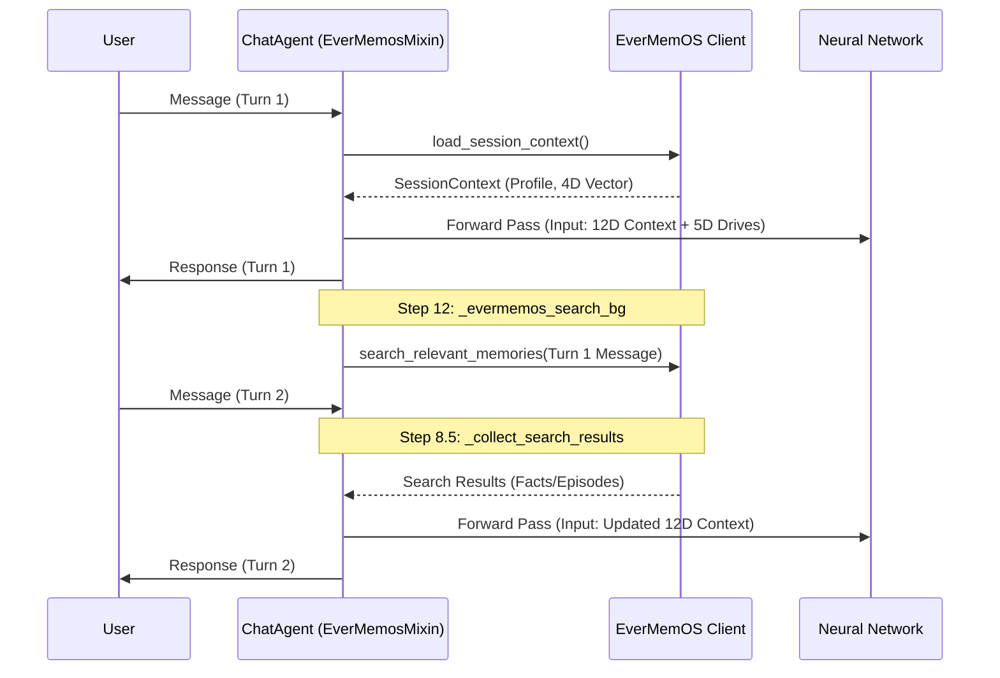

# Neural Network Pipeline and Relationship Evolution
Relevant source files
- [use-cases/openher/.env.example](https://github.com/EverMind-AI/EverOS/blob/d40b8703/use-cases/openher/.env.example)
- [use-cases/openher/README.md](https://github.com/EverMind-AI/EverOS/blob/d40b8703/use-cases/openher/README.md?plain=1)
- [use-cases/openher/demo/evermemos_demo.py](https://github.com/EverMind-AI/EverOS/blob/d40b8703/use-cases/openher/demo/evermemos_demo.py)
- [use-cases/openher/integration/context_features.py](https://github.com/EverMind-AI/EverOS/blob/d40b8703/use-cases/openher/integration/context_features.py)
- [use-cases/openher/integration/evermemos_mixin.py](https://github.com/EverMind-AI/EverOS/blob/d40b8703/use-cases/openher/integration/evermemos_mixin.py)
- [use-cases/openher/integration/memory_types.py](https://github.com/EverMind-AI/EverOS/blob/d40b8703/use-cases/openher/integration/memory_types.py)

This page details the integration between the **OpenHer** AI Being persona engine and the **EverMemOS** long-term memory infrastructure. It focuses on how declarative memory is transformed into a multi-dimensional input vector for a living neural network, enabling emergent behavioral changes based on relationship history.

## Neural Network Architecture

OpenHer's core personality is driven by a living neural network that processes internal motivations (Drives) and external perceptions (Context) to produce behavioral signals. The integration with EverMemOS expands the network's perception from a standard 8D turn-based context to a 12D cross-session context [use-cases/openher/integration/context_features.py5-7](https://github.com/EverMind-AI/EverOS/blob/d40b8703/use-cases/openher/integration/context_features.py#L5-L7)

### Data Dimensions

The neural network operates on a **25D input vector** and produces **8D behavioral signals**[use-cases/openher/integration/context_features.py60-63](https://github.com/EverMind-AI/EverOS/blob/d40b8703/use-cases/openher/integration/context_features.py#L60-L63)

| Layer | Dimensions | Components |
| --- | --- | --- |
| **Input** | **25D** | 5D Drives + 12D Context + 8D Recurrent State |
| **Hidden** | **24D** | Tanh activation layer |
| **Output** | **8D** | Sigmoid signals (Directness, Warmth, etc.) |

### Input Vector Composition

The 12D Context Features are derived from two sources:

1. **Critic LLM (8D):** Per-turn perception (e.g., `user_emotion`, `topic_intimacy`, `conflict_level`) [use-cases/openher/integration/context_features.py38-46](https://github.com/EverMind-AI/EverOS/blob/d40b8703/use-cases/openher/integration/context_features.py#L38-L46)
2. **EverMemOS (4D):** Cross-session relationship state (e.g., `trust_level`, `relationship_depth`) [use-cases/openher/integration/context_features.py48-53](https://github.com/EverMind-AI/EverOS/blob/d40b8703/use-cases/openher/integration/context_features.py#L48-L53)

**Sources:**[use-cases/openher/integration/context_features.py16-63](https://github.com/EverMind-AI/EverOS/blob/d40b8703/use-cases/openher/integration/context_features.py#L16-L63)[use-cases/openher/README.md44-67](https://github.com/EverMind-AI/EverOS/blob/d40b8703/use-cases/openher/README.md?plain=1#L44-L67)

---

## Relationship Evolution (EMA)

To prevent sudden, jarring shifts in persona behavior from a single message, OpenHer uses an **Exponential Moving Average (EMA)** to evolve the relationship vector. This ensures that trust and depth grow or shrink naturally over time [use-cases/openher/integration/evermemos_mixin.py68-72](https://github.com/EverMind-AI/EverOS/blob/d40b8703/use-cases/openher/integration/evermemos_mixin.py#L68-L72)

### The EMA Formula

The system blends the **EverMemOS Prior** (long-term history loaded at session start) with the **LLM Delta** (perceived change in the current turn) [use-cases/openher/demo/evermemos_demo.py158-164](https://github.com/EverMind-AI/EverOS/blob/d40b8703/use-cases/openher/demo/evermemos_demo.py#L158-L164):

$$posterior = clip(prior + delta)$$
$$state_t = \alpha \cdot posterior + (1 - \alpha) \cdot state_{t-1}$$

The `delta_map` translates Critic LLM outputs into context feature updates for `relationship_depth`, `emotional_valence`, and `trust_level`[use-cases/openher/integration/evermemos_mixin.py77-82](https://github.com/EverMind-AI/EverOS/blob/d40b8703/use-cases/openher/integration/evermemos_mixin.py#L77-L82)

### Dynamic Alpha ($\alpha$)

The smoothing factor $\alpha$ is modulated by `conversation_depth`. As a conversation progresses and becomes "deeper," the system trusts the current turn's perception more than the historical prior [use-cases/openher/integration/evermemos_mixin.py94-96](https://github.com/EverMind-AI/EverOS/blob/d40b8703/use-cases/openher/integration/evermemos_mixin.py#L94-L96):

- **Shallow/Start:** $\alpha \approx 0.15$ (Heavy reliance on long-term memory).
- **Deep/Engaged:** $\alpha \approx 0.65$ (Heavy reliance on current interaction).

**Sources:**[use-cases/openher/integration/evermemos_mixin.py61-104](https://github.com/EverMind-AI/EverOS/blob/d40b8703/use-cases/openher/integration/evermemos_mixin.py#L61-L104)[use-cases/openher/demo/evermemos_demo.py151-179](https://github.com/EverMind-AI/EverOS/blob/d40b8703/use-cases/openher/demo/evermemos_demo.py#L151-L179)

---

## Data Flow: From Memory to Behavior

The following diagram illustrates how raw data from EverMemOS is transformed into neural signals within the `EverMemosMixin` and `GenomeEngine` lifecycle.

### Pipeline: Memory to Neural Signal

[Flowchart Diagram]

**Sources:**[use-cases/openher/integration/context_features.py34-60](https://github.com/EverMind-AI/EverOS/blob/d40b8703/use-cases/openher/integration/context_features.py#L34-L60)[use-cases/openher/integration/evermemos_mixin.py25-104](https://github.com/EverMind-AI/EverOS/blob/d40b8703/use-cases/openher/integration/evermemos_mixin.py#L25-L104)[use-cases/openher/integration/memory_types.py36-55](https://github.com/EverMind-AI/EverOS/blob/d40b8703/use-cases/openher/integration/memory_types.py#L36-L55)

---

## Per-Turn Execution Lifecycle

The persona engine executes a multi-stage pipeline every turn. Memory retrieval is handled asynchronously to prevent blocking the response generation [use-cases/openher/README.md92-122](https://github.com/EverMind-AI/EverOS/blob/d40b8703/use-cases/openher/README.md?plain=1#L92-L122)

### Async Retrieval Pattern

To maintain a "human-like" flow, OpenHer uses a **two-stage async search**:

1. **Turn $N$:** As the user message arrives, the system fires an async search in the background via `_evermemos_search_bg()`[use-cases/openher/integration/evermemos_mixin.py128-153](https://github.com/EverMind-AI/EverOS/blob/d40b8703/use-cases/openher/integration/evermemos_mixin.py#L128-L153)
2. **Turn $N+1$:** The results from the previous turn are collected via `_collect_search_results()` and injected into the current prompt. If the search exceeds a 500ms timeout, the system degrades gracefully by using empty results or static session context [use-cases/openher/integration/evermemos_mixin.py157-187](https://github.com/EverMind-AI/EverOS/blob/d40b8703/use-cases/openher/integration/evermemos_mixin.py#L157-L187)

### Step-by-Step Pipeline

| Step | Action | Description |
| --- | --- | --- |
| **0** | `_evermemos_gather` | Load `SessionContext` (Profile, Summary, 4D Vector) [use-cases/openher/integration/evermemos_mixin.py25-30](https://github.com/EverMind-AI/EverOS/blob/d40b8703/use-cases/openher/integration/evermemos_mixin.py#L25-L30) |
| **2** | Perceive | Critic LLM evaluates 8D turn context [use-cases/openher/README.md101-103](https://github.com/EverMind-AI/EverOS/blob/d40b8703/use-cases/openher/README.md?plain=1#L101-L103) |
| **2.5** | `_apply_relationship_ema` | Blend history with current turn deltas [use-cases/openher/integration/evermemos_mixin.py61-66](https://github.com/EverMind-AI/EverOS/blob/d40b8703/use-cases/openher/integration/evermemos_mixin.py#L61-L66) |
| **5** | Neural Forward | 25D input $\to$ 8D behavioral signals [use-cases/openher/integration/context_features.py63-66](https://github.com/EverMind-AI/EverOS/blob/d40b8703/use-cases/openher/integration/context_features.py#L63-L66) |
| **8.5** | `_collect_search_results` | Gather async memories from the *previous* turn with 500ms timeout [use-cases/openher/integration/evermemos_mixin.py157-182](https://github.com/EverMind-AI/EverOS/blob/d40b8703/use-cases/openher/integration/evermemos_mixin.py#L157-L182) |
| **11** | `_evermemos_store_bg` | Store current turn in EverMemOS via `asyncio.create_task`[use-cases/openher/integration/evermemos_mixin.py106-124](https://github.com/EverMind-AI/EverOS/blob/d40b8703/use-cases/openher/integration/evermemos_mixin.py#L106-L124) |
| **12** | `_evermemos_search_bg` | Prefetch memories for the *next* turn [use-cases/openher/integration/evermemos_mixin.py128-132](https://github.com/EverMind-AI/EverOS/blob/d40b8703/use-cases/openher/integration/evermemos_mixin.py#L128-L132) |

### Sequence: Async Memory Handling

**Sources:**[use-cases/openher/integration/evermemos_mixin.py1-15](https://github.com/EverMind-AI/EverOS/blob/d40b8703/use-cases/openher/integration/evermemos_mixin.py#L1-L15)[use-cases/openher/README.md73-90](https://github.com/EverMind-AI/EverOS/blob/d40b8703/use-cases/openher/README.md?plain=1#L73-L90)[use-cases/openher/demo/evermemos_demo.py63-117](https://github.com/EverMind-AI/EverOS/blob/d40b8703/use-cases/openher/demo/evermemos_demo.py#L63-L117)