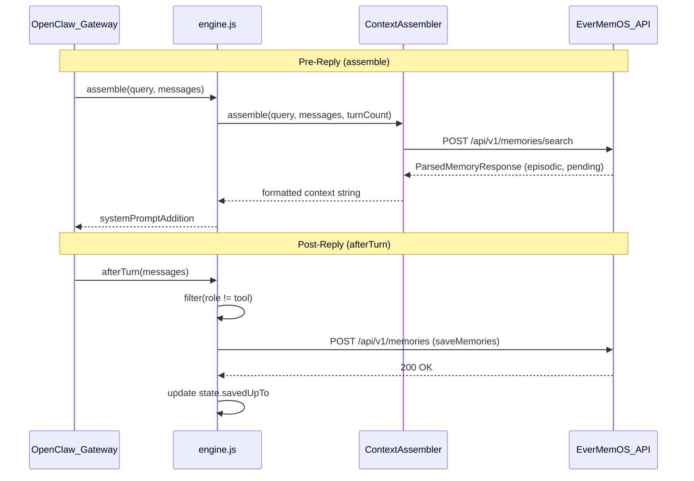

# OpenClaw Plugin Integration
Relevant source files
- [methods/evermemos/examples/openclaw-plugin/README.md](https://github.com/EverMind-AI/EverOS/blob/d40b8703/methods/evermemos/examples/openclaw-plugin/README.md?plain=1)
- [methods/evermemos/examples/openclaw-plugin/README.zh.md](https://github.com/EverMind-AI/EverOS/blob/d40b8703/methods/evermemos/examples/openclaw-plugin/README.zh.md?plain=1)
- [methods/evermemos/examples/openclaw-plugin/SKILL.md](https://github.com/EverMind-AI/EverOS/blob/d40b8703/methods/evermemos/examples/openclaw-plugin/SKILL.md?plain=1)
- [methods/evermemos/examples/openclaw-plugin/index.js](https://github.com/EverMind-AI/EverOS/blob/d40b8703/methods/evermemos/examples/openclaw-plugin/index.js)
- [methods/evermemos/examples/openclaw-plugin/src/engine.js](https://github.com/EverMind-AI/EverOS/blob/d40b8703/methods/evermemos/examples/openclaw-plugin/src/engine.js)
- [methods/evermemos/examples/openclaw-plugin/src/subagent-assembler.js](https://github.com/EverMind-AI/EverOS/blob/d40b8703/methods/evermemos/examples/openclaw-plugin/src/subagent-assembler.js)

The EverOS OpenClaw plugin provides persistent, long-term memory for the OpenClaw agent framework. Unlike traditional memory "slots" that require agents to manually call tools, this plugin operates as a `context-engine`. It hooks into the agent's full conversation lifecycle to automatically recall relevant past experiences before a reply and store new information after a reply, enabling a natural language "always-on" memory experience. [methods/evermemos/examples/openclaw-plugin/SKILL.md24-33](https://github.com/EverMind-AI/EverOS/blob/d40b8703/methods/evermemos/examples/openclaw-plugin/SKILL.md?plain=1#L24-L33)

## System Architecture

The plugin acts as a bridge between the OpenClaw agent framework and the EverMemOS backend. It manages session state, handles message conversion to prevent memory pollution, and coordinates context assembly for the LLM. [methods/evermemos/examples/openclaw-plugin/README.md7-19](https://github.com/EverMind-AI/EverOS/blob/d40b8703/methods/evermemos/examples/openclaw-plugin/README.md?plain=1#L7-L19)

### Entity Mapping: OpenClaw to EverMemOS

The following diagram illustrates how OpenClaw runtime entities map to EverMemOS code entities and storage.

**Entity Association Diagram**

[Flowchart Diagram]

Sources: [methods/evermemos/examples/openclaw-plugin/src/engine.js31-215](https://github.com/EverMind-AI/EverOS/blob/d40b8703/methods/evermemos/examples/openclaw-plugin/src/engine.js#L31-L215)[methods/evermemos/examples/openclaw-plugin/src/subagent-assembler.js19-66](https://github.com/EverMind-AI/EverOS/blob/d40b8703/methods/evermemos/examples/openclaw-plugin/src/subagent-assembler.js#L19-L66)[methods/evermemos/examples/openclaw-plugin/README.md151-161](https://github.com/EverMind-AI/EverOS/blob/d40b8703/methods/evermemos/examples/openclaw-plugin/README.md?plain=1#L151-L161)

## Plugin Configuration

The plugin is configured via the `openclaw.json` file under the `plugins.entries["evermind-ai-everos"]` key. [methods/evermemos/examples/openclaw-plugin/SKILL.md168-191](https://github.com/EverMind-AI/EverOS/blob/d40b8703/methods/evermemos/examples/openclaw-plugin/SKILL.md?plain=1#L168-L191)

| Field | Type | Default | Description |
| --- | --- | --- | --- |
| `baseUrl` | `string` | `http://localhost:1995` | The EverMemOS backend API URL. |
| `userId` | `string` | `everos-user` | Unique identifier for the user's memory partition. |
| `groupId` | `string` | `everos-group` | Shared namespace for group-based memory. |
| `topK` | `integer` | `5` | Number of memory entries to retrieve per turn. |
| `memoryTypes` | `array` | `["episodic_memory"]` | Types of memory to fetch (e.g., `episodic_memory`, `agent_case`). |
| `retrieveMethod` | `string` | `hybrid` | Retrieval strategy: `keyword`, `vector`, `hybrid`, `rrf`, or `agentic`. |

Sources: [methods/evermemos/examples/openclaw-plugin/SKILL.md179-186](https://github.com/EverMind-AI/EverOS/blob/d40b8703/methods/evermemos/examples/openclaw-plugin/SKILL.md?plain=1#L179-L186)[methods/evermemos/examples/openclaw-plugin/README.md123-132](https://github.com/EverMind-AI/EverOS/blob/d40b8703/methods/evermemos/examples/openclaw-plugin/README.md?plain=1#L123-L132)

## Lifecycle Hooks

The `createContextEngine` implementation in `src/engine.js` provides the core logic for memory persistence and context injection through the OpenClaw `ContextEngine` interface. [methods/evermemos/examples/openclaw-plugin/src/engine.js31-67](https://github.com/EverMind-AI/EverOS/blob/d40b8703/methods/evermemos/examples/openclaw-plugin/src/engine.js#L31-L67)

### 1. Pre-Reply: `assemble()`

Before the agent generates a response, `assemble()` is triggered. It performs a semantic search against the EverMemOS backend using the current user query. [methods/evermemos/examples/openclaw-plugin/src/engine.js154-185](https://github.com/EverMind-AI/EverOS/blob/d40b8703/methods/evermemos/examples/openclaw-plugin/src/engine.js#L154-L185)

- **Context Injection**: Retrieved memories are formatted into a prompt block (wrapped in code blocks) and prepended to the conversation context as `systemPromptAddition`. [methods/evermemos/examples/openclaw-plugin/src/engine.js179-180](https://github.com/EverMind-AI/EverOS/blob/d40b8703/methods/evermemos/examples/openclaw-plugin/src/engine.js#L179-L180)[methods/evermemos/examples/openclaw-plugin/src/subagent-assembler.js61](https://github.com/EverMind-AI/EverOS/blob/d40b8703/methods/evermemos/examples/openclaw-plugin/src/subagent-assembler.js#L61-L61)
- **Early Turn Logic**: For the first two turns of a session (`turnCount <= 2`), the `ContextAssembler` doubles the `topK` value (up to a max of 20) to provide better grounding for new conversations. [methods/evermemos/examples/openclaw-plugin/src/subagent-assembler.js37-39](https://github.com/EverMind-AI/EverOS/blob/d40b8703/methods/evermemos/examples/openclaw-plugin/src/subagent-assembler.js#L37-L39)
- **Query Extraction**: It extracts the query from the prompt or the last user message using `toText()`. [methods/evermemos/examples/openclaw-plugin/src/engine.js159-160](https://github.com/EverMind-AI/EverOS/blob/d40b8703/methods/evermemos/examples/openclaw-plugin/src/engine.js#L159-L160)
- **Session Reset Detection**: If the query is identified as a session reset prompt via `isSessionResetPrompt()`, context injection is skipped. [methods/evermemos/examples/openclaw-plugin/src/engine.js165-167](https://github.com/EverMind-AI/EverOS/blob/d40b8703/methods/evermemos/examples/openclaw-plugin/src/engine.js#L165-L167)

### 2. Post-Reply: `afterTurn()`

After a turn completes, this hook captures the new messages and saves them to the backend. [methods/evermemos/examples/openclaw-plugin/src/engine.js111-152](https://github.com/EverMind-AI/EverOS/blob/d40b8703/methods/evermemos/examples/openclaw-plugin/src/engine.js#L111-L152)

- **Message Slicing**: The plugin tracks `savedUpTo` in the `sessionState` to ensure only new messages in the current turn are sent to the backend, preventing duplicate ingestion. [methods/evermemos/examples/openclaw-plugin/src/engine.js124-130](https://github.com/EverMind-AI/EverOS/blob/d40b8703/methods/evermemos/examples/openclaw-plugin/src/engine.js#L124-L130)
- **Role Filtering**: Only `user` and `assistant` roles are saved; `tool` and `toolResult` messages are filtered out to keep the memory clean. [methods/evermemos/examples/openclaw-plugin/src/engine.js135-138](https://github.com/EverMind-AI/EverOS/blob/d40b8703/methods/evermemos/examples/openclaw-plugin/src/engine.js#L135-L138)
- **Deterministic IDs**: It uses a seed based on `sessionKey` and `turnCount` to generate consistent IDs for stored memories in the EverOS backend. [methods/evermemos/examples/openclaw-plugin/src/engine.js145](https://github.com/EverMind-AI/EverOS/blob/d40b8703/methods/evermemos/examples/openclaw-plugin/src/engine.js#L145-L145)
- **Ephemeral Sessions**: Sessions starting with `temp:` or `internal:` are ignored by `afterTurn()` to prevent persisting temporary internal agent chatter. [methods/evermemos/examples/openclaw-plugin/src/engine.js13-15](https://github.com/EverMind-AI/EverOS/blob/d40b8703/methods/evermemos/examples/openclaw-plugin/src/engine.js#L13-L15)[methods/evermemos/examples/openclaw-plugin/src/engine.js114](https://github.com/EverMind-AI/EverOS/blob/d40b8703/methods/evermemos/examples/openclaw-plugin/src/engine.js#L114-L114)

**Data Flow: assemble() and afterTurn()**

Sources: [methods/evermemos/examples/openclaw-plugin/src/engine.js111-185](https://github.com/EverMind-AI/EverOS/blob/d40b8703/methods/evermemos/examples/openclaw-plugin/src/engine.js#L111-L185)[methods/evermemos/examples/openclaw-plugin/src/subagent-assembler.js36-64](https://github.com/EverMind-AI/EverOS/blob/d40b8703/methods/evermemos/examples/openclaw-plugin/src/subagent-assembler.js#L36-L64)[methods/evermemos/examples/openclaw-plugin/src/api.js6](https://github.com/EverMind-AI/EverOS/blob/d40b8703/methods/evermemos/examples/openclaw-plugin/src/api.js#L6-L6)

## SubAgentAssembler Architecture

The `ContextAssembler` class in `src/subagent-assembler.js` manages the retrieval logic and prompt construction. [methods/evermemos/examples/openclaw-plugin/src/subagent-assembler.js19-27](https://github.com/EverMind-AI/EverOS/blob/d40b8703/methods/evermemos/examples/openclaw-plugin/src/subagent-assembler.js#L19-L27)

- **Memory Retrieval**: It constructs search parameters including `userId`, `groupId`, and `memoryTypes` before calling the `searchMemories` API. [methods/evermemos/examples/openclaw-plugin/src/subagent-assembler.js42-49](https://github.com/EverMind-AI/EverOS/blob/d40b8703/methods/evermemos/examples/openclaw-plugin/src/subagent-assembler.js#L42-L49)
- **Session State**: The plugin maintains an in-memory `sessionState` map to track `turnCount` and `savedUpTo` per session key, with a 2-hour TTL (`SESSION_TTL_MS`) to manage memory usage. [methods/evermemos/examples/openclaw-plugin/src/engine.js40-51](https://github.com/EverMind-AI/EverOS/blob/d40b8703/methods/evermemos/examples/openclaw-plugin/src/engine.js#L40-L51)
- **Health Checks**: During the `bootstrap()` phase, the plugin performs a health check on the EverMemOS backend (`/health`) to ensure connectivity before starting the session. [methods/evermemos/examples/openclaw-plugin/src/engine.js76-92](https://github.com/EverMind-AI/EverOS/blob/d40b8703/methods/evermemos/examples/openclaw-plugin/src/engine.js#L76-L92)
- **Compaction Support**: The plugin implements `compact()` to monitor token budgets, though it currently signals the host to perform compaction rather than owning the process itself. [methods/evermemos/examples/openclaw-plugin/src/engine.js187-205](https://github.com/EverMind-AI/EverOS/blob/d40b8703/methods/evermemos/examples/openclaw-plugin/src/engine.js#L187-L205)

## Installation and Verification

The plugin provides a dedicated installer to automate the configuration of `openclaw.json`. [methods/evermemos/examples/openclaw-plugin/README.md22-35](https://github.com/EverMind-AI/EverOS/blob/d40b8703/methods/evermemos/examples/openclaw-plugin/README.md?plain=1#L22-L35)

### Installation Steps

1. **Health Check**: The installer (or the `bootstrap` hook) verifies if the backend is reachable at the specified `baseUrl`. [methods/evermemos/examples/openclaw-plugin/SKILL.md116-120](https://github.com/EverMind-AI/EverOS/blob/d40b8703/methods/evermemos/examples/openclaw-plugin/SKILL.md?plain=1#L116-L120)[methods/evermemos/examples/openclaw-plugin/src/engine.js80-89](https://github.com/EverMind-AI/EverOS/blob/d40b8703/methods/evermemos/examples/openclaw-plugin/src/engine.js#L80-L89)
2. **Config Patching**: It updates the `plugins` section of `openclaw.json`, setting the `contextEngine` slot to `evermind-ai-everos` and disabling the standard `memory` slot (`plugins.slots.memory = "none"`) to avoid conflicts. [methods/evermemos/examples/openclaw-plugin/SKILL.md154-160](https://github.com/EverMind-AI/EverOS/blob/d40b8703/methods/evermemos/examples/openclaw-plugin/SKILL.md?plain=1#L154-L160)[methods/evermemos/examples/openclaw-plugin/README.md14-18](https://github.com/EverMind-AI/EverOS/blob/d40b8703/methods/evermemos/examples/openclaw-plugin/README.md?plain=1#L14-L18)
3. **Verification**: Users can verify the integration by sending a "Remember" command followed by a retrieval question to test the full loop. [methods/evermemos/examples/openclaw-plugin/SKILL.md241-247](https://github.com/EverMind-AI/EverOS/blob/d40b8703/methods/evermemos/examples/openclaw-plugin/SKILL.md?plain=1#L241-L247)[methods/evermemos/examples/openclaw-plugin/README.md43-48](https://github.com/EverMind-AI/EverOS/blob/d40b8703/methods/evermemos/examples/openclaw-plugin/README.md?plain=1#L43-L48)

Sources: [methods/evermemos/examples/openclaw-plugin/SKILL.md102-145](https://github.com/EverMind-AI/EverOS/blob/d40b8703/methods/evermemos/examples/openclaw-plugin/SKILL.md?plain=1#L102-L145)[methods/evermemos/examples/openclaw-plugin/README.md134-140](https://github.com/EverMind-AI/EverOS/blob/d40b8703/methods/evermemos/examples/openclaw-plugin/README.md?plain=1#L134-L140)