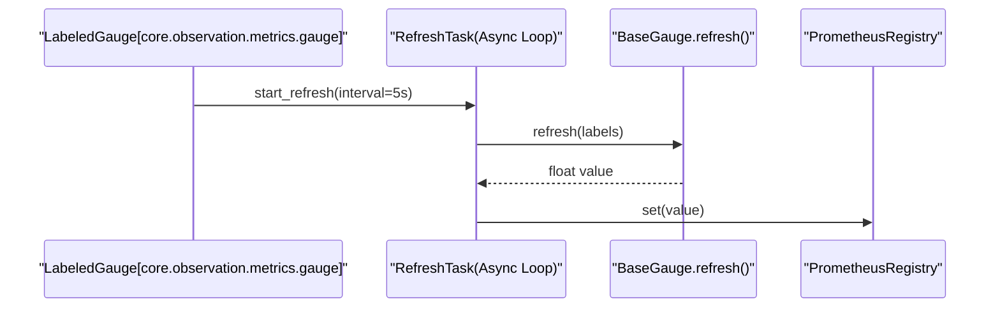

# Prometheus Metrics and Monitoring
Relevant source files
- [methods/evermemos/docs/OVERVIEW.md](https://github.com/EverMind-AI/EverOS/blob/d40b8703/methods/evermemos/docs/OVERVIEW.md?plain=1)
- [methods/evermemos/docs/usage/CONFIGURATION_GUIDE.md](https://github.com/EverMind-AI/EverOS/blob/d40b8703/methods/evermemos/docs/usage/CONFIGURATION_GUIDE.md?plain=1)

EverMemOS provides a comprehensive observability stack based on Prometheus, featuring automatic HTTP instrumentation, specialized pipeline latency tracking, and ML-specific metrics for vectorization and reranking. The system is designed to provide visibility into both infrastructure performance and the quality of memory operations.

## System Architecture and Data Flow

The monitoring infrastructure is decoupled from business logic through a wrapper layer in `core.observation.metrics`. Metrics are collected across all layers and exposed via a standalone HTTP server, typically on port `9090`.

### Metrics Collection Flow

The following diagram illustrates how metrics flow from various system components into the Prometheus registry.

**Diagram: Metrics Instrumentation Flow**

[Flowchart Diagram]

**Sources:**[src/core/observation/metrics/registry.py16-31](https://github.com/EverMind-AI/EverOS/blob/d40b8703/src/core/observation/metrics/registry.py#L16-L31)[src/core/observation/metrics/server.py33-81](https://github.com/EverMind-AI/EverOS/blob/d40b8703/src/core/observation/metrics/server.py#L33-L81)[src/core/middleware/prometheus_middleware.py120-138](https://github.com/EverMind-AI/EverOS/blob/d40b8703/src/core/middleware/prometheus_middleware.py#L120-L138)[src/agentic_layer/metrics/memorize_metrics.py184-191](https://github.com/EverMind-AI/EverOS/blob/d40b8703/src/agentic_layer/metrics/memorize_metrics.py#L184-L191)

---

## HTTP Instrumentation: PrometheusMiddleware

The `PrometheusMiddleware` provides auto-instrumentation for all FastAPI endpoints. It tracks request counts, latencies, and payload sizes [src/core/middleware/prometheus_middleware.py120-138](https://github.com/EverMind-AI/EverOS/blob/d40b8703/src/core/middleware/prometheus_middleware.py#L120-L138)

### Path Normalization

To prevent label cardinality explosion (e.g., unique labels for every ID in `/api/users/123`), the middleware uses `_normalize_path` to extract the FastAPI route template (e.g., `/api/users/{user_id}`) [src/core/middleware/prometheus_middleware.py94-116](https://github.com/EverMind-AI/EverOS/blob/d40b8703/src/core/middleware/prometheus_middleware.py#L94-L116) If a path does not match a defined route, it is labeled as `{unmatched}`[src/core/middleware/prometheus_middleware.py112-116](https://github.com/EverMind-AI/EverOS/blob/d40b8703/src/core/middleware/prometheus_middleware.py#L112-L116)

### Recorded Metrics

| Metric Name | Type | Labels | Description |
| --- | --- | --- | --- |
| `http_requests_total` | Counter | `method`, `path`, `status` | Total request count [src/core/middleware/prometheus_middleware.py27-33](https://github.com/EverMind-AI/EverOS/blob/d40b8703/src/core/middleware/prometheus_middleware.py#L27-L33) |
| `http_request_duration_seconds` | Histogram | `method`, `path` | Request latency [src/core/middleware/prometheus_middleware.py35-42](https://github.com/EverMind-AI/EverOS/blob/d40b8703/src/core/middleware/prometheus_middleware.py#L35-L42) |
| `http_request_size_bytes` | Histogram | `method`, `path` | Request body size [src/core/middleware/prometheus_middleware.py44-51](https://github.com/EverMind-AI/EverOS/blob/d40b8703/src/core/middleware/prometheus_middleware.py#L44-L51) |
| `http_response_size_bytes` | Histogram | `method`, `path` | Response body size [src/core/middleware/prometheus_middleware.py53-60](https://github.com/EverMind-AI/EverOS/blob/d40b8703/src/core/middleware/prometheus_middleware.py#L53-L60) |

**Sources:**[src/core/middleware/prometheus_middleware.py26-60](https://github.com/EverMind-AI/EverOS/blob/d40b8703/src/core/middleware/prometheus_middleware.py#L26-L60)[src/core/middleware/prometheus_middleware.py143-192](https://github.com/EverMind-AI/EverOS/blob/d40b8703/src/core/middleware/prometheus_middleware.py#L143-L192)

---

## Retrieval and Memorization Pipeline Metrics

The retrieval and memorization systems track performance across multiple stages to identify bottlenecks in memory lifecycle management.

### Key Retrieval Metrics

- **`retrieve_duration_seconds`**: Measures end-to-end latency using `HistogramBuckets.API_CALL`[src/agentic_layer/metrics/retrieve_metrics.py83-90](https://github.com/EverMind-AI/EverOS/blob/d40b8703/src/agentic_layer/metrics/retrieve_metrics.py#L83-L90)
- **`retrieve_stage_duration_seconds`**: Granular tracking for stages like `milvus_search`, `rerank`, and `rrf_fusion`[src/agentic_layer/metrics/retrieve_metrics.py102-109](https://github.com/EverMind-AI/EverOS/blob/d40b8703/src/agentic_layer/metrics/retrieve_metrics.py#L102-L109)
- **`retrieve_results_count`**: Histogram of the number of memories returned to tune top-k parameters [src/agentic_layer/metrics/retrieve_metrics.py122-129](https://github.com/EverMind-AI/EverOS/blob/d40b8703/src/agentic_layer/metrics/retrieve_metrics.py#L122-L129)

### Memorization and Extraction Metrics

The system tracks the multi-stage memory ingestion process, including boundary detection and MemCell extraction [src/agentic_layer/metrics/memorize_metrics.py1-10](https://github.com/EverMind-AI/EverOS/blob/d40b8703/src/agentic_layer/metrics/memorize_metrics.py#L1-L10)

- **`boundary_detection_total`**: Counts results of the boundary detection logic (e.g., `should_end`, `force_split`) [src/agentic_layer/metrics/memorize_metrics.py166-172](https://github.com/EverMind-AI/EverOS/blob/d40b8703/src/agentic_layer/metrics/memorize_metrics.py#L166-L172)
- **`memory_extraction_stage_duration_seconds`**: Tracks duration of specific extraction sub-tasks like `extract_episodes` or `extract_event_logs`[src/agentic_layer/metrics/memorize_metrics.py205-212](https://github.com/EverMind-AI/EverOS/blob/d40b8703/src/agentic_layer/metrics/memorize_metrics.py#L205-L212)
- **Multi-Tenant Support**: Metrics include `space_id` labels retrieved via `get_space_id_for_metrics()`[src/agentic_layer/metrics/memorize_metrics.py45-60](https://github.com/EverMind-AI/EverOS/blob/d40b8703/src/agentic_layer/metrics/memorize_metrics.py#L45-L60)

**Sources:**[src/agentic_layer/metrics/retrieve_metrics.py45-138](https://github.com/EverMind-AI/EverOS/blob/d40b8703/src/agentic_layer/metrics/retrieve_metrics.py#L45-L138)[src/agentic_layer/metrics/memorize_metrics.py82-232](https://github.com/EverMind-AI/EverOS/blob/d40b8703/src/agentic_layer/metrics/memorize_metrics.py#L82-L232)

---

## ML Service Metrics: Vectorize and Rerank

EverMemOS monitors the reliability and cost of ML inference providers. The system supports providers like `deepinfra` and `vllm`[methods/evermemos/docs/usage/CONFIGURATION_GUIDE.md35-59](https://github.com/EverMind-AI/EverOS/blob/d40b8703/methods/evermemos/docs/usage/CONFIGURATION_GUIDE.md?plain=1#L35-L59)

### Vectorization (Embedding)

- **Token Usage**: `vectorize_tokens_total` tracks total tokens processed per provider for cost accounting [src/agentic_layer/metrics/vectorize_metrics.py66-72](https://github.com/EverMind-AI/EverOS/blob/d40b8703/src/agentic_layer/metrics/vectorize_metrics.py#L66-L72)
- **Batching**: `vectorize_batch_size` monitors the efficiency of batch embedding requests [src/agentic_layer/metrics/vectorize_metrics.py104-111](https://github.com/EverMind-AI/EverOS/blob/d40b8703/src/agentic_layer/metrics/vectorize_metrics.py#L104-L111)
- **Fallbacks**: `vectorize_fallback_total` increments whenever the system switches from a primary provider to a fallback due to errors or timeouts [src/agentic_layer/metrics/vectorize_metrics.py32-38](https://github.com/EverMind-AI/EverOS/blob/d40b8703/src/agentic_layer/metrics/vectorize_metrics.py#L32-L38)

### Reranking

- **Document Volume**: `rerank_documents_count` tracks how many documents are sent to the reranker per request [src/agentic_layer/metrics/rerank_metrics.py110-117](https://github.com/EverMind-AI/EverOS/blob/d40b8703/src/agentic_layer/metrics/rerank_metrics.py#L110-L117)
- **Latency**: `rerank_duration_seconds` uses `HistogramBuckets.ML_INFERENCE` to capture the distribution of reranking time [src/agentic_layer/metrics/rerank_metrics.py92-99](https://github.com/EverMind-AI/EverOS/blob/d40b8703/src/agentic_layer/metrics/rerank_metrics.py#L92-L99)

**Sources:**[src/agentic_layer/metrics/vectorize_metrics.py15-125](https://github.com/EverMind-AI/EverOS/blob/d40b8703/src/agentic_layer/metrics/vectorize_metrics.py#L15-L125)[src/agentic_layer/metrics/rerank_metrics.py39-125](https://github.com/EverMind-AI/EverOS/blob/d40b8703/src/agentic_layer/metrics/rerank_metrics.py#L39-L125)[methods/evermemos/docs/usage/CONFIGURATION_GUIDE.md113-140](https://github.com/EverMind-AI/EverOS/blob/d40b8703/methods/evermemos/docs/usage/CONFIGURATION_GUIDE.md?plain=1#L113-L140)

---

## Metric Primitives and Patterns

The `core.observation.metrics` package wraps `prometheus_client` to provide a clean interface and specialized behaviors.

### HistogramBuckets

Standardized bucket definitions ensure consistent latency reporting across services [src/core/observation/metrics/histogram.py12-36](https://github.com/EverMind-AI/EverOS/blob/d40b8703/src/core/observation/metrics/histogram.py#L12-L36):

- `FAST`: 1ms to 500ms (Caches/Logic).
- `DATABASE`: 1ms to 5s (Milvus/Mongo/Elasticsearch).
- `ML_INFERENCE`: 10ms to 10s (vLLM/DeepInfra).
- `API_CALL`: 10ms to 30s (External services).

### BaseGauge (Self-Refreshing Pattern)

The `BaseGauge` class allows for asynchronous, periodic updates of instantaneous values (e.g., queue sizes or system resources) [src/core/observation/metrics/gauge.py16-50](https://github.com/EverMind-AI/EverOS/blob/d40b8703/src/core/observation/metrics/gauge.py#L16-L50)

**Diagram: BaseGauge Refresh Mechanism**

**Sources:**[src/core/observation/metrics/gauge.py16-50](https://github.com/EverMind-AI/EverOS/blob/d40b8703/src/core/observation/metrics/gauge.py#L16-L50)[src/core/observation/metrics/gauge.py194-222](https://github.com/EverMind-AI/EverOS/blob/d40b8703/src/core/observation/metrics/gauge.py#L194-L222)

---

## Lifecycle Management

The metrics server is managed via the `MetricsLifespanProvider`, which integrates with the FastAPI bootstrap process.

1. **Initialization**: During startup, the provider reads `METRICS_PORT` (default `9090`) [src/core/lifespan/metrics_lifespan.py43-45](https://github.com/EverMind-AI/EverOS/blob/d40b8703/src/core/lifespan/metrics_lifespan.py#L43-L45)
2. **Server Startup**: `start_metrics_server` initializes a daemon thread running a standalone HTTP server [src/core/observation/metrics/server.py69-75](https://github.com/EverMind-AI/EverOS/blob/d40b8703/src/core/observation/metrics/server.py#L69-L75)
3. **Registration**: All metrics created via `Counter`, `Histogram`, or `BaseGauge` are automatically registered to the singleton `REGISTRY`[src/core/observation/metrics/registry.py16-31](https://github.com/EverMind-AI/EverOS/blob/d40b8703/src/core/observation/metrics/registry.py#L16-L31)
4. **Shutdown**: The server stops automatically as it runs in a daemon thread [src/core/lifespan/metrics_lifespan.py63-74](https://github.com/EverMind-AI/EverOS/blob/d40b8703/src/core/lifespan/metrics_lifespan.py#L63-L74)

**Sources:**[src/core/lifespan/metrics_lifespan.py19-61](https://github.com/EverMind-AI/EverOS/blob/d40b8703/src/core/lifespan/metrics_lifespan.py#L19-L61)[src/core/observation/metrics/server.py33-81](https://github.com/EverMind-AI/EverOS/blob/d40b8703/src/core/observation/metrics/server.py#L33-L81)