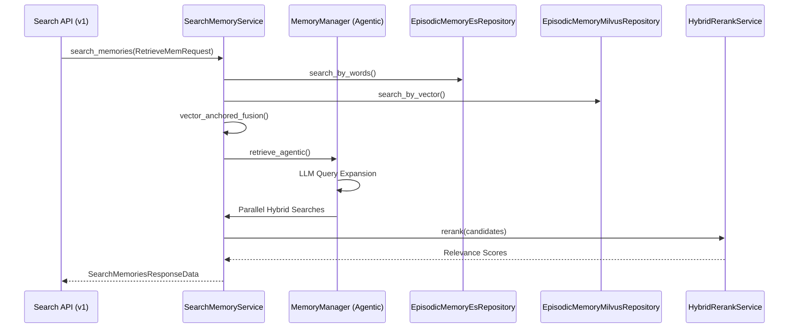

# Retrieval System
Relevant source files
- [methods/evermemos/docs/advanced/RETRIEVAL_STRATEGIES.md](https://github.com/EverMind-AI/EverOS/blob/d40b8703/methods/evermemos/docs/advanced/RETRIEVAL_STRATEGIES.md?plain=1)
- [methods/evermemos/src/agentic_layer/search_mem_service.py](https://github.com/EverMind-AI/EverOS/blob/d40b8703/methods/evermemos/src/agentic_layer/search_mem_service.py)

The EverOS Retrieval System is a multi-modal architecture designed to recall relevant memories across different time scales and data structures. It bridges the gap between natural language queries and structured memory entities (Episodes, Profiles, AgentCases, AgentSkills) by combining traditional keyword search, semantic vector search, and LLM-guided agentic reasoning.

## Retrieval Architecture Overview

The system follows a tiered approach to retrieval, allowing developers to balance latency and accuracy. The `SearchMemoryService` acts as the primary coordinator, routing requests to specialized repositories for MongoDB, Elasticsearch, and Milvus [methods/evermemos/src/agentic_layer/search_mem_service.py132-164](https://github.com/EverMind-AI/EverOS/blob/d40b8703/methods/evermemos/src/agentic_layer/search_mem_service.py#L132-L164)

### Retrieval Pipeline Stages

The retrieval process generally follows these stages:

1. **Query Normalization**: Parsing the user query and identifying the target `MemoryType` (e.g., `EPISODIC_MEMORY`, `AGENT_CASE`, `AGENT_SKILL`, `PROFILE`) [methods/evermemos/src/agentic_layer/search_mem_service.py230-245](https://github.com/EverMind-AI/EverOS/blob/d40b8703/methods/evermemos/src/agentic_layer/search_mem_service.py#L230-L245)
2. **Multi-Path Recall**: Executing parallel searches across Elasticsearch (BM25) and Milvus (Vector Similarity) [methods/evermemos/docs/advanced/RETRIEVAL_STRATEGIES.md84-92](https://github.com/EverMind-AI/EverOS/blob/d40b8703/methods/evermemos/docs/advanced/RETRIEVAL_STRATEGIES.md?plain=1#L84-L92)
3. **Fusion & Reranking**: Merging results using Reciprocal Rank Fusion (RRF) via `vector_anchored_fusion` and optionally applying a cross-encoder reranker for deep relevance scoring [methods/evermemos/src/agentic_layer/search_mem_service.py84](https://github.com/EverMind-AI/EverOS/blob/d40b8703/methods/evermemos/src/agentic_layer/search_mem_service.py#L84-L84)[methods/evermemos/docs/advanced/RETRIEVAL_STRATEGIES.md107-114](https://github.com/EverMind-AI/EverOS/blob/d40b8703/methods/evermemos/docs/advanced/RETRIEVAL_STRATEGIES.md?plain=1#L107-L114)
4. **Agentic Refinement (Optional)**: Using an LLM to evaluate if the retrieved context is sufficient and generating refined sub-queries if necessary via the `MemoryManager`[methods/evermemos/src/agentic_layer/search_mem_service.py160](https://github.com/EverMind-AI/EverOS/blob/d40b8703/methods/evermemos/src/agentic_layer/search_mem_service.py#L160-L160)[methods/evermemos/docs/advanced/RETRIEVAL_STRATEGIES.md120-130](https://github.com/EverMind-AI/EverOS/blob/d40b8703/methods/evermemos/docs/advanced/RETRIEVAL_STRATEGIES.md?plain=1#L120-L130)

### System Component Mapping

The following diagram illustrates how natural language queries are transformed into code-level operations across different storage backends.

**Query to Entity Mapping**

[Flowchart Diagram]

**Sources:**[methods/evermemos/src/agentic_layer/search_mem_service.py141-160](https://github.com/EverMind-AI/EverOS/blob/d40b8703/methods/evermemos/src/agentic_layer/search_mem_service.py#L141-L160)[methods/evermemos/docs/advanced/RETRIEVAL_STRATEGIES.md38-130](https://github.com/EverMind-AI/EverOS/blob/d40b8703/methods/evermemos/docs/advanced/RETRIEVAL_STRATEGIES.md?plain=1#L38-L130)

---

## Core Retrieval Strategies

EverOS supports several retrieval methods defined in the `RetrieveMethod` enum [methods/evermemos/src/agentic_layer/search_mem_service.py88](https://github.com/EverMind-AI/EverOS/blob/d40b8703/methods/evermemos/src/agentic_layer/search_mem_service.py#L88-L88)

| Method | Backend | Best For | Latency |
| --- | --- | --- | --- |
| **Keyword** | Elasticsearch | Exact matches, names, specific dates [methods/evermemos/docs/advanced/RETRIEVAL_STRATEGIES.md38-47](https://github.com/EverMind-AI/EverOS/blob/d40b8703/methods/evermemos/docs/advanced/RETRIEVAL_STRATEGIES.md?plain=1#L38-L47) | 50-100ms |
| **Vector** | Milvus | Semantic similarity, conceptual queries [methods/evermemos/docs/advanced/RETRIEVAL_STRATEGIES.md61-70](https://github.com/EverMind-AI/EverOS/blob/d40b8703/methods/evermemos/docs/advanced/RETRIEVAL_STRATEGIES.md?plain=1#L61-L70) | 200-500ms |
| **Hybrid / RRF** | ES + Milvus | General purpose search with fusion [methods/evermemos/docs/advanced/RETRIEVAL_STRATEGIES.md84-92](https://github.com/EverMind-AI/EverOS/blob/d40b8703/methods/evermemos/docs/advanced/RETRIEVAL_STRATEGIES.md?plain=1#L84-L92) | 200-600ms |
| **Agentic** | LLM + Hybrid | Complex, multi-faceted questions [methods/evermemos/docs/advanced/RETRIEVAL_STRATEGIES.md120-130](https://github.com/EverMind-AI/EverOS/blob/d40b8703/methods/evermemos/docs/advanced/RETRIEVAL_STRATEGIES.md?plain=1#L120-L130) | 2-5s |

For details on implementation and tuning, see **[Hybrid and Agentic Retrieval](/EverMind-AI/EverOS/4.1-hybrid-and-agentic-retrieval)**.

---

## Supporting Services

The retrieval system relies on several infrastructure services to maintain high-quality results:

### Vectorization Service

The `HybridVectorizeService` manages the generation of embeddings. It uses `get_embedding` to transform text queries into vectors for Milvus searches [methods/evermemos/src/agentic_layer/search_mem_service.py182-190](https://github.com/EverMind-AI/EverOS/blob/d40b8703/methods/evermemos/src/agentic_layer/search_mem_service.py#L182-L190)
For details, see **[Vectorization Service](/EverMind-AI/EverOS/4.2-vectorization-service)**.

### Reranking Service

The `HybridRerankService` utilizes cross-encoder models to provide a final relevance score for candidates. This is critical for filtering out "semantic noise" in large memory stores [methods/evermemos/docs/advanced/RETRIEVAL_STRATEGIES.md107-114](https://github.com/EverMind-AI/EverOS/blob/d40b8703/methods/evermemos/docs/advanced/RETRIEVAL_STRATEGIES.md?plain=1#L107-L114)
For details, see **[Reranking Service](/EverMind-AI/EverOS/4.3-reranking-service)**.

### Memory Synchronization

Retrieval quality depends on the synchronization between the primary truth (MongoDB) and search indices. The `MemorySyncService` handles the movement of memories (Episodic, AgentCase, AgentSkill, etc.) into Milvus and Elasticsearch.
For details, see **[Memory Sync to Search Backends](/EverMind-AI/EverOS/4.4-memory-sync-to-search-backends)**.

---

## Data Flow: Retrieval Pipeline

The following diagram shows the internal flow of a retrieval request through the system components.

**Internal Retrieval Flow**

**Sources:**[methods/evermemos/src/agentic_layer/search_mem_service.py170-191](https://github.com/EverMind-AI/EverOS/blob/d40b8703/methods/evermemos/src/agentic_layer/search_mem_service.py#L170-L191)[methods/evermemos/docs/advanced/RETRIEVAL_STRATEGIES.md150-164](https://github.com/EverMind-AI/EverOS/blob/d40b8703/methods/evermemos/docs/advanced/RETRIEVAL_STRATEGIES.md?plain=1#L150-L164)

---

## Child Pages

- **[Hybrid and Agentic Retrieval](/EverMind-AI/EverOS/4.1-hybrid-and-agentic-retrieval)**: Deep dive into BM25, Vector, RRF, and the two-round agentic loop (sufficiency check → query refinement → parallel re-search).
- **[Vectorization Service](/EverMind-AI/EverOS/4.2-vectorization-service)**: Architecture of the embedding pipeline, failure tracking, and instruction-based embeddings.
- **[Reranking Service](/EverMind-AI/EverOS/4.3-reranking-service)**: Details on the cross-encoder scoring, Qwen3-Reranker-4B integration, and batch processing logic.
- **[Memory Sync to Search Backends](/EverMind-AI/EverOS/4.4-memory-sync-to-search-backends)**: Technical details on how MongoDB data is mirrored to ES and Milvus, including jieba tokenization for Chinese content.