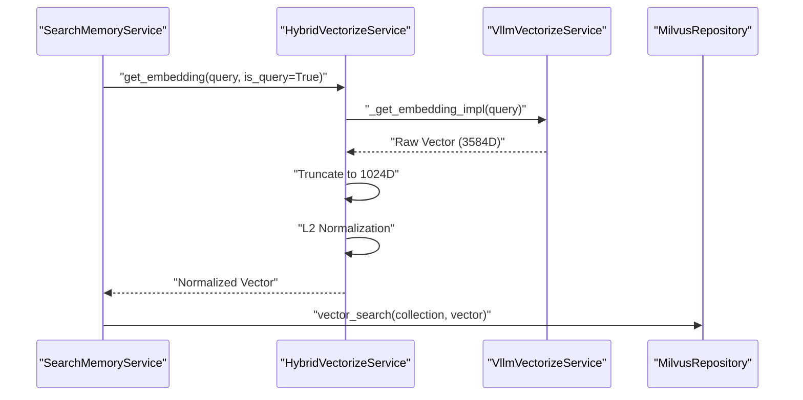

# Vectorization Service
Relevant source files
- [methods/evermemos/tests/test_embedding_reranker_providers.py](https://github.com/EverMind-AI/EverOS/blob/d40b8703/methods/evermemos/tests/test_embedding_reranker_providers.py)
- [methods/evermemos/tests/test_pickle_size_analysis.py](https://github.com/EverMind-AI/EverOS/blob/d40b8703/methods/evermemos/tests/test_pickle_size_analysis.py)
- [methods/evermemos/tests/test_rawdata_json_serialization.py](https://github.com/EverMind-AI/EverOS/blob/d40b8703/methods/evermemos/tests/test_rawdata_json_serialization.py)
- [methods/evermemos/tests/test_smart_text_parser.py](https://github.com/EverMind-AI/EverOS/blob/d40b8703/methods/evermemos/tests/test_smart_text_parser.py)

The Vectorization Service is a core infrastructure component within the EverOS agentic layer responsible for transforming textual memory content into high-dimensional numerical representations (embeddings). It employs a resilient **Hybrid Strategy** that prioritizes cost-efficiency via self-hosted models while ensuring high availability through commercial fallbacks.

## HybridVectorizeService Architecture

The `HybridVectorizeService` implements the `VectorizeServiceInterface` contract [methods/evermemos/src/agentic_layer/vectorize_service.py39-40](https://github.com/EverMind-AI/EverOS/blob/d40b8703/methods/evermemos/src/agentic_layer/vectorize_service.py#L39-L40) and acts as a high-level orchestrator. It manages a primary provider (typically a self-deployed vLLM instance) and an optional fallback provider (typically DeepInfra).

### Core Logic and Resilience

The service tracks the health of the primary provider using a failure counter. If the `_primary_failure_count` exceeds the configured `max_primary_failures`, the service automatically routes requests to the fallback provider to ensure zero downtime [methods/evermemos/src/agentic_layer/vectorize_service.py69-70](https://github.com/EverMind-AI/EverOS/blob/d40b8703/methods/evermemos/src/agentic_layer/vectorize_service.py#L69-L70)

### Key Components

| Component | Role |
| --- | --- |
| `HybridVectorizeService` | Orchestrates failover logic and manages provider lifecycles [methods/evermemos/src/agentic_layer/vectorize_service.py42-55](https://github.com/EverMind-AI/EverOS/blob/d40b8703/methods/evermemos/src/agentic_layer/vectorize_service.py#L42-L55) |
| `VllmVectorizeService` | Implementation for self-hosted vLLM or OpenAI-compatible embedding endpoints [methods/evermemos/src/agentic_layer/vectorize_vllm.py33-41](https://github.com/EverMind-AI/EverOS/blob/d40b8703/methods/evermemos/src/agentic_layer/vectorize_vllm.py#L33-L41) |
| `DeepInfraVectorizeService` | Implementation for DeepInfra's commercial API [methods/evermemos/src/agentic_layer/vectorize_deepinfra.py32-36](https://github.com/EverMind-AI/EverOS/blob/d40b8703/methods/evermemos/src/agentic_layer/vectorize_deepinfra.py#L32-L36) |
| `BaseVectorizeService` | Abstract base class providing common logic for batching, truncation, and concurrent request handling [methods/evermemos/src/agentic_layer/vectorize_base.py23-31](https://github.com/EverMind-AI/EverOS/blob/d40b8703/methods/evermemos/src/agentic_layer/vectorize_base.py#L23-L31) |

### Provider Flow and Error Classification

The service classifies errors to determine if a fallback is necessary. Transient network issues or 5xx server errors trigger the fallback mechanism, while validation errors (e.g., text too long) are typically bubbled up [methods/evermemos/src/agentic_layer/vectorize_service.py127-132](https://github.com/EverMind-AI/EverOS/blob/d40b8703/methods/evermemos/src/agentic_layer/vectorize_service.py#L127-L132)

**Vectorization Provider Flow**

[Flowchart Diagram]

Sources: [methods/evermemos/src/agentic_layer/vectorize_service.py39-114](https://github.com/EverMind-AI/EverOS/blob/d40b8703/methods/evermemos/src/agentic_layer/vectorize_service.py#L39-L114)[methods/evermemos/src/agentic_layer/vectorize_vllm.py33-58](https://github.com/EverMind-AI/EverOS/blob/d40b8703/methods/evermemos/src/agentic_layer/vectorize_vllm.py#L33-L58)[methods/evermemos/src/agentic_layer/vectorize_base.py151-161](https://github.com/EverMind-AI/EverOS/blob/d40b8703/methods/evermemos/src/agentic_layer/vectorize_base.py#L151-L161)

---

## Implementation Details

### Vector Truncation and L2 Normalization

EverOS uses models like `Qwen3-Embedding-4B`, which natively output high-dimensional vectors (up to 3584D). To optimize storage in Milvus and search latency, the service performs **client-side truncation** to a configured dimension (e.g., 1024D) followed by **L2 Re-normalization**[methods/evermemos/tests/test_embedding_reranker_providers.py12-13](https://github.com/EverMind-AI/EverOS/blob/d40b8703/methods/evermemos/tests/test_embedding_reranker_providers.py#L12-L13)

- **Truncation**: Taking the first $N$ dimensions of the embedding [methods/evermemos/src/agentic_layer/vectorize_base.py151-161](https://github.com/EverMind-AI/EverOS/blob/d40b8703/methods/evermemos/src/agentic_layer/vectorize_base.py#L151-L161)
- **Normalization**: Ensuring the resulting vector has a unit length of 1.0, which is required for accurate Cosine Similarity when stored as Inner Product (IP) in Milvus [methods/evermemos/tests/test_embedding_reranker_providers.py81-82](https://github.com/EverMind-AI/EverOS/blob/d40b8703/methods/evermemos/tests/test_embedding_reranker_providers.py#L81-L82)

### Instruction-Based Embeddings

Following modern embedding standards, the service distinguishes between "Document" and "Query" embeddings. When `is_query=True` is passed to `get_embedding`, specific instructions (e.g., "Given a search query, retrieve relevant passages...") are prepended to the text to align the vector space for retrieval [methods/evermemos/tests/test_embedding_reranker_providers.py36-54](https://github.com/EverMind-AI/EverOS/blob/d40b8703/methods/evermemos/tests/test_embedding_reranker_providers.py#L36-L54)

### Smart Text Parsing and Truncation

Before vectorization, long texts are processed by the `SmartTextParser` to ensure they fit within model context windows. This parser categorizes tokens into types such as `CJK_CHAR`, `ENGLISH_WORD`, and `PUNCTUATION`[methods/evermemos/tests/test_smart_text_parser.py24-35](https://github.com/EverMind-AI/EverOS/blob/d40b8703/methods/evermemos/tests/test_smart_text_parser.py#L24-L35) The `smart_truncate_text` utility uses a scoring system (e.g., CJK=1.0, English=1.5) to approximate token usage across different languages [methods/evermemos/tests/test_smart_text_parser.py62-71](https://github.com/EverMind-AI/EverOS/blob/d40b8703/methods/evermemos/tests/test_smart_text_parser.py#L62-L71)

### Batching and Concurrency

To handle high-throughput memory consolidation (e.g., during `Episode` or `EventLog` extraction), the service implements:

- **Batching**: Grouping multiple texts into a single API call based on configured batch sizes [methods/evermemos/src/agentic_layer/vectorize_base.py53-54](https://github.com/EverMind-AI/EverOS/blob/d40b8703/methods/evermemos/src/agentic_layer/vectorize_base.py#L53-L54)
- **Concurrency Control**: Using `asyncio.Semaphore` to limit the number of simultaneous outgoing requests [methods/evermemos/src/agentic_layer/vectorize_base.py36](https://github.com/EverMind-AI/EverOS/blob/d40b8703/methods/evermemos/src/agentic_layer/vectorize_base.py#L36-L36)

---

## Service Configuration

Configuration is managed via environment variables typically set in the system environment or `.env` files.

| Variable | Description | Example |
| --- | --- | --- |
| `VECTORIZE_PROVIDER` | Primary embedding provider | `vllm` |
| `VECTORIZE_MODEL` | Model identifier | `Qwen3-Embedding-4B` |
| `VECTORIZE_DIMENSIONS` | Output vector size after truncation | `1024` |
| `VECTORIZE_BASE_URL` | API endpoint for the provider | `http://localhost:11000/v1` |

Sources: [methods/evermemos/tests/test_embedding_reranker_providers.py9-13](https://github.com/EverMind-AI/EverOS/blob/d40b8703/methods/evermemos/tests/test_embedding_reranker_providers.py#L9-L13)[methods/evermemos/src/agentic_layer/vectorize_service.py72-114](https://github.com/EverMind-AI/EverOS/blob/d40b8703/methods/evermemos/src/agentic_layer/vectorize_service.py#L72-L114)

---

## Observability and Metrics

The service integrates with Prometheus to track performance and reliability across different providers.

**Code Entity to Metric Mapping**

[Flowchart Diagram]

Sources: [methods/evermemos/src/agentic_layer/metrics/vectorize_metrics.py15-78](https://github.com/EverMind-AI/EverOS/blob/d40b8703/methods/evermemos/src/agentic_layer/metrics/vectorize_metrics.py#L15-L78)[methods/evermemos/src/agentic_layer/vectorize_service.py29-33](https://github.com/EverMind-AI/EverOS/blob/d40b8703/methods/evermemos/src/agentic_layer/vectorize_service.py#L29-L33)

### Key Metrics Tracked

- **`vectorize_requests_total`**: Counted by `provider`, `operation` (`get_embedding`, `get_embeddings`), and `status` (`success`, `error`, `fallback`) [methods/evermemos/src/agentic_layer/metrics/vectorize_metrics.py15-29](https://github.com/EverMind-AI/EverOS/blob/d40b8703/methods/evermemos/src/agentic_layer/metrics/vectorize_metrics.py#L15-L29)
- **`vectorize_fallback_total`**: Specifically tracks when the system switches from primary to fallback, including the `reason` (e.g., `timeout`, `error`) [methods/evermemos/src/agentic_layer/metrics/vectorize_metrics.py32-47](https://github.com/EverMind-AI/EverOS/blob/d40b8703/methods/evermemos/src/agentic_layer/metrics/vectorize_metrics.py#L32-L47)
- **`vectorize_tokens_total`**: Counter for token usage to facilitate cost monitoring for commercial providers [methods/evermemos/src/agentic_layer/metrics/vectorize_metrics.py66-78](https://github.com/EverMind-AI/EverOS/blob/d40b8703/methods/evermemos/src/agentic_layer/metrics/vectorize_metrics.py#L66-L78)

---

## Data Flow: From Search to Vectorization

When a retrieval request is initiated via `SearchMemoryService`, it invokes the vectorization layer to transform the natural language query into a vector compatible with Milvus indices.

**Retrieval Vectorization Flow**



Sources: [methods/evermemos/src/agentic_layer/search_mem_service.py182-190](https://github.com/EverMind-AI/EverOS/blob/d40b8703/methods/evermemos/src/agentic_layer/search_mem_service.py#L182-L190)[methods/evermemos/src/agentic_layer/vectorize_service.py100-114](https://github.com/EverMind-AI/EverOS/blob/d40b8703/methods/evermemos/src/agentic_layer/vectorize_service.py#L100-L114)[methods/evermemos/src/agentic_layer/vectorize_base.py151-161](https://github.com/EverMind-AI/EverOS/blob/d40b8703/methods/evermemos/src/agentic_layer/vectorize_base.py#L151-L161)

---

## Integration Example

The following logic demonstrates how the `HybridVectorizeService` is used within the memory pipeline to generate embeddings for retrieval.

```
# Example from methods/evermemos/tests/test_embedding_reranker_providers.py
service = get_vectorize_service()
 
# 1. Query Embedding (with instruction and is_query=True)
query_task = "Given a search query, retrieve relevant passages that answer the query"
query_emb = await service.get_embedding("水果", instruction=query_task, is_query=True)
 
# 2. Document Embedding (is_query=False)
doc_emb = await service.get_embedding("苹果很好吃", is_query=False)
```

Sources: [methods/evermemos/tests/test_embedding_reranker_providers.py50-64](https://github.com/EverMind-AI/EverOS/blob/d40b8703/methods/evermemos/tests/test_embedding_reranker_providers.py#L50-L64)[methods/evermemos/src/agentic_layer/vectorize_service.py10-11](https://github.com/EverMind-AI/EverOS/blob/d40b8703/methods/evermemos/src/agentic_layer/vectorize_service.py#L10-L11)