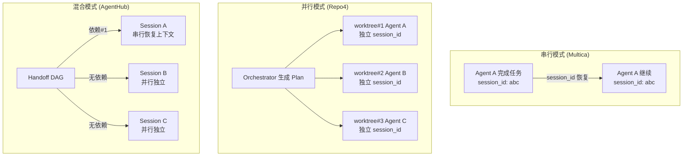

# Multi-Session 设计文档

> **分析来源**: Repo4 (ref/repo4), Multica (ref/multica), Repo1 (ref/repo1)
> **推荐方案**: Multica Session Resumption (主) + Repo4 Accessory Sessions (参考)

---

## 1. 分析范围

| 仓库 | 实现 | 关键文件 |
|------|------|---------|
| **multica** | Go — Session Resumption + Session Poisoning + 并发送话 | server/pkg/agent/{agent,models}.go, server/internal/daemon/{execenv,daemon}.go |
| **repo4** | Swift — AccessorySessions + WorktreeOrchestrationTool (并行会话编排) | AccessorySessions.md, Intelligence/WorktreeOrchestrationTool.swift |
| **repo1** | TypeScript — 运行时会话管理 | hub-server/src/lib/{runtime,types}.ts |

---

## 2. 方案对比

### 2.1 Multica Session Resumption (推荐主方案)

**设计定位**: 基于 session_id 的跨任务上下文恢复 + Session Poisoning 防循环恢复。

#### Session 数据模型

```go
// agent.go
type ExecOptions struct {
    ResumeSessionID    string        // 上次的 session ID
    MaxTurns           int           // 最大轮次
    // ...其他执行选项
}

// Session 执行结果
type Session struct {
    Messages <-chan Message     // 流式事件
    Result   <-chan Result      // 最终结果
}

type Result struct {
    Status          string      // completed | failed | cancelled | timed_out
    Output          string      // 汇总输出
    SessionID       string      // 本次 session ID（用于下次恢复）
    WorkDir         string      // 工作目录
    TokenUsage      Usage
    Error           string
}
```

#### Session 生命周期

```
1. Agent 认领任务 → 检查是否有 PriorSessionID
    │
    ├── 有 PriorSessionID → 注入 ResumeSessionID
    │       │
    │       ├── CLI 复用 session → session 恢复 → Agent 从上次继续
    │       └── CLI 创建新 session → session 恢复失败 → 新会话
    │
    └── 无 PriorSessionID → 新会话
```

#### Session Poisoning 检测

```go
// poisoned.go — 三侧检测坏会话

type PoisonReason string
const (
    PoisonOutput   PoisonReason = "output_side"   // Agent 产出了已知终止标记
    PoisonError    PoisonReason = "error_side"     // LLM API 400 (恢复必然再现)
    PoisonTimeout  PoisonReason = "timeout_side"   // 语义不活跃超时 (重新执行相同)
)

func isPoisoned(result Result) bool {
    // Output-side: Agent 完成时带有 fallback marker
    //   - 迭代限制: "已达到最大迭代次数"
    //   - 元消息: Claude Code 的 meta 类型消息
    //
    // Error-side: LLM API 返回 400
    //   - 问题: 坏消息已写入对话历史，恢复必然触发相同 400
    //   - 解决: 创建全新会话
    //
    // Timeout-side: 语义不活跃超时
    //   - Codex: 长时间无有效语义变化
    //   - 重新执行也会卡在相同位置
}
```

#### Session 存储与查询

```sql
-- chat.sql — 会话 SQL
-- GetLastTaskSession: 获取指定 Agent+Issue 的最后一个成功的 session
--   过滤逻辑: 跳过 poisoned 的 session
-- InsertTaskSession: 记录 session_id + work_dir 映射

-- 关键字段:
--   session_id: 外部 CLI 会话 ID
--   work_dir: Agent 执行的工作目录
--   status: 完成状态
--   is_poisoned: 是否标记为坏会话
```

#### execenv 执行环境

```go
// execenv.go
// 职责: 为每个任务准备独立执行环境
//   1. work_dir 创建 (基于 task_id)
//   2. work_dir 恢复 (基于 prior_work_dir)
//   3. Session ID 持久化 (.session_id 文件)
//   4. GC 元数据写入 (.multica.meta)
//   5. 制品产物清理
```

### 2.2 Repo4 Accessory Sessions (并行会话参考)

**设计定位**: 基于 Worktree 的并行会话编排——同时启动多个独立 Agent 会话，每个在不同工作树中执行。

```swift
// AccessorySessions.md 核心设计

// OrchestrationSession 模型
struct OrchestrationSession: Codable, Sendable {
    let id: String { branchName }
    let description: String       // 会话描述
    let branchName: String        // 分支名 = session 标识
    let sessionType: SessionType  // parallel/prototype/exploration
    let prompt: String            // 每个 Agent 独立的启动提示词
}

// 并行执行流程:
// 1. Orchestrator 生成 OrchestrationPlan
// 2. 为每个 session 创建独立 worktree + 分支
// 3. 每个 worktree 独立 spawn Agent
// 4. 所有 Agent 并行执行
// 5. 结果聚合
```

### 2.3 Repo1 会话运行时

```typescript
// runtime.ts — 会话运行时
// 管理每个运行时（Runtime）的 session 生命周期
// 提供 session 上下文创建、状态管理、资源清理
```

---

## 3. 推荐方案: Multica Session Resumption (主) + Repo4 Accessory Sessions (参考)

### 3.1 AgentHub Multi-Session 体系

```
Multi-Session 系统
│
├── Session 生命周期 (采纳 Multica)
│   ├── Create: 任务认领 → 创建 session_id
│   ├── Resume: PriorSessionID → 注入 ResumeSessionID → CLI 恢复
│   ├── Poisoning Check: 三侧检测 (output/error/timeout)
│   ├── Store: session_id + work_dir → DB
│   └── Cleanup: 任务完成 → GC 清理 session 痕迹
│
├── 并行 Session (采纳 Repo4)
│   ├── Orchestrator → OrchestrationPlan
│   ├── Plan → 多个 Session (每个独立 worktree)
│   ├── 每个 Session 独立 spawn CLI
│   └── 所有 Session 完成后聚合
│
├── Session 隔离 (采纳 Multica)
│   ├── 每个 Session 独立 work_dir
│   ├── 每个 Session 独立 session_id (CLI 内部)
│   └── 每个 Session 独立环境变量
│
├── Session Poisoning 检测 (采纳 Multica)
│   ├── Output-side: 已知终止标记
│   ├── Error-side: LLM API 400
│   ├── Timeout-side: 语义不活跃
│   └── 过滤 → GetLastTaskSession 跳过 poisoned session
│
└── 并发控制 (采纳 Multica)
    ├── slot-before-claim: 先获取槽位再认领
    ├── maxConcurrentTasks: 默认 20
    └── local_directory 路径互斥锁
```

### 3.2 并发与串行 Session 模式



### 3.3 关键设计决策

| 特性 | Multica | Repo4 | AgentHub |
|------|---------|-------|----------|
| **Session 标识** | session_id (外部 CLI 分配) | branchName | ✅ 两者并用 |
| **上下文恢复** | ResumeSessionID + resolveSessionID | — | ✅ Multica |
| **坏会话检测** | 三侧 poisoned | — | ✅ Multica |
| **并行 Session** | slot-before-claim | worktree orchestration | ✅ 两者混合 |
| **Session 隔离** | 独立 work_dir | 独立 worktree | ✅ worktree + work_dir |
| **并发限制** | maxConcurrentTasks=20 | — | ✅ Multica |
| **路径互斥** | local_directory 锁 | — | ✅ Multica |

### 3.4 AgentHub Session 数据模型

```go
type SessionInfo struct {
    SessionID   string    // CLI 分配的 session ID (用于恢复)
    PriorID     string    // 上个 session ID (用于链式恢复)
    WorkDir     string    // 执行工作目录
    BranchName  string    // 关联的 Git 分支 (worktree 模式)
    IsPoisoned  bool      // 是否被标记为坏会话
    TokenUsage  Usage     // 累计 token 消耗
    StartedAt   time.Time
    CompletedAt *time.Time
}
```

### 3.5 并发控制策略

```
slot-before-claim 保证了:
1. 先获取并发槽位 → 再认领任务
2. 认领成功才占用槽位 → 认领失败立即释放
3. 防止"任务已 dispatch 但客户端满负载"状态

并发槽位限制了:
- 同一 Daemon 同时执行的 CLI 实例数 (默认 20)
- 每个 CLI 实例绑定一个 session
- 超出限制 → poll 循环等待

路径互斥锁补充:
- 同一 local_directory 的任务串行执行
- 防止多个 Agent 同时修改同一文件
```