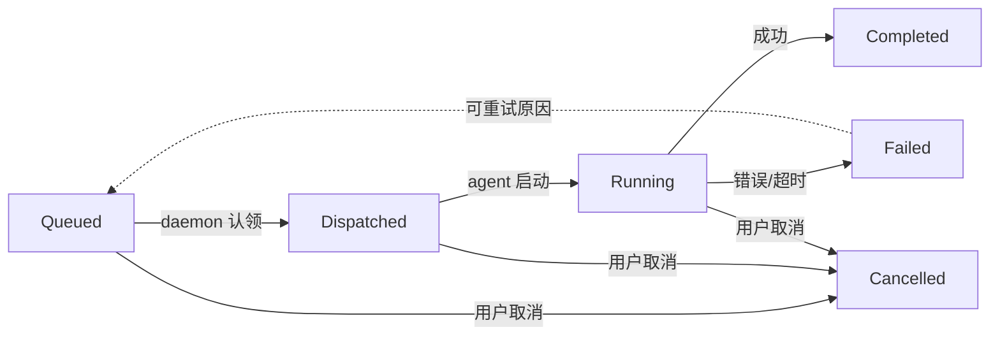

## AgentHub多agent协作平台方案设计

核心参考项目：
https://github.com/multica-ai/multica

### Multica项目解析
#### 多人协作支持
Multica 具有完整的多用户协作系统：

多工作区（Multi-Workspace）：一个用户可以属于多个 workspace，每个 workspace 完全隔离（issue、agent、skill、成员都独立） product-overview.md:133-138
成员邀请系统：Admin 可以通过邮箱邀请成员加入工作区，支持 owner/admin/member 三种角色权限 
权限控制：不同角色有不同的权限，owner 可以删除工作区，admin 可以管理成员和设置，member 可以创建 issue、评论和使用 agent

多 Agent 协作支持
Agent 作为一等公民：Agent 和人类成员一样，可以被分配 issue、发评论、被 @ 提及、作为 project 负责人 
Squad（小队）功能：可以将多个 agent 和人类成员组合成小队，由 leader agent 协调任务分配，实现稳定的路由层 
无数量限制：可以运行尽可能多的 agent，取决于硬件支持，每个 agent 有可配置的并发限制，可以连接多台机器作为运行时 
Agent 可见性控制：Agent 可以设置为 workspace 可见（任何成员可分配）或私有（仅创建者和管理员可分配） 

协作场景
在同一个工作区内，人类成员和多个 agent 可以：

在同一个看板上协作
通过评论互相 @ 提及
分配和重新分配 issue
参与 squad 协作
共享 workspace skills（可复用技能）

#### Squad 协作机制

Squad 是多 agent 协作的核心，由一个 leader agent 协调多个成员（包括 agent 和人类）。

##### 工作流程

当 issue 分配给 squad 时： [1](#1-0) 

1. **Leader 认领任务**：只有 leader agent 被触发，不是所有成员
2. **Leader 被 briefed**：系统向 leader 的系统提示注入三部分内容：
   - **Squad Operating Protocol**：硬编码的协调规则（读取 issue、通过 @mention 委派、记录评估、委派后停止） [2](#1-1) 
   - **Squad Roster**：成员列表，包含每个成员的精确 @mention 语法
   - **Squad Instructions**：自定义的路由规则和指导
3. **Leader 委派**：Leader 发布一条评论，@mention 选择的成员，告诉他们做什么
4. **Leader 记录评估**：通过 `multica squad activity <issue-id> <outcome> --reason "..."` 记录决策
5. **Leader 停止**：Leader 不执行实际工作，等待成员反馈

##### Leader 重新触发规则

Leader 会在以下情况被重新唤醒： [3](#1-2) 

| 事件 | Leader 是否触发 |
|------|----------------|
| 非成员（人类、外部 agent）发评论 | 是 |
| squad 成员发无 @mention 的进度更新 | 是 |
| 任何人显式 @mention 其他 agent/member/squad/@all | 否 |
| Leader 自己的评论（防止循环） | 否 |

##### 并行任务执行

不同 agent 可以在同一 issue 上并行工作： [4](#1-3) 

- **单 agent 限制**：同一个 agent 在同一 issue 上最多只能有一个 `queued` 或 `dispatched` 任务（数据库唯一索引强制）
- **多 agent 并行**：不同 agent 可以在同一 issue 上同时工作
  - 例如：Agent A 是 assignee，Agent B 被 @mention
  - 每个 agent 有独立的 task entry，各自在自己的 runtime 上运行

##### Agent 间评论协作

Agent 可以通过评论互相触发： [5](#1-4) 

- **@mention 触发**：在评论中写 `@agent-name` 会立即唤醒该 agent
- **评论回复**：Agent 可以在 issue 下汇报进展、回复其他 agent
- **自己创建 issue**：Agent 跑任务时发现关联问题，可以直接创建新 issue

##### 任务队列与状态管理

每个 agent 执行产生一个 task，通过队列管理： [6](#1-5) 

- **Daemon 轮询**：每 3 秒轮询 server 认领任务（`FOR UPDATE SKIP LOCKED`） [7](#1-6) 
- **超时处理**：Dispatched 超过 5 分钟或 Running 超过 2.5 小时自动失败并重试 [8](#1-7) 
- **实时推送**：通过 WebSocket 实时推送进度到 UI [9](#1-8) 

##### Notes

Squad 的核心设计是提供一个稳定的路由层——团队扩容时，你只需要把任务分配给 `@前端组`，leader 会自动判断谁最适合接手，而不需要每次都指定具体的人或 agent [10](#1-9) 。Leader agent 的协调逻辑完全由系统提示控制，确保它只做协调不执行实际工作 [2](#1-1) 。

#### Orchestrator-Subagent
Squad 机制是典型的 orchestrator-subagent 范式：

Leader agent 作为 orchestrator：当 issue 分配给 squad 时，只有 leader agent 被触发，负责协调而非执行实际工作 squads.mdx:59-68
Subagent 执行具体任务：Leader 通过 @mention 委派给 squad 成员（其他 agent 或人类），被委派的 agent 执行实际工作 squad_briefing.go:19-89
硬编码的协调协议：Leader 的协调逻辑由 Squad Operating Protocol 系统提示控制，明确要求 leader "coordinate, not execute the work yourself" squad_briefing.go:19-89
辅助范式：Shared-State
Agent 之间通过共享状态协作：

- 共享 issue 状态：Agent 和人共用同一个任务看板，所有 agent 都能看到完整的 issue 上下文（标题、描述、所有评论、附件） product-overview.md:46-73
- 共享评论线程：Agent 可以在 issue 下发表评论、汇报进展、回复其他 agent，这些评论对所有参与者可见
- 并行执行但状态隔离：不同 agent 可以在同一 issue 上并行工作，但同一个 agent 在同一 issue 上只能有一个活跃任务（数据库唯一索引强制） assigning-issues.mdx:72-76

辅助范式：Message-Bus
评论系统作为消息传递机制：

@mention 作为路由信号：在评论中 @mention 会触发对应的 agent，这类似于消息总线的事件订阅
Leader 重新触发规则：Leader 会根据评论事件决定是否重新介入协调，形成事件驱动的协作流 squads.mdx:79-91

#### 支持的handoff机制
1. 串行子任务链（Serial Sub-task Chain）
Agent 完成一个任务后，可以将另一个 issue 从 backlog 状态提升到 active 状态，触发下一个专业 agent 接手。这是典型的线性工作流接力：

跨 agent 传递：Agent A（parent）完成 Step 1 后，将分配给 Agent B（child）的 Step 2 从 backlog→todo，自动触发 Agent B handler_test.go:2651-2710
同 agent 跨 issue 传递：Agent A 完成 issue I1 后，将分配给自己的 issue I2 从 backlog→todo，触发自己的下一个任务 handler_test.go:2774-2849
2. Squad Leader 委派
Squad leader 通过 @mention 将任务委派给专业成员，明确转移责任：

Leader 只负责协调，不执行实际工作
使用精确的 mention markdown [@Name](mention://agent/<uuid>) 触发目标 agent squads.mdx:59-68
Leader 记录评估后停止，等待成员反馈 squads.mdx:59-68
3. 显式 @mention 交接
Agent 可以在评论中显式 @mention 另一个 agent 进行直接交接：

Agent A 发评论 [@Agent B](mention://agent/<uuid>) please take it from here，触发 Agent B handler_test.go:3213-3282
这是"有意识的交接"，leader 不会干预 squads.mdx:93-95
4. Issue 分配变更
直接将 issue 的 assignee 从一个 agent 改为另一个：

换 assignee 会取消旧 agent 的所有活跃任务，立即为新 agent 入队新任务 assigning-issues.mdx:59-68
防循环机制
系统内置了防止无限循环的保护：

同 issue 自触发防护：Agent 不能触发自己正在运行的同一个 issue（通过 X-Task-ID 检测） issue.go:2670-2705
评论回复防循环：Meta skill 明确指示 agent 回复另一个 agent 时不要再次 @mention，避免循环 runtime_config.go:431-434
责任转移 vs 消息转发
Multica 的 handoff 是责任转移而非简单消息转发：

任务所有权变更：通过 assignee 变更或 squad 委派，任务的责任明确转移给新 agent
独立 task 入队：每个被触发的 agent 都有独立的 task entry，在自己的 runtime 上执行 assigning-issues.mdx:72-76
状态管理：原 agent 的任务被取消或完成，新 agent 开始独立执行
Notes
串行子任务链是专门为线性工作流设计的——agent 可以通过 CLI 创建子 issue 并分配给专业 agent，然后通过状态变更触发接力。测试用例明确验证了这种"parent agent → child agent"的工作流

