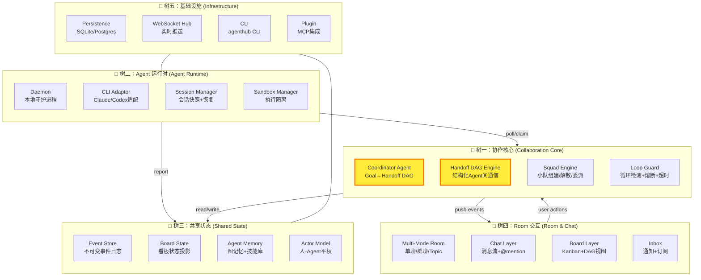
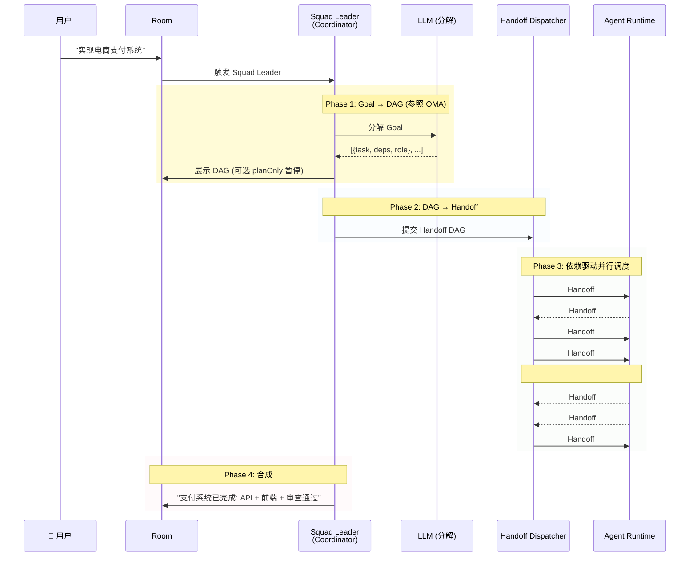

# AgentHub 多 Agent 协作平台设计文档

> **状态**: Draft
> **日期**: 2026-06-01
> **作者**: AgentHub Team
>
> **参考项目**: Multica (multica-ai/multica), OpenMultiAgent (open-multi-agent/open-multi-agent), Hermes, AI Scientist v2, DeerFlow, OpenAI Agents Python, MS Agent Framework

---

## 目录

1. [设计哲学](#1-设计哲学)
2. [协作范式创新：Handoff DAG](#2-协作范式创新handoff-dag)
3. [系统架构：五棵树](#3-系统架构五棵树)
4. [核心问题解答](#4-核心问题解答)
5. [代码组织架构 (参照 Multica)](#5-代码组织架构-参照-multica)
6. [Package 边界与依赖规则](#6-package-边界与依赖规则)
7. [关键数据模型](#7-关键数据模型)
8. [核心工作流](#8-核心工作流)
9. [API 设计概览](#9-api-设计概览)
10. [与参考项目的差异](#10-与参考项目的差异)

---

## 1. 设计哲学

### 1.1 核心原则

1. **Agent 是一等公民** — Agent 和人共享同一个任务看板、评论系统、@mention 机制。Agent 可以被分配 Issue、发评论、创建 Issue、订阅通知。
2. **不造 Agent 轮子** — 利用用户本地已有的 Claude CLI / Codex CLI 二进制作为单 Agent 执行器，AgentHub 只负责 Agent 上层的协作编排。
3. **Goal-First 任务分解** — 参照 OpenMultiAgent 的 Coordinator Agent 模式，用户描述目标，Squad Leader 自动分解为 Handoff DAG，不预先手动画图。
4. **结构化 Agent 间通信** — Agent 之间不走自然语言评论，而走结构化 Handoff Protocol。

### 1.2 一句话定位

> AgentHub 是一个**人 + AI 多 Agent 协作的任务管理平台**，利用本地 CLI 作为 Agent 运行时，通过 Structured Handoff Protocol 和 Goal-First Coordinator 实现 Agent 间结构化协作。

---

## 2. 协作范式创新：Handoff DAG

### 2.1 问题背景

Multica 的 Agent 间通信依赖 @mention + 自然语言评论。这种方式在简单线性委派时可行，但在复杂多 Agent 协作中存在三个问题：

1. **信息歧义** — Agent-B 需要重新理解 Agent-A 大段自然语言的意图，容易理解偏差
2. **不可并行** — 纯 @mention 链是线性的，无法表达"A 完成后，B 和 C 可以同时开始"
3. **不可验证** — 自然语言评论无法自动检验"这个任务是否真的完成了"

### 2.2 解决方案：结构化 Handoff Protocol

Agent 之间通过强类型的 Handoff Packet 通信，而非自然语言评论。

**Handoff 类型定义：**

```typescript
// packages/core/types/handoff.ts

type HandoffType = 'DELEGATE' | 'REVIEW' | 'HANDOVER' | 'QUERY' | 'NOTIFY'

type HandoffStatus = 
  | 'pending' 
  | 'accepted' 
  | 'running' 
  | 'completed' 
  | 'failed' 
  | 'rejected'

interface HandoffPacket {
  id: string
  type: HandoffType
  from: ActorRef           // { type: 'agent'|'member'|'squad', id: string }
  to: ActorRef
  status: HandoffStatus

  // 结构化任务描述
  task: {
    title: string
    description: string
    context_refs: string[]    // 引用的上下文资源 ID（Issue、图记忆节点、文档）
    constraints: string[]     // 约束条件
  }

  // 期望输出
  expected_output: {
    format: string            // 'code' | 'document' | 'review_report' | 'decision'
    acceptance_criteria: string[]
  }

  // 调度元数据
  priority: 'urgent' | 'high' | 'medium' | 'low'
  deadline?: string           // ISO 8601

  // DAG 结构
  parent_handoff?: string     // 父 Handoff ID（形成 Handoff 树）
  dependencies: string[]      // 依赖的 Handoff ID 列表

  // 时间戳
  created_at: string
  updated_at: string
}
```

### 2.3 Handoff DAG

```
Handoff 的 parent_handoff 和 dependencies 字段使其形成有向无环图（DAG），
而非 Multica 的线性 @mention 链。

示例：

  Issue: "实现电商支付系统"
      │
      └─► Handoff#1 (DELEGATE → Agent-Architect)
          │  task: "设计支付 API 契约"
          │  dependencies: []
          │
          ├─► Handoff#2 (DELEGATE → Agent-Backend)
          │   task: "实现支付网关"
          │   dependencies: [#1]
          │
          ├─► Handoff#3 (DELEGATE → Agent-Frontend)
          │   task: "实现前端支付页"
          │   dependencies: [#1]
          │
          └─► Handoff#4 (REVIEW → Agent-Review)
              task: "支付安全审查"
              dependencies: [#2, #3]   ← 等待 B 和 C 都完成
```

**DAG 带来的能力：**

| 能力 | Multica | AgentHub |
|------|---------|----------|
| 线性委派 | ✅ @mention | ✅ DELEGATE |
| 并行协作 | ❌ | ✅ DAG dependencies + 并行调度 |
| 审查回路 | ❌ | ✅ REVIEW Handoff |
| 依赖自动等待 | ❌ | ✅ Dispatcher 按 dependencies 自动解锁 |
| 可验证性 | ❌ | ✅ acceptance_criteria + status 追踪 |
| 回溯可视化 | ❌ | ✅ Event Store 记录完整 DAG 执行历史 |

---

## 3. 系统架构：五棵树

AgentHub 的架构以**五棵功能树**组织，每棵树是一个内聚的子系统，树之间通过明确定义的接口通信。



### 3.1 树一：协作核心 (Collaboration Core)

**职责**：Agent 间协作的"大脑"——任务分解、Handoff 路由、Squad 管理、安全防护。

| 模块 | 核心职责 | 参照 |
|------|---------|------|
| **Coordinator Agent** | 接收 Goal → 调用 LLM 生成 Handoff DAG → 识别依赖/并行 → 人类审查(planOnly) | OpenMultiAgent Coordinator |
| **Handoff DAG Engine** | Handoff 状态机路由、依赖解析、并行调度、结果合成 | 自研创新 ⭐ |
| **Squad Engine** | Squad 组建/解散、Leader 委派、Role Pool → Task Dispatch | Multica Squad |
| **Loop Guard** | 自触发循环检测、连续失败熔断、dispatched/running 超时回收 | Multica + Hermes |

**Coordinator 调度策略 (4 种)**：
- `dependency-first` — 优先执行阻塞最少后续任务的任务 (默认)
- `round-robin` — 轮询分配
- `least-busy` — 分配给最空闲的 Agent
- `capability-match` — 按 Agent 能力标签最佳匹配

### 3.2 树二：Agent 运行时 (Agent Runtime)

**职责**：Agent 的实际执行环境——CLI 子进程管理、会话恢复、沙箱隔离。

| 模块 | 核心职责 | 参照 |
|------|---------|------|
| **Daemon** | CLI 探测/注册、3s 轮询认领任务、双心跳(WS+HTTP)、崩溃恢复 | Multica Daemon |
| **CLI Adaptor** | 统一 AgentInterface(spawn/stream/kill)、Claude CLI 适配器、Codex CLI 适配器 | Multica CLI Adaptor |
| **Session Manager** | session_id+work_dir 持久化、上下文快照中断恢复、Session Poisoning 检测 | Multica Session Resumption |
| **Sandbox Manager** | 每任务独立 work_dir、虚拟路径映射、环境变量过滤、仓库白名单、GC | Multica + DeerFlow |

### 3.3 树三：共享状态 (Shared State)

**职责**：平台的核心状态存储——不可变事件日志 + 高效投影快照。

| 模块 | 核心职责 |
|------|---------|
| **Event Store** | Event Sourcing 架构——所有操作记录为不可变事件，当前状态 = replay(events) |
| **Board State** | Issue CRUD、status 流转 (backlog→todo→in_progress→in_review→done)、多态 assignee |
| **Agent Memory** | 图记忆系统（跨 Agent 关系网络）、Skill 技能库、Agent Profile(capability_tags) |
| **Actor Model** | member/agent/squad 三级 Actor 类型、平权身份映射 |

**状态分层**：

```
┌─────────────────────────────────────────┐
│              Event Store                │  ← 不可变写入层
│  (所有操作的完整审计日志)                 │
├─────────────────────────────────────────┤
│  Board View  │ Handoff View │ Agent View │  ← 投影快照层（读优化）
│  (Issue状态)  │ (Handoff DAG) │ (Agent状态) │
└─────────────────────────────────────────┘
```

### 3.4 树四：Room 交互 (Room & Chat)

**职责**：人与 Agent 的交互界面——单聊/群聊、看板、通知。

| 模块 | 核心职责 |
|------|---------|
| **Multi-Mode Room** | direct_chat (1人+Orchestrator) / session_room (多人+多Agent, 单次任务) / topic_room (多人+多Agent, 持续主题) |
| **Chat Layer** | 消息流 + @mention + Handoff 结构化卡片 + Agent 思考过程流式展示 |
| **Board Layer** | Kanban 视图 + DAG 视图 + Agent 活动日志 |
| **Inbox** | 被@、被分配、订阅 Issue 更新 → 通知 + WebSocket 实时推送 |

**群聊设计 (Session Room)**：

```
Session Room: "实现电商支付系统"
├── 👤 张三 (产品)
├── 👤 李四 (前端)
├── 🤖 Agent-Orchestrator (Squad Leader — 对外门面)
│   └── 内部 Squad: Agent-Architect, Agent-Backend, Agent-Frontend
├── 🤖 Agent-Review (常驻审查 Agent)
└── 📋 Issue#42 (Session 锚点)
```

- **对外只暴露 Orchestrator** — 人类不需要看到 Squad 内部协作细节
- **人类可选穿透** — `/show-internals` 展开 Squad 内部状态，`/intervene <agent>` 直接干预
- **发言规则**: 人类自由发言，Agent 被 @ 才响应

### 3.5 树五：基础设施 (Infrastructure)

| 模块 | 核心职责 |
|------|---------|
| **Persistence** | SQLite (本地开发) / PostgreSQL (生产)，对标 Multica 28 表体系 |
| **WebSocket Hub** | 按 Room 广播 + 个人定向推送 + 60+ 事件类型 |
| **agenthub CLI** | room/squad/task/agent/daemon 全命令行操作，对标 multica CLI |
| **Plugin System** | MCP Server 集成 + 自定义 Agent 能力扩展 |

---

## 4. 核心问题解答

### 4.1 Agent 间怎么通信？

**三层通信体系**：

| 层 | 通道 | 适用场景 |
|---|------|---------|
| **L1: Human-Visible** | @mention + Comment | 人召唤 Agent、Agent 请求人介入、公开讨论 |
| **L2: Agent-Agent** | Structured Handoff Packet (DELEGATE/REVIEW/QUERY/...) | Agent 间任务委派、审查请求、控制权交接 |
| **L3: Passive Sync** | Board State (Issue 状态变更 → 订阅者感知) | 状态同步、进度感知、上下文共享 |

**为什么 L2 不用 @mention？** Agent 之间不需要寒暄。结构化 Handoff 给 Agent-Backend 的是精确的"任务描述 + 验收标准 + 约束条件"，而不是一段需要二次理解的自然语言。

### 4.2 怎么设计全局 Shared State？

**Event Sourcing + 分层投影**：

- **写入**: 所有操作追加为不可变事件 → Event Store
- **读取**: Projection Engine 将事件流投影为 Board View / Handoff View / Agent View 三个读优化快照
- **好处**: 完整审计、时间旅行、读写解耦

### 4.3 群聊模式多人与多 Agent 架构？

**Session Room 设计**：
- 群聊以任务 (Issue) 为锚点，临时组建
- 人类只看到 Orchestrator 门面，内部 Squad 协作透明
- Agent 被 @ 才发言
- 可选穿透 (`/show-internals`, `/intervene`)

### 4.4 Task-based vs Role-based？

**混合方案**：

```
Role Pool (长期身份)  +  Capability Tags (技能标签)  +  Task Dispatch (任务匹配)

Role    = Agent 的"部门"（Squad 编组依据）
Tags    = Agent 的跨角色技能（任务匹配依据）
Dispatch = 在匹配的 Role Pool 中，按能力+负载+历史选出最佳 Agent
```

---

## 5. 代码组织架构 (参照 Multica)

### 5.1 Monorepo 结构

```
agenthub/
│
├── server/                          # TypeScript 后端 (Bun)
│   ├── src/
│   │   ├── index.ts                # 入口 (HTTP + WebSocket)
│   │   ├── daemon/                 # 守护进程核心
│   │   │   ├── poll.ts             # 任务轮询 & 认领
│   │   │   ├── heartbeat.ts        # 双心跳 (WS + HTTP)
│   │   │   ├── runner.ts           # CLI 子进程管理
│   │   │   ├── session.ts          # 会话恢复
│   │   │   ├── sandbox.ts          # 工作区隔离
│   │   │   ├── prompt.ts           # Prompt 构造
│   │   │   └── poisoned.ts         # 失败分类 & 坏会话检测
│   │   ├── coordinator/            # Coordinator Agent
│   │   │   ├── decompose.ts        # Goal → Handoff DAG (LLM 调用)
│   │   │   ├── dag.ts              # DAG 依赖解析
│   │   │   └── strategies.ts       # 4 种调度策略
│   │   ├── handoff/                # Handoff Protocol 引擎
│   │   │   ├── protocol.ts         # Handoff 状态机
│   │   │   ├── dispatcher.ts       # Handoff 分发 & 依赖解锁
│   │   │   ├── router.ts           # Actor 路由 & 能力匹配
│   │   │   └── merger.ts           # 结果合成 & 级联失败处理
│   │   ├── squad/                  # Squad 引擎
│   │   │   ├── engine.ts           # 组建/解散/扩缩
│   │   │   └── assigner.ts         # Role Pool → Task Dispatch
│   │   ├── eventstore/             # Event Sourcing
│   │   │   ├── store.ts            # 事件追加 & 查询
│   │   │   └── projections.ts      # Board/Handoff/Agent View 投影
│   │   ├── room/                   # Room 管理
│   │   │   ├── manager.ts          # Room CRUD
│   │   │   ├── membership.ts       # 成员 & Agent 加入/离开
│   │   │   └── bridge.ts           # Cross-Room 桥接
│   │   ├── memory/                 # 图记忆系统
│   │   │   ├── graph.ts            # 图存储 & 查询
│   │   │   └── ingestion.ts        # Handoff 完成 → 自动建节点
│   │   └── guard/                  # Loop Guard
│   │       ├── detector.ts         # 循环检测
│   │       └── breaker.ts          # 熔断器
│   ├── db/
│   │   ├── schema/                 # ORM schema (Prisma / Drizzle)
│   │   │   ├── issue.ts
│   │   │   ├── agent.ts
│   │   │   ├── handoff.ts
│   │   │   ├── squad.ts
│   │   │   ├── room.ts
│   │   │   └── event.ts
│   │   └── migrations/             # 数据库迁移
│   ├── package.json
│   └── tsconfig.json
│
├── packages/                        # 共享 TypeScript 包 (pnpm workspace)
│   │
│   ├── core/                        # @agenthub/core
│   │   ├── types/                   # 所有共享类型定义
│   │   │   ├── issue.ts
│   │   │   ├── agent.ts
│   │   │   ├── handoff.ts           # Handoff Packet 类型
│   │   │   ├── squad.ts
│   │   │   ├── room.ts
│   │   │   ├── event.ts             # Event Store 事件类型
│   │   │   ├── actor.ts             # Polymorphic Actor
│   │   │   └── index.ts
│   │   ├── api/                     # API 客户端
│   │   │   ├── client.ts            # HTTP 客户端
│   │   │   ├── ws-client.ts         # WebSocket 客户端
│   │   │   └── schema.ts            # Zod schema + parseWithFallback
│   │   ├── stores/                  # Zustand stores (客户端状态)
│   │   │   ├── auth-store.ts
│   │   │   ├── workspace-store.ts
│   │   │   ├── room-store.ts
│   │   │   └── filter-store.ts
│   │   ├── queries/                 # React Query hooks (服务端状态)
│   │   │   ├── issues.ts
│   │   │   ├── agents.ts
│   │   │   ├── handoffs.ts
│   │   │   ├── rooms.ts
│   │   │   └── inbox.ts
│   │   ├── platform/                # 平台抽象层
│   │   │   ├── provider.tsx         # CoreProvider
│   │   │   ├── storage.ts           # StorageAdapter
│   │   │   └── navigation.ts        # NavigationAdapter
│   │   └── utils/
│   │
│   ├── ui/                          # @agenthub/ui
│   │   ├── components/ui/           # Pure UI (shadcn，零业务逻辑)
│   │   │   ├── button.tsx
│   │   │   ├── card.tsx
│   │   │   ├── dialog.tsx
│   │   │   ├── handoff-card.tsx     # Handoff 结构化卡片 ⭐
│   │   │   ├── dag-view.tsx         # DAG 可视化组件
│   │   │   └── ...
│   │   ├── styles/                  # 共享样式 token
│   │   │   ├── base.css
│   │   │   └── tokens.css
│   │   └── markdown/                # Markdown 渲染
│   │
│   ├── views/                       # @agenthub/views
│   │   ├── room/                    # Room 页面
│   │   │   ├── room-page.tsx
│   │   │   ├── room-list.tsx
│   │   │   └── room-create.tsx
│   │   ├── chat/                    # Chat 面板
│   │   │   ├── chat-panel.tsx
│   │   │   ├── message-list.tsx
│   │   │   └── mention-input.tsx
│   │   ├── board/                   # Board 视图
│   │   │   ├── kanban-view.tsx
│   │   │   ├── dag-view.tsx
│   │   │   └── issue-detail.tsx
│   │   ├── squad/                   # Squad 管理
│   │   │   ├── squad-page.tsx
│   │   │   └── squad-form.tsx
│   │   ├── dashboard/               # 仪表盘
│   │   ├── inbox/                   # 通知中心
│   │   └── layout/                  # 共享布局组件
│   │
│   └── tsconfig/                    # 共享 TypeScript 配置
│       ├── base.json
│       └── package.json
│
├── apps/
│   └── web/                         # Next.js Web 应用
│       ├── app/
│       │   ├── (auth)/              # 认证路由
│       │   │   └── login/
│       │   ├── (app)/               # 工作区路由
│       │   │   └── [slug]/
│       │   │       ├── rooms/
│       │   │       ├── issues/
│       │   │       ├── squads/
│       │   │       └── settings/
│       │   └── layout.tsx
│       └── platform/
│           └── navigation.tsx       # 唯一使用 next/navigation 的地方
│
├── docs/
│   └── superpowers/
│       └── specs/
│           └── 2026-06-01-agenthub-multi-agent-collaboration-design.md
│
├── pnpm-workspace.yaml              # packages/*, apps/*
├── turbo.json                       # Turborepo 任务编排
├── package.json
└── Makefile
```

### 5.2 技术栈

| 层 | 技术选型 | 参照 |
|---|---------|------|
| Backend | TypeScript (Bun, Hono, Drizzle/Prisma) | — |
| Frontend | TypeScript, React 19, Next.js (App Router) | Multica |
| 状态管理 | TanStack Query (服务端状态) + Zustand (客户端状态) | Multica |
| UI 组件 | shadcn/ui (Base UI 变体) | Multica |
| 数据验证 | Zod (API 响应边界防护) | Multica |
| 图记忆 | 用户自研图记忆系统 | 创新 ⭐ |
| Build | pnpm workspaces + Turborepo | Multica |

---

## 6. Package 边界与依赖规则

### 6.1 依赖方向

```
views → core + ui     (views 依赖 core 和 ui)
core  ←→  ui          (core 和 ui 互不依赖)
apps/web → views + core + ui
```

### 6.2 硬边界规则

| Package | 禁止 | 允许 |
|---------|------|------|
| **@agenthub/core** | react-dom, localStorage, process.env, UI 库 | Zustand, React Query, TanStack Table, Zod |
| **@agenthub/ui** | 任何 `@agenthub/core` 导入 | React, 样式系统, shadcn, 纯 UI 逻辑 |
| **@agenthub/views** | `next/*`, `react-router-dom`, Zustand stores 定义 | `@agenthub/core`, `@agenthub/ui`, `NavigationAdapter` |
| **apps/web/platform/** | — (唯一允许 `next/navigation` 的地方) | `next/navigation` |

### 6.3 状态管理规则

```
- React Query → 服务端状态 (issues, agents, rooms, inbox, handoffs)
- Zustand    → 客户端状态 (workspace 选择, 视图 filter, drafts, modals)
- WS events  → 仅 invalidate React Query，不直接写 store
- 所有 Zustand stores 定义在 packages/core/——绝不在 views/ 或 apps/
```

### 6.4 共享原则

```
- Web (apps/web/) 和未来可能的 Desktop 版本共享 packages/*
- 两者唯一的差异在 platform/ 层 (NavigationAdapter)
- 如果同一逻辑存在于两个 app，必须提取到 shared package
- 参照 Multica: "The No-Duplication Rule"
```

---

## 7. 关键数据模型

### 7.1 核心实体关系

```
Workspace (工作区容器)
├── Member (成员, role: owner/admin/member)
├── Agent (智能体, provider + runtime + skills + instructions)
├── Squad (小队, leader: Agent + members: Agent[])
├── Room (房间, direct_chat / session_room / topic_room)
├── Issue (议题/任务)
│   ├── assignee: ActorRef (member | agent | squad)
│   ├── parent_issue: Issue (子任务层级)
│   └── Comments
├── HandoffPacket (Agent 间结构化通信)
│   ├── from: ActorRef
│   ├── to: ActorRef
│   ├── dependencies: HandoffPacket[]
│   └── parent_handoff: HandoffPacket
└── Event (不可变事件日志)
```

### 7.2 Polymorphic Actor

```typescript
// packages/core/types/actor.ts

type ActorType = 'member' | 'agent' | 'squad'

interface ActorRef {
  type: ActorType
  id: string
}
```

所有 `assignee`, `creator`, `comment.author`, `handoff.from/to` 都使用 `ActorRef`，确保 Agent 和人使用同一套 API。

### 7.3 Handoff 状态机

```
         ┌─────────┐
         │ pending │
         └────┬────┘
              │
    ┌─────────┼─────────┐
    ▼         ▼         ▼
┌────────┐ ┌────────┐ ┌──────────┐
│accepted│ │rejected│ │cancelled │ ← 可选终态
└───┬────┘ └────────┘ └──────────┘
    │
    ▼
┌─────────┐
│ running │
└────┬────┘
     │
┌────┴────┐
▼         ▼
┌──────────┐ ┌────────┐
│completed │ │ failed │
└──────────┘ └────────┘
```

### 7.4 Task 生命周期 (Agent 执行层)

```
queued → dispatched → running → completed
                              → failed
                              → cancelled

中间态: dispatched → waiting_local_directory → running
  (对标 Multica: 当目标 local_directory 被另一个任务锁定时)
```

---

## 8. 核心工作流

### 8.1 Goal-First 任务分解 & 执行



### 8.2 Daemon 任务执行

```
1. Daemon 启动 → 探测 $PATH 上的 claude/codex → 注册为 Runtime
2. 每 3s 轮询 ClaimTask(runtimeID)
3. 认领成功后:
   a. 准备隔离 work_dir
   b. 注入 Skills + Agent Context
   c. 恢复 session_id (如存在)
   d. spawn Claude CLI 子进程
4. 流式传输 stdout → 分类为 tool_call/thinking/text
5. 完成 → CompleteTask(taskID, output, sessionID, workDir)
   失败 → FailTask(taskID, error, failureReason)
```

### 8.3 人类介入工作流

```
1. planOnly 模式 — Coordinator 生成 DAG，暂停等人类确认
2. onPlanReady 回调 — DAG 生成后触发，人类可 approve/reject
3. 运行时介入 — 在 Room 中 /intervene <agent> 直接干预
4. 运行时调整 — @Orchestrator 追加/修改/取消任务
```

---

## 9. API 设计概览

### 9.1 REST API (核心端点)

```
# Workspace & Auth
POST   /api/auth/login
POST   /api/auth/verify
GET    /api/workspaces
POST   /api/workspaces

# Room
POST   /api/rooms                          # 创建 Room
GET    /api/rooms/:id                      # 获取 Room
POST   /api/rooms/:id/members              # 添加成员/Agent
POST   /api/rooms/:id/messages             # 发送消息

# Issue
POST   /api/issues                         # 创建 Issue
GET    /api/issues/:id                     # 获取 Issue
PATCH  /api/issues/:id                     # 更新 Issue
PATCH  /api/issues/:id/status              # 状态流转
POST   /api/issues/:id/comments            # 添加评论

# Handoff
POST   /api/handoffs                       # 创建 Handoff
GET    /api/handoffs/:id                   # 获取 Handoff
PATCH  /api/handoffs/:id/status            # 更新 Handoff 状态
GET    /api/handoffs/:id/tree              # 获取 Handoff DAG 子树

# Squad
POST   /api/squads                         # 组建 Squad
DELETE /api/squads/:id                     # 解散 Squad
POST   /api/squads/:id/members             # 添加 Squad 成员

# Coordinator
POST   /api/coordinator/plan               # Goal → DAG (planOnly)
POST   /api/coordinator/execute            # Goal → 完整执行

# Daemon
POST   /api/daemon/register                # 注册 Runtime
POST   /api/daemon/runtimes/:id/heartbeat  # 心跳
POST   /api/daemon/runtimes/:id/tasks/claim # 认领任务
POST   /api/daemon/tasks/:id/start         # 开始执行
POST   /api/daemon/tasks/:id/complete      # 完成任务
POST   /api/daemon/tasks/:id/fail          # 任务失败
```

### 9.2 WebSocket 事件

```
# Room 事件
room:message         — 新消息
room:member_joined   — 成员/Agent 加入
room:member_left     — 成员/Agent 离开

# Handoff 事件
handoff:created      — 新版 Handoff
handoff:status       — Handoff 状态变更
handoff:dag_updated  — DAG 结构变化

# Task 事件
task:dispatch        — 任务分发
task:progress        — 执行进度
task:message         — Agent 输出消息
task:completed       — 任务完成
task:failed          — 任务失败

# Inbox 事件
inbox:new            — 新通知
inbox:read           — 标记已读

# 个人事件
inbox:new            — 被 @ 或分配
invitation:created   — 新邀请
```

---

## 10. 与参考项目的差异

| 维度 | Multica | OpenMultiAgent | AgentHub |
|------|--------|---------------|----------|
| **任务分解** | — (未内置) | Coordinator Agent (Goal → DAG) | Coordinator Agent + planOnly |
| **Agent 通信** | @mention + 自然语言 | agent.run(prompt) | Structured Handoff Protocol ⭐ |
| **协作范式** | 线性 @mention 链 | 内存 Task DAG | **统一 Handoff DAG** ⭐ |
| **状态管理** | 直接 DB CRUD | 内存 | Event Sourcing + 分层投影 ⭐ |
| **群聊** | 无 (仅 Issue 评论区) | 无 | Multi-Mode Room ⭐ |
| **Agent 记忆** | Skill 文件 + Session 恢复 | 可选 sharedMemory | 图记忆系统 ⭐ |
| **任务 vs 角色** | Squad (纯 Role) | 按 Agent name 匹配 | Role Pool + Capability Tags ⭐ |
| **Agent 执行** | Daemon → CLI 子进程 | 直接 LLM API 调用 | Daemon → CLI 子进程 (复用 Multica) |
| **可观测性** | Activity Log + 时间线 | HTML Dashboard | Event Store 完整审计 + DAG 可视化 |

---

## 附录 A：术语表

| 术语 | 定义 |
|------|------|
| **Agent** | AI 工作者，有 profile/instructions/skills/runtime |
| **Squad** | Agent 小队，含 Leader (Coordinator) + 成员 Agent |
| **Squad Leader** | Squad 的协调者，负责 Goal 分解 + Handoff 委派 |
| **Coordinator** | = Squad Leader，参照 OpenMultiAgent 的 Coordinator Agent 角色 |
| **Handoff** | Agent 间结构化通信的基本单元 (DELEGATE/REVIEW/...) |
| **Handoff DAG** | 多个 Handoff 通过 dependencies 形成的协作有向无环图 |
| **Room** | 人与 Agent 的交互空间 (direct_chat / session_room / topic_room) |
| **Daemon** | 用户本地守护进程，探测 CLI + 轮询认领任务 + 执行 |
| **Runtime** | Agent 的执行环境 (一台机器上的一个 CLI 实例) |
| **Actor** | 可执行操作的实体 (member / agent / squad) |
| **Event Store** | 不可变事件日志，Event Sourcing 的核心存储 |

---

## 附录 B：后续规划

1. **Phase 1 — 核心骨架**: TypeScript 后端骨架 (Bun) + Daemon 基础轮询 + SQLite + 单 Agent Issue 执行
2. **Phase 2 — 协作核心**: Handoff Protocol + Handoff DAG Engine + Squad Engine
3. **Phase 3 — Coordinator**: Goal-First 任务分解 + 4 种调度策略 + planOnly
4. **Phase 4 — Room 交互**: Multi-Mode Room + Chat + Board + Inbox + Web UI
5. **Phase 5 — 记忆 & 可观测**: 图记忆系统 + Event Store + DAG 可视化
6. **Phase 6 — 优化**: Session Pool + 崩溃恢复 + GC + 熔断
