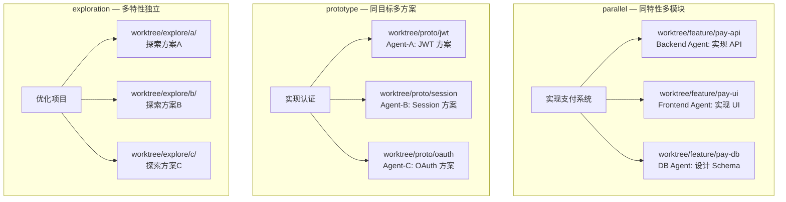

# Worktree 设计文档

> **分析来源**: Repo4 (ref/repo4), Vibe Kanban (docs 分析)
> **推荐方案**: Repo4 GitWorktreeService (主) + WorktreeOrchestrationTool (参考)

---

## 1. 分析范围

| 仓库 | 实现 | 关键文件 |
|------|------|---------|
| **repo4** | Swift — GitWorktreeService + WorktreeManagementService | AgentHubCore/Services/GitWorktreeService.swift, AgentHubCLI/WorktreeManagementService.swift |
| **repo4** | Swift — WorktreeOrchestrationTool (工作树编排) | AgentHubCore/Intelligence/WorktreeOrchestrationTool.swift |
| **vibe-kanban** | 分析文档 — Git Worktree 隔离 | docs/Kanban机制.md |

---

## 2. 方案对比

### 2.1 Repo4 GitWorktreeService (推荐主方案)

**设计定位**: 基于 Git Worktree 的完全隔离开发环境。每个 Agent 任务在一个独立的工作树中执行，拥有独立的分支、终端和文件系统。

**分层架构**:

```
┌──────────────────────────────────────────────────┐
│  GitWorktreeInventoryServiceProtocol              │  ← 协议定义 (可替换、可测试)
│  GitWorktreeCreationServiceProtocol               │
│  GitWorktreeRemovalServiceProtocol                │
├──────────────────────────────────────────────────┤
│  GitWorktreeService                               │  ← 业务逻辑层 (实现协议)
│    ├── listWorktrees(at:)                         │
│    ├── createWorktree(at:name:branch:commit:)     │
│    ├── removeWorktree(at:)                        │
│    └── ...                                        │
├──────────────────────────────────────────────────┤
│  WorktreeManagementService                        │  ← 底层命令执行层
│    ├── 执行 git worktree list                     │
│    ├── 执行 git worktree add                      │
│    ├── 执行 git worktree remove --force           │
│    └── ...                                        │
├──────────────────────────────────────────────────┤
│  WorktreeInventoryViewModel                       │  ← UI 视图模型层
│  WorktreeInventorySection                         │
│  CreateWorktreeSheet                              │
└──────────────────────────────────────────────────┘
```

**核心协议**:

```swift
// GitWorktreeService 实现的协议
protocol GitWorktreeInventoryServiceProtocol {
    func listWorktrees(at repositoryPath: String) async throws -> [GitWorktreeInventoryItem]
}

protocol GitWorktreeCreationServiceProtocol {
    func createWorktree(at repositoryPath: String, name: String, branch: String?,
                        commit: String?) async throws -> String
}

protocol GitWorktreeRemovalServiceProtocol {
    func removeWorktree(at worktreePath: String) async throws
}
```

**底层命令执行**:

```swift
// WorktreeManagementService — 直接操作 git 命令

/// 创建工作树
git branch -f {name} {commit}        // 从指定 commit 创建分支
git worktree add {path} {name}        // 创建工作树

/// 列出现有工作树
git worktree list --porcelain         // 机器可读格式输出

/// 清理工作树
git worktree remove --force {path}    // 强制移除工作树
git branch -D {name}                  // 删除分支

/// 分支管理
git fetch origin {remoteBranch}       // 获取远程分支
git rev-parse {ref}                   // 获取 commit hash
```

### 2.2 Repo4 WorktreeOrchestrationTool (核心创新)

**设计定位**: 通过结构化标记 (`<orchestration-plan>`) 让 Agent 自己描述并行工作树编排方案。

```swift
// WorktreeOrchestrationTool.swift — 并行会话编排

// Agent 输出结构化编排计划
struct OrchestrationPlan: Codable, Sendable {
    let modulePath: String          // 目标模块路径
    let sessions: [OrchestrationSession]  // 会话列表
}

struct OrchestrationSession: Codable, Sendable {
    let description: String         // 会话描述
    let branchName: String          // 分支名
    let sessionType: SessionType    // 会话类型
    let prompt: String              // Agent 的启动提示词
}

enum SessionType: String, Codable, Sendable {
    case parallel      // 相同任务在不同模块并行
    case prototype     // 相同目标不同实现方式
    case exploration   // 相关但不同的特性探索
}
```

**三种 Session 类型**:

| 类型 | 适用场景 | 示例 |
|------|---------|------|
| **parallel** | 同一特性多模块并行实现 | "支付系统: 前端Vue + 后端Go + 数据库" |
| **prototype** | 同一目标不同方案对比 | "认证系统: JWT vs Session vs OAuth" |
| **exploration** | 相关特性独立探索 | "搜索优化"、"缓存引入"、"日志重构" |

**编排计划注入**:

```swift
// Agent 输出包含 <orchestration-plan> 标记的 XML/JSON
<orchestration-plan>
{
  "modulePath": "/path/to/repo",
  "sessions": [
    {
      "description": "实现用户认证API",
      "branchName": "feature/auth-api",
      "sessionType": "parallel",
      "prompt": "在 /backend 中实现 JWT 认证..."
    },
    {
      "description": "实现前端登录页",
      "branchName": "feature/auth-frontend",
      "sessionType": "parallel",
      "prompt": "在 /frontend 中实现登录页面..."
    }
  ]
}
</orchestration-plan>
```

### 2.3 Vibe Kanban (参考)

**Git Worktree 隔离**: 每个 Workspace 使用独立的 Git worktree，提供分支、终端和开发服务器完全隔离
**多会话机制**: 单个 Workspace 可创建多个 Agent 对话会话，绕过上下文长度限制

---

## 3. 推荐方案: Repo4 GitWorktreeService (主) + WorktreeOrchestrationTool (参考)

### 3.1 AgentHub Worktree 体系

```
Worktree System
│
├── GitWorktreeService (采纳 Repo4)
│   ├── 协议驱动 (可替换测试)
│   ├── 异步操作 (async/await)
│   ├── 命名规范化 (WorktreeNaming)
│   └── 错误清理 (cleanupCancelledWorktreeCreation)
│
├── OrchestrationTool (采纳 Repo4)
│   ├── <orchestration-plan> Agent 输出编码
│   ├── 三种 Session 类型 (parallel/prototype/exploration)
│   └── 自动创建工作树 + spawn Agent
│
├── Parallel Session Spawn (采纳 Repo4)
│   ├── Orchestrator → 生成 OrchestrationPlan
│   ├── Plan → 解析为多个 Worktree Session
│   ├── 每个 Session 创建独立 worktree
│   ├── 每个 worktree 独立 spawn Agent
│   └── 结果聚合
│
└── Cleanup & GC (采纳 Multica + Repo4)
    ├── 任务完成 → GC 清理 worktree
    └── 失败回滚 → 清理 worktree + 分支
```

### 3.2 关键设计决策

| 特性 | Repo4 | AgentHub 选型 |
|------|-------|--------------|
| **隔离方式** | Git Worktree | ✅ 采纳 — 天然分支隔离，可同时运行多个 Agent |
| **协议驱动** | 三个 Protocol | ✅ 采纳 — List/Create/Remove 三协议 |
| **编排标记** | `<orchestration-plan>` | ✅ 采纳 — Agent 原生协作范式 |
| **Session 类型** | parallel/prototype/exploration | ✅ 采纳 — 三种并行模式 |
| **Worktree 命名** | WorktreeNaming 规范 | ✅ 采纳 |
| **错误清理** | cleanupCancelledWorktreeCreation | ✅ 采纳 |
| **GC 集成** | — | ✅ 接入 Multica GC Loop |

### 3.3 与 AgentHub Handoff DAG 的结合

```
Coordinator Agent 生成 Handoff DAG
    │
    └── Task: "实现支付系统"
        │
        └── Handoff DELEGATE → WorktreeOrchestrationTool
            │
            ├── 生成 OrchestrationPlan
            │   ├── Session#1: "API 设计" → worktree feature/api → Architect Agent
            │   ├── Session#2: "前端支付页" → worktree feature/pay → Frontend Agent
            │   └── Session#3: "支付网关" → worktree feature/gateway → Backend Agent
            │
            └── 所有 Session 完成后 → 聚合结果
```

### 3.4 三种 Session 类型的实际应用

