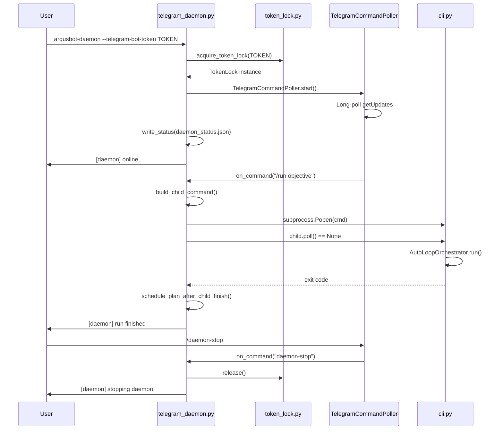

# Architecture
Relevant source files
- [README.md](https://github.com/waltstephen/ArgusBot/blob/6d0ec9f8/README.md?plain=1)
- [codex_autoloop/telegram_daemon.py](https://github.com/waltstephen/ArgusBot/blob/6d0ec9f8/codex_autoloop/telegram_daemon.py)

This document provides a high-level overview of ArgusBot's system architecture, explaining the dual-mode execution model, core components, and how they interact. For detailed information about specific subsystems, see:

- System-level architectural diagrams: [System Overview](/waltstephen/ArgusBot/3.1-system-overview)
- Daemon-specific implementation: [Daemon Mode Architecture](/waltstephen/ArgusBot/3.2-daemon-mode-architecture)
- CLI-specific implementation: [CLI Mode Architecture](/waltstephen/ArgusBot/3.3-cli-mode-architecture)
- Agent coordination and loop logic: [Multi-Agent Loop System](/waltstephen/ArgusBot/3.4-multi-agent-loop-system)
- Persistence and state tracking: [State Management and Persistence](/waltstephen/ArgusBot/3.5-state-management-and-persistence)

## Dual-Mode Execution Model

ArgusBot operates in two distinct execution modes: **Daemon Mode** for persistent 24/7 operation with remote control, and **CLI Mode** for single-run tasks. This design separates long-running supervision from individual task execution.

### Mode Characteristics

| Aspect | Daemon Mode | CLI Mode |
| --- | --- | --- |
| **Process Model** | Long-lived parent process | Single-run child process |
| **Entry Point** | `argusbot-daemon` command | `argusbot-run` command |
| **Primary Use Case** | 24/7 remote control via Telegram/Feishu | Direct local execution |
| **Child Management** | Spawns CLI mode processes as children | Runs standalone |
| **Control Channels** | Telegram, Feishu, local bus | Telegram (notifications only), Feishu (notifications only) |
| **Session Continuity** | Resumes last `session_id` by default | Explicit `--session-id` required |

**Sources:**[README.md9-29](https://github.com/waltstephen/ArgusBot/blob/6d0ec9f8/README.md?plain=1#L9-L29)[README.md423-453](https://github.com/waltstephen/ArgusBot/blob/6d0ec9f8/README.md?plain=1#L423-L453)

### Daemon-as-Supervisor Pattern

[Flowchart Diagram]

**Daemon Mode Key Responsibilities:**

- Poll multiple control channels (Telegram, Feishu, local bus)
- Spawn child processes via `subprocess.Popen()` when `/run` received
- Forward control commands to active child via JSONL bus
- Monitor child process exit codes
- Manage session continuity across runs
- Propose and auto-execute follow-up objectives (planner mode)

**CLI Mode Key Responsibilities:**

- Parse command-line arguments
- Initialize `AutoLoopOrchestrator` with configuration
- Execute the main agent loop
- Send notifications to Telegram/Feishu
- Read control commands from bus when daemon-spawned
- Write state files for persistence

**Sources:**[telegram_daemon.py200-239](https://github.com/waltstephen/ArgusBot/blob/6d0ec9f8/telegram_daemon.py#L200-L239)[telegram_daemon.py446-537](https://github.com/waltstephen/ArgusBot/blob/6d0ec9f8/telegram_daemon.py#L446-L537)[telegram_daemon.py1082-1211](https://github.com/waltstephen/ArgusBot/blob/6d0ec9f8/telegram_daemon.py#L1082-L1211)

## Entry Points and Command Routing

ArgusBot provides multiple entry points that route to either daemon or CLI mode:

[Flowchart Diagram]

### Entry Point Behavior

**`argusbot` (Smart Router):**

- First run: Launches setup wizard, writes `.argusbot/daemon_config.json`, starts daemon
- Subsequent runs: Attaches monitor console to running daemon
- Provides terminal control interface with command history

**`argusbot-run` (Direct CLI):**

- Directly executes CLI mode with provided arguments
- Does not require daemon to be running
- Useful for one-off tasks or testing

**`argusbot-daemon` (Daemon Service):**

- Starts persistent daemon process
- Requires control channel configuration (Telegram or Feishu)
- Enforces token-based locking to prevent conflicts

**`argusbot-setup` (Configuration Wizard):**

- Interactive configuration wizard
- Prompts for control channel, credentials, model presets
- Writes `daemon_config.json` and starts daemon

**`argusbot-daemon-ctl` (Daemon Control):**

- Sends commands to running daemon via JSONL bus
- Does not require Telegram/Feishu access
- Reads `daemon_status.json` for status queries

**Sources:**[README.md129-189](https://github.com/waltstephen/ArgusBot/blob/6d0ec9f8/README.md?plain=1#L129-L189)[README.md454-522](https://github.com/waltstephen/ArgusBot/blob/6d0ec9f8/README.md?plain=1#L454-L522)

## Core Component Hierarchy

The system is organized into distinct layers with clear separation of concerns:

[Flowchart Diagram]

**Sources:**[README.md9-16](https://github.com/waltstephen/ArgusBot/blob/6d0ec9f8/README.md?plain=1#L9-L16)[telegram_daemon.py324-342](https://github.com/waltstephen/ArgusBot/blob/6d0ec9f8/telegram_daemon.py#L324-L342)

## Key Architectural Decisions

### 1. Subprocess Isolation

Child runs execute as separate processes spawned via `subprocess.Popen()`. This provides:

- **Process isolation:** Child crashes don't kill daemon
- **Resource cleanup:** OS handles cleanup on child termination
- **Signal propagation:** Clean shutdown via SIGTERM/SIGKILL

**Sources:**[telegram_daemon.py483-491](https://github.com/waltstephen/ArgusBot/blob/6d0ec9f8/telegram_daemon.py#L483-L491)

### 2. JSONL-Based Command Buses

Commands flow through append-only JSONL files:

- **`daemon_commands.jsonl`:** Terminal → Daemon
- **`child-control-*.jsonl`:** Daemon → CLI child
- Each command is a timestamped JSON object
- Readers track last offset to detect new commands

This design enables:

- Multiple writers without coordination
- Audit trail of all commands
- Simple file-based IPC
- No socket/port management

**Sources:**[telegram_daemon.py268-269](https://github.com/waltstephen/ArgusBot/blob/6d0ec9f8/telegram_daemon.py#L268-L269)[telegram_daemon.py456-457](https://github.com/waltstephen/ArgusBot/blob/6d0ec9f8/telegram_daemon.py#L456-L457)

### 3. Token-Based Daemon Locking

Telegram's `getUpdates` API returns `409 Conflict` if multiple clients poll the same token. ArgusBot enforces single-daemon-per-token via filesystem locks:

[Flowchart Diagram]

Lock files contain daemon metadata (PID, chat_id, workspace) for debugging.

**Sources:**[telegram_daemon.py252-266](https://github.com/waltstephen/ArgusBot/blob/6d0ec9f8/telegram_daemon.py#L252-L266)

### 4. Session Continuity with Fallback

Session resumption follows a two-tier fallback strategy:

1. **Primary:** Read `session_id` from `last_state.json`
2. **Fallback:** Scan `argusbot-run-archive.jsonl` for last completed run's session
3. **Override:**`force_fresh_session` marker bypasses both

This ensures session continuity even if state file is corrupted or missing.

**Sources:**[telegram_daemon.py1513-1519](https://github.com/waltstephen/ArgusBot/blob/6d0ec9f8/telegram_daemon.py#L1513-L1519)[telegram_daemon.py1484-1510](https://github.com/waltstephen/ArgusBot/blob/6d0ec9f8/telegram_daemon.py#L1484-L1510)

### 5. Control Command Forwarding

Daemon cannot directly interrupt child process execution. Instead:

- Daemon writes commands to child's control bus JSONL file
- Child orchestrator polls bus on each round iteration
- Commands inject into orchestrator state before next round

This decouples daemon polling from child execution timing.

**Sources:**[telegram_daemon.py634-641](https://github.com/waltstephen/ArgusBot/blob/6d0ec9f8/telegram_daemon.py#L634-L641)

## Execution Flow Patterns

### Daemon Lifecycle



**Sources:**[telegram_daemon.py1039-1080](https://github.com/waltstephen/ArgusBot/blob/6d0ec9f8/telegram_daemon.py#L1039-L1080)[telegram_daemon.py1082-1211](https://github.com/waltstephen/ArgusBot/blob/6d0ec9f8/telegram_daemon.py#L1082-L1211)

### CLI Lifecycle

CLI mode executes a single run from start to completion:

1. **Argument Parsing:** Parse command-line arguments and build configuration
2. **Orchestrator Init:** Create `AutoLoopOrchestrator` with parsed config
3. **Loop Execution:** Run rounds until done/blocked/max_rounds
4. **State Persistence:** Write final state to `state_file`
5. **Exit:** Return exit code to parent (0 = success, 1 = failure/blocked)

The orchestrator handles all agent coordination, prompt building, and round management internally.

**Sources:**[README.md191-228](https://github.com/waltstephen/ArgusBot/blob/6d0ec9f8/README.md?plain=1#L191-L228)

## Configuration and State Files

The `.argusbot/` directory structure organizes all persistent data:

```
.argusbot/
├── daemon_config.json          # Daemon configuration (control channels, models, planner mode)
├── daemon.pid                  # Daemon process ID
├── last_state.json             # Latest orchestrator state (session_id, rounds, reviews)
├── bus/
│   ├── daemon_commands.jsonl   # Terminal → Daemon commands
│   ├── daemon_status.json      # Daemon status snapshot
│   └── child-control-*.jsonl   # Daemon → Child commands (per run)
└── logs/
    ├── daemon-events.jsonl     # Daemon lifecycle events
    ├── argusbot-run-archive.jsonl  # All run start/finish records
    ├── operator_messages.md    # Persistent inject history
    ├── btw_messages.md         # BTW side-agent conversation log
    ├── run-*.log               # Child stdout/stderr (per run)
    ├── run-*-main-prompt.md    # Main agent prompt (per run)
    ├── run-*-plan-report.md    # Planner output (per run)
    ├── run-*-todo.md           # Planner TODO board (per run)
    └── run-*-review/           # Reviewer summaries (per run)
        ├── index.md
        └── round-*.md

```

**Key Configuration Files:**

- **`daemon_config.json`:** Written by setup wizard, contains Telegram/Feishu credentials, model presets, planner mode
- **`last_state.json`:** Written by orchestrator, contains `session_id`, round history, latest review/plan
- **`daemon_status.json`:** Updated by daemon on every state change, contains child PID, objective, log paths

**Sources:**[telegram_daemon.py242-249](https://github.com/waltstephen/ArgusBot/blob/6d0ec9f8/telegram_daemon.py#L242-L249)[telegram_daemon.py398-444](https://github.com/waltstephen/ArgusBot/blob/6d0ec9f8/telegram_daemon.py#L398-L444)

## Integration Points

### Codex CLI Integration

All agent invocations route through `CodexRunner`, which wraps `subprocess.run()` calls to `codex exec` or `codex exec resume`:

[Flowchart Diagram]

**Provider Override Mechanism:**
When `--copilot-proxy` enabled, `CodexRunner` injects environment variables:

- `CODEX_PROVIDER_OVERRIDE_OPENAI_ENDPOINT=http://localhost:18080/v1`
- `CODEX_PROVIDER_OVERRIDE_ANTHROPIC_ENDPOINT=http://localhost:18080/v1`
- `CODEX_PROVIDER_OVERRIDE_GOOGLE_ENDPOINT=http://localhost:18080/v1`

This transparently routes all model calls through the copilot-proxy without modifying `~/.codex/config.toml`.

**Sources:**[README.md97-127](https://github.com/waltstephen/ArgusBot/blob/6d0ec9f8/README.md?plain=1#L97-L127)

### Telegram Integration

Telegram integration uses two components:

1. **`TelegramCommandPoller`:** Long-polls `getUpdates` API, parses commands, invokes callbacks
2. **`TelegramNotifier`:** Sends messages, files, typing indicators via `sendMessage` / `sendDocument` APIs

**Whisper Voice Transcription:**

- Daemon detects voice/audio messages in polling loop
- Downloads file via `getFile` API
- POSTs to OpenAI Whisper API for transcription
- Treats transcript as text command (e.g., spoken `/inject fix the bug`)

**Sources:**[README.md363-416](https://github.com/waltstephen/ArgusBot/blob/6d0ec9f8/README.md?plain=1#L363-L416)[telegram_daemon.py1039-1055](https://github.com/waltstephen/ArgusBot/blob/6d0ec9f8/telegram_daemon.py#L1039-L1055)

### Feishu Integration

Feishu integration provides equivalent functionality for CN network environments:

1. **`FeishuCommandPoller`:** Polls message history API, extracts text commands
2. **`FeishuNotifier`:** Sends messages and uploads files via Feishu Open API

**Authentication:** Feishu requires `app_id` + `app_secret`, exchanges for tenant access token, used for all API calls.

**Sources:**[README.md230-277](https://github.com/waltstephen/ArgusBot/blob/6d0ec9f8/README.md?plain=1#L230-L277)[telegram_daemon.py1057-1067](https://github.com/waltstephen/ArgusBot/blob/6d0ec9f8/telegram_daemon.py#L1057-L1067)

## Summary

ArgusBot's architecture achieves several design goals:

- **Modularity:** Daemon and CLI modes share orchestrator/agent logic but differ in lifecycle management
- **Fault Isolation:** Child crashes don't kill daemon; daemon can restart children
- **Multi-Channel Control:** Telegram, Feishu, and terminal all route to same command handler
- **Session Continuity:** Two-tier fallback ensures runs can resume across restarts
- **Flexible Deployment:** Can run as persistent daemon (24/7 Telegram control) or one-off CLI (CI/CD integration)

The dual-mode design with subprocess isolation and JSONL-based command buses enables robust long-running operation while maintaining clean separation between supervision (daemon) and execution (CLI).