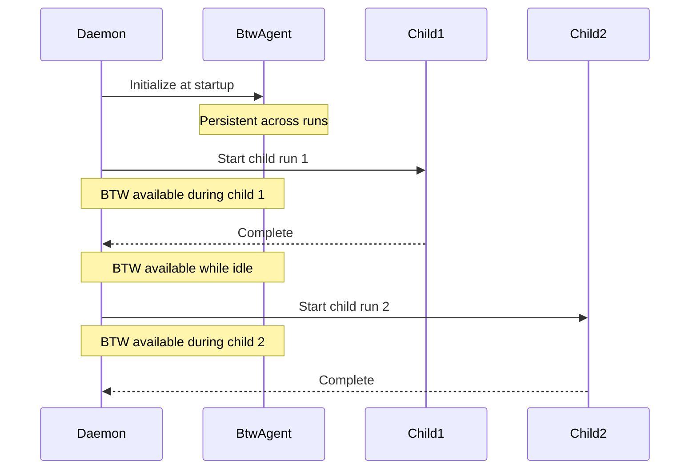

# BTW Side-Agent
Relevant source files
- [README.md](https://github.com/waltstephen/ArgusBot/blob/6d0ec9f8/README.md?plain=1)
- [codex_autoloop/apps/cli_app.py](https://github.com/waltstephen/ArgusBot/blob/6d0ec9f8/codex_autoloop/apps/cli_app.py)
- [codex_autoloop/apps/daemon_app.py](https://github.com/waltstephen/ArgusBot/blob/6d0ec9f8/codex_autoloop/apps/daemon_app.py)

## Purpose and Scope

The BTW (By The Way) Side-Agent is a read-only query system that allows operators to ask questions about the codebase without interrupting active main agent execution. It runs independently in parallel, using a separate Codex CLI session to answer questions, inspect files, and return information with optional file attachments.

For information about the main execution loop and primary agents, see [Multi-Agent Loop System](/waltstephen/ArgusBot/3.4-multi-agent-loop-system). For command syntax and invocation details, see [Command Reference](/waltstephen/ArgusBot/8.1-command-reference).

---

## Architecture Overview

The BTW agent implements an asynchronous, non-blocking query handler that operates independently of the main loop execution. It maintains its own Codex session and executes read-only operations without modifying project state.

### Component Structure

[Flowchart Diagram]

**Sources:**[codex_autoloop/apps/daemon_app.py70-92](https://github.com/waltstephen/ArgusBot/blob/6d0ec9f8/codex_autoloop/apps/daemon_app.py#L70-L92)[codex_autoloop/apps/cli_app.py240-248](https://github.com/waltstephen/ArgusBot/blob/6d0ec9f8/codex_autoloop/apps/cli_app.py#L240-L248)[codex_autoloop/btw_agent.py](https://github.com/waltstephen/ArgusBot/blob/6d0ec9f8/codex_autoloop/btw_agent.py)[codex_autoloop/attachment_policy.py](https://github.com/waltstephen/ArgusBot/blob/6d0ec9f8/codex_autoloop/attachment_policy.py)

---

## Initialization and Configuration

### Configuration Structure

The BTW agent is configured using `BtwConfig` with the following fields:

| Field | Type | Purpose |
| --- | --- | --- |
| `working_dir` | `str` | Directory where Codex CLI executes queries |
| `model` | `str` | LLM model for BTW queries (inherits from planner/reviewer/main) |
| `reasoning_effort` | `str` | Reasoning effort level (inherits hierarchy) |
| `messages_file` | `str` | Path to markdown file storing BTW conversation history |

### Model Selection Hierarchy

The BTW agent model selection follows this fallback chain:

[Flowchart Diagram]

**Reasoning effort** follows the same hierarchy: `plan_reasoning_effort` → `reviewer_reasoning_effort` → `main_reasoning_effort`.

**Sources:**[codex_autoloop/apps/daemon_app.py70-92](https://github.com/waltstephen/ArgusBot/blob/6d0ec9f8/codex_autoloop/apps/daemon_app.py#L70-L92)[codex_autoloop/apps/cli_app.py240-248](https://github.com/waltstephen/ArgusBot/blob/6d0ec9f8/codex_autoloop/apps/cli_app.py#L240-L248)

### Daemon Mode Initialization

In daemon mode, the BTW agent is initialized once at daemon startup in `TelegramDaemonApp.__init__()` and persists across multiple child runs:

| Configuration Field | Source | Fallback Chain |
| --- | --- | --- |
| `working_dir` | `self.run_cwd` | Daemon working directory from `args.run_cd` |
| `model` | Model preset or args | `run_plan_model` → `preset.plan_model` → `run_reviewer_model` → `preset.reviewer_model` → `run_main_model` → `preset.main_model` |
| `reasoning_effort` | Preset or args | `run_plan_reasoning_effort` → `preset.plan_reasoning_effort` → `run_reviewer_reasoning_effort` → `preset.reviewer_reasoning_effort` → `run_main_reasoning_effort` → `preset.main_reasoning_effort` |
| `messages_file` | Logs directory | `self.logs_dir / "btw_messages.md"` |

The BTW agent uses `build_codex_runner()` with the daemon's copilot proxy configuration, ensuring it routes through the same proxy settings as child runs.

**Sources:**[codex_autoloop/apps/daemon_app.py70-92](https://github.com/waltstephen/ArgusBot/blob/6d0ec9f8/codex_autoloop/apps/daemon_app.py#L70-L92)

### CLI Mode Initialization

In CLI mode, the BTW agent is initialized per-run in `run_cli()` with the active loop configuration:

| Configuration Field | Source | Fallback Chain |
| --- | --- | --- |
| `working_dir` | `Path.cwd()` | Current working directory |
| `model` | CLI arguments | `args.plan_model` → `args.reviewer_model` → `args.main_model` |
| `reasoning_effort` | CLI arguments | `args.plan_reasoning_effort` → `args.reviewer_reasoning_effort` → `args.main_reasoning_effort` |
| `messages_file` | File resolver | `resolve_btw_messages_file(operator_messages_file, control_file, state_file)` |

The BTW agent shares the same `CodexRunner` instance built with copilot proxy configuration from `config_from_args(args)`, ensuring consistent model routing with the main loop agents.

**Sources:**[codex_autoloop/apps/cli_app.py240-248](https://github.com/waltstephen/ArgusBot/blob/6d0ec9f8/codex_autoloop/apps/cli_app.py#L240-L248)[codex_autoloop/apps/shell_utils.py](https://github.com/waltstephen/ArgusBot/blob/6d0ec9f8/codex_autoloop/apps/shell_utils.py)

---

## Execution Model

### Asynchronous Operation

The BTW agent uses an asynchronous callback model to prevent blocking the main control loop:

```

```

**Key Implementation Details:**

- `start_async()` returns `True` if query accepted, `False` if rejected (busy)
- Callbacks execute in the BTW agent's background thread context
- The caller must handle result delivery via the `on_complete` callback

**Sources:**[codex_autoloop/apps/daemon_app.py364-368](https://github.com/waltstephen/ArgusBot/blob/6d0ec9f8/codex_autoloop/apps/daemon_app.py#L364-L368)[codex_autoloop/apps/cli_app.py285-287](https://github.com/waltstephen/ArgusBot/blob/6d0ec9f8/codex_autoloop/apps/cli_app.py#L285-L287)

### Single Query Constraint

The BTW agent enforces a **single active query at a time**. If a new query is requested while one is in progress, the `on_busy` callback is invoked immediately and the new query is rejected.

**Sources:**[codex_autoloop/apps/daemon_app.py342-343](https://github.com/waltstephen/ArgusBot/blob/6d0ec9f8/codex_autoloop/apps/daemon_app.py#L342-L343)[codex_autoloop/apps/cli_app.py269-270](https://github.com/waltstephen/ArgusBot/blob/6d0ec9f8/codex_autoloop/apps/cli_app.py#L269-L270)

---

## Command Interface

### Command Syntax

| Command | Description | Example |
| --- | --- | --- |
| `/btw <question>` | Ask read-only question | `/btw what is the current test coverage?` |
| `/btw <question>` | Request file inspection | `/btw show me the implementation of the planner agent` |
| `/btw <question>` | Query architecture | `/btw how does the stall watchdog work?` |

### Control Channel Support

BTW commands are supported across all control channels with unified routing:

[Flowchart Diagram]

**Sources:**[codex_autoloop/apps/daemon_app.py336-368](https://github.com/waltstephen/ArgusBot/blob/6d0ec9f8/codex_autoloop/apps/daemon_app.py#L336-L368)[codex_autoloop/apps/cli_app.py263-335](https://github.com/waltstephen/ArgusBot/blob/6d0ec9f8/codex_autoloop/apps/cli_app.py#L263-L335)

---

## Result Handling

### Result Structure

BTW query results contain two components:

| Component | Type | Description |
| --- | --- | --- |
| `answer` | `str` | Text response from the BTW agent |
| `attachments` | `list` | Files returned by the agent (path + reason) |

### Answer Delivery

Answers are delivered immediately via the originating control channel:

[Flowchart Diagram]

**Sources:**[codex_autoloop/apps/daemon_app.py345-362](https://github.com/waltstephen/ArgusBot/blob/6d0ec9f8/codex_autoloop/apps/daemon_app.py#L345-L362)[codex_autoloop/apps/cli_app.py272-283](https://github.com/waltstephen/ArgusBot/blob/6d0ec9f8/codex_autoloop/apps/cli_app.py#L272-L283)

---

## Attachment Management

### Confirmation Policy

When BTW results include file attachments, a confirmation policy is enforced via `requires_attachment_confirmation()` based on the source channel and attachment count:

[Flowchart Diagram]

**Confirmation Threshold:** Attachments require confirmation when `count > 5`**AND**`source == 'telegram'`. All other combinations send immediately.

### Attachment Confirmation Commands

| Command | Handler | Action |
| --- | --- | --- |
| `/confirm-send` | `kind='attachments-confirm'` | Retrieve pending batch and upload via notifier |
| `/cancel-send` | `kind='attachments-cancel'` | Discard pending batch without uploading |

**Sources:**[codex_autoloop/apps/daemon_app.py208-362](https://github.com/waltstephen/ArgusBot/blob/6d0ec9f8/codex_autoloop/apps/daemon_app.py#L208-L362)[codex_autoloop/apps/cli_app.py276-331](https://github.com/waltstephen/ArgusBot/blob/6d0ec9f8/codex_autoloop/apps/cli_app.py#L276-L331)[codex_autoloop/attachment_policy.py](https://github.com/waltstephen/ArgusBot/blob/6d0ec9f8/codex_autoloop/attachment_policy.py)

### File Upload Implementation

Attachments are uploaded using channel-specific notifier instances:

| Channel | Implementation | Code Reference |
| --- | --- | --- |
| Telegram | `telegram_notifier.send_local_file(item.path, caption=item.reason)` | [daemon_app.py216](https://github.com/waltstephen/ArgusBot/blob/6d0ec9f8/daemon_app.py#L216-L216)[cli_app.py254](https://github.com/waltstephen/ArgusBot/blob/6d0ec9f8/cli_app.py#L254-L254) |
| Feishu | `feishu_notifier.send_local_file(item.path, caption=item.reason)` | [cli_app.py258](https://github.com/waltstephen/ArgusBot/blob/6d0ec9f8/cli_app.py#L258-L258) |
| Terminal | Print `"[btw] attachments:\n- {path}"` to stderr/stdout | [daemon_app.py357-361](https://github.com/waltstephen/ArgusBot/blob/6d0ec9f8/daemon_app.py#L357-L361)[cli_app.py260-261](https://github.com/waltstephen/ArgusBot/blob/6d0ec9f8/cli_app.py#L260-L261) |

**Upload Loop Pattern:**

```
for item in result.attachments:
    notifier.send_local_file(item.path, caption=item.reason)
```

Each `item` in the attachments list contains:

- `item.path`: Local file path to upload
- `item.reason`: Caption explaining why the file is relevant

**Sources:**[codex_autoloop/apps/daemon_app.py214-356](https://github.com/waltstephen/ArgusBot/blob/6d0ec9f8/codex_autoloop/apps/daemon_app.py#L214-L356)[codex_autoloop/apps/cli_app.py252-261](https://github.com/waltstephen/ArgusBot/blob/6d0ec9f8/codex_autoloop/apps/cli_app.py#L252-L261)

---

## Status and Monitoring

### Status Snapshot

The BTW agent exposes a `status_snapshot()` method that returns current state information:

| Field | Type | Description |
| --- | --- | --- |
| `busy` | `bool` | Whether a query is currently executing |
| `session_id` | `str` or `None` | Active Codex session ID for BTW queries |
| `messages_file` | `str` | Path to BTW conversation history file |

### Status Integration

BTW status is included in daemon status reporting via `format_status()` function:

**Daemon `/status` Output:**

```
[daemon] status=idle
btw_busy=False
btw_session_id=<session_id or None>

```

**Daemon Status JSON (daemon_status.json):**

```
{
  "btw_busy": false,
  "btw_session_id": "...",
  "btw_messages_file": ".argusbot/logs/btw_messages.md"
}
```

The status snapshot is called in two contexts:

1. `format_status()` for reply messages: [daemon_app.py260-261](https://github.com/waltstephen/ArgusBot/blob/6d0ec9f8/daemon_app.py#L260-L261)
2. `_write_status()` for JSON file updates: [daemon_app.py506-508](https://github.com/waltstephen/ArgusBot/blob/6d0ec9f8/daemon_app.py#L506-L508)

**Sources:**[codex_autoloop/apps/daemon_app.py260-714](https://github.com/waltstephen/ArgusBot/blob/6d0ec9f8/codex_autoloop/apps/daemon_app.py#L260-L714)

### Conversation History

All BTW queries and responses are persisted to a markdown file for audit and continuity:

| Mode | Path |
| --- | --- |
| Daemon | `.argusbot/logs/btw_messages.md` |
| CLI | Resolved via `resolve_btw_messages_file()` based on state/control file locations |

**Sources:**[codex_autoloop/apps/daemon_app.py90](https://github.com/waltstephen/ArgusBot/blob/6d0ec9f8/codex_autoloop/apps/daemon_app.py#L90-L90)[codex_autoloop/apps/cli_app.py66-71](https://github.com/waltstephen/ArgusBot/blob/6d0ec9f8/codex_autoloop/apps/cli_app.py#L66-L71)

---

## Integration Points

### Daemon Mode Integration

In daemon mode, the BTW agent is initialized once at startup and remains available across all child runs:



**Key characteristics:**

- Single BTW agent instance shared across all runs
- Survives child process lifecycle
- Uses daemon's run_cwd as working directory
- Messages persist in `logs_dir/btw_messages.md`

**Sources:**[codex_autoloop/apps/daemon_app.py70-368](https://github.com/waltstephen/ArgusBot/blob/6d0ec9f8/codex_autoloop/apps/daemon_app.py#L70-L368)

### CLI Mode Integration

In CLI mode, the BTW agent is initialized per-run alongside the main loop:

[Flowchart Diagram]

**Sources:**[codex_autoloop/apps/cli_app.py240-335](https://github.com/waltstephen/ArgusBot/blob/6d0ec9f8/codex_autoloop/apps/cli_app.py#L240-L335)

---

## Use Cases

### Typical BTW Queries

| Query Type | Example | Expected Result | Attachment Behavior |
| --- | --- | --- | --- |
| Architecture inspection | `/btw explain how the stall watchdog works` | Text answer describing soft/hard thresholds and restart logic | No attachments |
| File content | `/btw show me the current planner implementation` | Answer + relevant source file | 1 attachment (if single file), confirmation required if >5 files |
| Test coverage | `/btw what is the current test coverage?` | Answer with coverage metrics, possibly test result files | Attachments if coverage reports exist |
| Configuration | `/btw what model is the main agent using?` | Answer with current model configuration from state | No attachments typically |
| Status check | `/btw how many rounds has this run completed?` | Answer with round count from state file | No attachments |
| Multi-file queries | `/btw show me all the controller files` | Answer listing files | Confirmation prompt if >5 files on Telegram |

### Read-Only Guarantee

The BTW agent executes in read-only mode, enforced by the underlying `CodexRunner` configuration. It is prevented from:

- Modifying source files
- Committing changes to git
- Executing destructive commands (no `--yolo` or `--full-auto` flags passed)
- Interfering with main agent execution (separate Codex session)
- Changing loop state (no access to `LoopStateStore`)

**Isolation Mechanism:**

- Separate Codex session ID (does not share with main agent)
- Independent `CodexRunner` instance
- Read-only filesystem operations enforced by Codex CLI
- No write permissions to state files

This isolation ensures BTW queries are safe to execute at any time without risk of disrupting active work or causing data corruption.

**Sources:**[README.md99](https://github.com/waltstephen/ArgusBot/blob/6d0ec9f8/README.md?plain=1#L99-L99)[codex_autoloop/apps/daemon_app.py70-368](https://github.com/waltstephen/ArgusBot/blob/6d0ec9f8/codex_autoloop/apps/daemon_app.py#L70-L368)[codex_autoloop/apps/cli_app.py240-248](https://github.com/waltstephen/ArgusBot/blob/6d0ec9f8/codex_autoloop/apps/cli_app.py#L240-L248)

---

## Error Handling

### Busy State Rejection

When a query is submitted while the BTW agent is busy:

```
Input: /btw <question>
Output: [btw] side-agent is busy. Wait for the current answer to finish.
Action: Query is rejected, no state change

```

### Attachment Upload Failures

If attachment uploads fail (network errors, file not found):

- Telegram/Feishu: Error logged via `on_error` callback
- Terminal: Attachment paths still listed, operator can access manually

**Sources:**[codex_autoloop/apps/daemon_app.py342-343](https://github.com/waltstephen/ArgusBot/blob/6d0ec9f8/codex_autoloop/apps/daemon_app.py#L342-L343)[codex_autoloop/apps/cli_app.py269-270](https://github.com/waltstephen/ArgusBot/blob/6d0ec9f8/codex_autoloop/apps/cli_app.py#L269-L270)