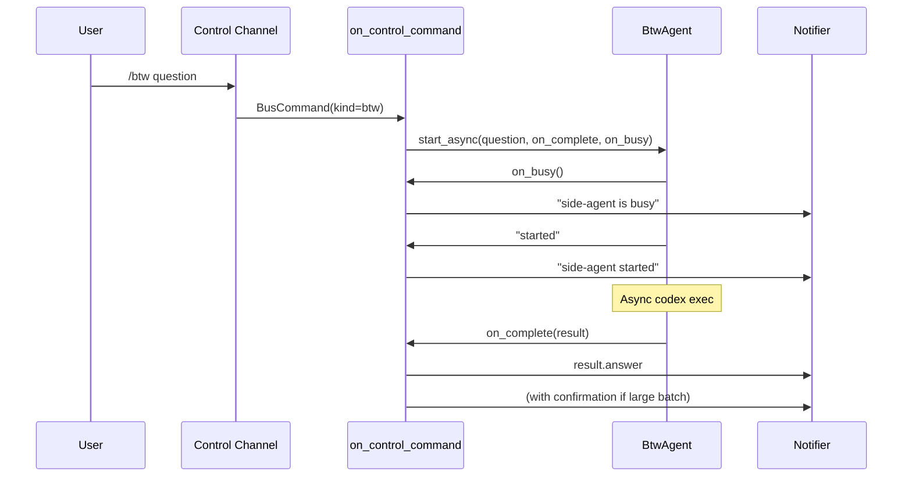
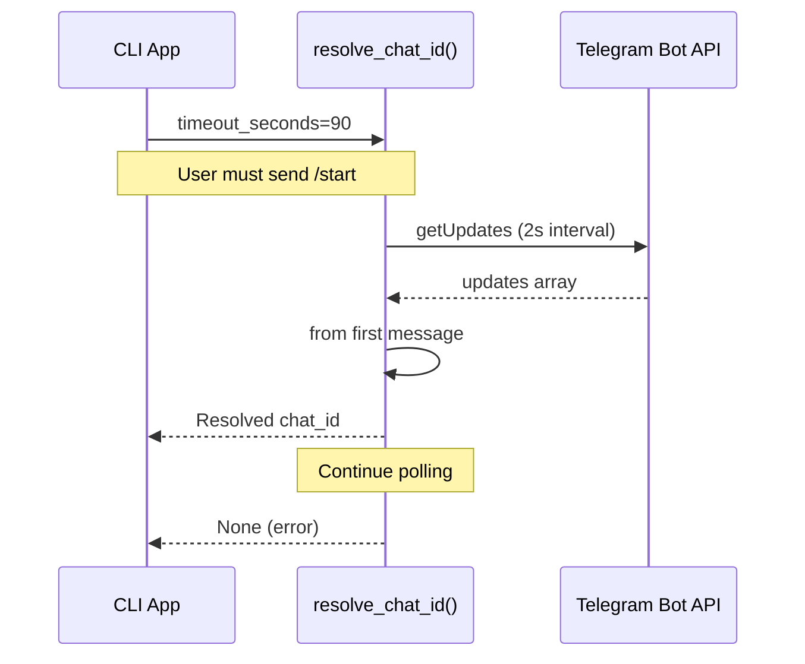

# CLI Mode Architecture
Relevant source files
- [codex_autoloop/apps/cli_app.py](https://github.com/waltstephen/ArgusBot/blob/6d0ec9f8/codex_autoloop/apps/cli_app.py)
- [codex_autoloop/apps/daemon_app.py](https://github.com/waltstephen/ArgusBot/blob/6d0ec9f8/codex_autoloop/apps/daemon_app.py)
- [codex_autoloop/cli.py](https://github.com/waltstephen/ArgusBot/blob/6d0ec9f8/codex_autoloop/cli.py)
- [codex_autoloop/codexloop.py](https://github.com/waltstephen/ArgusBot/blob/6d0ec9f8/codex_autoloop/codexloop.py)
- [tests/test_codexloop.py](https://github.com/waltstephen/ArgusBot/blob/6d0ec9f8/tests/test_codexloop.py)

## Purpose and Scope

This document describes the architecture of ArgusBot's CLI mode, which provides single-run execution without a persistent daemon. CLI mode is the direct execution path where users invoke `argusbot-run` with an objective and the system runs until completion or error. This mode is ideal for scripting, CI/CD integration, and one-off tasks.

For information about persistent, remotely-controlled operation, see [Daemon Mode Architecture](/waltstephen/ArgusBot/3.2-daemon-mode-architecture). For details on the multi-agent execution loop itself, see [Multi-Agent Loop System](/waltstephen/ArgusBot/3.4-multi-agent-loop-system).

---

## Overview: CLI vs Daemon Mode

CLI mode differs from daemon mode in execution model and lifecycle management:

| Aspect | CLI Mode | Daemon Mode |
| --- | --- | --- |
| **Process Model** | Single process, direct execution | Parent daemon spawns child processes |
| **Lifecycle** | Runs until completion/error | Persistent supervisor, multiple runs |
| **Session Management** | Optional resume via `--session-id` | Automatic session continuity across runs |
| **Control** | Terminal input, optional channels | Multi-channel (Telegram/Feishu/terminal) |
| **Use Case** | Scripts, CI/CD, one-off tasks | Long-running automation, remote control |

**Entry Points:**

- CLI mode: `argusbot-run` command → [codex_autoloop/cli.py32-71](https://github.com/waltstephen/ArgusBot/blob/6d0ec9f8/codex_autoloop/cli.py#L32-L71)
- Daemon mode: `argusbot-daemon` command → daemon spawns `argusbot-run` as child

Sources: [codex_autoloop/cli.py1-461](https://github.com/waltstephen/ArgusBot/blob/6d0ec9f8/codex_autoloop/cli.py#L1-L461)[codex_autoloop/apps/daemon_app.py552-661](https://github.com/waltstephen/ArgusBot/blob/6d0ec9f8/codex_autoloop/apps/daemon_app.py#L552-L661)

---

## Execution Flow

### High-Level Flow Diagram

[Flowchart Diagram]

Sources: [codex_autoloop/cli.py32-71](https://github.com/waltstephen/ArgusBot/blob/6d0ec9f8/codex_autoloop/cli.py#L32-L71)[codex_autoloop/apps/cli_app.py42-493](https://github.com/waltstephen/ArgusBot/blob/6d0ec9f8/codex_autoloop/apps/cli_app.py#L42-L493)

---

## Entry Point and Argument Parsing

### Parser Construction

The `build_parser()` function creates a comprehensive `ArgumentParser` with 70+ command-line options organized into functional groups:

**Core Options:**

- `objective`: Required positional argument(s) for task description
- `--session-id`: Resume existing Codex session
- `--max-rounds`: Maximum iteration limit (default: 500)

**Model Configuration:**

- `--main-model`, `--reviewer-model`, `--plan-model`: Model overrides
- `--main-reasoning-effort`, `--reviewer-reasoning-effort`, `--plan-reasoning-effort`: Effort levels
- `--main-extra-arg`, `--reviewer-extra-arg`, `--plan-extra-arg`: Pass-through arguments

**Planner Configuration:**

- `--planner` / `--no-planner`: Enable/disable planner (default: enabled)
- `--plan-mode`: Operating mode (off/auto/record, default: auto)

**State Persistence:**

- `--state-file`: JSON state snapshot path
- `--operator-messages-file`: Operator input history markdown
- `--plan-overview-file`: Planner output markdown
- `--review-summaries-dir`: Reviewer output directory

**Control Channels:**

- `--control-file`: Local JSONL command bus path
- `--telegram-*`: Telegram integration options
- `--feishu-*`: Feishu integration options

**Execution Options:**

- `--yolo`: Bypass all Codex CLI approvals
- `--full-auto`: Enable Codex full-auto mode
- `--skip-git-repo-check`: Skip repository validation
- `--check`: Acceptance test commands (repeatable)

Sources: [codex_autoloop/cli.py73-408](https://github.com/waltstephen/ArgusBot/blob/6d0ec9f8/codex_autoloop/cli.py#L73-L408)

### Argument Validation

The `main()` function performs validation before execution:

```
# Objective validation
objective = " ".join(args.objective).strip()
if not objective:
    parser.error("objective cannot be empty")
 
# Stall threshold validation
if args.stall_hard_idle_seconds < args.stall_soft_idle_seconds:
    parser.error("--stall-hard-idle-seconds must be >= --stall-soft-idle-seconds")
 
# Planner mode normalization
if not args.planner:
    args.plan_mode = "off"
```

Sources: [codex_autoloop/cli.py35-52](https://github.com/waltstephen/ArgusBot/blob/6d0ec9f8/codex_autoloop/cli.py#L35-L52)

---

## Component Initialization Sequence

### State Store Initialization

The `LoopStateStore` is the central state management component, initialized before any other components:

[Flowchart Diagram]

Sources: [codex_autoloop/apps/cli_app.py49-82](https://github.com/waltstephen/ArgusBot/blob/6d0ec9f8/codex_autoloop/apps/cli_app.py#L49-L82)

### Event Sink Construction

Event sinks form a composite pipeline for routing events to multiple destinations:

[Flowchart Diagram]

**TerminalEventSink** is mandatory and provides:

- Real-time stream output to console
- Optional verbose mode for raw JSONL events
- Configurable live terminal updates

**Optional sinks** are enabled conditionally:

- `DashboardEventSink`: Requires `--dashboard` flag, serves HTTP on specified port
- `TelegramEventSink`: Requires `--telegram-bot-token`, sends to resolved `chat_id`
- `FeishuEventSink`: Requires `--feishu-app-id`, `--feishu-app-secret`, `--feishu-chat-id`

Sources: [codex_autoloop/apps/cli_app.py84-219](https://github.com/waltstephen/ArgusBot/blob/6d0ec9f8/codex_autoloop/apps/cli_app.py#L84-L219)

### Control Channel Setup

Control channels enable external command injection during execution:

```

```

**LocalBusControlChannel** ([codex_autoloop/apps/cli_app.py220-229](https://github.com/waltstephen/ArgusBot/blob/6d0ec9f8/codex_autoloop/apps/cli_app.py#L220-L229)):

- Polls JSONL file at `--control-file` path
- Used by daemon-spawned children and terminal control
- Default poll interval: 1 second

**TelegramControlChannel** ([codex_autoloop/apps/cli_app.py157-173](https://github.com/waltstephen/ArgusBot/blob/6d0ec9f8/codex_autoloop/apps/cli_app.py#L157-L173)):

- Long-polls Telegram Bot API for commands
- Supports voice transcription via Whisper API
- Plain text messages mapped to `/inject` by default

**FeishuControlChannel** ([codex_autoloop/apps/cli_app.py207-218](https://github.com/waltstephen/ArgusBot/blob/6d0ec9f8/codex_autoloop/apps/cli_app.py#L207-L218)):

- Polls Feishu message API
- Plain text messages mapped to `/inject` or `/run`

All channels start background threads and invoke `on_control_command()` callback for each received command.

Sources: [codex_autoloop/apps/cli_app.py220-418](https://github.com/waltstephen/ArgusBot/blob/6d0ec9f8/codex_autoloop/apps/cli_app.py#L220-L418)

---

## Loop Engine Construction

The `LoopEngine` is the core orchestrator, initialized with all dependencies:

```

```

**CodexRunner** is constructed with Copilot proxy configuration:

- `config_from_args()` detects/configures copilot-proxy settings
- `build_codex_runner()` creates runner with optional proxy overrides
- Event callback attached to stream parser for real-time event emission

**LoopConfig** encapsulates all execution parameters:

- Model selections and reasoning effort levels
- Safety flags (`dangerous_yolo`, `full_auto`, `skip_git_repo_check`)
- Stall detection thresholds (soft/hard idle seconds)
- Acceptance check commands and timeout

Sources: [codex_autoloop/apps/cli_app.py420-456](https://github.com/waltstephen/ArgusBot/blob/6d0ec9f8/codex_autoloop/apps/cli_app.py#L420-L456)

---

## Command Handling

### Command Routing Table

The `on_control_command()` callback routes commands to state store methods:

| Command | Handler Method | Action |
| --- | --- | --- |
| `inject` | `state_store.request_inject()` | Queue instruction injection |
| `stop` | `state_store.request_stop()` | Request loop termination |
| `plan` | `state_store.request_plan_direction()` | Add planner direction |
| `review` | `state_store.request_review_criteria()` | Add reviewer criteria |
| `mode` | `state_store.request_plan_mode()` | Update planner mode |
| `status` | `format_control_status()` | Return runtime snapshot |
| `btw` | `btw_agent.start_async()` | Start side-agent query |
| `show-plan` | `state_store.read_plan_overview_markdown()` | Return plan markdown |
| `show-review` | `state_store.read_review_summaries_markdown()` | Return review markdown |

**Command Structure:**

```
class BusCommand:
    kind: str      # Command type
    text: str      # Command payload
    source: str    # Origin (telegram/feishu/terminal)
    ts: float      # Timestamp
```

Sources: [codex_autoloop/apps/cli_app.py289-415](https://github.com/waltstephen/ArgusBot/blob/6d0ec9f8/codex_autoloop/apps/cli_app.py#L289-L415)

### BTW Side-Agent Integration

The BTW agent handles read-only questions without interrupting main execution:



BTW agent configuration uses fallback model priority:

1. `--plan-model`
2. `--reviewer-model`
3. `--main-model`

Sources: [codex_autoloop/apps/cli_app.py240-288](https://github.com/waltstephen/ArgusBot/blob/6d0ec9f8/codex_autoloop/apps/cli_app.py#L240-L288)[codex_autoloop/apps/cli_app.py333-335](https://github.com/waltstephen/ArgusBot/blob/6d0ec9f8/codex_autoloop/apps/cli_app.py#L333-L335)

---

## Execution and Output

### Engine Execution

The `engine.run()` call is synchronous and blocking:

```
try:
    result = engine.run()  # Blocks until completion
    payload = {
        "success": result.success,
        "session_id": result.session_id,
        "stop_reason": result.stop_reason,
        "rounds": [...]
    }
    return payload, 0 if result.success else 2
finally:
    # Cleanup control channels
    for channel in reversed(control_channels):
        channel.stop()
    # Close event sinks
    if event_sink is not None:
        event_sink.close()
    # Stop dashboard
    if dashboard_server is not None:
        dashboard_server.stop()
```

Sources: [codex_autoloop/apps/cli_app.py458-493](https://github.com/waltstephen/ArgusBot/blob/6d0ec9f8/codex_autoloop/apps/cli_app.py#L458-L493)

### Output Format

The `main()` function outputs structured JSON to stdout:

```
{
  "success": true,
  "session_id": "abc123...",
  "stop_reason": "done",
  "plan_mode": "auto",
  "main_prompt_file": "/path/to/main_prompt.md",
  "plan_overview_file": "/path/to/plan_report.md",
  "review_summaries_dir": "/path/to/review_summaries/",
  "rounds": [
    {
      "round": 0,
      "thread_id": "thread_xyz",
      "main_exit_code": 0,
      "review_status": "continue",
      "checks_passed": true,
      "plan_next_explore": "implement feature X"
    }
  ]
}
```

**Exit Codes:**

- `0`: Success (`result.success == True`)
- `2`: Failure or blocked

Sources: [codex_autoloop/cli.py58-71](https://github.com/waltstephen/ArgusBot/blob/6d0ec9f8/codex_autoloop/cli.py#L58-L71)[codex_autoloop/apps/cli_app.py460-485](https://github.com/waltstephen/ArgusBot/blob/6d0ec9f8/codex_autoloop/apps/cli_app.py#L460-L485)

---

## Configuration Resolution

### File Path Resolution

Default file paths are resolved based on specified anchors:

[Flowchart Diagram]

**Resolution Functions:**

- `resolve_operator_messages_file()`: Anchor to control/state file parent
- `resolve_plan_overview_file()`: Defaults to `plan_report.md` in same directory
- `resolve_review_summaries_dir()`: Defaults to `review_summaries/` subdirectory
- `resolve_main_prompt_file()`: Defaults to `main_prompt.md` in same directory

Sources: [codex_autoloop/cli.py54-56](https://github.com/waltstephen/ArgusBot/blob/6d0ec9f8/codex_autoloop/cli.py#L54-L56)[codex_autoloop/cli.py411-441](https://github.com/waltstephen/ArgusBot/blob/6d0ec9f8/codex_autoloop/cli.py#L411-L441)[codex_autoloop/apps/shell_utils.py](https://github.com/waltstephen/ArgusBot/blob/6d0ec9f8/codex_autoloop/apps/shell_utils.py)

### Copilot Proxy Configuration

Copilot proxy settings are extracted and applied to CodexRunner:

[Flowchart Diagram]

When `--copilot-proxy` is enabled:

1. Auto-detect proxy directory (home, .argusbot/tools, or explicit path)
2. Format summary for user feedback
3. Apply environment variable overrides to Codex CLI invocations

Sources: [codex_autoloop/apps/cli_app.py47-48](https://github.com/waltstephen/ArgusBot/blob/6d0ec9f8/codex_autoloop/apps/cli_app.py#L47-L48)[codex_autoloop/apps/cli_app.py100-101](https://github.com/waltstephen/ArgusBot/blob/6d0ec9f8/codex_autoloop/apps/cli_app.py#L100-L101)[codex_autoloop/apps/cli_app.py420-424](https://github.com/waltstephen/ArgusBot/blob/6d0ec9f8/codex_autoloop/apps/cli_app.py#L420-L424)

---

## Telegram/Feishu Integration

### Chat ID Resolution

When `--telegram-chat-id=auto`:



Sources: [codex_autoloop/apps/cli_app.py104-134](https://github.com/waltstephen/ArgusBot/blob/6d0ec9f8/codex_autoloop/apps/cli_app.py#L104-L134)

### Notifier Lifecycle

Notifiers are created conditionally and passed to event sinks:

**Telegram:**

- Validates bot token format
- Resolves chat_id if set to `auto`
- Creates `TelegramNotifier` with typing heartbeat config
- Enables control channel if `--telegram-control` is true

**Feishu:**

- Requires all three credentials: app_id, app_secret, chat_id
- Creates `FeishuNotifier` with token management
- Enables control channel if `--feishu-control` is true

Both notifiers are closed in the finally block after engine execution.

Sources: [codex_autoloop/apps/cli_app.py103-218](https://github.com/waltstephen/ArgusBot/blob/6d0ec9f8/codex_autoloop/apps/cli_app.py#L103-L218)

---

## Comparison with Daemon-Spawned Runs

When daemon mode spawns a child via `build_child_command()`, it constructs an `argusbot-run` invocation with:

**Differences:**

- `--no-telegram-control`: Daemon handles control, not child
- Explicit paths for all state files (timestamped)
- `--session-id` passed if resuming
- `--yolo` typically enabled by default

**Similarities:**

- Same `argusbot-run` binary
- Same argument structure
- Same LoopEngine execution
- Same event emission

The child process logs stdout/stderr to a file and exits when complete. Daemon monitors exit code to determine next action.

Sources: [codex_autoloop/apps/daemon_app.py552-661](https://github.com/waltstephen/ArgusBot/blob/6d0ec9f8/codex_autoloop/apps/daemon_app.py#L552-L661)

---

## Summary

CLI mode provides a **synchronous, single-process execution model** for ArgusBot runs. Key characteristics:

1. **Direct execution**: No daemon supervisor, runs until completion
2. **Flexible integration**: Supports Telegram/Feishu for notifications and control
3. **Stateless by default**: Optional state persistence via `--state-file`
4. **Scriptable**: JSON output on stdout, exit codes for automation
5. **Composable**: Control channels, event sinks, and dashboard are optional

This architecture makes CLI mode suitable for:

- CI/CD pipelines requiring deterministic exit codes
- One-off automation tasks
- Development and debugging (direct terminal output)
- Environments where persistent daemons are undesirable

For continuous operation with session management and remote control, see [Daemon Mode Architecture](/waltstephen/ArgusBot/3.2-daemon-mode-architecture).