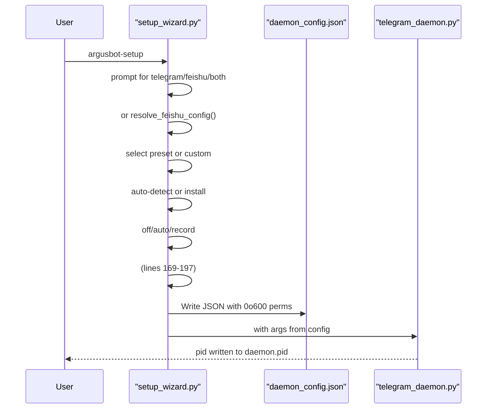
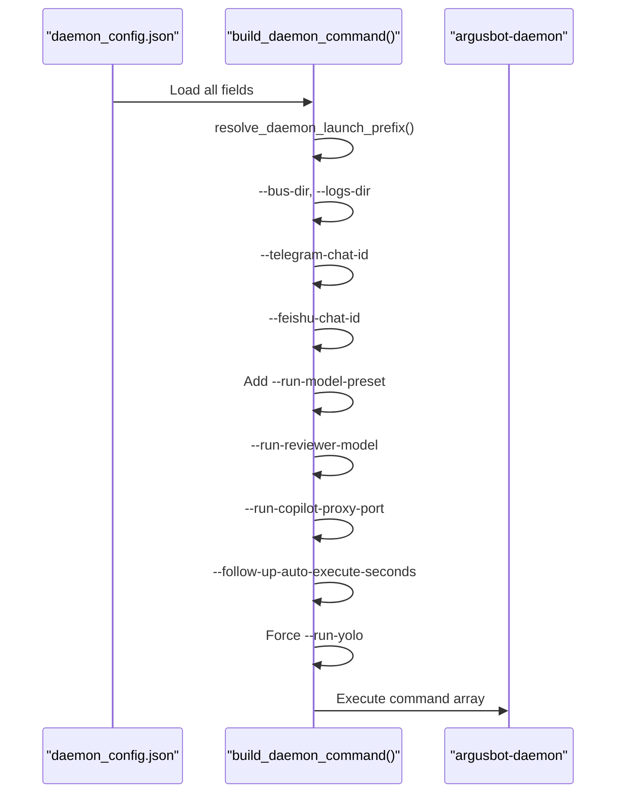

# Configuration Files
Relevant source files
- [codex_autoloop/cli.py](https://github.com/waltstephen/ArgusBot/blob/6d0ec9f8/codex_autoloop/cli.py)
- [codex_autoloop/codexloop.py](https://github.com/waltstephen/ArgusBot/blob/6d0ec9f8/codex_autoloop/codexloop.py)
- [codex_autoloop/setup_wizard.py](https://github.com/waltstephen/ArgusBot/blob/6d0ec9f8/codex_autoloop/setup_wizard.py)
- [tests/test_codexloop.py](https://github.com/waltstephen/ArgusBot/blob/6d0ec9f8/tests/test_codexloop.py)

This page documents the configuration file system used by ArgusBot, with primary focus on the `daemon_config.json` file structure and how configuration is resolved from multiple sources. For information about command-line arguments that can be passed at runtime, see [CLI Arguments Reference](/waltstephen/ArgusBot/8.2-cli-arguments-reference). For details about initial setup, see [Installation and Initial Setup](/waltstephen/ArgusBot/2.1-installation-and-initial-setup).

---

## Overview

ArgusBot uses a persistent JSON configuration file stored at `.argusbot/daemon_config.json` (or a custom `--home-dir` location). This file is created during initial setup via the setup wizard and contains all daemon behavior settings, including control channel credentials, model selections, run parameters, and planner configuration.

The configuration system has three layers:

1. **Persistent Configuration**: `daemon_config.json` stores all daemon settings
2. **Daemon Launch Arguments**: Built from `daemon_config.json` when starting the daemon
3. **CLI Run Arguments**: Passed to each spawned `argusbot-run` child process

Configuration priority (highest to lowest): CLI arguments → Environment variables → `daemon_config.json` → System defaults.

Sources: [codex_autoloop/setup_wizard.py169-200](https://github.com/waltstephen/ArgusBot/blob/6d0ec9f8/codex_autoloop/setup_wizard.py#L169-L200)[codex_autoloop/codexloop.py304-319](https://github.com/waltstephen/ArgusBot/blob/6d0ec9f8/codex_autoloop/codexloop.py#L304-L319)

---

## Configuration File Location and Permissions

[Flowchart Diagram]

**File Locations**

| File | Default Path | Purpose |
| --- | --- | --- |
| `daemon_config.json` | `.argusbot/daemon_config.json` | Persistent configuration |
| `bus/` | `.argusbot/bus/` | Command bus directory |
| `logs/` | `.argusbot/logs/` | Event logs directory |
| `daemon.pid` | `.argusbot/daemon.pid` | Daemon process ID |
| `daemon.out` | `.argusbot/daemon.out` | Daemon stdout/stderr |

The configuration file is created with restricted permissions (mode `0o600`) to protect sensitive credentials like bot tokens.

Sources: [codex_autoloop/setup_wizard.py61-66](https://github.com/waltstephen/ArgusBot/blob/6d0ec9f8/codex_autoloop/setup_wizard.py#L61-L66)[codex_autoloop/setup_wizard.py198-200](https://github.com/waltstephen/ArgusBot/blob/6d0ec9f8/codex_autoloop/setup_wizard.py#L198-L200)

---

## daemon_config.json Schema

### Complete Field Reference

The `daemon_config.json` file contains the following top-level fields:

[Flowchart Diagram]

### Field Categories and Types

**Control Channel Configuration**

| Field | Type | Example | Description |
| --- | --- | --- | --- |
| `control_channel` | `string` | `"telegram"` | Control channel: `"telegram"`, `"feishu"`, or `"both"` |
| `telegram_bot_token` | `string \| null` | `"123456:ABC-xyz"` | Telegram bot API token |
| `telegram_chat_id` | `string \| null` | `"-100123456"` | Telegram chat ID for notifications |
| `feishu_app_id` | `string \| null` | `"cli_xxx"` | Feishu application ID |
| `feishu_app_secret` | `string \| null` | `"secret"` | Feishu application secret |
| `feishu_chat_id` | `string \| null` | `"oc_xxx"` | Feishu chat ID |
| `feishu_receive_id_type` | `string` | `"chat_id"` | Feishu receive ID type |

**Run Parameters**

| Field | Type | Default | Description |
| --- | --- | --- | --- |
| `run_cd` | `string` | `"."` | Working directory for CLI runs |
| `run_check` | `string \| null` | `null` | Shell command for acceptance checks |
| `run_max_rounds` | `number` | `100` | Maximum rounds per run |
| `run_skip_git_repo_check` | `boolean` | `false` | Skip git repository validation |
| `run_full_auto` | `boolean` | `false` | Enable Codex full-auto mode |
| `run_yolo` | `boolean` | `true` | Bypass Codex approvals and sandbox |
| `run_resume_last_session` | `boolean` | `true` | Resume previous session on new run |

**Model Configuration**

| Field | Type | Default | Description |
| --- | --- | --- | --- |
| `run_main_model` | `string \| null` | `null` | Main agent model override |
| `run_main_reasoning_effort` | `string \| null` | `null` | Main agent reasoning effort: `"low"`, `"medium"`, `"high"`, `"xhigh"` |
| `run_reviewer_model` | `string \| null` | `null` | Reviewer agent model override |
| `run_reviewer_reasoning_effort` | `string \| null` | `null` | Reviewer agent reasoning effort |
| `run_model_preset` | `string \| null` | `null` | Model preset name (e.g., `"quality"`, `"copilot"`) |

**Copilot Proxy Configuration**

| Field | Type | Default | Description |
| --- | --- | --- | --- |
| `run_copilot_proxy` | `boolean` | `false` | Enable copilot-proxy routing |
| `run_copilot_proxy_dir` | `string \| null` | `null` | Path to copilot-proxy checkout |
| `run_copilot_proxy_port` | `number` | `18080` | copilot-proxy local port |

**Planner Configuration**

| Field | Type | Default | Description |
| --- | --- | --- | --- |
| `run_planner_mode` | `string` | `"auto"` | Planner mode: `"off"`, `"auto"`, `"record"` |
| `follow_up_auto_execute_seconds` | `number` | `600` | Auto-execute countdown in auto mode |

**System Paths**

| Field | Type | Default | Description |
| --- | --- | --- | --- |
| `codex_autoloop_bin` | `string` | `"python -m codex_autoloop.cli"` | CLI command for spawning children |
| `bus_dir` | `string` | `".argusbot/bus"` | Command bus directory |
| `logs_dir` | `string` | `".argusbot/logs"` | Event logs directory |

Sources: [codex_autoloop/setup_wizard.py169-197](https://github.com/waltstephen/ArgusBot/blob/6d0ec9f8/codex_autoloop/setup_wizard.py#L169-L197)[codex_autoloop/codexloop.py345-374](https://github.com/waltstephen/ArgusBot/blob/6d0ec9f8/codex_autoloop/codexloop.py#L345-L374)

---

## Configuration Creation Flow



### Setup Wizard Steps

The setup wizard (`argusbot-setup`) creates the configuration file through the following steps:

1. **Channel Selection**: Prompts for control channel (Telegram, Feishu, or both)
2. **Credentials**: Collects bot tokens, app IDs, and chat IDs based on channel selection
3. **Model Selection**: Prompts for model preset or allows custom model configuration
4. **Copilot Proxy**: Auto-detects existing proxy installations or offers to bootstrap one
5. **Planner Mode**: Selects planner behavior (off, auto, or record)
6. **Validation**: Performs `codex --version` check and auth probe request
7. **File Creation**: Writes `daemon_config.json` with restricted permissions
8. **Daemon Launch**: Spawns daemon process using configuration

Sources: [codex_autoloop/setup_wizard.py45-340](https://github.com/waltstephen/ArgusBot/blob/6d0ec9f8/codex_autoloop/setup_wizard.py#L45-L340)[codex_autoloop/setup_wizard.py850-914](https://github.com/waltstephen/ArgusBot/blob/6d0ec9f8/codex_autoloop/setup_wizard.py#L850-L914)

---

## Configuration Loading and Resolution

[Flowchart Diagram]

### Load Process

The configuration loading process follows this flow:

1. **Load File**: `load_config()` reads and parses `daemon_config.json`
2. **Validation**: `is_config_usable()` checks for required fields (token OR Feishu credentials, and `run_cd`)
3. **Fallback**: If config is invalid or missing, triggers interactive reconfiguration
4. **Command Building**: `build_daemon_command()` merges config, environment, and defaults

**Configuration Validation Requirements**

A configuration is considered usable if it has:

- Either a valid `telegram_bot_token` OR complete Feishu credentials (`feishu_app_id`, `feishu_app_secret`, `feishu_chat_id`)
- A non-empty `run_cd` working directory

Sources: [codex_autoloop/codexloop.py304-313](https://github.com/waltstephen/ArgusBot/blob/6d0ec9f8/codex_autoloop/codexloop.py#L304-L313)[codex_autoloop/codexloop.py377-383](https://github.com/waltstephen/ArgusBot/blob/6d0ec9f8/codex_autoloop/codexloop.py#L377-L383)[codex_autoloop/codexloop.py695-793](https://github.com/waltstephen/ArgusBot/blob/6d0ec9f8/codex_autoloop/codexloop.py#L695-L793)

---

## Control Channel Configuration

### Telegram Configuration

When `control_channel` is `"telegram"` or `"both"`, the following fields must be configured:

**Required Fields**

| Field | Format | Example | Validation |
| --- | --- | --- | --- |
| `telegram_bot_token` | `<digits>:<secret>` | `"123456:ABC-xyz"` | Must contain `:` with digits before |
| `telegram_chat_id` | Numeric or `"auto"` | `"-100123456"` | Must be digits or start with `-` |

**Token Format Validation**

The setup wizard validates Telegram bot tokens using `looks_like_token()`:

```
# Token must be in format: <digits>:<secret>
def looks_like_token(token: str) -> bool:
    if ":" not in token:
        return False
    left, right = token.split(":", 1)
    return left.isdigit() and bool(right.strip())
```

**Chat ID Resolution**

When `telegram_chat_id` is set to `"auto"`, the setup wizard polls Telegram's `getUpdates` API to automatically resolve the chat ID from recent messages. The user must send `/start` or any message to the bot within the timeout period.

Sources: [codex_autoloop/setup_wizard.py811-823](https://github.com/waltstephen/ArgusBot/blob/6d0ec9f8/codex_autoloop/setup_wizard.py#L811-L823)[codex_autoloop/setup_wizard.py473-518](https://github.com/waltstephen/ArgusBot/blob/6d0ec9f8/codex_autoloop/setup_wizard.py#L473-L518)

### Feishu Configuration

When `control_channel` is `"feishu"` or `"both"`, the following fields must be configured:

**Required Fields**

| Field | Example | Description |
| --- | --- | --- |
| `feishu_app_id` | `"cli_xxx"` | Feishu application ID |
| `feishu_app_secret` | `"secret"` | Feishu application secret |
| `feishu_chat_id` | `"oc_xxx"` | Feishu chat/group ID |
| `feishu_receive_id_type` | `"chat_id"` | ID type for outgoing messages |

**Chat ID Format**

For `receive_id_type="chat_id"`, the chat ID must start with `"oc_"`. Other receive ID types have no validation constraints.

Sources: [codex_autoloop/setup_wizard.py826-833](https://github.com/waltstephen/ArgusBot/blob/6d0ec9f8/codex_autoloop/setup_wizard.py#L826-L833)[codex_autoloop/setup_wizard.py893-913](https://github.com/waltstephen/ArgusBot/blob/6d0ec9f8/codex_autoloop/setup_wizard.py#L893-L913)

### Dual-Channel Configuration

When `control_channel` is `"both"`, all Telegram and Feishu fields must be populated. The daemon will poll both channels simultaneously and accept commands from either source.

Sources: [codex_autoloop/setup_wizard.py71-72](https://github.com/waltstephen/ArgusBot/blob/6d0ec9f8/codex_autoloop/setup_wizard.py#L71-L72)[codex_autoloop/setup_wizard.py162-177](https://github.com/waltstephen/ArgusBot/blob/6d0ec9f8/codex_autoloop/setup_wizard.py#L162-L177)

---

## Model Configuration

### Model Preset System

ArgusBot supports named model presets that configure both the main agent and reviewer agent simultaneously. When a preset is selected, it populates `run_model_preset`, `run_main_model`, `run_reviewer_model`, and reasoning effort fields.

**Preset Resolution**

[Flowchart Diagram]

If `run_model_preset` is `null` or not set, the system falls back to individual model fields. If those are also `null`, it inherits from Codex CLI defaults.

**Preset Hierarchy**

1. **Explicit preset**: If `run_model_preset` is set, use preset values
2. **Individual overrides**: If `run_main_model` or `run_reviewer_model` are set, use those
3. **Codex defaults**: If all model fields are `null`, let Codex CLI choose

Sources: [codex_autoloop/setup_wizard.py79-134](https://github.com/waltstephen/ArgusBot/blob/6d0ec9f8/codex_autoloop/setup_wizard.py#L79-L134)[codex_autoloop/setup_wizard.py106-109](https://github.com/waltstephen/ArgusBot/blob/6d0ec9f8/codex_autoloop/setup_wizard.py#L106-L109)

### Individual Model Configuration

When not using presets, models can be configured individually:

**Main Agent Configuration**

- `run_main_model`: Model identifier (e.g., `"claude-sonnet-4.6"`, `"gpt-5.4"`)
- `run_main_reasoning_effort`: Reasoning level (`"low"`, `"medium"`, `"high"`, `"xhigh"`)

**Reviewer Agent Configuration**

- `run_reviewer_model`: Model identifier
- `run_reviewer_reasoning_effort`: Reasoning level

**Model vs. Preset Priority**

If both a preset and individual model fields are specified:

- The preset takes priority during setup wizard flow
- Individual fields can override preset values in daemon command construction

Sources: [codex_autoloop/setup_wizard.py121-134](https://github.com/waltstephen/ArgusBot/blob/6d0ec9f8/codex_autoloop/setup_wizard.py#L121-L134)[codex_autoloop/codexloop.py757-783](https://github.com/waltstephen/ArgusBot/blob/6d0ec9f8/codex_autoloop/codexloop.py#L757-L783)

### Reasoning Effort Levels

The reasoning effort parameter controls how much computational effort the model expends on complex reasoning tasks:

| Level | Description |
| --- | --- |
| `low` | Minimal reasoning overhead |
| `medium` | Balanced reasoning effort |
| `high` | Extended reasoning for complex tasks |
| `xhigh` | Maximum reasoning effort |

Sources: [codex_autoloop/setup_wizard.py801-808](https://github.com/waltstephen/ArgusBot/blob/6d0ec9f8/codex_autoloop/setup_wizard.py#L801-L808)

---

## Copilot Proxy Configuration

### Proxy Enable/Disable Logic

[Flowchart Diagram]

### Auto-Detection

The setup wizard attempts to auto-detect copilot-proxy in these locations:

1. `--run-copilot-proxy-dir` if explicitly specified
2. `~/copilot-proxy/` (home directory)
3. `../copilot-proxy/` (sibling directory)
4. `./copilot-proxy/` (current directory subdirectory)

A directory is considered a valid proxy checkout if it contains `proxy.mjs`.

**Bootstrap Installation**

If no proxy is detected and the user chooses to install, the wizard clones the repository to `~/.config/argusbot/copilot-proxy` using `bootstrap_proxy_checkout()`.

Sources: [codex_autoloop/setup_wizard.py389-432](https://github.com/waltstephen/ArgusBot/blob/6d0ec9f8/codex_autoloop/setup_wizard.py#L389-L432)[codex_autoloop/setup_wizard.py435-451](https://github.com/waltstephen/ArgusBot/blob/6d0ec9f8/codex_autoloop/setup_wizard.py#L435-L451)

### Proxy Configuration Fields

| Field | Type | Default | Description |
| --- | --- | --- | --- |
| `run_copilot_proxy` | `boolean` | `false` | Enable proxy routing |
| `run_copilot_proxy_dir` | `string \| null` | `null` | Absolute path to proxy checkout |
| `run_copilot_proxy_port` | `number` | `18080` | TCP port for proxy server |

When enabled, the daemon passes `--copilot-proxy`, `--copilot-proxy-dir`, and `--copilot-proxy-port` to each spawned CLI run, which then routes all Codex requests through the local proxy.

Sources: [codex_autoloop/setup_wizard.py85-93](https://github.com/waltstephen/ArgusBot/blob/6d0ec9f8/codex_autoloop/setup_wizard.py#L85-L93)[codex_autoloop/setup_wizard.py258-264](https://github.com/waltstephen/ArgusBot/blob/6d0ec9f8/codex_autoloop/setup_wizard.py#L258-L264)

---

## Run Parameters Configuration

### Working Directory

`run_cd` specifies the working directory for all CLI runs spawned by the daemon. It defaults to the current directory when the setup wizard is run, but can be customized:

```
argusbot-setup --run-cd /path/to/project
```

The path is resolved to an absolute path and stored in the configuration.

Sources: [codex_autoloop/setup_wizard.py177](https://github.com/waltstephen/ArgusBot/blob/6d0ec9f8/codex_autoloop/setup_wizard.py#L177-L177)[codex_autoloop/setup_wizard.py927-930](https://github.com/waltstephen/ArgusBot/blob/6d0ec9f8/codex_autoloop/setup_wizard.py#L927-L930)

### Acceptance Checks

`run_check` defines a shell command that must pass before the loop can complete. Multiple checks are supported in array form:

**Single Check (String)**

```
{
  "run_check": "pytest -q"
}
```

**Multiple Checks (Array in daemon command)**

```
--run-check "pytest -q" --run-check "mypy src/"
```

The setup wizard prompts for a single check command, but the daemon command builder supports multiple check flags.

Sources: [codex_autoloop/setup_wizard.py75-78](https://github.com/waltstephen/ArgusBot/blob/6d0ec9f8/codex_autoloop/setup_wizard.py#L75-L78)[codex_autoloop/codexloop.py749-756](https://github.com/waltstephen/ArgusBot/blob/6d0ec9f8/codex_autoloop/codexloop.py#L749-L756)

### Round Limits and Safety

| Field | Default | Purpose |
| --- | --- | --- |
| `run_max_rounds` | `100` | Maximum rounds before force-stop |
| `run_skip_git_repo_check` | `false` | Skip Codex git validation |
| `run_full_auto` | `false` | Enable Codex full-auto mode |
| `run_yolo` | `true` | Bypass Codex approvals |
| `run_resume_last_session` | `true` | Resume previous session on new run |

**YOLO Mode Enforcement**

The daemon command builder always passes `--run-yolo` regardless of the config value, ensuring unattended operation. The config field exists for future customization but is currently overridden.

Sources: [codex_autoloop/setup_wizard.py179-183](https://github.com/waltstephen/ArgusBot/blob/6d0ec9f8/codex_autoloop/setup_wizard.py#L179-L183)[codex_autoloop/codexloop.py788-792](https://github.com/waltstephen/ArgusBot/blob/6d0ec9f8/codex_autoloop/codexloop.py#L788-L792)

### Session Resumption

When `run_resume_last_session` is `true`, the daemon attempts to resume the previous Codex session when launching a new run while idle. This provides continuity across objectives within the same workspace.

**Session Resolution Flow**

1. Check `last_state.json` for `session_id`
2. If not found, check `argusbot-run-archive.jsonl` for most recent session
3. If found, pass `--session-id` to `codex exec resume`
4. If session is corrupted or invalid, fall back to fresh session

Sources: [codex_autoloop/setup_wizard.py183](https://github.com/waltstephen/ArgusBot/blob/6d0ec9f8/codex_autoloop/setup_wizard.py#L183-L183)[codex_autoloop/codexloop.py789-792](https://github.com/waltstephen/ArgusBot/blob/6d0ec9f8/codex_autoloop/codexloop.py#L789-L792)

---

## Planner Configuration

### Planner Mode

`run_planner_mode` controls the planner sub-agent behavior:

| Mode | Behavior |
| --- | --- |
| `off` | Planner disabled entirely |
| `auto` | Background updates + automated follow-up |
| `record` | Updates markdown only, no automation |

When set during setup, the wizard also configures related timing fields.

Sources: [codex_autoloop/setup_wizard.py135-137](https://github.com/waltstephen/ArgusBot/blob/6d0ec9f8/codex_autoloop/setup_wizard.py#L135-L137)[codex_autoloop/setup_wizard.py218-219](https://github.com/waltstephen/ArgusBot/blob/6d0ec9f8/codex_autoloop/setup_wizard.py#L218-L219)

### Auto-Execute Countdown

`follow_up_auto_execute_seconds` specifies the countdown duration (in seconds) before the daemon automatically executes the planner's proposed next objective in `auto` mode.

**Default**: 600 seconds (10 minutes)

After a run completes in auto mode, the daemon:

1. Waits for the countdown to elapse
2. Displays the proposed objective
3. Automatically executes if no interruption occurs

The countdown can be interrupted by sending a new `/run` command or `/stop`.

Sources: [codex_autoloop/setup_wizard.py193](https://github.com/waltstephen/ArgusBot/blob/6d0ec9f8/codex_autoloop/setup_wizard.py#L193-L193)[codex_autoloop/setup_wizard.py1028-1032](https://github.com/waltstephen/ArgusBot/blob/6d0ec9f8/codex_autoloop/setup_wizard.py#L1028-L1032)

### Additional Planner Fields (codexloop.py)

When using the `argusbot` entrypoint (codexloop.py), additional planner fields are available:

| Field | Default | Description |
| --- | --- | --- |
| `run_plan_mode` | `"fully-plan"` | Planner execution mode |
| `run_plan_request_delay_seconds` | `600` | Background update interval |
| `run_plan_auto_execute_delay_seconds` | `600` | Auto-execute delay |
| `run_plan_record_file` | `null` | Optional plan record file path |

These fields are set during interactive configuration but not exposed in the `argusbot-setup` wizard.

Sources: [codex_autoloop/codexloop.py358-362](https://github.com/waltstephen/ArgusBot/blob/6d0ec9f8/codex_autoloop/codexloop.py#L358-L362)

---

## System Path Configuration

### Binary and Command Paths

**Codex Autoloop Binary**

`codex_autoloop_bin` specifies the command used to spawn CLI child processes. It defaults to:

```
python -m codex_autoloop.cli

```

But can be customized to use an installed binary or specific Python interpreter:

```
{
  "codex_autoloop_bin": "C:\\Users\\user\\.venv\\Scripts\\python.exe -m codex_autoloop.cli"
}
```

This field is used when the daemon builds the command for spawning `argusbot-run` children.

Sources: [codex_autoloop/setup_wizard.py38](https://github.com/waltstephen/ArgusBot/blob/6d0ec9f8/codex_autoloop/setup_wizard.py#L38-L38)[codex_autoloop/setup_wizard.py194](https://github.com/waltstephen/ArgusBot/blob/6d0ec9f8/codex_autoloop/setup_wizard.py#L194-L194)[codex_autoloop/codexloop.py706-748](https://github.com/waltstephen/ArgusBot/blob/6d0ec9f8/codex_autoloop/codexloop.py#L706-L748)

### Directory Paths

**Bus Directory**

`bus_dir` is the directory for JSONL command files:

- `daemon_commands.jsonl` - Terminal control commands
- `child-control-*.jsonl` - Per-run control buses
- `daemon_status.json` - Current daemon status

**Logs Directory**

`logs_dir` is the directory for event logs:

- `daemon-events.jsonl` - Daemon lifecycle events
- `run-*.jsonl` - Per-run event streams

Both directories are created automatically with `parents=True, exist_ok=True` during daemon startup.

Sources: [codex_autoloop/setup_wizard.py62-66](https://github.com/waltstephen/ArgusBot/blob/6d0ec9f8/codex_autoloop/setup_wizard.py#L62-L66)[codex_autoloop/setup_wizard.py195-196](https://github.com/waltstephen/ArgusBot/blob/6d0ec9f8/codex_autoloop/setup_wizard.py#L195-L196)

---

## Configuration Update and Reconfiguration

### Manual Reconfiguration

To update the configuration, users can:

1. **Edit JSON directly**: Modify `.argusbot/daemon_config.json` and restart the daemon
2. **Run setup wizard again**: `argusbot-setup --restart-existing` stops the daemon, re-runs setup, and launches a new daemon
3. **Use argusbot init**: `argusbot init` stops the current daemon and runs interactive reconfiguration

**Reconfigure with argusbot**

```
argusbot --reconfigure
```

This stops the daemon, runs `run_interactive_config()`, saves the new configuration, and restarts the daemon.

Sources: [codex_autoloop/codexloop.py93-102](https://github.com/waltstephen/ArgusBot/blob/6d0ec9f8/codex_autoloop/codexloop.py#L93-L102)[codex_autoloop/setup_wizard.py68-69](https://github.com/waltstephen/ArgusBot/blob/6d0ec9f8/codex_autoloop/setup_wizard.py#L68-L69)

### Configuration Validation

Before starting the daemon, both the setup wizard and codexloop perform validation:

**Required Validation Checks**

1. `codex` binary exists in PATH
2. `codex --version` runs successfully
3. Codex auth probe request succeeds (optional, can skip with prompt)
4. Token lock can be acquired (for Telegram mode)
5. Control channel credentials are valid

If validation fails, the wizard exits with an error or prompts the user to continue anyway.

Sources: [codex_autoloop/setup_wizard.py51-105](https://github.com/waltstephen/ArgusBot/blob/6d0ec9f8/codex_autoloop/setup_wizard.py#L51-L105)[codex_autoloop/setup_wizard.py342-386](https://github.com/waltstephen/ArgusBot/blob/6d0ec9f8/codex_autoloop/setup_wizard.py#L342-L386)

---

## Environment Variable Overrides

Certain configuration aspects can be overridden via environment variables:

| Environment Variable | Purpose | Default Behavior |
| --- | --- | --- |
| `CODEX_AUTOLOOP_DAEMON_BIN` | Override daemon launch command | Auto-detect `argusbot-daemon` or use Python module |

When `CODEX_AUTOLOOP_DAEMON_BIN` is set, its value is split with `shlex.split()` and used as the daemon launch prefix instead of auto-detection.

Sources: [codex_autoloop/setup_wizard.py455-463](https://github.com/waltstephen/ArgusBot/blob/6d0ec9f8/codex_autoloop/setup_wizard.py#L455-L463)

---

## Daemon Command Construction

### Build Process



The `build_daemon_command()` function in codexloop.py constructs the full command array for launching the daemon subprocess. It merges configuration fields into command-line arguments following these rules:

1. Start with daemon binary prefix (from environment or auto-detect)
2. Add all `--run-*` parameters from config
3. Add control channel credentials if present
4. Add model configuration (preset takes priority over individual)
5. Add copilot proxy settings if enabled
6. Force `--run-yolo` regardless of config value
7. Add planner mode and timing parameters

**Key Argument Mapping**

| Config Field | Daemon Argument |
| --- | --- |
| `run_cd` | `--run-cd` |
| `run_max_rounds` | `--run-max-rounds` |
| `run_check` | `--run-check` (repeatable) |
| `telegram_bot_token` | `--telegram-bot-token` |
| `run_model_preset` | `--run-model-preset` |
| `run_planner_mode` | `--run-planner-mode` |
| `follow_up_auto_execute_seconds` | `--follow-up-auto-execute-seconds` |

Sources: [codex_autoloop/codexloop.py695-793](https://github.com/waltstephen/ArgusBot/blob/6d0ec9f8/codex_autoloop/codexloop.py#L695-L793)

---

## Example Configurations

### Minimal Telegram Configuration

```
{
  "control_channel": "telegram",
  "telegram_bot_token": "123456:ABC-xyz",
  "telegram_chat_id": "-100123456",
  "run_cd": "/home/user/project",
  "run_check": null,
  "run_max_rounds": 100,
  "run_skip_git_repo_check": false,
  "run_full_auto": false,
  "run_yolo": true,
  "run_resume_last_session": true,
  "run_main_reasoning_effort": null,
  "run_reviewer_reasoning_effort": null,
  "run_main_model": null,
  "run_reviewer_model": null,
  "run_model_preset": null,
  "run_copilot_proxy": false,
  "run_copilot_proxy_dir": null,
  "run_copilot_proxy_port": 18080,
  "run_planner_mode": "auto",
  "follow_up_auto_execute_seconds": 600,
  "codex_autoloop_bin": "python -m codex_autoloop.cli",
  "bus_dir": ".argusbot/bus",
  "logs_dir": ".argusbot/logs"
}
```

### Advanced Configuration with Presets and Proxy

```
{
  "control_channel": "both",
  "telegram_bot_token": "123456:ABC-xyz",
  "telegram_chat_id": "-100123456",
  "feishu_app_id": "cli_xxx",
  "feishu_app_secret": "secret",
  "feishu_chat_id": "oc_xxx",
  "feishu_receive_id_type": "chat_id",
  "run_cd": "/home/user/project",
  "run_check": "pytest -q",
  "run_max_rounds": 200,
  "run_skip_git_repo_check": false,
  "run_full_auto": false,
  "run_yolo": true,
  "run_resume_last_session": true,
  "run_main_reasoning_effort": null,
  "run_reviewer_reasoning_effort": null,
  "run_main_model": null,
  "run_reviewer_model": null,
  "run_model_preset": "quality",
  "run_copilot_proxy": true,
  "run_copilot_proxy_dir": "/home/user/copilot-proxy",
  "run_copilot_proxy_port": 18080,
  "run_planner_mode": "auto",
  "follow_up_auto_execute_seconds": 900,
  "codex_autoloop_bin": "/usr/local/bin/argusbot-run",
  "bus_dir": ".argusbot/bus",
  "logs_dir": ".argusbot/logs"
}
```

Sources: Example configurations synthesized from schema documentation above.