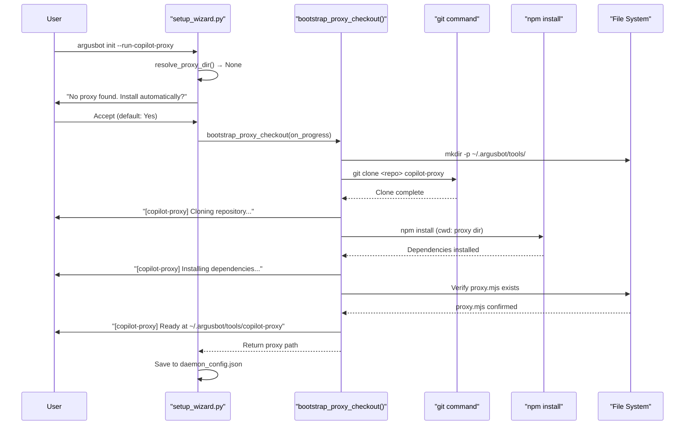
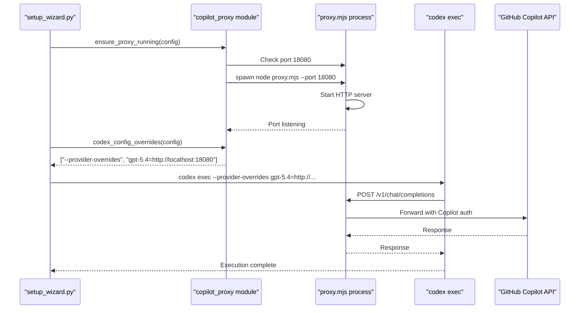

# Copilot Proxy Integration
Relevant source files
- [README.md](https://github.com/waltstephen/ArgusBot/blob/6d0ec9f8/README.md?plain=1)
- [codex_autoloop/setup_wizard.py](https://github.com/waltstephen/ArgusBot/blob/6d0ec9f8/codex_autoloop/setup_wizard.py)
- [tests/test_setup_wizard.py](https://github.com/waltstephen/ArgusBot/blob/6d0ec9f8/tests/test_setup_wizard.py)

## Overview

The Copilot Proxy Integration enables ArgusBot to route all Codex CLI requests through a local `copilot-proxy` instance, allowing main agent, reviewer agent, planner agent, and BTW agent runs to consume GitHub Copilot quota instead of direct OpenAI API billing. This provides significant cost optimization for long-running daemon operations.

This integration is fully automated: ArgusBot auto-detects existing proxy installations, offers to bootstrap the proxy if not found, manages proxy lifecycle (auto-start on demand), and injects runtime provider overrides to Codex CLI without requiring manual global configuration changes.

For information about model selection and presets, see [Model Catalog and Presets](/waltstephen/ArgusBot/6.1-model-catalog-and-presets). For daemon configuration details, see [Configuration Files](/waltstephen/ArgusBot/6.3-configuration-files).

---

## Architecture

The copilot proxy integration operates as a transparent middleware layer between ArgusBot's Codex runner and the AI model backend. The system architecture separates detection, installation, lifecycle management, and runtime configuration into distinct components.

### Component Interaction Flow

[Flowchart Diagram]

**Sources:**[codex_autoloop/setup_wizard.py16-26](https://github.com/waltstephen/ArgusBot/blob/6d0ec9f8/codex_autoloop/setup_wizard.py#L16-L26)[README.md97-127](https://github.com/waltstephen/ArgusBot/blob/6d0ec9f8/README.md?plain=1#L97-L127)

---

## Detection Mechanisms

ArgusBot employs a multi-location auto-detection strategy to locate existing `copilot-proxy` installations without requiring explicit user configuration.

### Auto-Detection Locations

The `resolve_proxy_dir()` function searches the following standard paths in order:

| Priority | Location | Description |
| --- | --- | --- |
| 1 | `~/copilot-proxy` | Common user home directory location |
| 2 | `~/copilot-codex-proxy` | Alternative naming convention |
| 3 | `~/.argusbot/tools/copilot-proxy` | ArgusBot-managed installation path |

Detection succeeds when `proxy.mjs` exists in any of these directories. If an explicit `--run-copilot-proxy-dir` is provided, that location takes precedence over auto-detection.

**Sources:**[codex_autoloop/setup_wizard.py389-432](https://github.com/waltstephen/ArgusBot/blob/6d0ec9f8/codex_autoloop/setup_wizard.py#L389-L432)[README.md109-110](https://github.com/waltstephen/ArgusBot/blob/6d0ec9f8/README.md?plain=1#L109-L110)

### Detection Flow

[Flowchart Diagram]

**Sources:**[codex_autoloop/setup_wizard.py389-432](https://github.com/waltstephen/ArgusBot/blob/6d0ec9f8/codex_autoloop/setup_wizard.py#L389-L432)

---

## Bootstrap Installation

When no proxy installation is detected and the copilot preset is selected (or `--run-copilot-proxy` is explicitly enabled), ArgusBot offers to automatically install the proxy into the managed directory.

### Installation Process



**Sources:**[codex_autoloop/setup_wizard.py435-451](https://github.com/waltstephen/ArgusBot/blob/6d0ec9f8/codex_autoloop/setup_wizard.py#L435-L451)[README.md107-111](https://github.com/waltstephen/ArgusBot/blob/6d0ec9f8/README.md?plain=1#L107-L111)

### Installation Configuration

The bootstrap process creates the following structure:

```
~/.argusbot/tools/copilot-proxy/
├── proxy.mjs          # Main proxy server script
├── package.json       # Node.js dependencies
├── node_modules/      # Installed dependencies
└── ...               # Additional proxy files

```

The `managed_proxy_dir()` function returns `~/.argusbot/tools/copilot-proxy` as the canonical managed installation location.

**Sources:**[codex_autoloop/setup_wizard.py435-451](https://github.com/waltstephen/ArgusBot/blob/6d0ec9f8/codex_autoloop/setup_wizard.py#L435-L451)

---

## Runtime Management

The proxy lifecycle is managed automatically per Codex run. ArgusBot ensures the proxy process is running before executing Codex commands and injects provider overrides to route requests through the proxy.

### Proxy Lifecycle

[State Diagram]

**Sources:**[codex_autoloop/setup_wizard.py94-100](https://github.com/waltstephen/ArgusBot/blob/6d0ec9f8/codex_autoloop/setup_wizard.py#L94-L100)

### Provider Override Mechanism

The `codex_config_overrides()` function generates runtime arguments that reconfigure Codex CLI to use the proxy without modifying global `~/.codex/config.toml`:

```
--provider-overrides <model_name>=<proxy_url>

```

This allows per-run proxy configuration, supporting scenarios where different runs may or may not use the proxy.

**Sources:**[README.md126](https://github.com/waltstephen/ArgusBot/blob/6d0ec9f8/README.md?plain=1#L126-L126)

---

## Configuration

The copilot proxy integration is configured through three layers: CLI arguments, setup wizard prompts, and daemon configuration persistence.

### Configuration Schema

| Field | Type | Default | Description |
| --- | --- | --- | --- |
| `run_copilot_proxy` | boolean | `None` | Enable/disable proxy usage |
| `run_copilot_proxy_dir` | string | `None` | Explicit proxy directory path |
| `run_copilot_proxy_port` | integer | `18080` | Local proxy port |

**Sources:**[codex_autoloop/setup_wizard.py169-197](https://github.com/waltstephen/ArgusBot/blob/6d0ec9f8/codex_autoloop/setup_wizard.py#L169-L197)

### CLI Usage

Direct single-run example:

```
argusbot-run \
  --copilot-proxy \
  --main-model gpt-5.4 \
  --reviewer-model gpt-5.4 \
  "实现功能并跑完验证"
```

With custom port and directory:

```
argusbot-run \
  --copilot-proxy \
  --copilot-proxy-dir /custom/path/to/proxy \
  --copilot-proxy-port 18090 \
  --main-model gpt-5.4 \
  "objective"
```

**Sources:**[README.md113-121](https://github.com/waltstephen/ArgusBot/blob/6d0ec9f8/README.md?plain=1#L113-L121)

### Daemon Configuration

When configured via `argusbot init`, proxy settings are persisted to `.argusbot/daemon_config.json`:

```
{
  "run_copilot_proxy": true,
  "run_copilot_proxy_dir": "/home/user/.argusbot/tools/copilot-proxy",
  "run_copilot_proxy_port": 18080,
  "run_model_preset": "copilot"
}
```

All daemon-launched runs inherit these settings.

**Sources:**[codex_autoloop/setup_wizard.py189-191](https://github.com/waltstephen/ArgusBot/blob/6d0ec9f8/codex_autoloop/setup_wizard.py#L189-L191)

### Setup Wizard Integration

The setup wizard integrates proxy detection into the model selection flow:

[Flowchart Diagram]

**Sources:**[codex_autoloop/setup_wizard.py85-100](https://github.com/waltstephen/ArgusBot/blob/6d0ec9f8/codex_autoloop/setup_wizard.py#L85-L100)[codex_autoloop/setup_wizard.py389-432](https://github.com/waltstephen/ArgusBot/blob/6d0ec9f8/codex_autoloop/setup_wizard.py#L389-L432)

---

## Model Support

The copilot proxy supports routing for Copilot-compatible model names. When the proxy is enabled, these models route through GitHub Copilot quota instead of direct API billing.

### Supported Models

| Model Name | Reasoning Effort | Notes |
| --- | --- | --- |
| `gpt-5.4` | low/medium/high/xhigh | Recommended for copilot preset |
| `gpt-5.2` | low/medium/high/xhigh | Codex variant |
| `gpt-5.1` | low/medium/high/xhigh | Codex variant |
| `gpt-4o` | low/medium/high/xhigh | GPT-4 optimized |
| `claude-sonnet-4.6` | low/medium/high/xhigh | Anthropic Claude |
| `claude-opus-4.6` | low/medium/high/xhigh | Anthropic Claude |
| `gemini-3-pro-preview` | low/medium/high/xhigh | Google Gemini |

**Sources:**[README.md127](https://github.com/waltstephen/ArgusBot/blob/6d0ec9f8/README.md?plain=1#L127-L127)

### Copilot Preset

The `copilot` preset is a predefined configuration optimized for proxy usage:

```
copilot_preset = {
    "name": "copilot",
    "main_model": "gpt-5.4",
    "main_reasoning_effort": "high",
    "reviewer_model": "gpt-5.4",
    "reviewer_reasoning_effort": "high"
}
```

When this preset is selected during setup, ArgusBot automatically enables proxy detection and offers installation if not found.

**Sources:**[README.md535](https://github.com/waltstephen/ArgusBot/blob/6d0ec9f8/README.md?plain=1#L535-L535)[codex_autoloop/setup_wizard.py389-392](https://github.com/waltstephen/ArgusBot/blob/6d0ec9f8/codex_autoloop/setup_wizard.py#L389-L392)

---

## Integration Points

The copilot proxy integration touches multiple ArgusBot components through well-defined interfaces.

### Code Entity Mapping

[Flowchart Diagram]

**Sources:**[codex_autoloop/setup_wizard.py16-26](https://github.com/waltstephen/ArgusBot/blob/6d0ec9f8/codex_autoloop/setup_wizard.py#L16-L26)

### Authentication Flow



**Sources:**[codex_autoloop/setup_wizard.py94-100](https://github.com/waltstephen/ArgusBot/blob/6d0ec9f8/codex_autoloop/setup_wizard.py#L94-L100)

---

## Error Handling

The proxy integration implements defensive error handling at detection, installation, and runtime stages.

### Common Error Scenarios

| Error Condition | Detection Point | Resolution |
| --- | --- | --- |
| `proxy.mjs` not found in specified dir | `resolve_proxy_dir()` | Exit with error message, prompt re-check path |
| Bootstrap `git clone` fails | `bootstrap_proxy_checkout()` | Return `None`, allow fallback to manual setup |
| Bootstrap `npm install` fails | `bootstrap_proxy_checkout()` | Return `None`, suggest manual `npm install` |
| Port already in use | `ensure_proxy_running()` | Assume existing proxy process, proceed |
| Proxy process crashes during run | Codex execution | Fall back to direct OpenAI API if configured |

**Sources:**[codex_autoloop/setup_wizard.py435-451](https://github.com/waltstephen/ArgusBot/blob/6d0ec9f8/codex_autoloop/setup_wizard.py#L435-L451)

### Validation During Setup

The setup wizard validates Codex authentication with proxy overrides before persisting configuration:

```
auth_ok = check_codex_auth(
    codex_bin=codex_bin,
    cwd=Path(args.run_cd).resolve(),
    timeout_seconds=45,
    extra_args=codex_config_overrides(copilot_proxy),
    before_exec=(lambda: ensure_proxy_running(copilot_proxy)) if copilot_proxy.enabled else None,
)
```

If authentication fails, the wizard prompts whether to continue anyway, allowing users to troubleshoot proxy issues before committing to daemon configuration.

**Sources:**[codex_autoloop/setup_wizard.py94-106](https://github.com/waltstephen/ArgusBot/blob/6d0ec9f8/codex_autoloop/setup_wizard.py#L94-L106)

---

## Directory Structure Summary

When copilot proxy is enabled and managed by ArgusBot, the following directory structure is created:

```
~/.argusbot/
├── daemon_config.json          # Contains run_copilot_proxy settings
└── tools/
    └── copilot-proxy/          # Managed installation
        ├── proxy.mjs           # Main proxy script
        ├── package.json
        └── node_modules/

```

The `tools/copilot-proxy/` directory is created only when automatic installation is triggered. Existing installations in `~/copilot-proxy` or `~/copilot-codex-proxy` are reused without modification.

**Sources:**[README.md109-110](https://github.com/waltstephen/ArgusBot/blob/6d0ec9f8/README.md?plain=1#L109-L110)[codex_autoloop/setup_wizard.py435-451](https://github.com/waltstephen/ArgusBot/blob/6d0ec9f8/codex_autoloop/setup_wizard.py#L435-L451)