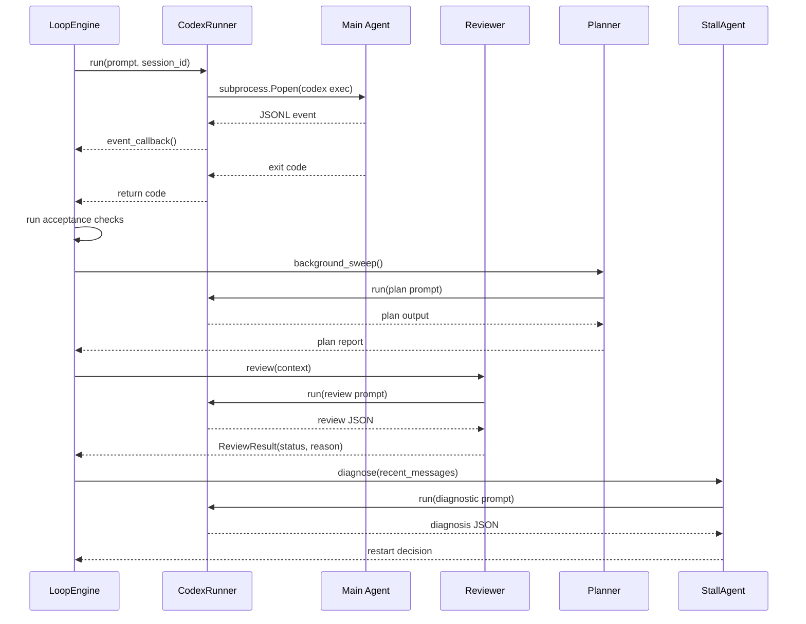

# Core Components
Relevant source files
- [codex_autoloop/apps/cli_app.py](https://github.com/waltstephen/ArgusBot/blob/6d0ec9f8/codex_autoloop/apps/cli_app.py)
- [codex_autoloop/apps/daemon_app.py](https://github.com/waltstephen/ArgusBot/blob/6d0ec9f8/codex_autoloop/apps/daemon_app.py)
- [codex_autoloop/orchestrator.py](https://github.com/waltstephen/ArgusBot/blob/6d0ec9f8/codex_autoloop/orchestrator.py)
- [codex_autoloop/reviewer.py](https://github.com/waltstephen/ArgusBot/blob/6d0ec9f8/codex_autoloop/reviewer.py)
- [tests/test_reviewer.py](https://github.com/waltstephen/ArgusBot/blob/6d0ec9f8/tests/test_reviewer.py)

This page documents the major internal components and subsystems that comprise ArgusBot's execution runtime. It covers the core classes responsible for orchestrating multi-agent loops, managing state, executing tasks, and handling communication. For detailed information about individual components, see their dedicated pages: [Loop Engine](/waltstephen/ArgusBot/4.1-autolooporchestrator), [Agent System](/waltstephen/ArgusBot/4.2-reviewer-sub-agent), [Codex Runner](/waltstephen/ArgusBot/4.3-planner-sub-agent), and [BTW Side-Agent](/waltstephen/ArgusBot/4.4-btw-side-agent).

For architectural context on how these components fit into the overall system design, see [Architecture](/waltstephen/ArgusBot/3-architecture). For configuration and operational details, see [Advanced Topics](/waltstephen/ArgusBot/7-advanced-topics).

---

## Component Architecture Overview

ArgusBot's core runtime is composed of five primary subsystems that work together to execute automated supervision loops:

| Subsystem | Primary Classes | Responsibility |
| --- | --- | --- |
| **Loop Orchestration** | `LoopEngine` | Coordinates execution rounds, manages agent invocations, enforces stop conditions |
| **State Management** | `LoopStateStore` | Persists session state, operator messages, plan reports, review summaries |
| **Task Execution** | `CodexRunner` | Manages `codex` CLI subprocess, parses output streams, monitors watchdog |
| **Agent System** | `Reviewer`, `Planner`, `StallAgent` | Provides quality gates, strategic planning, and stall detection |
| **Communication** | Event sinks, control channels | Publishes events to external services, receives control commands |

### Component Relationship Diagram

[Flowchart Diagram]

**Sources:**[codex_autoloop/cli.py32-70](https://github.com/waltstephen/ArgusBot/blob/6d0ec9f8/codex_autoloop/cli.py#L32-L70)[codex_autoloop/apps/cli_app.py42-493](https://github.com/waltstephen/ArgusBot/blob/6d0ec9f8/codex_autoloop/apps/cli_app.py#L42-L493)[codex_autoloop/apps/daemon_app.py40-546](https://github.com/waltstephen/ArgusBot/blob/6d0ec9f8/codex_autoloop/apps/daemon_app.py#L40-L546)

---

## State Management Layer

The **`LoopStateStore`** class serves as the central repository for all runtime state and operator interactions. It manages persistence of session data, coordinates state updates across rounds, and provides access to historical context for agents.

### State Store Responsibilities

| Function | Method | Description |
| --- | --- | --- |
| **Session Management** | Constructor initialization | Loads or creates session based on `state_file` configuration |
| **Operator Input Recording** | `record_message()` | Appends operator messages to `operator_messages.md` |
| **Inject Handling** | `request_inject()` | Queues inject commands for main agent interruption |
| **Plan Direction** | `request_plan_direction()` | Records plan-specific guidance for planner agent |
| **Review Criteria** | `request_review_criteria()` | Records review-specific criteria for reviewer agent |
| **Stop Requests** | `request_stop()` | Flags immediate loop termination |
| **Round Persistence** | `save_round()` | Writes round data to `state_file` JSON |
| **Markdown Artifacts** | `write_plan_overview()`, `write_review_summary()` | Maintains human-readable reports |

### State Persistence Workflow

[Flowchart Diagram]

**Sources:**[codex_autoloop/apps/cli_app.py72-82](https://github.com/waltstephen/ArgusBot/blob/6d0ec9f8/codex_autoloop/apps/cli_app.py#L72-L82)[codex_autoloop/apps/daemon_app.py384-440](https://github.com/waltstephen/ArgusBot/blob/6d0ec9f8/codex_autoloop/apps/daemon_app.py#L384-L440)

---

## Execution Layer

The **`CodexRunner`** component manages the lifecycle of `codex` CLI subprocess execution. It handles stream parsing, output event routing, and watchdog monitoring for stall detection.

### CodexRunner Construction

The runner is instantiated via the `build_codex_runner()` factory function, which applies optional copilot-proxy configuration:

[Flowchart Diagram]

### Stream Processing Pipeline

The runner parses JSONL output from the `codex` CLI and routes events through registered callbacks:

| Stream Type | Processing | Event Routing |
| --- | --- | --- |
| **stdout JSONL** | Line-by-line parsing, JSON decode | `event_callback(type, payload)` |
| **stderr plain text** | Raw line forwarding | `event_callback("stderr", {"line": ...})` |
| **Exit code** | Process completion detection | Return value from `run()` |

### Watchdog Monitoring

The `WatchdogMonitor` tracks time since last output and enforces idle thresholds:

[State Diagram]

**Sources:**[codex_autoloop/apps/cli_app.py420-424](https://github.com/waltstephen/ArgusBot/blob/6d0ec9f8/codex_autoloop/apps/cli_app.py#L420-L424)[codex_autoloop/cli.py226-242](https://github.com/waltstephen/ArgusBot/blob/6d0ec9f8/codex_autoloop/cli.py#L226-L242)

---

## Agent System Integration

ArgusBot employs a multi-agent architecture where specialized agents handle distinct responsibilities within each loop round.

### Agent Invocation Sequence

### Agent Configuration Mapping

Each agent type supports independent model and reasoning effort configuration:

| Agent | Model Flag | Reasoning Flag | Default Fallback Chain |
| --- | --- | --- | --- |
| **Main** | `--main-model` | `--main-reasoning-effort` | `preset.main_model` → none |
| **Reviewer** | `--reviewer-model` | `--reviewer-reasoning-effort` | `preset.reviewer_model` → `main_model` |
| **Planner** | `--plan-model` | `--plan-reasoning-effort` | `preset.plan_model` → `reviewer_model` → `main_model` |
| **Stall** | *(uses main)* | *(uses main)* | Same as main agent |
| **BTW** | *(uses plan/reviewer/main)* | *(uses plan/reviewer/main)* | `plan_model` → `reviewer_model` → `main_model` |

**Sources:**[codex_autoloop/cli.py119-141](https://github.com/waltstephen/ArgusBot/blob/6d0ec9f8/codex_autoloop/cli.py#L119-L141)[codex_autoloop/apps/daemon_app.py552-661](https://github.com/waltstephen/ArgusBot/blob/6d0ec9f8/codex_autoloop/apps/daemon_app.py#L552-L661)[codex_autoloop/apps/cli_app.py241-248](https://github.com/waltstephen/ArgusBot/blob/6d0ec9f8/codex_autoloop/apps/cli_app.py#L241-L248)

---

## Communication Layer

The communication layer implements bidirectional control flow: outbound event notifications via event sinks, and inbound control commands via control channels.

### Event Sink Architecture

The `CompositeEventSink` multiplexes events to multiple destinations:

[Flowchart Diagram]

### Control Channel Architecture

Control channels poll external sources and convert commands into `BusCommand` objects:

[Flowchart Diagram]

### Command Kind Mapping

| Command Kind | State Store Effect | Daemon Effect |
| --- | --- | --- |
| `inject` | Set `pending_inject` flag, append to `operator_messages.md` | Forward to child via `child_control.jsonl` |
| `plan` | Append plan direction to `operator_messages.md` | Forward to child via `child_control.jsonl` |
| `review` | Append review criteria to `operator_messages.md` | Forward to child via `child_control.jsonl` |
| `stop` | Set `stop_requested` flag | Forward to child or terminate child process |
| `mode` | Update `plan_mode` in state | Update `run_plan_mode` and forward to child |
| `status` | Return runtime snapshot | Return daemon status with child info |
| `btw` | *(N/A)* | Start `BtwAgent` async execution |

**Sources:**[codex_autoloop/apps/cli_app.py83-230](https://github.com/waltstephen/ArgusBot/blob/6d0ec9f8/codex_autoloop/apps/cli_app.py#L83-L230)[codex_autoloop/apps/cli_app.py289-414](https://github.com/waltstephen/ArgusBot/blob/6d0ec9f8/codex_autoloop/apps/cli_app.py#L289-L414)[codex_autoloop/apps/daemon_app.py165-185](https://github.com/waltstephen/ArgusBot/blob/6d0ec9f8/codex_autoloop/apps/daemon_app.py#L165-L185)[codex_autoloop/apps/daemon_app.py187-383](https://github.com/waltstephen/ArgusBot/blob/6d0ec9f8/codex_autoloop/apps/daemon_app.py#L187-L383)

---

## BTW Side-Agent Component

The **`BtwAgent`** provides a read-only query interface that operates independently of the main loop execution. It allows operators to ask questions about the codebase without interrupting ongoing work.

### BTW Agent Lifecycle

[State Diagram]

### BTW Integration in Daemon

The daemon maintains a persistent `BtwAgent` instance and handles attachment confirmation for large result sets:

| Condition | Behavior |
| --- | --- |
| **Small attachment count** | Immediately send via `send_local_file()` |
| **Large attachment count** | Store in `pending_attachment_batches`, send confirmation prompt |
| **User confirms** | Send attachments via `/confirm-send` |
| **User cancels** | Discard attachments via `/cancel-send` |

**Sources:**[codex_autoloop/apps/daemon_app.py70-92](https://github.com/waltstephen/ArgusBot/blob/6d0ec9f8/codex_autoloop/apps/daemon_app.py#L70-L92)[codex_autoloop/apps/daemon_app.py336-368](https://github.com/waltstephen/ArgusBot/blob/6d0ec9f8/codex_autoloop/apps/daemon_app.py#L336-L368)[codex_autoloop/apps/cli_app.py240-288](https://github.com/waltstephen/ArgusBot/blob/6d0ec9f8/codex_autoloop/apps/cli_app.py#L240-L288)

---

## Component Initialization Flow

The following diagram traces component construction from CLI entry to active loop execution:

[Flowchart Diagram]

**Sources:**[codex_autoloop/cli.py32-70](https://github.com/waltstephen/ArgusBot/blob/6d0ec9f8/codex_autoloop/cli.py#L32-L70)[codex_autoloop/apps/cli_app.py42-493](https://github.com/waltstephen/ArgusBot/blob/6d0ec9f8/codex_autoloop/apps/cli_app.py#L42-L493)

---

## Cross-Cutting Concerns

### Error Handling Strategy

All core components follow a consistent error handling pattern:

1. **Validation errors** raise `ValueError` immediately (e.g., invalid configuration)
2. **Runtime errors** are caught and logged via `on_error` callbacks
3. **Subprocess failures** are captured via exit codes and returned to caller
4. **External service errors** (Telegram/Feishu) are logged but do not halt execution

### Thread Safety

| Component | Threading Model |
| --- | --- |
| `LoopEngine` | Single-threaded, synchronous execution |
| `BtwAgent` | Background thread via `start_async()` |
| `TelegramControlChannel` | Polling thread started by `start()` |
| `FeishuControlChannel` | Polling thread started by `start()` |
| `DashboardServer` | HTTP server thread via `http.server.HTTPServer` |
| `WatchdogMonitor` | Checked synchronously during main loop |

### Configuration Precedence

Configuration values follow this precedence order (highest to lowest):

1. Explicit CLI arguments (`--main-model`, `--plan-mode`, etc.)
2. Preset values from `--run-model-preset` (daemon mode)
3. Daemon-level defaults from `daemon_config.json`
4. Hardcoded defaults in `build_parser()`

**Sources:**[codex_autoloop/cli.py73-408](https://github.com/waltstephen/ArgusBot/blob/6d0ec9f8/codex_autoloop/cli.py#L73-L408)[codex_autoloop/apps/cli_app.py42-493](https://github.com/waltstephen/ArgusBot/blob/6d0ec9f8/codex_autoloop/apps/cli_app.py#L42-L493)[codex_autoloop/apps/daemon_app.py40-546](https://github.com/waltstephen/ArgusBot/blob/6d0ec9f8/codex_autoloop/apps/daemon_app.py#L40-L546)