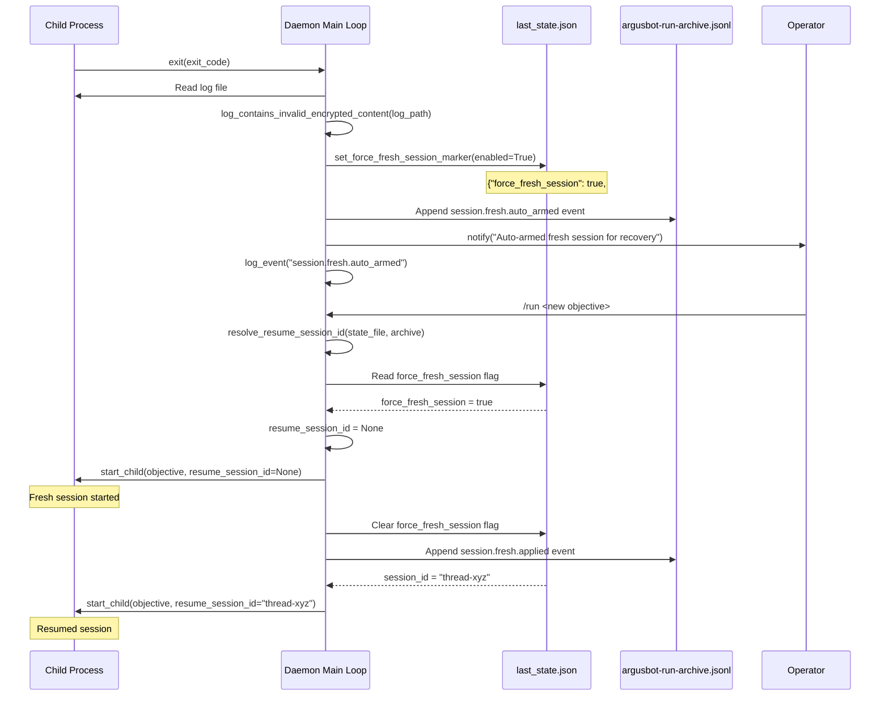
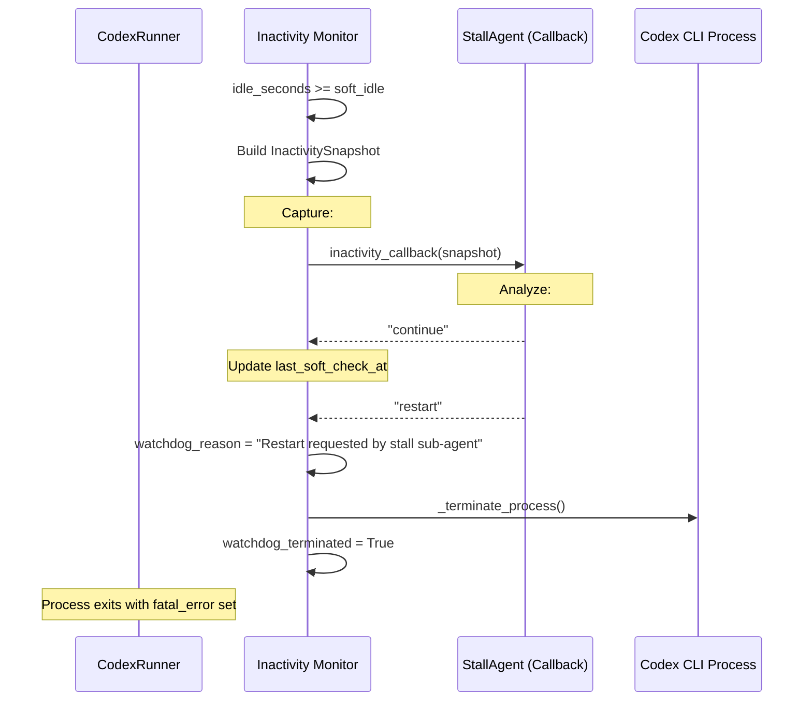

# Error Recovery and Resilience
Relevant source files
- [README.md](https://github.com/waltstephen/ArgusBot/blob/6d0ec9f8/README.md?plain=1)
- [codex_autoloop/orchestrator.py](https://github.com/waltstephen/ArgusBot/blob/6d0ec9f8/codex_autoloop/orchestrator.py)
- [codex_autoloop/reviewer.py](https://github.com/waltstephen/ArgusBot/blob/6d0ec9f8/codex_autoloop/reviewer.py)
- [tests/test_reviewer.py](https://github.com/waltstephen/ArgusBot/blob/6d0ec9f8/tests/test_reviewer.py)
- [tests/test_telegram_daemon.py](https://github.com/waltstephen/ArgusBot/blob/6d0ec9f8/tests/test_telegram_daemon.py)

## Purpose and Scope

This page documents ArgusBot's error recovery mechanisms and resilience features that ensure the system can handle failures gracefully and recover from problematic states. Topics include invalid encrypted content recovery, stall detection thresholds, process termination strategies, and session recovery mechanisms.

For general session management concepts, see [Session Management and Resumption](/waltstephen/ArgusBot/7.1-session-management-and-resumption). For stall agent diagnostics specifically, see [Agent System](/waltstephen/ArgusBot/4.2-reviewer-sub-agent). For state persistence details, see [State Persistence Details](/waltstephen/ArgusBot/7.2-state-persistence-details).

---

## System Overview

ArgusBot implements multiple layers of error recovery to handle various failure modes:

[Flowchart Diagram]

**Sources:**[codex_autoloop/telegram_daemon.py45-46](https://github.com/waltstephen/ArgusBot/blob/6d0ec9f8/codex_autoloop/telegram_daemon.py#L45-L46)[codex_autoloop/telegram_daemon.py144-198](https://github.com/waltstephen/ArgusBot/blob/6d0ec9f8/codex_autoloop/telegram_daemon.py#L144-L198)[codex_autoloop/codex_runner.py96-198](https://github.com/waltstephen/ArgusBot/blob/6d0ec9f8/codex_autoloop/codex_runner.py#L96-L198)

---

## Invalid Encrypted Content Recovery

### Detection Mechanism

ArgusBot detects the specific error pattern `"invalid encrypted content"` in Codex CLI output logs. This error occurs when the Codex CLI encounters corrupted or incompatible session state that cannot be decrypted.

The detection function `log_contains_invalid_encrypted_content()` scans log files for the marker:

[Flowchart Diagram]

**Implementation:**

| Function | Location | Purpose |
| --- | --- | --- |
| `log_contains_invalid_encrypted_content()` | [codex_autoloop/telegram_daemon.py1328-1344](https://github.com/waltstephen/ArgusBot/blob/6d0ec9f8/codex_autoloop/telegram_daemon.py#L1328-L1344) | Scans log file for error marker |
| `set_force_fresh_session_marker()` | [codex_autoloop/telegram_daemon.py1239-1265](https://github.com/waltstephen/ArgusBot/blob/6d0ec9f8/codex_autoloop/telegram_daemon.py#L1239-L1265) | Sets force-fresh flag in state file |
| `is_force_fresh_session_requested()` | [codex_autoloop/telegram_daemon.py1268-1280](https://github.com/waltstephen/ArgusBot/blob/6d0ec9f8/codex_autoloop/telegram_daemon.py#L1268-L1280) | Checks if force-fresh flag is set |
| `resolve_resume_session_id()` | [codex_autoloop/telegram_daemon.py1199-1212](https://github.com/waltstephen/ArgusBot/blob/6d0ec9f8/codex_autoloop/telegram_daemon.py#L1199-L1212) | Returns None when flag is set |

**Sources:**[codex_autoloop/telegram_daemon.py1328-1344](https://github.com/waltstephen/ArgusBot/blob/6d0ec9f8/codex_autoloop/telegram_daemon.py#L1328-L1344)[codex_autoloop/telegram_daemon.py1239-1265](https://github.com/waltstephen/ArgusBot/blob/6d0ec9f8/codex_autoloop/telegram_daemon.py#L1239-L1265)[tests/test_telegram_daemon.py327-334](https://github.com/waltstephen/ArgusBot/blob/6d0ec9f8/tests/test_telegram_daemon.py#L327-L334)

### Automatic Recovery Flow

When invalid encrypted content is detected after a run completes, the daemon automatically arms a fresh session for the next run:



**Sources:**[codex_autoloop/telegram_daemon.py1138-1156](https://github.com/waltstephen/ArgusBot/blob/6d0ec9f8/codex_autoloop/telegram_daemon.py#L1138-L1156)[codex_autoloop/telegram_daemon.py446-537](https://github.com/waltstephen/ArgusBot/blob/6d0ec9f8/codex_autoloop/telegram_daemon.py#L446-L537)[codex_autoloop/telegram_daemon.py1239-1265](https://github.com/waltstephen/ArgusBot/blob/6d0ec9f8/codex_autoloop/telegram_daemon.py#L1239-L1265)

### Manual Recovery Control

Operators can manually trigger fresh session recovery using the `/new` or `/fresh-session` commands:

| Command | Effect | Behavior |
| --- | --- | --- |
| `/new` | Set `force_fresh_session` flag | Next `/run` starts fresh session |
| `/fresh-session` | Set `force_fresh_session` flag | Alias for `/new` |
| Resume flag cleared | Automatic on run start | Flag removed after applied |

**Sources:**[codex_autoloop/telegram_daemon.py697-720](https://github.com/waltstephen/ArgusBot/blob/6d0ec9f8/codex_autoloop/telegram_daemon.py#L697-L720)[tests/test_telegram_daemon.py312-324](https://github.com/waltstephen/ArgusBot/blob/6d0ec9f8/tests/test_telegram_daemon.py#L312-L324)

---

## Stall Detection and Watchdog Monitoring

### Two-Tier Threshold System

ArgusBot implements dual-threshold stall detection to balance responsiveness with false positive avoidance:

[Flowchart Diagram]

**Configuration Parameters:**

| Parameter | Default | Purpose |
| --- | --- | --- |
| `watchdog_soft_idle_seconds` | 1200 (20 min) | Trigger stall agent evaluation |
| `watchdog_hard_idle_seconds` | 10800 (3 hrs) | Forced termination threshold |
| `inactivity_callback` | StallAgent callback | Diagnostic decision function |

**Sources:**[codex_autoloop/codex_runner.py96-198](https://github.com/waltstephen/ArgusBot/blob/6d0ec9f8/codex_autoloop/codex_runner.py#L96-L198)[codex_autoloop/telegram_daemon.py64-66](https://github.com/waltstephen/ArgusBot/blob/6d0ec9f8/codex_autoloop/telegram_daemon.py#L64-L66)

### Soft Threshold: Diagnostic Evaluation

When the soft threshold is reached, the stall agent is invoked to diagnose the situation:



The `InactivitySnapshot` data class provides diagnostic context:

| Field | Type | Purpose |
| --- | --- | --- |
| `idle_seconds` | `float` | Time since last output |
| `command` | `list[str]` | Full command line executed |
| `thread_id` | `str \| None` | Current session thread ID |
| `last_agent_message` | `str` | Last agent message content |
| `stdout_tail` | `list[str]` | Last 50 stdout lines |
| `stderr_tail` | `list[str]` | Last 50 stderr lines |
| `run_label` | `str \| None` | Label for logging context |

**Sources:**[codex_autoloop/codex_runner.py20-29](https://github.com/waltstephen/ArgusBot/blob/6d0ec9f8/codex_autoloop/codex_runner.py#L20-L29)[codex_autoloop/codex_runner.py155-183](https://github.com/waltstephen/ArgusBot/blob/6d0ec9f8/codex_autoloop/codex_runner.py#L155-L183)

### Hard Threshold: Forced Termination

When the hard threshold is reached, the process is immediately terminated without evaluation:

**Implementation Details:**

1. **Detection:**`idle_seconds >= hard_idle` and `process.poll() is None`
2. **Action:** Set `watchdog_reason` and call `_terminate_process()`
3. **Effect:**`watchdog_terminated = True`, `turn_failed = True`, `fatal_error` populated

**Sources:**[codex_autoloop/codex_runner.py184-197](https://github.com/waltstephen/ArgusBot/blob/6d0ec9f8/codex_autoloop/codex_runner.py#L184-L197)

### External Interrupt Handling

In addition to idle-based detection, the watchdog checks for external interrupts:

[Flowchart Diagram]

This mechanism allows the loop engine to signal interrupts (e.g., `/stop` command, `/inject` command) to the active Codex CLI process.

**Sources:**[codex_autoloop/codex_runner.py125-141](https://github.com/waltstephen/ArgusBot/blob/6d0ec9f8/codex_autoloop/codex_runner.py#L125-L141)

---

## Process Termination and Cleanup

### Graceful vs Forced Shutdown

ArgusBot implements a two-stage shutdown strategy:

[State Diagram]

**Configuration:**

| Constant | Value | Purpose |
| --- | --- | --- |
| `STOP_GRACE_SECONDS` | 2.0 | Time to wait for graceful exit |
| `STOP_POLL_INTERVAL_SECONDS` | 0.1 | Poll interval during wait |

**Sources:**[codex_autoloop/telegram_daemon.py46-47](https://github.com/waltstephen/ArgusBot/blob/6d0ec9f8/codex_autoloop/telegram_daemon.py#L46-L47)[codex_autoloop/telegram_daemon.py857-882](https://github.com/waltstephen/ArgusBot/blob/6d0ec9f8/codex_autoloop/telegram_daemon.py#L857-L882)

### Platform-Specific Termination

The `terminate_process_tree()` function handles cross-platform process cleanup:

[Flowchart Diagram]

**Platform Differences:**

| Platform | Signal 1 | Signal 2 | Tool |
| --- | --- | --- | --- |
| Windows | N/A | N/A | `taskkill /T /F` (tree kill) |
| Unix/Linux | `SIGTERM` | `SIGKILL` | `os.killpg()` (process group) |

**Why Process Group Termination?**

- Child processes are started with `start_new_session=True` ([codex_autoloop/telegram_daemon.py490](https://github.com/waltstephen/ArgusBot/blob/6d0ec9f8/codex_autoloop/telegram_daemon.py#L490-L490))
- This creates a new process group, allowing termination of all descendants
- Windows uses `taskkill /T` for tree termination
- Unix uses `os.killpg()` to send signals to entire group

**Sources:**[codex_autoloop/telegram_daemon.py153-198](https://github.com/waltstephen/ArgusBot/blob/6d0ec9f8/codex_autoloop/telegram_daemon.py#L153-L198)[tests/test_telegram_daemon.py657-685](https://github.com/waltstephen/ArgusBot/blob/6d0ec9f8/tests/test_telegram_daemon.py#L657-L685)

### Wait for Process Exit

The `wait_for_process_exit()` helper implements graceful shutdown with timeout:

**Algorithm:**

1. Calculate deadline: `deadline = now + timeout_seconds`
2. Loop: Poll process every `STOP_POLL_INTERVAL_SECONDS` (0.1s)
3. Exit early if `process.poll() != None`
4. Return `True` if exited, `False` if timeout reached

**Sources:**[codex_autoloop/telegram_daemon.py144-150](https://github.com/waltstephen/ArgusBot/blob/6d0ec9f8/codex_autoloop/telegram_daemon.py#L144-L150)

---

## Session Recovery Mechanisms

### Force Fresh Session Flag

The force-fresh-session mechanism bypasses normal session resumption:

[Flowchart Diagram]

**State File Format:**

```
{
  "session_id": "thread-abc123",
  "force_fresh_session": true,
  "force_fresh_reason": "invalid_encrypted_content",
  "rounds": [...]
}
```

**Sources:**[codex_autoloop/telegram_daemon.py1239-1280](https://github.com/waltstephen/ArgusBot/blob/6d0ec9f8/codex_autoloop/telegram_daemon.py#L1239-L1280)[tests/test_telegram_daemon.py312-324](https://github.com/waltstephen/ArgusBot/blob/6d0ec9f8/tests/test_telegram_daemon.py#L312-L324)

### Session Resolution Flow

The complete session resolution process with recovery:

[Flowchart Diagram]

**Sources:**[codex_autoloop/telegram_daemon.py446-537](https://github.com/waltstephen/ArgusBot/blob/6d0ec9f8/codex_autoloop/telegram_daemon.py#L446-L537)[codex_autoloop/telegram_daemon.py1157-1212](https://github.com/waltstephen/ArgusBot/blob/6d0ec9f8/codex_autoloop/telegram_daemon.py#L1157-L1212)

---

## Error Propagation and Reporting

### Fatal Error Detection

The `CodexRunner` detects and propagates fatal errors through multiple mechanisms:

[Flowchart Diagram]

**Error Priority:**

1. **Watchdog termination:** Always sets `fatal_error` and `turn_failed`
2. **turn.failed event:** Sets `fatal_error` from event payload if available
3. **error event:** Sets `fatal_error` if no prior error
4. **Non-zero exit:** Sets `fatal_error` if no turn completion and no prior error

**Sources:**[codex_autoloop/codex_runner.py228-257](https://github.com/waltstephen/ArgusBot/blob/6d0ec9f8/codex_autoloop/codex_runner.py#L228-L257)

### Turn Failure Handling

The `CodexRunResult` data class encapsulates execution outcome:

| Field | Type | Purpose |
| --- | --- | --- |
| `turn_completed` | `bool` | True if `turn.completed` event received |
| `turn_failed` | `bool` | True if `turn.failed` or watchdog terminated |
| `fatal_error` | `str \| None` | Human-readable error message |
| `exit_code` | `int` | Process exit code |

**Result Interpretation:**

| State | Interpretation | Action |
| --- | --- | --- |
| `turn_completed=True, turn_failed=False` | Success | Continue to reviewer |
| `turn_failed=True` | Failure | Stop loop or retry |
| `exit_code != 0, turn_completed=False` | Early termination | Mark as failed |
| `fatal_error != None` | Error occurred | Log and report |

**Sources:**[codex_autoloop/codex_runner.py258-269](https://github.com/waltstephen/ArgusBot/blob/6d0ec9f8/codex_autoloop/codex_runner.py#L258-L269)[codex_autoloop/models.py5-16](https://github.com/waltstephen/ArgusBot/blob/6d0ec9f8/codex_autoloop/models.py#L5-L16)

### Error Logging and Notification

When errors occur, the daemon logs and notifies through multiple channels:

```

```

**Event Types:**

| Event | Purpose | When |
| --- | --- | --- |
| `child.stop.requested` | User-initiated stop | `/stop` command |
| `round.failed` | Round execution failed | Fatal error in round |
| `session.fresh.auto_armed` | Auto-recovery armed | Invalid content detected |
| `session.fresh.applied` | Recovery executed | Fresh session started |
| `plan.cleared` | Planner state reset | Error during planning |

**Sources:**[codex_autoloop/telegram_daemon.py344-351](https://github.com/waltstephen/ArgusBot/blob/6d0ec9f8/codex_autoloop/telegram_daemon.py#L344-L351)[codex_autoloop/telegram_daemon.py857-882](https://github.com/waltstephen/ArgusBot/blob/6d0ec9f8/codex_autoloop/telegram_daemon.py#L857-L882)

---

## Retry Mechanisms

### No Automatic Retry

ArgusBot does **not** implement automatic retry for failed runs. This is a deliberate design decision:

**Rationale:**

1. **Agent autonomy:** The main agent should handle transient errors internally
2. **Cost control:** Automatic retries could compound expensive API failures
3. **Operator awareness:** Failures should be surfaced to humans for review
4. **State preservation:** Failed runs preserve full diagnostic context

**Manual Retry:**

Operators can manually retry by:

1. **Resume last session:**`/run <objective>` (continues from failed state)
2. **Fresh session:**`/new` then `/run <objective>` (clean slate)
3. **Inject correction:**`/inject <guidance>` if run still active

**Sources:**[codex_autoloop/telegram_daemon.py822-856](https://github.com/waltstephen/ArgusBot/blob/6d0ec9f8/codex_autoloop/telegram_daemon.py#L822-L856)[codex_autoloop/telegram_daemon.py697-720](https://github.com/waltstephen/ArgusBot/blob/6d0ec9f8/codex_autoloop/telegram_daemon.py#L697-L720)

---

## Summary Table

| Recovery Mechanism | Trigger | Action | Automatic |
| --- | --- | --- | --- |
| Invalid content recovery | `log_contains_invalid_encrypted_content()` | Set `force_fresh_session` flag | Yes |
| Soft watchdog | `idle_seconds >= soft_idle` | Invoke stall agent callback | Yes |
| Hard watchdog | `idle_seconds >= hard_idle` | Force terminate process | Yes |
| External interrupt | `external_interrupt_reason_provider()` | Force terminate process | Yes |
| Graceful stop | `/stop` command | Forward signal, wait 2s | No |
| Forced stop | Stop timeout or `/stop` on hung process | `terminate_process_tree()` | Fallback |
| Fresh session request | `/new` or `/fresh-session` | Set flag for next run | No |
| Process cleanup | Any termination | Platform-specific tree kill | Always |

**Sources:**[codex_autoloop/telegram_daemon.py45-198](https://github.com/waltstephen/ArgusBot/blob/6d0ec9f8/codex_autoloop/telegram_daemon.py#L45-L198)[codex_autoloop/codex_runner.py96-198](https://github.com/waltstephen/ArgusBot/blob/6d0ec9f8/codex_autoloop/codex_runner.py#L96-L198)